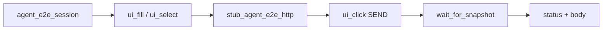

# Agent Golden E2E (PYPOST-838)

## Overview

One intentional golden product flow proves that the agent UI stack composes:

lifecycle → identity → actions → wait → snapshot → assert.

The scenario opens a blank request tab, sets URL and method, sends a request
with a **shared** HTTP canned 200 (PYPOST-859), and asserts the response panel
shows the expected status and body.

The golden scenario **is** a documented pytest
(`tests/test_agent_golden_e2e.py`) that imports the same `pypost.agent` APIs
agents use. It does not add a parallel scenario runner under `pypost/agent/`.

Broader packaging (umbrella doc + `make test-agent-e2e`) is
[Agent UI E2E](agent_e2e.md). HTTP catalog / stub API:
[agent_e2e_http.md](agent_e2e_http.md).

Golden asserts status + body **presence** (`in joined`). For the PYPOST-887
**exactly-once** cardinality lock (PUT + malformed body), see
[agent_e2e_double_response_body.md](agent_e2e_double_response_body.md) — do
not overload this module.

## Architecture

| Component | Role |
| --- | --- |
| `tests/test_agent_golden_e2e.py` | One scenario; asserts; failure context |
| `AgentAppSession` / `agent_e2e_session` | Launch → ready → shutdown (858) |
| `pypost.ui.widget_ids` | Stable control ids (PYPOST-834) |
| `ui_fill` / `ui_select` / `ui_click` | Drive URL / method / Send (PYPOST-836) |
| `wait_for_snapshot` | Settle after Send (PYPOST-837) |
| `ui_snapshot` / panel excerpt | Observe + diagnosable failure (PYPOST-835) |
| `stub_agent_e2e_http(CANNED_GOLDEN_OK)` | Deterministic OK (PYPOST-859) |



Composition at a glance:

| Capability | API used |
| --- | --- |
| Lifecycle | `agent_e2e_session` (blank) |
| Identity | `URL_INPUT`, `METHOD_COMBO`, `SEND_BUTTON`, `RESPONSE_PANEL` |
| Actions | `session.ui_fill` / `ui_select` / `ui_click` |
| Wait | `session.wait_for_snapshot` after Send |
| Snapshot | Predicate + failure excerpt from `RESPONSE_PANEL` |
| HTTP | `stub_agent_e2e_http(CANNED_GOLDEN_OK)` |

Fresh agent sessions restore one blank request tab — no plus-tab click is
required. Status and body widgets under `ResponseView` have no dedicated
`objectName`s; snapshot still captures their values under `RESPONSE_PANEL`.

## API / Usage

### How to run

Preferred (epic harness set, including this golden):

```bash
make test-agent-e2e
```

Golden only under the project offscreen GUI env (`QT_QPA_PLATFORM=offscreen`):

```bash
make test-agent-e2e PYTEST_ARGS="tests/test_agent_golden_e2e.py -v"
```

Or as part of the fast suite:

```bash
make test
```

Module timeout is 60s (`pytest.mark.timeout(60)`). Send settle uses a 15s
`wait_for_snapshot` budget; lifecycle ready uses `ready_timeout=30.0`.

### Scenario steps

1. Obtain ready session via `agent_e2e_session`.
2. Pre-flight: `find_widget` for `URL_INPUT`, `METHOD_COMBO`, `SEND_BUTTON`.
3. `ui_fill(URL_INPUT, GOLDEN_URL)` and `ui_select(METHOD_COMBO, GOLDEN_METHOD)`.
4. `with stub_agent_e2e_http(CANNED_GOLDEN_OK):` then `ui_click(SEND_BUTTON)`.
5. `wait_for_snapshot` until response panel shows expected status and body.
6. Assert final snapshot; on wait timeout, rewrap with `response_excerpt`.

### Public APIs consumed (do not redefine)

```python
from pypost.agent import AgentAppSession
from pypost.fixtures.agent_e2e_http import (
    CANNED_GOLDEN_OK,
    stub_agent_e2e_http,
)
from pypost.ui.widget_ids import (
    METHOD_COMBO,
    RESPONSE_PANEL,
    SEND_BUTTON,
    URL_INPUT,
)

# via fixture agent_e2e_session:
session.ui_fill(URL_INPUT, FIXTURE_URL)
session.ui_select(METHOD_COMBO, FIXTURE_METHOD)
with stub_agent_e2e_http(CANNED_GOLDEN_OK):
    session.ui_click(SEND_BUTTON)
    snap = session.wait_for_snapshot(predicate, timeout=15.0)
```

Scenario helpers `_response_ready` and `_assert_response_ui` are
**test-local** in `tests/test_agent_golden_e2e.py` (expected status/body
tokens). Snapshot walk / subtree / excerpt / join come from shared
[response-panel helpers](agent_e2e_response_panel.md)
(`tests/helpers/agent_e2e_response_panel.py`) — not a production agent API.

## Configuration

### Fixture constants

Constants are defined in `pypost/fixtures/agent_e2e_http.py` and re-exported
as `FIXTURE_*` aliases in the golden test for readability:

| Constant | Value |
| --- | --- |
| `GOLDEN_URL` / `FIXTURE_URL` | `https://example.test/agent-golden` |
| `GOLDEN_METHOD` / `FIXTURE_METHOD` | `GET` |
| `GOLDEN_STATUS` / `FIXTURE_STATUS` | `200` |
| `GOLDEN_BODY` / `FIXTURE_BODY` | `{"ok": true}` (mock / widget source) |
| `FIXTURE_BODY_IN_SNAPSHOT` | `{"ok": true}` (compact; what asserts match) |
| `FIXTURE_STATUS_LABEL` | `Status: 200` |

HTTP is stubbed via the shared layer at
`pypost.core.request_service.HTTPClient.send_request`. The UI →
`RequestWorker` → response panel path stays real. Do not mock
`RequestWorker` wholesale or depend on live HTTP. Do not add a private
`patch(...)` as the primary path — see
[agent_e2e_http.md](agent_e2e_http.md) (how to add canned responses).

### Snapshot body form

`ResponseView` pretty-prints JSON in the widget, but snapshot values pass through
`sanitize_text`, which re-dumps parseable JSON without indentation. Golden
assertions match the **snapshot-visible** body (`FIXTURE_BODY_IN_SNAPSHOT`), not
the pretty-printed `QTextEdit` text.

### Timeouts

| Budget | Value | Where |
| --- | --- | --- |
| Module pytest timeout | 60s | `pytestmark` |
| Lifecycle ready | 30s | `AgentAppSession(ready_timeout=…)` |
| Send settle | 15s | `wait_for_snapshot(timeout=…)` |

Offscreen is set by `make test-agent-e2e` / `make test` and by
`AgentAppSession(offscreen=True)`.

## Troubleshooting

| Failure | What you see / what to do |
| --- | --- |
| Wait timeout after Send | `UiWaitTimeoutError` with |
| | `step=wait_response_after_send` and a short `response_excerpt`. |
| | Grep `agent_e2e_http_stub_installed`; confirm shared stub wraps click. |
| Wrong status/body | Assertion message includes expected value and response-panel |
| | excerpt. Remember snapshot body is compact JSON, not pretty-print. |
| Missing control | `UiTargetNotFoundError` / interactable errors from actions. |
| | Confirm blank tab restore and `is_ui_ready`. |
| Ready never happens | Lifecycle timeout / `agent_session_ready_timeout` (833). |

Primary observability for this flow is those failure carriers (FR10), not new
production metrics. On success, no full snapshot trees are dumped.

### Sibling logs during a golden run

The golden test does not add loggers. With INFO/DEBUG enabled you will see
existing agent events from the composed stack (see [logging.md](logging.md)):

| Event | Module | Scalars only |
| --- | --- | --- |
| `agent_session_*` | lifecycle | ports, timings |
| `agent_e2e_fixture_ready` | packaging | `mode=blank` |
| `agent_e2e_http_stub_installed` | HTTP fixture | `name=golden_ok` |
| `ui_action_applied` | ui_actions | primitive, widget_id, outcome, duration_ms |
| `ui_snapshot_captured` | ui_snapshot | node/named counts, duration_ms |
| `ui_wait_settled` / `ui_wait_timeout` | ui_wait | condition, waited_ms, timeout_s |

## Related

- [Agent UI E2E](agent_e2e.md)
- [Agent E2E Double Response-Body Lock](agent_e2e_double_response_body.md)
- [Agent E2E HTTP Fixture Layer](agent_e2e_http.md)
- [Agent E2E Environment Contract](agent_e2e_env.md) — seeded env pack
  (PYPOST-855); preferred when scenarios need workspace seed
- [Agent App Lifecycle](agent_lifecycle.md)
- [UI Widget Identity](ui_identity.md)
- [UI Action Tools](ui_actions.md)
- [UI State Snapshot](ui_snapshot.md)
- [UI Settle / Wait Helpers](ui_wait.md)
- [GUI Testing](gui_testing.md)
- [Logging Event Naming Convention](logging.md)
