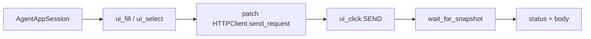

# Agent Golden E2E (PYPOST-838)

## Overview

One intentional golden product flow proves that the agent UI stack composes:

lifecycle → identity → actions → wait → snapshot → assert.

The scenario opens a blank request tab, sets URL and method, sends a request
with a mocked HTTP 200, and asserts the response panel shows the expected
status and body.

The golden scenario **is** a documented pytest
(`tests/test_agent_golden_e2e.py`) that imports the same `pypost.agent` APIs
agents use. It does not add a parallel scenario runner under `pypost/agent/`.

Broader `make agent-*` packaging remains
[PYPOST-839](https://pypost.atlassian.net/browse/PYPOST-839).

## Architecture

| Component | Role |
| --- | --- |
| `tests/test_agent_golden_e2e.py` | One scenario; HTTP mock; asserts; failure context |
| `AgentAppSession` | Launch → ready → shutdown (PYPOST-833) |
| `pypost.ui.widget_ids` | Stable control ids (PYPOST-834) |
| `ui_fill` / `ui_select` / `ui_click` | Drive URL / method / Send (PYPOST-836) |
| `wait_for_snapshot` | Settle after Send (PYPOST-837) |
| `ui_snapshot` / panel excerpt | Observe + diagnosable failure (PYPOST-835) |
| `HTTPClient.send_request` (mocked) | Deterministic OK; UI → worker path stays real |



Composition at a glance:

| Capability | API used |
| --- | --- |
| Lifecycle | `AgentAppSession(offscreen=True)` |
| Identity | `URL_INPUT`, `METHOD_COMBO`, `SEND_BUTTON`, `RESPONSE_PANEL` |
| Actions | `session.ui_fill` / `ui_select` / `ui_click` |
| Wait | `session.wait_for_snapshot` after Send |
| Snapshot | Predicate + failure excerpt from `RESPONSE_PANEL` |

Fresh agent sessions restore one blank request tab — no plus-tab click is
required. Status and body widgets under `ResponseView` have no dedicated
`objectName`s; snapshot still captures their values under `RESPONSE_PANEL`.

## API / Usage

### How to run

Under the project offscreen GUI env (`QT_QPA_PLATFORM=offscreen` via
`make test`):

```bash
make test PYTEST_ARGS="tests/test_agent_golden_e2e.py -v"
```

Or as part of the fast suite:

```bash
make test
```

Module timeout is 60s (`pytest.mark.timeout(60)`). Send settle uses a 15s
`wait_for_snapshot` budget; lifecycle ready uses `ready_timeout=30.0`.

### Scenario steps

1. Launch with `AgentAppSession(offscreen=True)` until `is_ui_ready`.
2. Pre-flight: `find_widget` for `URL_INPUT`, `METHOD_COMBO`, `SEND_BUTTON`.
3. `ui_fill(URL_INPUT, FIXTURE_URL)` and `ui_select(METHOD_COMBO, FIXTURE_METHOD)`.
4. Patch `pypost.core.request_service.HTTPClient.send_request` → canned 200.
5. `ui_click(SEND_BUTTON)`.
6. `wait_for_snapshot` until response panel shows expected status and body.
7. Assert final snapshot; on wait timeout, rewrap with `response_excerpt`.

### Public APIs consumed (do not redefine)

```python
from pypost.agent import AgentAppSession
from pypost.ui.widget_ids import (
    METHOD_COMBO,
    RESPONSE_PANEL,
    SEND_BUTTON,
    URL_INPUT,
)

with AgentAppSession(offscreen=True) as session:
    session.ui_fill(URL_INPUT, FIXTURE_URL)
    session.ui_select(METHOD_COMBO, FIXTURE_METHOD)
    # patch HTTPClient.send_request, then:
    session.ui_click(SEND_BUTTON)
    snap = session.wait_for_snapshot(predicate, timeout=15.0)
```

Helpers such as `_response_ready`, `_response_panel_excerpt`, and
`_assert_response_ui` are **test-local** in `tests/test_agent_golden_e2e.py`,
not a production agent API.

## Configuration

### Fixture constants

| Constant | Value |
| --- | --- |
| `FIXTURE_URL` | `https://example.test/agent-golden` |
| `FIXTURE_METHOD` | `GET` |
| `FIXTURE_STATUS` | `200` |
| `FIXTURE_BODY` | `{"ok": true}` (mock / widget source) |
| `FIXTURE_BODY_IN_SNAPSHOT` | `{"ok": true}` (compact; what asserts match) |
| `FIXTURE_STATUS_LABEL` | `Status: 200` |

HTTP is mocked at `pypost.core.request_service.HTTPClient.send_request` (same
seam as existing integration tests). The UI → `RequestWorker` → response panel
path stays real. Do not mock `RequestWorker` wholesale or depend on live HTTP.

### Snapshot body form

`ResponseView` pretty-prints JSON in the widget, but snapshot values pass through
`sanitize_text`, which re-dumps parseable JSON without indentation. Golden
assertions match the **snapshot-visible** body (`FIXTURE_BODY_IN_SNAPSHOT`), not
the pretty-printed `QTextEdit` text.

### Timeouts

| Budget | Value | Where |
| --- | --- | --- |
| Module pytest timeout | 60s | `pytestmark` |
| Lifecycle ready | 30s | `AgentAppSession(ready_timeout=…)` |
| Send settle | 15s | `wait_for_snapshot(timeout=…)` |

Offscreen is set by `make test` and by `AgentAppSession(offscreen=True)`.
No new Makefile target in this story (839 owns epic packaging).

## Troubleshooting

| Failure | What you see / what to do |
| --- | --- |
| Wait timeout after Send | `UiWaitTimeoutError` with |
| | `step=wait_response_after_send` and a short `response_excerpt`. |
| | Check mock patch target and that the worker path still runs. |
| Wrong status/body | Assertion message includes expected value and response-panel |
| | excerpt. Remember snapshot body is compact JSON, not pretty-print. |
| Missing control | `UiTargetNotFoundError` / interactable errors from actions. |
| | Confirm blank tab restore and `is_ui_ready`. |
| Ready never happens | Lifecycle timeout / `agent_session_ready_timeout` (833). |

Primary observability for this flow is those failure carriers (FR10), not new
production metrics. On success, no full snapshot trees are dumped.

### Sibling logs during a golden run

The golden test does not add loggers. With DEBUG enabled you will see existing
agent events from the composed stack (see [logging.md](logging.md)):

| Event | Module | Scalars only |
| --- | --- | --- |
| `agent_session_*` | lifecycle | ports, timings |
| `ui_action_applied` | ui_actions | primitive, widget_id, outcome, duration_ms |
| `ui_snapshot_captured` | ui_snapshot | node/named counts, duration_ms |
| `ui_wait_settled` / `ui_wait_timeout` | ui_wait | condition, waited_ms, timeout_s |

## Related

- [Agent App Lifecycle](agent_lifecycle.md)
- [UI Widget Identity](ui_identity.md)
- [UI Action Tools](ui_actions.md)
- [UI State Snapshot](ui_snapshot.md)
- [UI Settle / Wait Helpers](ui_wait.md)
- [GUI Testing](gui_testing.md)
- [Logging Event Naming Convention](logging.md)
