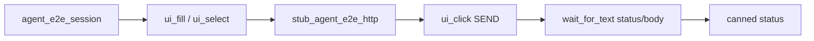

# Agent Golden E2E (PYPOST-838)

## Overview

One intentional golden product flow proves that the agent UI stack composes:

lifecycle → identity → actions → wait → snapshot → assert.

The scenario opens a blank request tab, sets URL and method, sends a request
with a **shared** HTTP canned 200 (PYPOST-859), and settles with
`wait_for_text` on `RESPONSE_STATUS` / `RESPONSE_BODY` (display-form body;
PYPOST-920).

The golden scenario **is** a documented pytest
(`tests/test_agent_golden_e2e.py`) that imports the same `pypost.agent` APIs
agents use. It does not add a parallel scenario runner under `pypost/agent/`.

`make test-agent-e2e` is the **primary packaging** path for the **broader**
agent e2e pack **beyond golden** (umbrella + env pack; PYPOST-922). This
golden module is one scenario inside that pack — see
[Agent UI E2E](agent_e2e.md). HTTP catalog / stub API:
[agent_e2e_http.md](agent_e2e_http.md).

Product **dialog** settle after Settings open is a sibling `agent_e2e`
module (`tests/test_agent_dialog_settle_e2e.py`, PYPOST-919) — not part of
this Send → response golden. Full pattern (timer-before-`exec`,
`activeModalWidget`, diagnostics):
[agent_dialog_settle.md](agent_dialog_settle.md).

Golden asserts status + body via identity-scoped text waits. For the
PYPOST-887 **exactly-once** cardinality lock (PUT + malformed body), see
[agent_e2e_double_response_body.md](agent_e2e_double_response_body.md) — do
not overload this module.

## Architecture

| Component | Role |
| --- | --- |
| `tests/test_agent_golden_e2e.py` | One scenario; asserts; failure context |
| `AgentAppSession` / `agent_e2e_session` | Launch → ready → shutdown (858) |
| `pypost.ui.widget_ids` | Stable control ids (PYPOST-834) |
| `ui_fill` / `ui_select` / `ui_click` | Drive URL / method / Send (PYPOST-836) |
| `wait_for_text` | Settle after Send on status/body ids (PYPOST-920) |
| Panel excerpt | Timeout diagnostics from `RESPONSE_PANEL` (PYPOST-835/869) |
| `stub_agent_e2e_http(CANNED_GOLDEN_OK)` | Deterministic OK (PYPOST-859) |



Composition at a glance:

| Capability | API used |
| --- | --- |
| Lifecycle | `agent_e2e_session` (blank) |
| Identity | `URL_INPUT`, `METHOD_COMBO`, `SEND_BUTTON`, |
| | `RESPONSE_STATUS`, `RESPONSE_BODY` |
| | (`PLUS_TAB_BUTTON` for no-blank create) |
| Actions | `session.ui_fill` / `ui_select` / `ui_click` |
| Wait | `wait_for_text` on status then body after Send |
| | (current-tab root after plus-tab create) |
| Snapshot | Failure excerpt only (`response_panel_excerpt`) |
| HTTP | `stub_agent_e2e_http(CANNED_GOLDEN_OK)` |

Fresh agent sessions restore one blank request tab — the primary golden
scenario needs no plus-tab click. Status and body surfaces under
`ResponseView` have dedicated ids (`RESPONSE_STATUS`, `RESPONSE_BODY`;
PYPOST-920). Golden settles with `wait_for_text` on those widgets
(display-form body text), not a sanitize-coupled `wait_for_snapshot`
predicate. Sibling Send scenarios may still walk the panel snapshot — see
[response-panel helpers](agent_e2e_response_panel.md).

**Plus-tab create (PYPOST-921):** when restore does not leave a blank request
tab, agents click `PLUS_TAB_BUTTON` (`pypost_plus_tab_button`, the embedded
`+` on the trailing plus chrome — not `PLUS_TAB_PLACEHOLDER`). Covered by
`test_agent_golden_plus_tab_create_when_no_blank_tab`: strip request tabs
without presenter close (`removeTab` + `deleteLater`, so orphan role ids do
not poison finds), `ui_click(PLUS_TAB_BUTTON)`, then the same fill / Send /
status+body settle. Prefer current-tab roots for fill/click/wait after
create (shared role ids across tabs).
## API / Usage

### How to run

Primary packaging (broader pack beyond golden, including this scenario):

```bash
make test-agent-e2e
```

Golden-only narrow via `PYTEST_ARGS` under the project offscreen GUI env
(`QT_QPA_PLATFORM=offscreen`):

```bash
make test-agent-e2e PYTEST_ARGS="tests/test_agent_golden_e2e.py -v"
```

Or as part of the fast suite:

```bash
make test
```

Module timeout is 60s (`pytest.mark.timeout(60)`). Send settle uses a 15s
`wait_for_text` budget per status/body wait; lifecycle ready uses
`ready_timeout=30.0`.

### Scenario steps

Primary (blank restore):

1. Obtain ready session via `agent_e2e_session`.
2. Pre-flight: `find_widget` for `URL_INPUT`, `METHOD_COMBO`, `SEND_BUTTON`.
3. `ui_fill(URL_INPUT, GOLDEN_URL)` and `ui_select(METHOD_COMBO, GOLDEN_METHOD)`.
4. `with stub_agent_e2e_http(CANNED_GOLDEN_OK):` then `ui_click(SEND_BUTTON)`.
5. `wait_for_text(RESPONSE_STATUS, FIXTURE_STATUS_LABEL)`.
6. `wait_for_text(RESPONSE_BODY, FIXTURE_BODY_DISPLAY)` (pretty-printed JSON).
7. On wait timeout, force a text-wait miss on `RESPONSE_STATUS` (companion test)
   or rewrap happy-path `wait_for_text` failures with `response_excerpt` from
   the panel snapshot.

Plus-tab create when no blank tab (PYPOST-921):

1. Ready session, then strip all `RequestTab` pages (`removeTab` +
   `deleteLater` + `processEvents`) so only the plus placeholder remains.
2. `ui_click(PLUS_TAB_BUTTON)` — creates a blank request tab via plus chrome.
3. Continue with fill / Send / status+body settle as above (current-tab
   scoped actions and `wait_for_text` root).

### Public APIs consumed (do not redefine)

```python
from pypost.agent import AgentAppSession
from pypost.fixtures.agent_e2e_http import (
    CANNED_GOLDEN_OK,
    stub_agent_e2e_http,
)
from pypost.ui.widget_ids import (
    METHOD_COMBO,
    RESPONSE_BODY,
    RESPONSE_STATUS,
    SEND_BUTTON,
    URL_INPUT,
)

# via fixture agent_e2e_session:
session.ui_fill(URL_INPUT, FIXTURE_URL)
session.ui_select(METHOD_COMBO, FIXTURE_METHOD)
with stub_agent_e2e_http(CANNED_GOLDEN_OK):
    session.ui_click(SEND_BUTTON)
    session.wait_for_text(RESPONSE_STATUS, FIXTURE_STATUS_LABEL, timeout=15.0)
    session.wait_for_text(RESPONSE_BODY, FIXTURE_BODY_DISPLAY, timeout=15.0)
```

Expected status/body tokens are **test-local** in
`tests/test_agent_golden_e2e.py`. Timeout diagnostics use the same
text-wait miss path as Send settle (`wait_for_text` on `RESPONSE_STATUS` with
an impossible label and short budget), then wrap with
`response_panel_excerpt` from shared
[response-panel helpers](agent_e2e_response_panel.md)
(`tests/helpers/agent_e2e_response_panel.py`) — not a production agent API.
Sibling locks/matrix/env scenarios settle via
[send settle helper](agent_e2e_send_settle.md) (PYPOST-948).

## Configuration

### Fixture constants

Constants are defined in `pypost/fixtures/agent_e2e_http.py` and re-exported
as `FIXTURE_*` aliases in the golden test for readability:

| Constant | Value |
| --- | --- |
| `GOLDEN_URL` / `FIXTURE_URL` | `https://example.test/agent-golden` |
| `GOLDEN_METHOD` / `FIXTURE_METHOD` | `GET` |
| `GOLDEN_STATUS` / `FIXTURE_STATUS` | `200` |
| `GOLDEN_BODY` / `FIXTURE_BODY` | `{"ok": true}` (mock / widget source) |
| `FIXTURE_BODY_DISPLAY` | Pretty-printed JSON (`indent=2`; matches |
| | `ResponseView.display_response`) |
| `FIXTURE_STATUS_LABEL` | `Status: 200` |

HTTP is stubbed via the shared layer at
`pypost.core.request_service.HTTPClient.send_request`. The UI →
`RequestWorker` → response panel path stays real. Do not mock
`RequestWorker` wholesale or depend on live HTTP. Do not add a private
`patch(...)` as the primary path — see
[agent_e2e_http.md](agent_e2e_http.md) (how to add canned responses).

### Body text form (display vs snapshot)

`ResponseView` pretty-prints JSON in the body widget (`indent_size=2` by
default). Golden `wait_for_text` matches that **display** form
(`FIXTURE_BODY_DISPLAY`), not the compact JSON that `sanitize_text` produces
in snapshot values. **Readiness waits** use display form; **post-settle**
panel joins may still use compact snapshot tokens — see
[ui_snapshot.md](ui_snapshot.md),
[send settle helper](agent_e2e_send_settle.md), and
[response-panel helpers](agent_e2e_response_panel.md).

### Timeouts

| Budget | Value | Where |
| --- | --- | --- |
| Module pytest timeout | 60s | `pytestmark` |
| Lifecycle ready | 30s | `AgentAppSession(ready_timeout=…)` |
| Send settle | 15s | `wait_for_text(timeout=…)` per status/body |

Offscreen is set by `make test-agent-e2e` / `make test` and by
`AgentAppSession(offscreen=True)`.

## Troubleshooting

| Failure | What you see / what to do |
| --- | --- |
| Wait timeout after Send | `UiWaitTimeoutError` with |
| | `step=wait_response_after_send` and a short `response_excerpt`. |
| | Grep `agent_e2e_http_stub_installed`; confirm shared stub wraps click. |
| Wrong status/body | Timeout / diagnostics include `response_excerpt`. Match |
| | display-form body (`indent=2`), not compact snapshot JSON. |
| Missing control | `UiTargetNotFoundError` / interactable errors from actions. |
| | Confirm blank tab restore and `is_ui_ready`. |
| Plus-tab create fails | Confirm `PLUS_TAB_BUTTON` (not placeholder) and that strip |
| | used `deleteLater` (orphans poison window-scoped finds). |
| | Prefer current-tab fill/click/wait after create. |
| Ready never happens | Lifecycle timeout / `agent_session_ready_timeout` (833). |

Primary observability for this flow is those failure carriers (FR10), not new
production metrics. On success, no full snapshot trees are dumped.

### Sibling logs during a golden run

The golden test does not add loggers. With INFO/DEBUG enabled you will see
existing agent events from the composed stack (see [logging.md](logging.md)):

| Event | Module | Scalars only |
| --- | --- | --- |
| `agent_session_*` | lifecycle | ports, timings |
| `agent_e2e_fixture_ready` | packaging | `mode=blank` |
| `agent_e2e_http_stub_installed` | HTTP fixture | `name=golden_ok` |
| `ui_action_applied` | ui_actions | primitive, widget_id, outcome, duration_ms |
| `ui_snapshot_captured` | ui_snapshot | node/named counts, duration_ms |
| `ui_wait_settled` / `ui_wait_timeout` | ui_wait | condition, waited_ms, timeout_s |

## Related

- [Agent UI E2E](agent_e2e.md)
- [Agent E2E Double Response-Body Lock](agent_e2e_double_response_body.md)
- [Agent E2E HTTP Fixture Layer](agent_e2e_http.md)
- [Agent E2E Environment Contract](agent_e2e_env.md) — seeded env pack
  (PYPOST-855); preferred when scenarios need workspace seed
- [Agent App Lifecycle](agent_lifecycle.md)
- [UI Widget Identity](ui_identity.md)
- [UI Action Tools](ui_actions.md)
- [UI State Snapshot](ui_snapshot.md)
- [UI Settle / Wait Helpers](ui_wait.md)
- [Agent E2E Product Dialog Settle](agent_dialog_settle.md)
- [GUI Testing](gui_testing.md)
- [Logging Event Naming Convention](logging.md)
