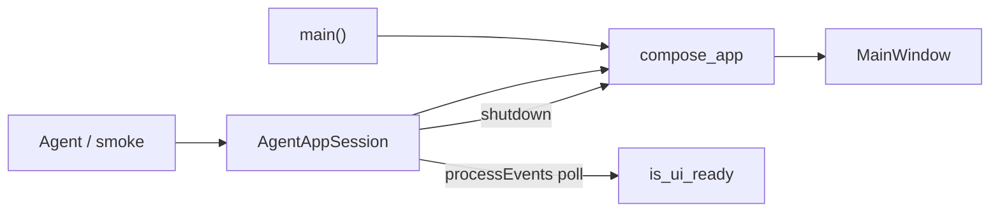

# Agent App Lifecycle (PYPOST-833)

## Overview

Agents and automated harnesses start PyPost **in-process** via
`pypost.agent.lifecycle.AgentAppSession`. This is the project-supported automation
entry point for launch → ready → shutdown. Interactive humans keep `make run` →
`pypost.main.main()` (blocking `QApplication.exec()`).

Primary packaging for the **broader** agent e2e pack **beyond golden**
(`make test-agent-e2e`; PYPOST-922) — umbrella:
[Agent UI E2E](agent_e2e.md).

## Architecture

| Component | Role |
| --- | --- |
| `pypost.agent.lifecycle.AgentAppSession` | Launch, ready wait, shutdown; offscreen + isolation |
| `pypost.main.compose_app` / `ComposedApp` | Shared composition root (managers → `MainWindow`) |
| `MainWindow.is_ui_ready` | Pollable ready gate after startup restore |
| Smoke | `tests/test_agent_lifecycle_smoke.py` under `make test` |



### Event-loop model

| Path | Event loop | Ready wait |
| --- | --- | --- |
| Interactive `main()` | Blocks on `app.exec()` | N/A (human) |
| `AgentAppSession` | No `app.exec()`; pumps via `processEvents` | Until `is_ui_ready` or timeout |

`AgentAppSession` must **not** call `app.exec()`: a blocking loop would freeze the
harness before it can drive the same-process UI. Ready wait uses the same
processEvents + wall-clock pattern as [GUI testing](gui_testing.md).

### Ready condition

`MainWindow.is_ui_ready` becomes true after startup collections and environments
loads complete and `_maybe_complete_startup_restore` has run (tabs + tree
restore). It does **not** wait for deferred history load or all background work
forever.

Production log: `main_window_ui_ready`. Harness confirmation after a successful
wait: `agent_session_ready`. See [logging.md](logging.md).

### Isolation

Agent sessions default to temporary `config_dir` / `data_dir` and an ephemeral
metrics port so parallel/CI runs do not contend with user dirs or fixed ports. The default alert
log also follows `data_dir`; it does not fall back to the real user data directory.
`compose_app(..., apply_log_level=False)` avoids resetting the process log level
when a harness already configured logging.

### Dependency rules

- `pypost.agent` may depend on `pypost.main` / UI / core.
- Production UI (`MainWindow`, presenters, widgets) must **not** depend on
  `pypost.agent` (one-way).
- Interactive `main()` (composition root) **may** start
  `AgentUiAttachHost` from `pypost.agent.attach_ipc` — that is not a UI
  import of the agent package.

## API / Usage

```python
from pathlib import Path
from pypost.agent import AgentAppSession

with AgentAppSession(offscreen=True) as session:
    # session.window.is_ui_ready is True here
    window = session.window
# shutdown runs on context exit

# Seeded session: pre-populates collections and environments (PYPOST-993)
with AgentAppSession(seed_path=Path("fixtures/seed.json"), offscreen=True) as session:
    assert session.window.is_ui_ready
```

When an `Exception` propagates out of the `with` body and the agent e2e
pytest plugin has installed the failure-dump hook, `__exit__` dumps masked
failure artifacts **before** shutdown (PYPOST-875). Packaging fixtures still
dump via makereport; yield teardown does not see the test exception.
See [agent_e2e_failure_artifacts.md](agent_e2e_failure_artifacts.md).

| Concern | API |
| --- | --- |
| Launch | `AgentAppSession.start()` / context manager |
| Ready | wait is inside `start()`; after start, `session.window.is_ui_ready` is true |
| Metrics port | `session.metrics_port` (ephemeral bind; set in `start`) |
| Snapshot | `session.ui_snapshot()` → [ui_snapshot.md](ui_snapshot.md) |
| Actions | `session.ui_click` / `ui_fill` / `ui_select` / `ui_send_key` → [ui_actions.md](ui_actions.md) |
| Settle waits | `session.wait_for_*` / `wait_until` → [ui_wait.md](ui_wait.md) |
| Shutdown | `session.shutdown()` / context `__exit__` |
| Offscreen | `offscreen=True` (default) sets `QT_QPA_PLATFORM=offscreen` if unset |
| Failure dump | Auto on exceptional `__exit__` when plugin hook installed |

### `AgentAppSession(...)`

| Parameter | Default | Meaning |
| --- | --- | --- |
| `offscreen` | `True` | Ensure offscreen Qt platform for CI/headless |
| `config_dir` | temp dir | Injectable config root; cleaned on shutdown when temp |
| `data_dir` | temp dir | Injectable data root; cleaned on shutdown when temp |
| `ready_timeout` | `30.0` | Seconds to wait for `is_ui_ready` before `TimeoutError` |
| `seed_path` | `None` | Seed collection/env file or bundle dir (PYPOST-993) |

### Properties (after `start()`)

| Property | Returns |
| --- | --- |
| `app` | `QApplication` instance (reuses existing) |
| `window` | Wired `MainWindow` |

Accessing `app` or `window` before `start()` raises `RuntimeError`.

After `shutdown()`:

| Property | Behavior |
| --- | --- |
| `window` | Raises `RuntimeError` (`_composed` cleared) |
| `app` | May still return the process `QApplication` (`_app` is not cleared) |

Do not use `window` after shutdown. Treat `app` as optionally still present for
process-level Qt reuse (e.g. a second session), not as a live session handle.

### `start() -> AgentAppSession`

Composes the app, shows the window, pumps events until `is_ui_ready`, or raises
(typically `TimeoutError` or compose errors). On **any** failure after resource
allocation (temps / metrics / compose / ready wait), runs `shutdown()` before
re-raising (PYPOST-841). Ready timeout also logs `agent_session_ready_timeout`.

### `shutdown() -> None`

Idempotent. Delegates the whole composed graph to `ComposedApp.shutdown()`, processes deferred Qt
deletion, then cleans temporary directories. The shared LIFO owner drains the window's nested MCP,
history, request and storage work before closing alerts and metrics. Failures in individual steps
are logged and do not skip later cleanup. See [application lifecycle](application_lifecycle.md).

### `MainWindow.is_ui_ready`

Public `@property` returning `bool`. Set true once in
`_maybe_complete_startup_restore` (same gate for interactive and agent paths).

### Shared factory

```python
from pypost.main import compose_app

composed = compose_app(
    config_dir=...,
    data_dir=...,
    metrics_host="127.0.0.1",
    metrics_port=ephemeral_port,
    apply_log_level=False,  # agent path
)
```

Both `main()` and `AgentAppSession` use `compose_app` so the object graph stays
singular; only event-loop ownership and isolation knobs differ.

## Configuration

| Knob | How set |
| --- | --- |
| Offscreen platform | `offscreen=True` → setdefault `QT_QPA_PLATFORM=offscreen` |
| Config / data dirs | Constructor args, or automatic `tempfile.TemporaryDirectory` |
| Metrics bind | Always `127.0.0.1` + free ephemeral port inside the session |
| Ready timeout | `ready_timeout` seconds (default 30) |
| Seed injection | `seed_path` argument (or `PYPOST_AGENT_SEED_PATH` in sidecar) |

No new environment variables beyond Qt’s `QT_QPA_PLATFORM`. Interactive
`make run` keeps user config/data dirs and configured metrics ports.

## Observability

Lifecycle events use the project `event_name key=value` convention. Catalog
entries live under **Application lifecycle** in [logging.md](logging.md).

| Phase | Events |
| --- | --- |
| Launch | `agent_session_started` / `agent_session_seed_injected` |
| Ready (UI) | `main_window_ui_ready` |
| Ready (harness) | `agent_session_ready` / `agent_session_ready_timeout` |
| Snapshot | `ui_snapshot_captured` (DEBUG; see [ui_snapshot.md](ui_snapshot.md)) |
| Actions | `ui_action_applied` (DEBUG; see [ui_actions.md](ui_actions.md)) |
| Settle waits | `ui_wait_settled` / `ui_wait_timeout` (DEBUG; see [ui_wait.md](ui_wait.md)) |
| Shutdown | `agent_session_shutdown_started` / `_completed` / `*_failed` |

## Smoke

`tests/test_agent_lifecycle_smoke.py` covers launch → ready → shutdown (and a
second launch after shutdown) under `make test` with offscreen Qt. Relaunch smoke
hard-asserts the first session’s metrics port is free after shutdown (PYPOST-842).
`tests/test_agent_lifecycle_mid_start_cleanup.py` locks mid-start failure
cleanup (PYPOST-841).

After ready, resolve key widgets by stable identities — see
[UI widget identity](ui_identity.md). Spot-check:
`tests/test_ui_identity_spotcheck.py`.

Capture a structured visible-UI tree (roles, names, values, hierarchy) with
`capture_ui_snapshot(window)` or `session.ui_snapshot()` — see
[UI state snapshot](ui_snapshot.md). Gate: `tests/test_ui_snapshot.py`.

Drive named controls with click / fill / select / send key — see
[UI action tools](ui_actions.md) (in-process; out-of-process MCP packaging
path: PYPOST-918). Gate: `tests/test_ui_actions.py`.

Wait for post-action settle conditions (exists / enabled / text / snapshot) —
see [UI settle / wait helpers](ui_wait.md). Gate: `tests/test_ui_wait.py`.

## Troubleshooting

- **Ready `TimeoutError`** — Collections/env load stuck; raise `ready_timeout`;
  grep `agent_session_ready_timeout` and startup load failures.
- **`RuntimeError` on `window`** — Accessing before `start()`, or after
  `shutdown()` (composition cleared). `app` before start also raises; after
  shutdown it may still return `QApplication`.
- **Port / dir contention in CI** — Confirm defaults: temp dirs + ephemeral
  metrics port.
- **Hang past pytest timeout** — Prefer processEvents waits; never call
  `app.exec()` in harness code — see [gui_testing.md](gui_testing.md).
- **Display / segfault in CI** — Set `QT_QPA_PLATFORM=offscreen` before Qt
  import (`offscreen=True` or `make test`).

## Attach bind / unbind (ATTACH-1 / ATTACH-2)

`AgentAppSession` above is the **spawn-session / harness** path: the agent
owns launch → ready → shutdown of its own app instance.

**Attach** binds agent-UI MCP to an **already-running desktop** instead. That
path does not replace spawn-session.

| Layer | Behavior |
| --- | --- |
| Composition root | `main()` starts `AgentUiAttachHost` after show; stops in `finally` |
| Transport | Local AF_UNIX + NDJSON (`pypost.agent.attach_ipc`) |
| Sidecar | `pypost-agent-ui-mcp --attach` (no `AgentAppSession.start`) |
| GUI thread | Host marshals `ui_*` onto the QApplication thread |

| Outcome | Meaning |
| --- | --- |
| **Attach success** | Bound; UI tools apply to the live desktop |
| **Attach fail** | Not bound; sidecar exits nonzero (no silent spawn) |
| **Detach** | Binding ends; no default forced kill of the other |
| **Host exit** | Desktop ends; socket removed (sidecar/client may remain) |
| **Sidecar exit** | Sidecar ends; desktop host keeps listening |

Operator narrative, CLI, and API:
[agent_ui_actions_mcp.md](agent_ui_actions_mcp.md). Shipped capability:
[PYPOST-1207](https://pypost.atlassian.net/browse/PYPOST-1207). Proven vs
manual verification matrix (ATTACH-3):
[PYPOST-1208](https://pypost.atlassian.net/browse/PYPOST-1208) —
[Proven vs manual](agent_ui_actions_mcp.md#proven-vs-manual-attach-3--pypost-1208).

## Out of scope (siblings)

Identity (834), snapshots (835), actions (836), and settle waits (837) are
documented separately — see Related. The composed golden product flow is
[agent_golden_e2e.md](agent_golden_e2e.md) (838). Broader pack packaging
(beyond golden): [agent_e2e.md](agent_e2e.md) (`make test-agent-e2e`).
Attach capability / tests: PYPOST-1207 / PYPOST-1208.

## Related documentation

| Document | Topic |
| --- | --- |
| [agent_e2e.md](agent_e2e.md) | Broader pack primary packaging (`make test-agent-e2e`) |
| [agent_ui_actions_mcp.md](agent_ui_actions_mcp.md) | Spawn vs attach; attach lifecycle |
| [agent_seed_injection.md](agent_seed_injection.md) | Sidecar/session seed injection (PYPOST-993) |
| [gui_testing.md](gui_testing.md) | Offscreen Qt, `wait_until`, GUI test patterns |
| [ui_identity.md](ui_identity.md) | Stable `objectName` catalog for key controls |
| [ui_snapshot.md](ui_snapshot.md) | Visible-UI tree for agents after ready |
| [ui_actions.md](ui_actions.md) | Click / fill / select / key; out-of-process MCP packaging (918) |
| [ui_wait.md](ui_wait.md) | Settle waits after actions |
| [agent_golden_e2e.md](agent_golden_e2e.md) | Golden request/response product flow (838) |
| [logging.md](logging.md) | Event catalog (agent session + attach IPC) |
| [testing.md](testing.md) | Suite timeouts and CI guardrails |
| [architecture.md](architecture.md) | Broader app structure |
