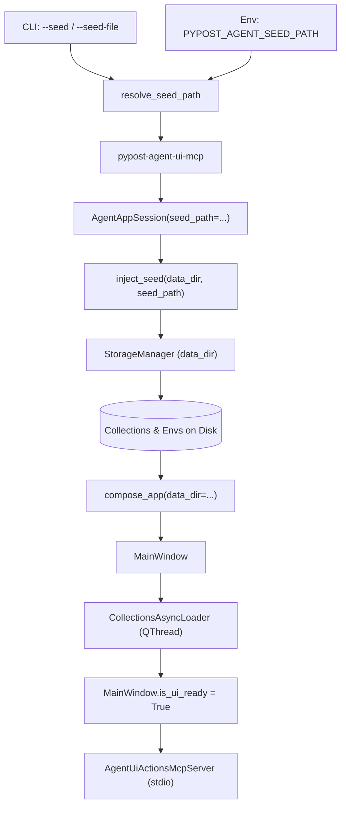

# Agent Sidecar Seed Injection (PYPOST-993)

## Overview

External agents and automated test harnesses using the `pypost-agent-ui-mcp` sidecar or
`AgentAppSession` often require pre-populated collections, requests, or environment fixtures
rather than starting from a blank canvas.

Seed injection provides declarative, automated loading of collection and environment fixtures
into the session's workspace storage prior to UI initialization and MCP server availability.

Key capabilities:
- **CLI flags**: `--seed <path>` and `--seed-file <path>` alias on `pypost-agent-ui-mcp`.
- **Environment variable**: `PYPOST_AGENT_SEED_PATH=<path>` for headless or containerized setups.
- **Precedence**: CLI flag > Environment variable > Unseeded default.
- **Pre-compose staging**: Injects fixtures into `data_dir` before application composition,
  eliminating race conditions with asynchronous Qt storage loaders.
- **Format versatility**: Supports single collection files, collection lists, environment files,
  and directory bundles.
- **Programmatic API**: `AgentAppSession(seed_path=...)` for direct use in test suites.
- **Fail-fast validation**: Invalid or missing seeds abort cleanly with status code 1 and
  structured diagnostic logs.

Parent sidecar documentation: [agent_ui_actions_mcp.md](agent_ui_actions_mcp.md).
Session lifecycle: [agent_lifecycle.md](agent_lifecycle.md).
Fixed E2E fixture inventory: [agent_e2e_seed.md](agent_e2e_seed.md).

## Architecture



### Component Roles

| Component | Module | Responsibility |
| --- | --- | --- |
| `resolve_seed_path` | `pypost.agent.seed_loader` | Resolves CLI flag vs env var precedence |
| `inject_seed` | `pypost.agent.seed_loader` | Parses seed files/dirs and persists to storage |
| `AgentAppSession` | `pypost.agent.lifecycle` | Coordinates pre-compose staging in `start()` |
| `ui_actions_mcp` | `pypost.agent.ui_actions_mcp` | CLI parsing, attach exclusion, error handling |
| `StorageManager` | `pypost.core.storage` | Writes collections and environments to storage |
| `CollectionsAsyncLoader` | `pypost.ui.presenters` | Loads staged collections on startup |

### Pre-Compose Staging Pattern

Seeding executes synchronously within `AgentAppSession.start()` **before** `compose_app()` and
`MainWindow` construction:
1. An ephemeral (or configured) `data_dir` is allocated.
2. `inject_seed(data_dir, seed_path)` validates the source, parses payloads, and writes
   collection files into `data_dir / "collections"` and environments into
   `data_dir / "environments.json"` via `StorageManager`.
3. Application composition starts. `MainWindow` spawns `CollectionsAsyncLoader`, which reads
   the pre-staged collections off the UI thread via `QThread`.
4. `MainWindow` signals `is_ui_ready = True` when all startup collections and environments
   have been loaded and restored into the UI tree.
5. The MCP server starts serving requests only after readiness is confirmed.

This design prevents thread races, eliminates monkeypatching, and ensures standard UI tree
and snapshot contracts operate identically for seeded and manually created data.

## Supported Seed Formats

The seed loader inspects the file extension (`.json`, `.yaml`, `.yml`) and top-level schema
to parse the fixture:

### 1. Single Collection File (JSON / YAML)

A single collection dictionary containing `name` and optional `requests`:

```json
{
  "id": "col-auth-tests",
  "name": "Auth API Tests",
  "requests": [
    {
      "id": "req-login",
      "name": "User Login",
      "method": "POST",
      "url": "https://api.example.com/v1/auth/login"
    }
  ]
}
```

YAML syntax is equally supported (`col-auth-tests.yaml`).

### 2. Multi-Collection List File (JSON / YAML)

A JSON or YAML list containing multiple collection objects:

```json
[
  {
    "id": "col-users",
    "name": "Users Service",
    "requests": []
  },
  {
    "id": "col-orders",
    "name": "Orders Service",
    "requests": []
  }
]
```

### 3. Environments File

A JSON or YAML file containing environment definitions (distinguished by the presence of a
`variables` dictionary and absence of `requests`):

```json
[
  {
    "id": "env-staging",
    "name": "Staging",
    "variables": {
      "base_url": "https://staging.example.com"
    }
  }
]
```

### 4. Directory Bundle

A directory path containing collection files and environment definitions:
- **Subdirectory layout**: If a `collections/` subfolder exists, files inside it are scanned.
- **Direct layout**: If no `collections/` folder exists, top-level `.json`/`.yaml` files are
  parsed as collections.
- **Environments**: An optional `environments.json` at the root of the directory is loaded
  into workspace environments.

## Configuration and Precedence

### Precedence Matrix

| CLI Argument (`--seed` / `--seed-file`) | Env (`PYPOST_AGENT_SEED_PATH`) | Resulting Seed Path |
| --- | --- | --- |
| Provided (`/path/to/cli.json`) | Unset | `/path/to/cli.json` |
| Provided (`/path/to/cli.json`) | Set (`/path/to/env.json`) | `/path/to/cli.json` (CLI wins) |
| Omitted | Set (`/path/to/env.json`) | `/path/to/env.json` |
| Omitted | Unset / empty | `None` (standard unseeded session) |

### Mutual Exclusion with `--attach`

The `--attach` flag connects to an **already-running** desktop PyPost process. Because seed
injection requires pre-compose filesystem staging into a newly spawned session's storage,
combining `--attach` with `--seed` or `--seed-file` is rejected:

```bash
pypost-agent-ui-mcp --attach --seed fixtures/demo.json
# Stderr: agent_ui_mcp_attach_with_seed_rejected ... --attach cannot be combined with --seed
# Exit status: 1
```

## CLI Usage

### Direct Command Line

```bash
# Launch sidecar pre-loaded with a collection JSON
pypost-agent-ui-mcp --seed tests/fixtures/demo_collection.json

# Using the alias --seed-file
pypost-agent-ui-mcp --seed-file /path/to/bundle_directory/

# Via environment variable
PYPOST_AGENT_SEED_PATH=/path/to/seed.yaml pypost-agent-ui-mcp
```

### MCP Client Configuration

In client settings (e.g. Cursor, Claude Desktop, or custom orchestrators):

```json
{
  "mcpServers": {
    "pypost-agent-ui": {
      "command": "pypost-agent-ui-mcp",
      "args": ["--seed", "/absolute/path/to/seed_collection.json"],
      "env": {
        "QT_QPA_PLATFORM": "offscreen"
      }
    }
  }
}
```

Or using the environment variable configuration:

```json
{
  "mcpServers": {
    "pypost-agent-ui": {
      "command": "pypost-agent-ui-mcp",
      "env": {
        "QT_QPA_PLATFORM": "offscreen",
        "PYPOST_AGENT_SEED_PATH": "/absolute/path/to/seed_bundle"
      }
    }
  }
}
```

## Programmatic Usage in Test Suites

Automated tests can supply `seed_path` directly to `AgentAppSession`:

```python
from pathlib import Path
from pypost.agent import AgentAppSession
from pypost.ui.widget_ids import COLLECTION_TREE

def test_seeded_scenario(tmp_path: Path) -> None:
    seed_file = Path("tests/fixtures/sample_collection.json")

    with AgentAppSession(seed_path=seed_file, offscreen=True) as session:
        # MainWindow.is_ui_ready is True here; collections are loaded
        assert session.window.is_ui_ready

        # The collection is already rendered in the UI tree
        tree = session.window.findChild(object, COLLECTION_TREE)
        assert tree is not None

        # Inspect visible controls via snapshot
        snapshot = session.ui_snapshot()
        assert snapshot["role"] == "window"

        # Drive actions immediately on seeded items
        session.ui_select(COLLECTION_TREE, "Sample Collection")
```

### Seed Injection vs Fixed E2E Inventory

| Feature | Seed Injection (`PYPOST-993`) | Fixed E2E Inventory (`PYPOST-857`) |
| --- | --- | --- |
| **Module** | `pypost.agent.seed_loader` | `pypost.fixtures.agent_e2e_seed` |
| **Target** | Session `seed_path` and sidecar CLI | `seeded_agent_e2e_session` fixture |
| **Flexibility** | Arbitrary JSON, YAML, or dir bundles | Fixed constants (`SEED_COLLECTION_ID`) |
| **Use case** | Ad-hoc agent tasks, custom test fixtures | Standard regression pack assertions |

## Observability

Seed operations emit structured logs using the project `event_name key=value` convention.
See [logging.md](logging.md).

| Event Name | Level | Key Fields | Meaning |
| --- | --- | --- | --- |
| `agent_seed_injected_collection` | INFO | `file`, `collection_id`, `request_count` | Staged |
| `agent_seed_injected_environment` | INFO | `file`, `env_id` | Staged env |
| `agent_seed_injected_environments` | INFO | `file`, `count` | Staged envs |
| `agent_seed_injection_completed` | INFO | `seed_path`, `collection_count`, etc. | Finished |
| `agent_session_seed_injected` | INFO | `path`, `collections_count`, `duration_ms` | Confirmed |
| `agent_ui_mcp_seed_failed` | ERROR | `seed_path`, `error_type`, `error` | Fatal error |
| `agent_ui_mcp_attach_with_seed_rejected` | ERROR | `seed_path`, `error_type` | Conflict |

## Troubleshooting

- **Missing seed path**: If the file does not exist, `SeedLoadError` is raised. The sidecar logs
  `agent_ui_mcp_seed_failed` and exits with status 1.
- **Corrupted JSON/YAML**: `SeedFormatError` is raised on syntax errors or invalid Pydantic
  schema structures. Check stderr for detailed schema validation errors.
- **Empty directory**: Supplying an empty directory or a directory with no `.json`/`.yaml` files
  raises `SeedFormatError: No valid collection or environment seeds found in directory`.
- **Environment selection**: Injected environments appear in the environment combo box, but
  the active selection defaults to `No Environment` unless explicitly activated via
  `ui_select` or pre-configured `last_environment_id` (present ≠ active).
- **Flag collision**: Ensure `--attach` is not combined with `--seed` or `--seed-file`.

## Related Documentation

- [Agent UI Actions MCP Sidecar](agent_ui_actions_mcp.md) — sidecar server architecture and tools
- [Agent App Lifecycle](agent_lifecycle.md) — `AgentAppSession` details and ready conditions
- [Agent E2E Seed Inventory](agent_e2e_seed.md) — fixed inventory for standard e2e test suite
- [UI Action Tools](ui_actions.md) — `ui_click`, `ui_fill`, `ui_select`, `ui_send_key`
- [UI State Snapshot](ui_snapshot.md) — structured UI tree extraction
- [GUI Testing](gui_testing.md) — general PySide6 / Qt headless testing practices
- [Logging Event Naming](logging.md) — structured event catalog
