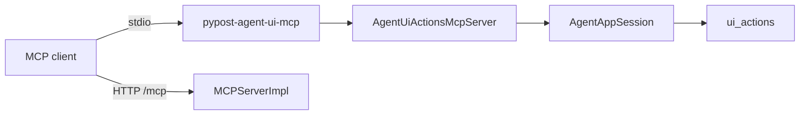

# Agent UI Actions MCP Sidecar (PYPOST-952)

## Overview

External MCP clients can drive PyPost widgets **out-of-process** via a dedicated
stdio MCP server that wraps `pypost.agent.ui_actions` through
[AgentAppSession](agent_lifecycle.md). This surface is **not** part of product
`MCPServerImpl` (collection HTTP request tools).

Parent packaging contract: [ui_actions.md](ui_actions.md) (PYPOST-918).

## Architecture

| Component | Role |
| --- | --- |
| `pypost/agent/ui_actions_mcp.py` | MCP Server + stdio `main()` |
| `AgentUiActionsMcpServer` | `list_tools` / `call_tool` for ui_* primitives |
| `AgentAppSession` | Launches Qt app, ready wait, ui_* dispatch |
| `MCPServerImpl` | Product HTTP tools only — **no UI-action tools** |



Server name: `pypost-agent-ui` (distinct from default product `pypost-server`).

## Runnable entry points

After `pip install -e .` (or project venv):

```bash
# Console script
pypost-agent-ui-mcp

# Module
python -m pypost.agent.ui_actions_mcp

# Makefile (offscreen Qt)
make run-agent-ui-mcp
```

The sidecar starts an offscreen `AgentAppSession`, waits for `is_ui_ready`, then
serves MCP on stdin/stdout until the client disconnects.

### Client configuration (example)

Point a stdio MCP client at the sidecar command (Cursor / Claude Desktop pattern):

```json
{
  "mcpServers": {
    "pypost-agent-ui": {
      "command": "pypost-agent-ui-mcp",
      "env": {
        "QT_QPA_PLATFORM": "offscreen"
      }
    }
  }
}
```

Compose **two** servers when you need both UI drive and collection HTTP tools:
this sidecar plus product MCP at `http://127.0.0.1:<port>/mcp`
([mcp_integration.md](mcp_integration.md)).

## Tool catalog

| Tool | Description |
| --- | --- |
| `ui_click` | Left-click `widget_id` |
| `ui_fill` | Fill text input (`text`, optional `via_key_clicks`, `delay`) |
| `ui_select` | Select by `option` (str) or `option_index` (int) |
| `ui_send_key` | Key/hotkey (`key`, optional `modifiers` list) |

All tools accept optional `in_current_tab: bool` (scope to active request tab).

Successful calls return JSON `{"ok": true}`. UI-action failures return
`{"ok": false, "error": "..."}` without raising MCP protocol errors.

Widget ids: [ui_identity.md](ui_identity.md).

## Configuration

| Flag | Default | Purpose |
| --- | --- | --- |
| `--no-offscreen` | offscreen on | Allow on-screen Qt platform |
| `--ready-timeout` | 30 | Seconds to wait for UI ready |

Logging goes to **stderr** (stdio is MCP transport). Tool calls log at DEBUG;
fill **text is never logged** (same policy as in-process ui_actions).

## Limitations (v1)

- Sidecar **owns** its own `AgentAppSession`; attaching to an already-running
  desktop PyPost is not supported. Attach follow-up is ticketed under epic
  [PYPOST-991](https://pypost.atlassian.net/browse/PYPOST-991):
  [PYPOST-1206](https://pypost.atlassian.net/browse/PYPOST-1206) (docs/trust/lifecycle),
  [PYPOST-1207](https://pypost.atlassian.net/browse/PYPOST-1207) (capability),
  [PYPOST-1208](https://pypost.atlassian.net/browse/PYPOST-1208) (tests as feasible).
  Documented attach path, trust boundary, and lifecycle belong to PYPOST-1206
  (ATTACH-1) — not expanded here.
- **Stdio only** — no separate loopback Streamable HTTP port for agent-UI MCP
  in this release.
- Default session has empty collections unless you extend launch options in a
  follow-up.

## Troubleshooting

- **Sidecar hangs at start** — Increase `--ready-timeout`; check stderr for
  `agent_session_ready_timeout`.
- **UiTargetNotFoundError in tool result** — Wrong `widget_id` or use
  `in_current_tab: true` for per-tab controls.
- **Client sees no tools** — Ensure the client uses stdio transport, not HTTP,
  for this server.
- **Accidentally merged with product MCP** — UI tools must never appear on
  `MCPServerImpl`; use two MCP server entries in the client config. CI enforces
  this via `TestMCPServerImpl.test_list_tools_excludes_agent_ui_action_names` in
  `tests/test_mcp_server_impl.py` (PYPOST-953).

## Related

- [UI Action Tools](ui_actions.md) — in-process API + packaging history
- [Agent lifecycle](agent_lifecycle.md) — session semantics
- [MCP Integration](mcp_integration.md) — product HTTP MCP
- [MCP trust model](mcp_trust_model.md) — separate trust surfaces

## Tests

```bash
# Sidecar module + packaging
make test PYTEST_ARGS='tests/test_agent_ui_actions_mcp.py -v'
make test-agent-e2e PYTEST_ARGS='tests/test_agent_ui_actions_mcp.py::test_stdio_sidecar_lists_ui_action_tools -v'

# Product MCP catalog must exclude ui_* tools (PYPOST-953)
make test PYTEST_ARGS='tests/test_mcp_server_impl.py::TestMCPServerImpl::test_list_tools_excludes_agent_ui_action_names -v'
```
