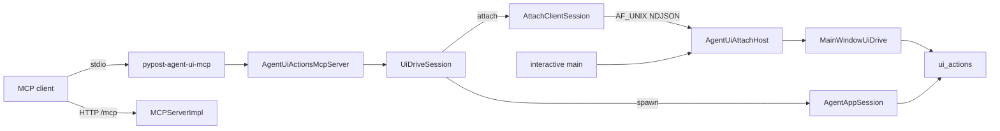

# Agent UI Actions MCP Sidecar (PYPOST-952)

## Overview

External MCP clients can drive PyPost widgets **out-of-process** via a dedicated
stdio MCP server that wraps `pypost.agent.ui_actions`. This surface is **not**
part of product `MCPServerImpl` (collection HTTP request tools).

Two **session paths** are valid on this surface:

| Path | Session ownership | Typical use |
| --- | --- | --- |
| **Spawn-session** (default) | Sidecar owns `AgentAppSession` | Empty/offscreen; not live desktop |
| **Attach** (`--attach`) | Bind to already-running desktop | Drive the live interactive UI |

Attach does **not** replace spawn-session. Choose attach when you need UI tools
to apply to a desktop the operator already has open; choose spawn-session for a
sidecar-owned harness session (CI, empty workspace, offscreen).

Parent packaging contract: [ui_actions.md](ui_actions.md) (PYPOST-918).
Trust: [mcp_trust_model.md](mcp_trust_model.md). Lifecycle:
[agent_lifecycle.md](agent_lifecycle.md).

## Architecture

| Component | Role |
| --- | --- |
| `pypost/agent/ui_actions_mcp.py` | MCP Server + stdio `main()` (spawn or `--attach`) |
| `AgentUiActionsMcpServer` | `list_tools` / `call_tool` for ui_* primitives |
| `pypost/agent/ui_drive.py` | `UiDriveSession` protocol + `MainWindowUiDrive` |
| `AgentAppSession` | Spawn-session: launches Qt app, ready wait, ui_* |
| `pypost/agent/attach_ipc.py` | AF_UNIX host + client; NDJSON wire protocol |
| `AgentUiAttachHost` | Desktop listener; GUI-thread `ui_*` dispatch |
| `AttachClientSession` | Sidecar attach client (`UiDriveSession`) |
| `pypost/main.py` | Starts/stops host around interactive `app.exec()` |
| `MCPServerImpl` | Product HTTP tools only — **no UI-action tools** |



Server name: `pypost-agent-ui` (distinct from default product `pypost-server`).

### Local IPC (AF_UNIX)

MCP clients always **spawn** the stdio sidecar. Attach cannot turn the desktop
into that stdio child, so the sidecar binds a **side-channel** into the live
Qt process:

1. Interactive `main()` constructs `AgentUiAttachHost(window)` after show,
   calls `start()` before `app.exec()`, and `stop()` in `finally`.
2. The host binds a per-user AF_UNIX socket, accepts peers on a daemon thread,
   and marshals `ui_*` onto the QApplication thread via a queued Qt signal.
3. Sidecar `--attach` creates `AttachClientSession`, handshakes, then serves
   the same `ui_*` MCP catalog; each tool call is one NDJSON request/reply.
4. `detach` closes the binding; neither process exits by default. Host stop
   removes the socket file and closes peers (host-exit outcome).

Wire format: one JSON object per line. Ops: `handshake` (version `1`),
`detach`, `ui_click`, `ui_fill`, `ui_select`, `ui_send_key`. Replies are
`{"ok": true, ...}` or `{"ok": false, "error": "..."}`. Fill **text** is
never logged on either side.

## Spawn-session path

After `pip install -e .` (or project venv):

```bash
# Console script
pypost-agent-ui-mcp

# Module
python -m pypost.agent.ui_actions_mcp

# Makefile (offscreen Qt)
make run-agent-ui-mcp
```

The sidecar starts an offscreen `AgentAppSession`, waits for `is_ui_ready`, then
serves MCP on stdin/stdout until the client disconnects. The session is
**sidecar-owned**: it is not the operator’s already-running desktop window.

### Client configuration (example)

Point a stdio MCP client at the sidecar command (Cursor / Claude Desktop
pattern):

```json
{
  "mcpServers": {
    "pypost-agent-ui": {
      "command": "pypost-agent-ui-mcp",
      "env": {
        "QT_QPA_PLATFORM": "offscreen"
      }
    }
  }
}
```

Compose **two** servers when you need both UI drive and collection HTTP tools:
this sidecar plus product MCP at `http://127.0.0.1:<port>/mcp`
([mcp_integration.md](mcp_integration.md)).

## Attach path

**Attach** binds agent-UI MCP to an **already-running desktop PyPost** so
`ui_*` tools drive that live UI. Prefer attach when:

- The operator already has a desktop session open (collections, tabs, state).
- Driving a fresh sidecar-owned offscreen session would lose that context.
- You need the same interactive window a human is using, not a parallel app.

Prefer **spawn-session** when you want an isolated, empty, or offscreen
session the sidecar fully owns (typical automation / CI).

### Operator procedure (product level)

1. Start (or keep) desktop PyPost open on the same machine (interactive
   `main` starts the local attach host after show).
2. Configure the MCP client for the agent-UI sidecar surface (not product
   `MCPServerImpl`).
3. Run the sidecar with **`--attach`** (optional `--attach-endpoint` or
   `PYPOST_AGENT_UI_ATTACH_ENDPOINT` to override the per-user AF_UNIX path).
4. On **attach success**, `ui_*` calls apply to the bound desktop.
5. End the binding with **detach** when finished, or stop when **host exit** /
   **sidecar exit** ends the binding (see lifecycle below).

### Client configuration (attach example)

```json
{
  "mcpServers": {
    "pypost-agent-ui": {
      "command": "pypost-agent-ui-mcp",
      "args": ["--attach"]
    }
  }
}
```

Optional override (CLI or env; same well-known default as the desktop host):

```bash
pypost-agent-ui-mcp --attach --attach-endpoint /path/to/pypost-agent-ui-attach.sock
# or: PYPOST_AGENT_UI_ATTACH_ENDPOINT=/path/to/... pypost-agent-ui-mcp --attach
```

Do **not** set `QT_QPA_PLATFORM=offscreen` for attach — the sidecar has no
local Qt app; the desktop already owns the GUI thread.

**Capability note:** Runtime attach is shipped
([PYPOST-1207](https://pypost.atlassian.net/browse/PYPOST-1207) / ATTACH-2).
Spawn-session remains the default when `--attach` is omitted. Attach
verification matrix (automated vs manual): see **Proven vs manual** under
Tests ([PYPOST-1208](https://pypost.atlassian.net/browse/PYPOST-1208) /
ATTACH-3). Epic: [PYPOST-991](https://pypost.atlassian.net/browse/PYPOST-991).

## Trust boundary

Agent-UI attach/sidecar is a **separate trust surface** from product
request-tool MCP. UI-action tools must **never** appear on `MCPServerImpl`.

Attach implies **local-host posture**: same-machine privilege to drive the live
desktop (stdio peers are mutually trusting; not a remote sandbox). Aligns in
spirit with product MCP local-trust guidance without merging the two surfaces.

Details: [mcp_trust_model.md](mcp_trust_model.md).

## Attach lifecycle

Product-level outcomes (ATTACH-1 soft contract):

| Outcome | Meaning | Mechanism |
| --- | --- | --- |
| **Attach success** | Bound to live desktop | Handshake OK; attach ready log |
| **Attach fail** | Unbound; no silent spawn | `AttachUnboundError` → exit 1 |
| **Detach** | Binding ends; peers continue | Client `detach` + socket close |
| **Host exit** | Desktop ends; socket gone | `AgentUiAttachHost.stop()` |
| **Sidecar exit** | Sidecar ends; host listens | `session.detach()` in finally |

Spawn-session lifecycle (sidecar-owned launch → ready → shutdown) remains in
[agent_lifecycle.md](agent_lifecycle.md).

## API / Usage (attach modules)

### `default_attach_endpoint() -> str`

Per-user AF_UNIX path. Honors `PYPOST_AGENT_UI_ATTACH_ENDPOINT`, else
`$XDG_RUNTIME_DIR/pypost-agent-ui-attach.sock`, else
`/tmp/pypost-agent-ui-attach-<uid>.sock`.

### `AgentUiAttachHost(window, endpoint=None)`

Desktop host. Interactive `main` owns the instance.

| Method | Behavior |
| --- | --- |
| `start()` | Bind/listen AF_UNIX; accept loop on daemon thread |
| `stop()` | Stop accept; close peers; unlink socket file |
| `endpoint` | Bound path (property) |

### `AttachClientSession(endpoint=None, *, connect_timeout=2.0)`

Sidecar-side `UiDriveSession`.

| Method | Behavior |
| --- | --- |
| `connect()` | Connect + handshake, or raise `AttachUnboundError` |
| `detach()` / `shutdown()` | Send `detach`, close socket (host stays up) |
| `ui_*` | Proxy the four catalog ops over NDJSON |

Composition-root pattern (already in `main`):

```python
from pypost.agent.attach_ipc import AgentUiAttachHost

attach_host = AgentUiAttachHost(composed.window)
attach_host.start()
try:
    exit_code = app.exec()
finally:
    attach_host.stop()
```

Do **not** import `pypost.agent` from `MainWindow` or presenters — only the
composition root may start the host.

## Tool catalog

| Tool | Description |
| --- | --- |
| `ui_click` | Left-click `widget_id` |
| `ui_fill` | Fill text input (`text`, optional `via_key_clicks`, `delay`) |
| `ui_select` | Select by `option` (str) or `option_index` (int) |
| `ui_send_key` | Key/hotkey (`key`, optional `modifiers` list) |

All tools accept optional `in_current_tab: bool` (scope to active request tab).

Successful calls return JSON `{"ok": true}`. UI-action failures return
`{"ok": false, "error": "..."}` without raising MCP protocol errors.

Widget ids: [ui_identity.md](ui_identity.md).

## Configuration

| Flag / env | Default | Purpose |
| --- | --- | --- |
| `--no-offscreen` | offscreen on | Allow on-screen Qt platform (spawn-session) |
| `--ready-timeout` | 30 | Seconds to wait for UI ready (spawn-session) |
| `--attach` | off | Bind to desktop attach host (no spawn) |
| `--attach-endpoint` | per-user path | Override AF_UNIX path for attach |
| `PYPOST_AGENT_UI_ATTACH_ENDPOINT` | unset | Env override for the well-known AF_UNIX path |

Logging goes to **stderr** (stdio is MCP transport). Tool calls log at DEBUG;
fill **text is never logged** (same policy as in-process ui_actions).

Default endpoint: `$XDG_RUNTIME_DIR/pypost-agent-ui-attach.sock`, or
`/tmp/pypost-agent-ui-attach-<uid>.sock` when `XDG_RUNTIME_DIR` is unset.

## Observability (attach)

Key structured events (`event_name key=value`). Full catalog:
[logging.md](logging.md).

| Phase | Events |
| --- | --- |
| Host lifecycle | `agent_ui_attach_host_started` / `_stopped` / `_start_failed` |
| Composition root | `agent_ui_attach_host_lifecycle action=start\|stop\|start_failed` |
| Bind | `agent_ui_attach_bound` / `agent_ui_attach_bind_failed` |
| Peers | `agent_ui_attach_client_accepted` / `_closed`; handshake / detach |
| Sidecar | `agent_ui_mcp_attach_starting` / `_ready` / `_failed` / `_ended` |
| UI dispatch | `agent_ui_attach_ui_dispatch` (DEBUG); `_failed` / `_timeout` |

Prometheus metrics are **not** used for attach IPC (agent-UI policy).

## Limitations

- **Spawn-session (default):** Sidecar **owns** its own `AgentAppSession`
  (empty/offscreen by default). That path does not bind to an already-running
  desktop.
- **Attach path:** Cooperative local AF_UNIX host in interactive desktop
  plus sidecar `--attach`. Automated vs manual matrix is under Tests
  ([PYPOST-1208](https://pypost.atlassian.net/browse/PYPOST-1208)). Epic
  [PYPOST-991](https://pypost.atlassian.net/browse/PYPOST-991).
- **Stdio only** — no separate loopback Streamable HTTP port for agent-UI MCP
  in this release.
- Default spawn-session has empty collections unless you extend launch options
  in a follow-up.

## Troubleshooting

- **Sidecar hangs at start** — Increase `--ready-timeout`; check stderr for
  `agent_session_ready_timeout`. Applies to **spawn-session** (sidecar-owned
  ready wait).
- **UiTargetNotFoundError in tool result** — Wrong `widget_id` or use
  `in_current_tab: true` for per-tab controls.
- **Client sees no tools** — Ensure the client uses stdio transport, not HTTP,
  for this server.
- **Accidentally merged with product MCP** — UI tools must never appear on
  `MCPServerImpl`; use two MCP server entries in the client config. CI enforces
  this via `TestMCPServerImpl.test_list_tools_excludes_agent_ui_action_names` in
  `tests/test_mcp_server_impl.py` (PYPOST-953).
- **Expected live desktop, got empty/offscreen session** — You are on
  **spawn-session** (default). Use `pypost-agent-ui-mcp --attach` with the
  interactive desktop running so the sidecar binds the local attach host.
- **Attach fails / unbound** — Ensure interactive PyPost is running (host
  starts from `main`), endpoint matches (`--attach-endpoint` /
  `PYPOST_AGENT_UI_ATTACH_ENDPOINT`), and check sidecar stderr for
  `agent_ui_mcp_attach_failed` / `agent_ui_attach_bind_failed`. Desktop
  logs `agent_ui_attach_host_started` when the host is listening.
- **Host start fails** — Grep `agent_ui_attach_host_start_failed` or
  `agent_ui_attach_host_lifecycle action=start_failed` (bind/listen OSError;
  stale socket path permissions).
- **UI action times out over attach** — Host waits ≤30s for GUI-thread
  dispatch; look for `agent_ui_attach_ui_timeout` on the desktop logger.
- **Thought attach replaced spawn-session** — Both paths remain valid. Use
  spawn-session for isolated/CI sessions; use `--attach` when the live
  desktop must be the target.
- **Looking for attach flags on product MCP** — Attach stays on the agent-UI
  sidecar surface, not `MCPServerImpl`. See Trust boundary and
  [mcp_trust_model.md](mcp_trust_model.md).

## Related

- [UI Action Tools](ui_actions.md) — in-process API + packaging history
- [Agent lifecycle](agent_lifecycle.md) — session and attach outcomes
- [MCP Integration](mcp_integration.md) — product HTTP MCP
- [MCP trust model](mcp_trust_model.md) — separate trust surfaces
- [PYPOST-991](https://pypost.atlassian.net/browse/PYPOST-991) — agent-UI
  attach epic
- [PYPOST-1207](https://pypost.atlassian.net/browse/PYPOST-1207) — ATTACH-2
  capability
- [PYPOST-1208](https://pypost.atlassian.net/browse/PYPOST-1208) — ATTACH-3
  tests

## Tests

```bash
# Sidecar module + packaging
make test PYTEST_ARGS='tests/test_agent_ui_actions_mcp.py -v'
make test-agent-e2e \
  PYTEST_ARGS='tests/test_agent_ui_actions_mcp.py::test_stdio_sidecar_lists_ui_action_tools -v'

# Attach CLI + host/client IPC (ATTACH-2/3)
make test PYTEST_ARGS='tests/test_agent_ui_attach.py -v'

# Product MCP catalog must exclude ui_* tools (PYPOST-953)
make test PYTEST_ARGS=\
  'tests/test_mcp_server_impl.py -k test_list_tools_excludes_agent_ui -v'
```

### Proven vs manual (ATTACH-3 / PYPOST-1208)

What **automated tests prove** versus **manual residual gaps** for attach.
Do not treat manual rows as CI-proven. Capability remains ATTACH-2 /
[PYPOST-1207](https://pypost.atlassian.net/browse/PYPOST-1207); this matrix
is verification only.

Automated proofs live in `tests/test_agent_ui_attach.py` (module
`pytestmark` timeout 30; eleven attach tests). Packaging / spawn continuity
and product-catalog exclusion stay in sibling suites. Discoverability:
[testing.md](testing.md#agent-ui-attach-verification-attach-3--pypost-1208),
[ui_actions.md](ui_actions.md), [README.md](README.md).

| Scenario | Coverage |
| --- | --- |
| CLI `--attach` accepted | **Automated** |
| Attach does not call `AgentAppSession.start` | **Automated** |
| Attach fail unbound (no silent spawn) | **Automated** |
| Host+client `ui_click` | **Automated** |
| Host+client `ui_fill` | **Automated** |
| Host+client `ui_select` | **Automated** |
| Host+client `ui_send_key` | **Automated** |
| Detach leaves host listening (rebind) | **Automated** |
| Host exit → client unbound | **Automated** |
| Sidecar exit → host still listening | **Automated** |
| Endpoint override (env / CLI / default) | **Automated** |
| UI tools off product MCP | **Automated** |
| Protocol-version reject on mismatch | **Manual** |
| Concurrent interleaved `ui_*` / multi-client | **Manual** |
| Stale multi-desktop socket steal | **Manual** |

**Automated proofs** (`tests/test_agent_ui_attach.py` unless noted):

- CLI `--attach` — `test_cli_accepts_attach_mode`
- No `AgentAppSession.start` —
  `test_attach_mode_does_not_call_agent_app_session_start`
- Unbound fail (no silent spawn) —
  `test_attach_without_host_fails_unbound_not_silent_spawn`
- `ui_click` — `test_attach_host_client_ui_click_round_trip`
- `ui_fill` — `test_attach_host_client_ui_fill_sets_line_edit`
- `ui_select` — `test_attach_host_client_ui_select_sets_combo`
- `ui_send_key` — `test_attach_host_client_ui_send_key_changes_text`
- Detach/rebind — `test_attach_detach_leaves_host_listening`
- Host exit unbound — `test_attach_host_stop_unbinds_client`
  (models product host-exit as `AgentUiAttachHost.stop()` —
  unlink + close peers; not `QApplication.exit()` / `quit()`, which would
  tear down the shared pytest-qt loop)
- Sidecar exit rebind — `test_attach_sidecar_exit_leaves_host_listening`
  (abrupt peer socket close without a `detach` op)
- Endpoint override — `test_attach_endpoint_override_env_and_cli`
  (env / `default_attach_endpoint()` path resolution; `--attach-endpoint`
  present in `--help` — not a full stdio MCP serve with overridden argv)
- UI tools off product MCP —
  `tests/test_mcp_server_impl.py`
  (`test_list_tools_excludes_agent_ui_action_names`)

**Manual residual checks:**

- **Protocol-version reject on mismatch** — Handshake version is advisory
  today
  ([PYPOST-1218](https://pypost.atlassian.net/browse/PYPOST-1218)).
  **Check:** connect a client with a mismatched `handshake.version`; expect
  reject only after 1218 enforces it — today host may still accept. Do not
  treat advisory accept as a product bug in ATTACH-3.
- **Concurrent interleaved `ui_*` / multi-client** — **Check:** two sidecars
  (or clients) bound to one host; interleave `ui_fill` / `ui_click` under
  load. **Pass:** no crash; actions apply without silent cross-client
  corruption. Full race stress is out of fast-suite norms.
- **Stale multi-desktop socket steal** — **Check:** leave a stale AF_UNIX
  path, start a second desktop host on the same override path. **Pass:**
  `host.start()` unlinks stale path and binds (or fails loudly); no silent
  steal of another live peer without operator intent.
