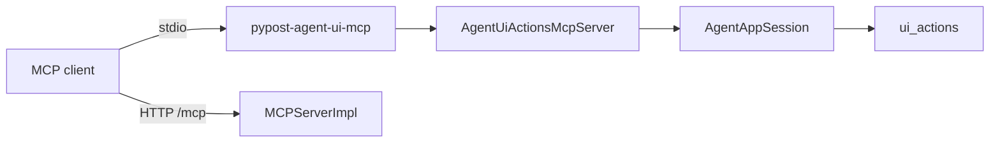

# Agent UI Actions MCP Sidecar (PYPOST-952)

## Overview

External MCP clients can drive PyPost widgets **out-of-process** via a dedicated
stdio MCP server that wraps `pypost.agent.ui_actions`. This surface is **not**
part of product `MCPServerImpl` (collection HTTP request tools).

Two **session paths** are valid on this surface:

| Path | Session ownership | Typical use |
| --- | --- | --- |
| **Spawn-session** (shipped) | Sidecar owns `AgentAppSession` | Empty/offscreen; not live desktop |
| **Attach** (soft contract) | Bind to already-running desktop | Drive the live interactive UI |

Attach does **not** replace spawn-session. Choose attach when you need UI tools
to apply to a desktop the operator already has open; choose spawn-session for a
sidecar-owned harness session (CI, empty workspace, offscreen).

Parent packaging contract: [ui_actions.md](ui_actions.md) (PYPOST-918).
Trust: [mcp_trust_model.md](mcp_trust_model.md). Lifecycle:
[agent_lifecycle.md](agent_lifecycle.md).

## Architecture

| Component | Role |
| --- | --- |
| `pypost/agent/ui_actions_mcp.py` | MCP Server + stdio `main()` |
| `AgentUiActionsMcpServer` | `list_tools` / `call_tool` for ui_* primitives |
| `AgentAppSession` | Spawn-session: launches Qt app, ready wait, ui_* |
| `MCPServerImpl` | Product HTTP tools only — **no UI-action tools** |



Server name: `pypost-agent-ui` (distinct from default product `pypost-server`).

## Spawn-session path

After `pip install -e .` (or project venv):

```bash
# Console script
pypost-agent-ui-mcp

# Module
python -m pypost.agent.ui_actions_mcp

# Makefile (offscreen Qt)
make run-agent-ui-mcp
```

The sidecar starts an offscreen `AgentAppSession`, waits for `is_ui_ready`, then
serves MCP on stdin/stdout until the client disconnects. The session is
**sidecar-owned**: it is not the operator’s already-running desktop window.

### Client configuration (example)

Point a stdio MCP client at the sidecar command (Cursor / Claude Desktop
pattern):

```json
{
  "mcpServers": {
    "pypost-agent-ui": {
      "command": "pypost-agent-ui-mcp",
      "env": {
        "QT_QPA_PLATFORM": "offscreen"
      }
    }
  }
}
```

Compose **two** servers when you need both UI drive and collection HTTP tools:
this sidecar plus product MCP at `http://127.0.0.1:<port>/mcp`
([mcp_integration.md](mcp_integration.md)).

## Attach path

**Attach** binds agent-UI MCP to an **already-running desktop PyPost** so
`ui_*` tools drive that live UI. Prefer attach when:

- The operator already has a desktop session open (collections, tabs, state).
- Driving a fresh sidecar-owned offscreen session would lose that context.
- You need the same interactive window a human is using, not a parallel app.

Prefer **spawn-session** when you want an isolated, empty, or offscreen
session the sidecar fully owns (typical automation / CI).

### Operator procedure (product level)

High-level steps only (no CLI flag or wire-format dump — mechanism is
ATTACH-2):

1. Start (or keep) desktop PyPost open on the same machine.
2. Configure the MCP client for the agent-UI sidecar surface (not product
   `MCPServerImpl`).
3. Choose **attach** so UI tools bind to that live desktop.
4. On **attach success**, `ui_*` calls apply to the bound desktop.
5. End the binding with **detach** when finished, or stop when **host exit** /
   **sidecar exit** ends the binding (see lifecycle below).

**Capability note (FR12):** Runtime attach lands in
[PYPOST-1207](https://pypost.atlassian.net/browse/PYPOST-1207) (ATTACH-2).
Until that capability ships, treat this section as the **soft contract** for
operators and implementers; spawn-session remains the runnable path today.
Verification: [PYPOST-1208](https://pypost.atlassian.net/browse/PYPOST-1208)
(ATTACH-3). Epic: [PYPOST-991](https://pypost.atlassian.net/browse/PYPOST-991).

## Trust boundary

Agent-UI attach/sidecar is a **separate trust surface** from product
request-tool MCP. UI-action tools must **never** appear on `MCPServerImpl`.

Attach implies **local-host posture**: same-machine privilege to drive the live
desktop (stdio peers are mutually trusting; not a remote sandbox). Aligns in
spirit with product MCP local-trust guidance without merging the two surfaces.

Details: [mcp_trust_model.md](mcp_trust_model.md).

## Attach lifecycle

Product-level outcomes (soft contract; mechanism deferred to ATTACH-2):

| Outcome | Operator-visible meaning |
| --- | --- |
| **Attach success** | Bound; agent-UI MCP UI tools apply to the live desktop |
| **Attach fail** | Not bound; failure is operator-visible at product level |
| **Detach** | Binding ends; neither path forces kill of the other by default |
| **Host exit** | Desktop ends; attach binding ends (sidecar/client may remain) |
| **Sidecar exit** | Sidecar ends; desktop is not implied destroyed |

Spawn-session lifecycle (sidecar-owned launch → ready → shutdown) remains in
[agent_lifecycle.md](agent_lifecycle.md). Attach bind/unbind and exit
outcomes are cross-linked there.

## Tool catalog

| Tool | Description |
| --- | --- |
| `ui_click` | Left-click `widget_id` |
| `ui_fill` | Fill text input (`text`, optional `via_key_clicks`, `delay`) |
| `ui_select` | Select by `option` (str) or `option_index` (int) |
| `ui_send_key` | Key/hotkey (`key`, optional `modifiers` list) |

All tools accept optional `in_current_tab: bool` (scope to active request tab).

Successful calls return JSON `{"ok": true}`. UI-action failures return
`{"ok": false, "error": "..."}` without raising MCP protocol errors.

Widget ids: [ui_identity.md](ui_identity.md).

## Configuration

| Flag | Default | Purpose |
| --- | --- | --- |
| `--no-offscreen` | offscreen on | Allow on-screen Qt platform |
| `--ready-timeout` | 30 | Seconds to wait for UI ready |

Logging goes to **stderr** (stdio is MCP transport). Tool calls log at DEBUG;
fill **text is never logged** (same policy as in-process ui_actions).

Configuration above applies to the **spawn-session** entry. Attach bind
options (if any) are owned by ATTACH-2 when capability ships.

## Limitations

- **Spawn-session (shipped):** Sidecar **owns** its own `AgentAppSession`
  (empty/offscreen by default). That path does not bind to an already-running
  desktop.
- **Attach path (ATTACH-1 contract):** Documented above (path choice, trust,
  lifecycle). Runtime attach capability is
  [PYPOST-1207](https://pypost.atlassian.net/browse/PYPOST-1207); tests as
  feasible are [PYPOST-1208](https://pypost.atlassian.net/browse/PYPOST-1208).
  Soft contract under epic
  [PYPOST-991](https://pypost.atlassian.net/browse/PYPOST-991).
- **Stdio only** — no separate loopback Streamable HTTP port for agent-UI MCP
  in this release.
- Default spawn-session has empty collections unless you extend launch options
  in a follow-up.

## Troubleshooting

- **Sidecar hangs at start** — Increase `--ready-timeout`; check stderr for
  `agent_session_ready_timeout`. Applies to **spawn-session** (sidecar-owned
  ready wait).
- **UiTargetNotFoundError in tool result** — Wrong `widget_id` or use
  `in_current_tab: true` for per-tab controls.
- **Client sees no tools** — Ensure the client uses stdio transport, not HTTP,
  for this server.
- **Accidentally merged with product MCP** — UI tools must never appear on
  `MCPServerImpl`; use two MCP server entries in the client config. CI enforces
  this via `TestMCPServerImpl.test_list_tools_excludes_agent_ui_action_names` in
  `tests/test_mcp_server_impl.py` (PYPOST-953).
- **Expected live desktop, got empty/offscreen session** — You are on
  **spawn-session**. Attach (bind to an already-open desktop) is the soft
  contract above; runtime bind ships in
  [PYPOST-1207](https://pypost.atlassian.net/browse/PYPOST-1207). Until then,
  spawn-session cannot drive the operator’s open window.
- **Thought attach replaced spawn-session** — Both paths remain valid. Use
  spawn-session for isolated/CI sessions; use attach when the live desktop
  must be the target (once ATTACH-2 lands).
- **Looking for attach flags on product MCP** — Attach stays on the agent-UI
  sidecar surface, not `MCPServerImpl`. See Trust boundary and
  [mcp_trust_model.md](mcp_trust_model.md).

## Related

- [UI Action Tools](ui_actions.md) — in-process API + packaging history
- [Agent lifecycle](agent_lifecycle.md) — session and attach outcomes
- [MCP Integration](mcp_integration.md) — product HTTP MCP
- [MCP trust model](mcp_trust_model.md) — separate trust surfaces
- [PYPOST-991](https://pypost.atlassian.net/browse/PYPOST-991) — agent-UI
  attach epic
- [PYPOST-1207](https://pypost.atlassian.net/browse/PYPOST-1207) — ATTACH-2
  capability
- [PYPOST-1208](https://pypost.atlassian.net/browse/PYPOST-1208) — ATTACH-3
  tests

## Tests

```bash
# Sidecar module + packaging
make test PYTEST_ARGS='tests/test_agent_ui_actions_mcp.py -v'
make test-agent-e2e PYTEST_ARGS='tests/test_agent_ui_actions_mcp.py::test_stdio_sidecar_lists_ui_action_tools -v'

# Product MCP catalog must exclude ui_* tools (PYPOST-953)
make test PYTEST_ARGS='tests/test_mcp_server_impl.py::TestMCPServerImpl::test_list_tools_excludes_agent_ui_action_names -v'
```

Attach verification is owned by ATTACH-3 / PYPOST-1208 — not claimed here.
