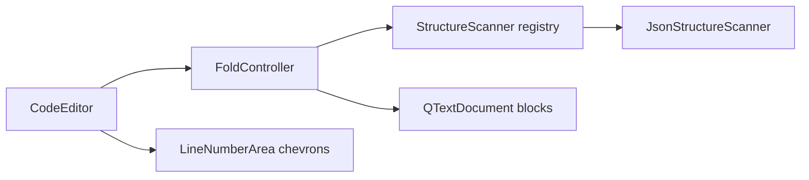

# Body Editor Folding

## Overview

The request Body tab `CodeEditor` supports collapsing and expanding nested sections in valid JSON
body content. Hidden lines remain in the document (`toPlainText()` is unchanged) so save and send
use the full payload. Collapse state is session-only and resets when body text is replaced.

YAML and XML scanners are implemented; the format selector on the Body tab sets `BodyFormat`
and activates the matching scanner.

## Architecture

- **`FoldRegion` / `BodyFormat` (`pypost/ui/widgets/fold/fold_region.py`)** — Region metadata
  (stable `region_id`, header/start/end block numbers, kind).
- **`StructureScanner` registry (`pypost/ui/widgets/fold/structure_scanner.py`)** — Selects
  scanner by `BodyFormat`; `PLAIN` returns no regions.
- **`JsonStructureScanner` (`pypost/ui/widgets/fold/json_structure_scanner.py`)** — Validates
  JSON then detects nestable `{`/`[` regions with JSON Pointer–style `region_id` values.
- **`YamlStructureScanner` (`yaml_structure_scanner.py`)** — Uses `yaml.compose_all()` node marks
  for mapping/sequence regions; invalid YAML returns no regions.
- **`XmlStructureScanner` (`xml_structure_scanner.py`)** — Validates with `ElementTree` then
  scans tags for multi-line elements; invalid XML returns no regions.
- **`FoldController` (`pypost/ui/widgets/fold/fold_controller.py`)** — Debounced scan
  (200 ms), collapsed `region_id` set, applies `QTextBlock.setVisible()` on descendants.
- **`CodeEditor` (`pypost/ui/widgets/code_editor.py`)** — Owns `FoldController`; widens gutter
  for chevrons (▶/▼); handles chevron clicks in `line_number_area_mouse_press`.
- **`LineNumberArea` (`pypost/ui/widgets/line_number_area.py`)** — Forwards mouse presses to the
  host editor.

See also [Body Editor Line Numbers](body_editor_line_numbers.md) for gutter layout basics.

## API / Usage

### `CodeEditor.set_body_format(body_format: BodyFormat) -> None`

Switches the active structure scanner. Default is `BodyFormat.JSON`. The Body tab format selector
calls this when the user changes JSON/YAML/XML.

### `CodeEditor.fold_controller() -> FoldController`

Access collapse state and regions for tests or future UI (e.g. expand all).

### `FoldController.toggle(region_id: str) -> None`

Collapse or expand one region; updates block visibility and repaints the viewport.

### `FoldController.expand_all() -> None`

Shows all blocks and clears collapsed IDs. Called from `CodeEditor.setPlainText()`.

### Gutter interaction

Chevrons appear on fold-header lines (opening `{` or `[`). Click the leftmost gutter column
(`chevron_width`, 14 px) to toggle. Line numbers show logical document line numbers for visible
blocks only (gaps where lines are hidden).

## Configuration

No user setting. Folding is enabled automatically for valid JSON in `CodeEditor`. Debounce
interval is `_DEBOUNCE_MS = 200` in `fold_controller.py` (not user-configurable).

## Troubleshooting

### No chevrons appear

Content may be invalid JSON or empty. The scanner returns no regions when `json.loads()` fails.
Invalid JSON yields no fold regions and no chevrons; validation errors are shown separately
via [Body Editor Validation](body_editor_validation.md). Fix syntax or confirm the widget is
`CodeEditor` with default `BodyFormat.JSON`.

### Collapsed content missing from saved request

Should not happen: `toPlainText()` includes hidden blocks. If content is missing, check that
callers read `toPlainText()` rather than iterating only visible blocks.

### Chevrons disappear after edit

Re-scan may invalidate region boundaries; affected collapsed IDs are dropped and blocks expand.
Re-collapse after the document is valid again.

### YAML/XML bodies do not fold

Confirm the Body tab format selector matches the document (JSON/YAML/XML). Invalid syntax yields
no fold regions for any format.
