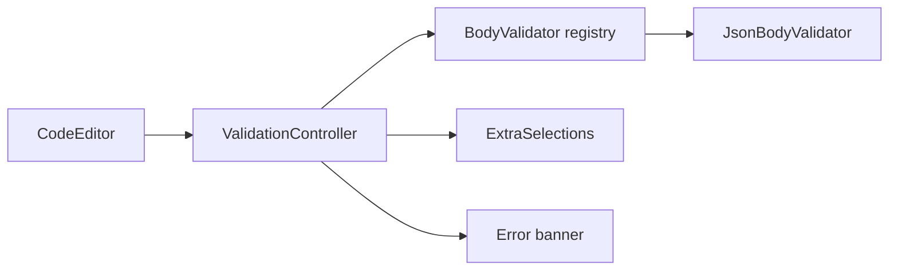

# Body Editor Validation

## Overview

The request Body tab `CodeEditor` validates content against the active body format and shows
inline errors while the user edits. JSON, YAML, and XML are supported; the Body tab format
selector sets `BodyFormat` and activates the matching validator.

Errors do not modify body text — save and send use the full `toPlainText()` content.

## Architecture

- **`ValidationError` (`pypost/ui/widgets/validate/validation_error.py`)** — `line`, `column`
  (1-based, matching gutter line numbers), and `message`.
- **`BodyValidator` registry (`pypost/ui/widgets/validate/body_validator.py`)** — Selects
  validator by `BodyFormat`; `PLAIN` returns no errors.
- **`JsonBodyValidator`** — Uses `json.loads()`; maps `JSONDecodeError` to one error.
- **`YamlBodyValidator`** — Uses `yaml.safe_load_all()`; maps `YAMLError.problem_mark` to one
  error.
- **`XmlBodyValidator`** — Uses `ElementTree.fromstring()`; maps `ParseError.position` to one
  error.
- **`ValidationController`** — Debounced validation (200 ms), applies
  `setExtraSelections()` for line/column markers and an error banner label.
- **`CodeEditor`** — Owns `ValidationController`; `set_body_format()` switches validator.

See also [Body Editor Folding](body_editor_folding.md) and
[Body Format Selector](body_format_selector.md) for the shared `BodyFormat` hook.

## API / Usage

### `CodeEditor.set_body_format(body_format: BodyFormat) -> None`

Switches the active validator and fold scanner. Default is `BodyFormat.JSON`. The Body tab
format selector calls this when the user changes JSON/YAML/XML.

### `CodeEditor.validation_controller() -> ValidationController`

Access current errors for tests or future UI.

### `ValidationController.errors() -> list[ValidationError]`

Returns the latest validation result (empty when valid or plain text).

## Configuration

No user setting. JSON validation runs automatically in `CodeEditor`. Debounce interval is
`_DEBOUNCE_MS = 200` in `validation_controller.py`.

## Troubleshooting

### No error shown for invalid JSON

Confirm `BodyFormat` is `JSON` (default), not `PLAIN`. Whitespace-only bodies are treated as
valid (no error).

### Error line does not match gutter number

Errors use 1-based document line numbers. Folded hidden lines keep their logical numbers; the
error line must be visible or expanded to see the highlight.

### Error banner overlaps text

Resize the Body tab or scroll; banner sits at the editor bottom. Very short editor heights may
obscure the last line — increase tab area height if needed.
