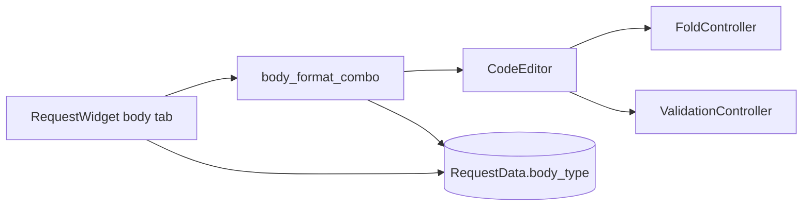

# Body Format Selector

## Overview

The request Body tab includes a format selector (JSON, YAML, XML) above the code editor. The
selected format drives folding and validation via `CodeEditor.set_body_format()` and is persisted
on the request as `RequestData.body_type`.

## Architecture

- **`RequestWidget` (`request_editor.py`)** — Hosts the format combo and `body_edit` (`CodeEditor`).
- **`body_type_to_body_format` / `body_format_to_body_type`** — Map between model strings and
  `BodyFormat` enum values.
- **`RequestData.body_type`** — Persisted field (`json`, `yaml`, `xml`); used by `http_client` for
  send serialization.

See also [Body Editor Folding](body_editor_folding.md) and
[Body Editor Validation](body_editor_validation.md) for format-driven editor behavior.

## API / Usage

### Format selector

The combo appears at the top of the Body tab with options JSON, YAML, and XML. Changing the
selection calls `CodeEditor.set_body_format()` immediately.

### Persistence

- **Load**: `load_data()` reads `request_data.body_type`, sets the combo, and applies the format
  on the editor.
- **Save / Send**: `get_request_data_from_ui()` writes the selected format to `body_type`.

### Defaults

New requests and unknown legacy `body_type` values (e.g. `"text"`) default to JSON in the selector
and editor.

## Configuration

No user setting. Default format is JSON.

## Troubleshooting

### Folding or validation still behave like JSON after selecting YAML

Confirm the selector shows YAML and that `body_type` on the request is `"yaml"`. Full YAML/XML
folding and validation require scanner/validator implementations (PYPOST-518, PYPOST-519).

### JSON body sent incorrectly after switching to YAML

`body_type` controls send behavior: only `"json"` triggers JSON serialization in `http_client`.
Switching format updates `body_type`; ensure the payload matches the declared format.

### Format not restored when reopening a request

Verify the saved request includes `body_type` in collection JSON. The field has been on
`RequestData` since early versions; the selector now reads and writes it.
