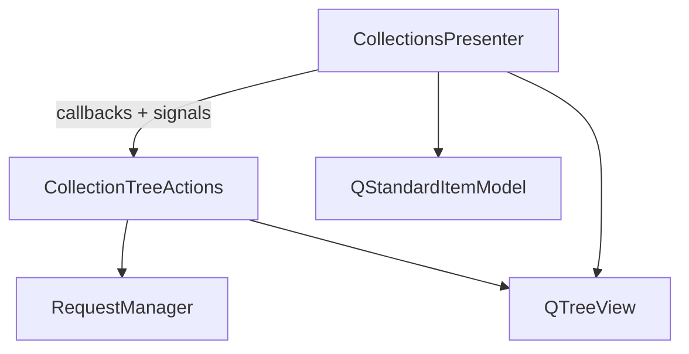

# Collection Tree Actions

## Overview

`CollectionTreeActions` (`pypost/ui/presenters/collection_tree_actions.py`) owns
right-click context-menu behavior for the collections tree: **New tab** (requests only),
**Rename**, and **Delete**. It also handles the inline rename editor lifecycle and delete
confirmation flow.

`CollectionsPresenter` wires the tree view to this class and keeps tree loading, navigation,
and expand/collapse state.

## Architecture

| Component | Role |
|-----------|------|
| `CollectionsPresenter` | Builds tree model, handles left-click open, expand state |
| `CollectionTreeActions` | Context menu, rename editor close, delete with confirmation |
| `RequestManager` | `rename_collection_item`, `delete_collection_item` |

Wiring in `CollectionsPresenter.__init__`:

- `customContextMenuRequested` → `CollectionTreeActions.show_context_menu`
- `closeEditor` → `CollectionTreeActions.on_editor_closed`

## API / Usage

### `CollectionTreeActions.show_context_menu(pos)`

Resolves the item at `pos`, builds the menu, and dispatches the selected action.

### `CollectionTreeActions.on_editor_closed(_editor, hint)`

Finalizes inline rename after the tree editor closes (commit or cancel).

### `CollectionTreeActions.handle_delete(item_id, item_type, item_label)`

Runs delete persistence, emits `requests_deleted` via callback, and updates the tree
incrementally or via `refresh_tree` fallback.

### Callbacks (constructor)

| Callback | Purpose |
|----------|---------|
| `find_item` | Locate `QStandardItem` by id and type |
| `remove_item` | Remove one node without full rebuild |
| `refresh_tree` / `restore_tree_state` | Fallback when item missing from model |
| `emit_collections_changed` | After successful rename or delete |
| `emit_request_renamed` | After request rename |
| `emit_requests_deleted` | After delete with affected request IDs |
| `emit_open_isolated_tab` | After **New tab** on a request |

## Configuration

No task-specific settings. Metrics use existing `MetricsManager` counters documented in
`doc/dev/collection_item_rename.md` and `doc/dev/collection_item_delete.md`.

## Troubleshooting

### Context menu tests fail after moving imports

Patch `QMenu` and `QMessageBox` under `pypost.ui.presenters.collection_tree_actions`,
not `collections_presenter`.

### Rename pending state in tests

Set `presenter._pending_rename` — the property delegates to
`presenter._tree_actions._pending_rename`.
