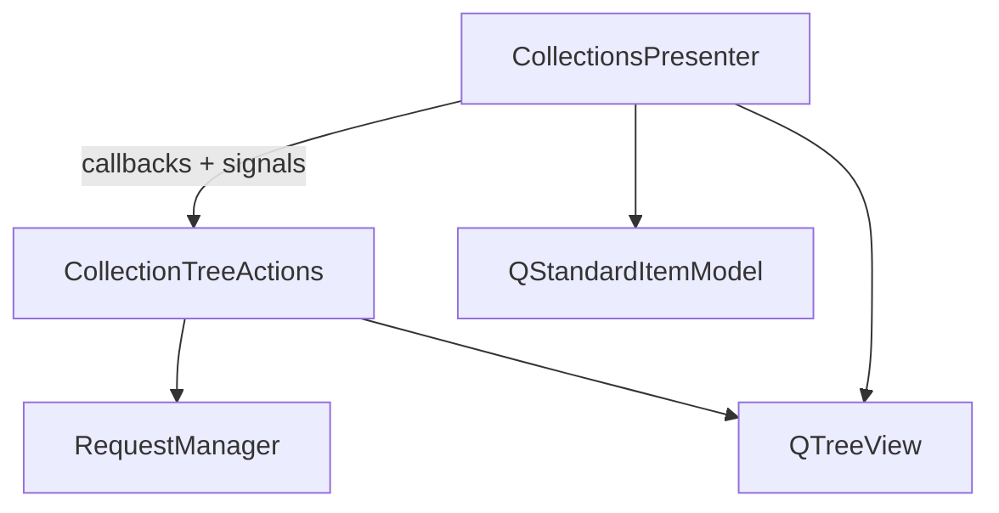

# Collection Tree Actions

## Overview

`CollectionTreeActions` (`pypost/ui/presenters/collection_tree_actions.py`) owns
right-click context-menu behavior for the collections tree: **New tab** (requests only),
**Rename**, and **Delete**. It also handles the inline rename editor lifecycle and delete
confirmation flow.

`CollectionsPresenter` wires the tree view to this class and keeps tree loading, navigation,
and expand/collapse state.

## Architecture

| Component | Role |
|-----------|------|
| `CollectionsPresenter` | Builds tree model, handles left-click open, expand state |
| `CollectionItemRenameDelegate` | Inline rename editor lifecycle |
| `CollectionTreeActions` | Context menu, rename callbacks, delete with confirmation |
| `collection_item_dialogs` | Shared QMessageBox helpers for rename/delete flows |
| `RequestManager` | `rename_collection_item`, `delete_collection_item` |

Wiring in `CollectionsPresenter.__init__`:

- `setItemDelegate(CollectionItemRenameDelegate)` — commit/cancel callbacks to tree actions
- `customContextMenuRequested` → `CollectionTreeActions.show_context_menu`

## API / Usage

### `CollectionTreeActions.show_context_menu(pos)`

Resolves the item at `pos`, builds the menu, and dispatches the selected action.

### `CollectionTreeActions.handle_rename_committed(new_name)`

Finalizes a successful inline rename (persistence, metrics, tree sync).

### `CollectionTreeActions.handle_rename_cancelled()`

Restores the tree label after Escape cancel.

### `CollectionTreeActions.handle_rename_rejected_empty()`

Handles empty-name rejection from the delegate.

### `CollectionTreeActions.handle_delete(item_id, item_type, item_label)`

Runs delete persistence, emits `requests_deleted` via callback, and updates the tree
incrementally or via `refresh_tree` fallback.

### `collection_item_dialogs`

`pypost/ui/collection_item_dialogs.py` centralizes QMessageBox usage for collection rename
and delete:

| Helper | When used |
|--------|-----------|
| `confirm_delete(parent, item_label)` | Delete context-menu action (Yes/No) |
| `show_rename_empty_name_error(parent)` | Delegate rejects empty rename |
| `show_rename_failure(parent, label, error)` | Rename persistence exception |
| `show_rename_not_found(parent, label)` | Rename returned false |
| `show_delete_failure(parent, label, error)` | Delete persistence exception |
| `show_delete_not_found(parent, label)` | Delete returned false |

### Callbacks (constructor)

| Callback | Purpose |
|----------|---------|
| `find_item` | Locate `QStandardItem` by id and type |
| `remove_item` | Remove one node without full rebuild |
| `refresh_tree` / `restore_tree_state` | Fallback when item missing from model |
| `emit_collections_changed` | After successful rename or delete |
| `emit_request_renamed` | After request rename |
| `emit_requests_deleted` | After delete with affected request IDs |
| `emit_open_isolated_tab` | After **New tab** on a request |

## Configuration

No task-specific settings. Metrics use existing `MetricsManager` counters documented in
`doc/dev/collection_item_rename.md` and `doc/dev/collection_item_delete.md`.

## Automated tests

`tests/test_collection_tree_actions.py` covers right-click menu behavior via
`CollectionsPresenter` and `CollectionTreeActions`:

| Test | Behavior |
|------|----------|
| `test_invalid_index_skips_context_menu` | Blank click — no menu |
| `test_collection_menu_offers_rename_and_delete` | Collection node actions |
| `test_request_menu_offers_new_tab_rename_delete` | Request node actions |
| `test_rename_selected_starts_inline_edit` | Rename dispatches inline edit |
| `test_new_tab_selected_emits_open_isolated_tab` | New tab copies request, emits signal |
| `test_delete_cancelled_skips_persistence` | Delete No — tree unchanged |
| `test_delete_confirmed_removes_request` | Delete Yes — row removed |

`tests/test_collection_tree_delete_confirmation.py` asserts Yes/No confirmation
branching and `track_gui_collection_delete_action` call sequences (`selected` →
`cancelled` or `succeeded`) for collection and request nodes.

Patch `QMenu` under `pypost.ui.presenters.collection_tree_actions`. Patch dialog helpers
(`confirm_delete`, `show_rename_empty_name_error`, `show_delete_failure`, etc.) at the same
import site. Unit tests for helpers live in `tests/test_collection_item_dialogs.py`.
Related presenter tests remain in `tests/test_collections_presenter.py`.

## Troubleshooting

### Context menu tests fail after moving imports

Patch `QMenu` and dialog helpers under `pypost.ui.presenters.collection_tree_actions`,
not `collections_presenter`.

### Rename pending state in tests

Set `presenter._pending_rename` — the property delegates to
`presenter._tree_actions._pending_rename`.
