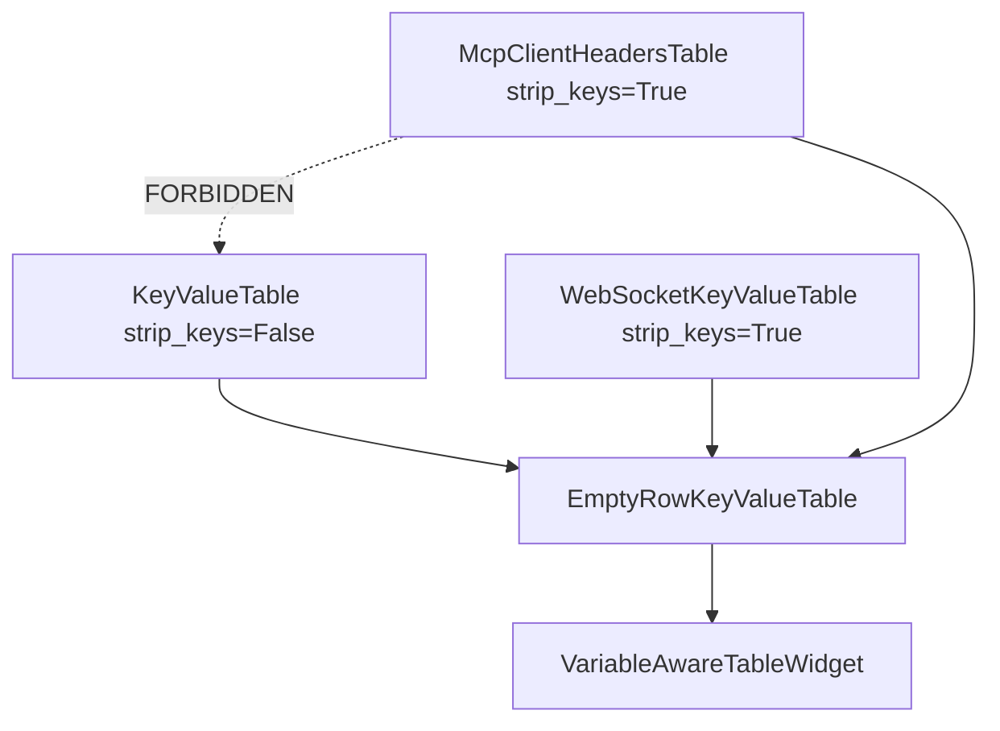

# Shared empty-row Key/Value table (PYPOST-1186)

## Overview

HTTP request Params/Headers, WebSocket handshake Params/Headers, and MCP
Client Headers share one empty-row Key/Value editor:
`EmptyRowKeyValueTable` in
`pypost/ui/widgets/empty_row_key_value_table.py`.

Call sites keep stable names via thin wrappers:

| Wrapper | Module | `strip_keys` |
| ------- | ------ | ------------ |
| `KeyValueTable` | `pypost/ui/widgets/request_editor.py` | `False` (raw keys) |
| `WebSocketKeyValueTable` | `pypost/ui/widgets/websocket/connection_editor.py` | `True` |
| `McpClientHeadersTable` | `pypost/ui/widgets/mcp_client/headers_table.py` | `True` |

MCP Client must import the **shared** module only — never
`pypost.ui.widgets.request_editor` (FR-5 / PYPOST-1167).

This is maintainer consolidation, not a new Headers product feature.
Env hover stays on `VariableAwareTableWidget`.

## Architecture

- **`EmptyRowKeyValueTable`**: subclasses `VariableAwareTableWidget`;
  Key/Value columns; trailing empty row; `get_data` / `set_data`;
  `set_read_only`; constructor policy `strip_keys`.
- **`set_data`**: always `blockSignals` while populating and seeds an
  empty last row so `itemChanged` does not recurse.
- **`get_data`**: last-wins `dict[str, str]`; with `strip_keys=True`,
  strips keys and omits whitespace-only names; with `False`, keeps raw
  key text (HTTP contract).
- **`set_read_only`**: toggles `QAbstractItemView` edit triggers. Only
  WebSocket connection editor calls it while connected.
- **Wrappers**: encode consumer policy; objectNames and presenter wiring
  stay on the protocol surfaces.



See also [MCP Client draft tab](mcp_client_draft_tab.md) and
[WebSocket environments / masking](websocket_environments_templating_and_masking.md).

## API / Usage

### `EmptyRowKeyValueTable(parent=None, *, strip_keys=True)`

Shared two-column editor.

- **parent**: optional `QWidget`
- **strip_keys**: collect policy (see table above)
- **Returns**: widget instance

### `get_data() -> dict[str, str]`

Collects non-empty key rows. Duplicate keys last-wins.

### `set_data(data: dict[str, str]) -> None`

Replaces rows from a pair map and leaves one trailing empty row.

### `set_read_only(read_only: bool) -> None`

Disables or restores cell editing (WebSocket while connected).

### Wrappers

```python
class KeyValueTable(EmptyRowKeyValueTable):
    def __init__(self, parent=None):
        super().__init__(parent, strip_keys=False)

class WebSocketKeyValueTable(EmptyRowKeyValueTable):
    def __init__(self, parent=None):
        super().__init__(parent, strip_keys=True)

class McpClientHeadersTable(EmptyRowKeyValueTable):
    def __init__(self, parent=None):
        super().__init__(parent, strip_keys=True)
```

## Configuration

No environment variables. Behavior is constructor policy only
(`strip_keys`). Widget ids (for example
`pypost_mcp_client_headers_table`) remain on the hosting tab/editor, not
on the shared class.

## Observability

Do **not** log Key/Value cell contents from this widget (auth headers /
secrets). MCP outbound header counts stay on the presenter/service path
documented under the MCP Client draft tab — count only, never values.

## Troubleshooting

| Symptom | Check |
| ------- | ----- |
| MCP imports pull in HTTP request editor | Ensure `headers_table.py` imports `empty_row_key_value_table` only; run `tests/test_empty_row_key_value_table.py` FR-5 cases |
| HTTP keys lose leading spaces | HTTP wrapper must use `strip_keys=False` |
| WS/MCP keep whitespace-only keys | Those wrappers must use `strip_keys=True` |
| Extra rows during `set_data` | Shared path blocks signals; do not reintroduce unblocked bulk `setItem` loops |
| WS tables editable while connected | `WebSocketConnectionEditor.set_read_only(True)` must still reach both tables |

## Tests

`tests/test_empty_row_key_value_table.py` (`pytestmark` timeout 30):

- Shared module export and HTTP/WS/MCP ancestry
- FR-5 import decoupling
- Strip vs non-strip collect
- WS `set_read_only`
- Trailing empty-row growth

MCP Headers UX regressions remain in `tests/test_mcp_client_tab.py`.
