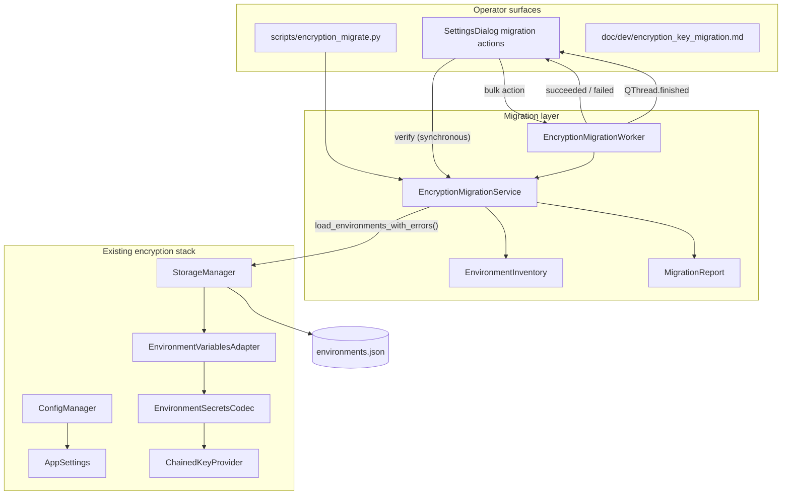

# Environment Encryption Key Migration

## Overview

PYPOST-487 adds operator tooling and runbooks for migrating environment encryption key sources,
enabling encryption on existing plaintext hidden values, and optional bulk re-encryption after key
rotation. The migration layer does not change envelope format, codec behavior, or key provider
contracts — it orchestrates existing `StorageManager` load/save paths.

PYPOST-1072 stabilizes the desktop migration worker lifecycle by separating domain results from
native thread completion, retaining worker ownership through bounded cleanup, and validating the
behavior with focused tests and bounded full-suite runs.

For encryption fundamentals (sources, settings, rotation registries), see
[Environment Encryption at Rest](environment_encryption_at_rest.md). This document focuses on
staged rollout, scenario procedures, CLI usage, and failure playbooks.

## Architecture



| Component | Module | Responsibility |
| --- | --- | --- |
| Migration service | `pypost/core/encryption_migration.py` | Verify, inventory, bulk re-encrypt, encrypt-plaintext |
| Operator CLI | `scripts/encryption_migrate.py` | Headless subcommands; loads `AppSettings` via `ConfigManager` |
| Settings UI | `pypost/ui/widgets/settings/encryption_migration_section.py` | Verify encryption; re-encrypt all (with confirmation) |
| Worker | `pypost/core/qt/encryption_migration_worker.py` | Run bulk actions and emit domain outcomes |
| Inventory | `EnvironmentInventory` | Per-env and aggregate `kid`/plaintext stats |
| Report | `MigrationReport` | Structured outcome: counts, errors, dry-run, backup path |
| Storage | `pypost/core/storage.py` | Atomic I/O; migration uses `load_environments_with_errors()` |
| Load failure | `EnvironmentLoadFailure` | Structured per-env decrypt/deserialize failure from storage |
| Adapter | `pypost/core/environment_variables_adapter.py` | Lazy encrypt-on-save; migration relies on re-save |

**Safety properties:**

- Writes use the existing atomic `tmp` + `os.replace` path in `StorageManager`.
- `--dry-run` performs full decrypt without `save_environments`.
- Write commands back up `environments.json` to a timestamped sibling by default; pass
  `--no-backup` to skip.
- Migration does not run automatically on settings change.
- Fails closed: missing `kid` or decrypt errors abort before write; no partial file update.

## Rollout stages

Stages are operator guidance only — they are not persisted in settings.

| Stage | Audience | Primary source | Typical fallback | Prerequisites |
| --- | --- | --- | --- | --- |
| **0 — Legacy env-only** | Solo desktop, CI, quick start | `environment` | none | `PYPOST_ENV_ENCRYPTION_KEY` when encryption on |
| **1 — Env with registry** | Rotation on env channel | `environment` | none | `PYPOST_ENV_ENCRYPTION_KEYS_FILE` with active + historical keys |
| **2 — Desktop keyring** | Individual developer workstation | `keyring` | `environment` | `keyring` installed; entries under `pypost/env-encryption`; backup taken |
| **3 — Team secret file** | Small team, shared machine image | `secret_store` | `environment` or `keyring` | Spec file + file backend; access controls on registry path |
| **4 — Central secrets** | Centrally managed deployments | `secret_store` (vault backend) | ordered chain per ops | Vault/token or env-indirection backend configured (PYPOST-500+) |

### Go/no-go between stages

Before promoting to the next stage:

1. Run `encryption_migrate verify` — exit code 0, no `missing_kids`.
2. Confirm sample decrypt succeeds (verify performs full deserialize).
3. Take a backup of `environments.json` (manual copy or rely on the default backup before
   write commands; use `--no-backup` only when you already have a copy).
4. Confirm the new primary source yields an active key.
5. When fallback is relied upon, test intentionally (e.g. disable primary in a dry check) and
   confirm chain resolution logs show expected fallback success.

## Migration scenarios

| ID | Scenario | CLI / action |
| --- | --- | --- |
| **M1** | Stay on env-only legacy | None required |
| **M2** | Adopt env registry for rotation | Provision `KEYS_FILE`; `verify` |
| **M3** | Change primary to keyring/secret_store | Reconfigure settings; keep old source in fallback; `verify`; remove fallback when confident |
| **M4** | Enable encryption on plaintext hidden values | Enable in Settings; `encrypt-plaintext` |
| **M5** | Change fallback order only | Update Settings; `verify`; no bulk rewrite |
| **M6** | Rotate active key | Update registry per [rotation workflow](environment_encryption_at_rest.md#key-rotation-workflow); `verify` |
| **M7** | Bulk re-encrypt under active key | `re-encrypt` (backup is default) or Settings → **Re-encrypt all environments** |
| **M8** | Retire historical key material | Only after M7 confirms no envelopes reference retired `kid` |
| **M9** | Upgrade v1 envelopes to v2 fernet | `upgrade-v2` (backup is default) |

### M3 — Change primary key source (cutover)

1. Provision key material in the new source (same Fernet bytes or new active key per rotation policy).
2. In Settings, set the new primary source and add the previous source to **fallback**.
3. Restart PyPost if you changed env vars or registry files outside Settings.
4. Run `python scripts/encryption_migrate.py verify`.
5. Operate normally; monitor logs for `*_resolved_via_fallback` warnings.
6. When confident, remove the old source from fallback and run `verify` again.

### M4 — Enable encryption on plaintext data

1. Enable encryption in Settings (**Enabled**) or set `PYPOST_ENV_ENCRYPTION_ENABLED=true`.
2. Ensure an active key is available in the configured chain.
3. Run inventory: `python scripts/encryption_migrate.py report` — note `plaintext_hidden` count.
4. Dry run: `python scripts/encryption_migrate.py encrypt-plaintext --dry-run`.
5. Apply: `python scripts/encryption_migrate.py encrypt-plaintext` (creates backup by default).
6. Confirm `plaintext_hidden: 0` in output.

Equivalent to editing and saving each environment manually; suitable for one-shot migration.

### M6 + M7 — Rotate then bulk re-encrypt

**Rotation** updates the active key in the registry. Existing envelopes keep their historical `kid`
until re-encrypted.

1. Introduce new active key; retain historical keys under their `kid` values.
2. `python scripts/encryption_migrate.py verify`
3. Use the app normally; new saves use the new active `kid`.
4. When ready to retire old key material: `python scripts/encryption_migrate.py re-encrypt --dry-run`
5. `python scripts/encryption_migrate.py re-encrypt`
6. Confirm `kid_histogram` shows a single active `kid`.
7. Remove retired keys from registry (M8).

### M9 — Upgrade v1 envelopes to v2 fernet

After [v2 decrypt support](environment_encryption_at_rest.md#version-2-decrypt-supported-encrypt-still-v1-only)
is available, operators can normalize on-disk envelopes to v2 without changing key material
semantics (v2 fernet uses the same Fernet token in `ct` as v1).

1. `python scripts/encryption_migrate.py report` — note `v1_envelopes` count.
2. `python scripts/encryption_migrate.py verify`
3. `python scripts/encryption_migrate.py upgrade-v2 --dry-run`
4. `python scripts/encryption_migrate.py upgrade-v2`
5. Confirm `v1_envelopes: 0` and `v2_envelopes` matches hidden value count.

Also encrypts plain hidden strings as v2 when present. Skips when every hidden value is already v2.
Runtime saves through the desktop app still emit v1 until a future change; use `upgrade-v2` for
bulk normalization.

## Operator surfaces

### Settings (desktop)

Open **Settings** from the main window. Under **Encryption migration**:

- **Verify encryption** — read-only decrypt check using encryption fields currently shown in the
  form (saved or not). Results appear in an information or warning dialog.
- **Re-encrypt all environments** — asks for confirmation, creates a timestamped backup, then
  bulk re-encrypts under the active key. Same safety properties as the CLI `re-encrypt` command.
  The result dialog includes **Re-encrypted** and **Reused** counts when the migration service
  returns `reencrypt_stats` (same fields as CLI `reencrypt_stats`).

`encrypt-plaintext` and dry-run are CLI-only. `upgrade-v2` is CLI-only.

### Operator CLI

Run from the repository root (or any environment where PyPost dependencies and data dir are
available). The CLI loads `AppSettings` via `ConfigManager` and respects `PYPOST_ENV_ENCRYPTION_*`
env overrides the same way the desktop app does.

```bash
python scripts/encryption_migrate.py [--json] [--data-dir PATH] [--config-dir PATH] verify
python scripts/encryption_migrate.py [--json] [--data-dir PATH] [--config-dir PATH] report
python scripts/encryption_migrate.py [--json] [--data-dir PATH] [--config-dir PATH] re-encrypt [--dry-run] [--no-backup]
python scripts/encryption_migrate.py [--json] [--data-dir PATH] [--config-dir PATH] encrypt-plaintext [--dry-run] [--no-backup]
python scripts/encryption_migrate.py [--json] [--data-dir PATH] [--config-dir PATH] upgrade-v2 [--dry-run] [--no-backup]
```

| Flag | Purpose |
| --- | --- |
| `--json` | Emit one JSON document on stdout (inventory, errors, success). For CI and scripting. |
| `--data-dir PATH` | Use `PATH` as the PyPost data directory (`environments.json`). Useful when verifying a restored copy before swap-in. |
| `--config-dir PATH` | Use `PATH` as the PyPost config directory (`settings.json`). Useful when backup-restore copies settings alongside data. |

| Command | Writes | Purpose |
| --- | --- | --- |
| `verify` | No | Check all stored `kid` values resolve; full decrypt of every environment |
| `report` | No | Inventory `kid` histogram and plaintext/encrypted counts |
| `re-encrypt` | Yes (unless `--dry-run`) | Rewrite all hidden values under the current active key |
| `encrypt-plaintext` | Yes (unless `--dry-run`) | Encrypt plain hidden strings after enabling encryption |
| `upgrade-v2` | Yes (unless `--dry-run`) | Rewrite v1 envelopes (and plain hidden strings) as v2 fernet |

**Exit codes:** `0` on success; `1` on verification or migration failure. In human mode, errors print
to stderr; with `--json`, errors are included in the JSON payload on stdout.

**JSON example** (`re-encrypt --json` after kid rotation):

```json
{
  "command": "re-encrypt",
  "success": true,
  "dry_run": false,
  "backup_path": "/path/to/environments.json.backup.20260611T120000Z",
  "errors": [],
  "reencrypt_stats": {
    "encrypted_count": 3,
    "reused_count": 0
  },
  "inventory": {
    "environment_count": 2,
    "hidden_value_count": 3,
    "encrypted_envelope_count": 3,
    "plaintext_hidden_count": 0,
    "invalid_hidden_count": 0,
    "kid_histogram": { "abc123def4567890": 3 },
    "missing_kids": [],
    "data_quality_errors": []
  }
}
```

**JSON example** (`report --json`):

```json
{
  "command": "report",
  "success": true,
  "dry_run": false,
  "backup_path": null,
  "errors": [],
  "inventory": {
    "environment_count": 0,
    "hidden_value_count": 0,
    "encrypted_envelope_count": 0,
    "plaintext_hidden_count": 0,
    "invalid_hidden_count": 0,
    "kid_histogram": {},
    "missing_kids": [],
    "data_quality_errors": []
  }
}
```

**Example output:**

```
environments: 3
hidden_values: 12
encrypted_envelopes: 10
v1_envelopes: 8
v2_envelopes: 2
plaintext_hidden: 2
kid_histogram:
  abc123def4567890: 8
  fedcba0987654321: 2
reencrypt_stats:
  encrypted: 8
  reused: 2
```

`reencrypt_stats` appears on `re-encrypt` and `encrypt-plaintext` when the command completes a
rewrite or skips because every hidden value already uses the active `kid`. Omitted on `verify` and
`report`. Dry-run includes projected `reencrypt_stats` using the same serialize path as a live
save without writing.

Envelope reuse during bulk save requires the stored `kid` to match the active key (PYPOST-535), so
kid rotation re-encrypts historical envelopes even when plaintext is unchanged.

With `--dry-run` on write commands, `kid_histogram` reflects the projected state after re-encryption
under the active key.

### Verification checklist

Use before production cutover or after rotation:

- [ ] `verify` exits 0
- [ ] `report` shows `missing_kids` empty and `invalid_hidden: 0` (sections omitted when none)
- [ ] Backup of `environments.json` exists
- [ ] Primary source yields active key (app can save a test hidden value)
- [ ] Fallback tested when configured
- [ ] For M7: `re-encrypt --dry-run` then `re-encrypt` with backup

## API / Usage (developers)

### Desktop worker lifecycle (PYPOST-1072)

`EncryptionMigrationWorker` subclasses `QThread`. It exposes two domain-result signals:

- `succeeded(MigrationReport)` reports a service return value.
- `failed(str)` reports an exception raised by the service.

Neither signal means that the native thread has terminated. Native termination is represented by
the inherited, no-argument `QThread.finished()` signal. Do not add a subclass signal named
`finished`; doing so hides Qt's lifecycle signal in Python and makes a result indistinguishable
from thread termination.

`EncryptionMigrationSection` owns the worker through the host dialog's `_migration_worker`
reference. The lifecycle ordering is:

1. Retain the worker, disable all migration buttons, and start the thread.
2. Handle `succeeded` or `failed` while keeping the worker strongly referenced.
3. After inherited `QThread.finished()` fires, call `deleteLater()`.
4. Call `wait(100)` to bound synchronization with any remaining native thread effects.
5. Clear `_migration_worker` and restore the migration buttons, including when `wait()` returns
   false.

The 100 millisecond cleanup wait is a code policy in `_WORKER_FINISH_WAIT_MS`; it is not a user
setting or an environment variable. A timeout emits this warning through
`pypost.ui.dialogs.settings_dialog`:

```text
settings_encryption_migration_worker_finish_wait_timeout wait_ms=100 operation=<operation>
```

The warning means cleanup reached its bound. It does not change the migration result, extend the
wait, or keep the controls disabled. Avoid `QThread.terminate()` in recovery code because forced
termination cannot guarantee safe cleanup.

### `StorageManager.load_environments_with_errors()` (PYPOST-525)

Supported batch load for migration and other operator tooling. Unlike `load_environments()`, it
continues after individual decrypt or deserialize failures and returns structured
`EnvironmentLoadFailure` records.

```python
storage.apply_encryption_settings(settings)
environments, failures = storage.load_environments_with_errors()
operator_lines = tuple(f.format_operator_message() for f in failures)
```

`EncryptionMigrationService._deserialize_all()` wraps this call. Desktop UI code must continue to
use `load_environments()` only. Full contract and logging: [Environment Encryption at Rest —
load contracts](environment_encryption_at_rest.md#environment-load-contracts-pypost-525).

### `EncryptionMigrationService(storage: StorageManager)`

Facade for programmatic migration (CLI and optional future Settings actions).

#### `build_inventory(settings: AppSettings | None) -> EnvironmentInventory`

Scans raw `environments.json` for envelope-shaped hidden values. Classifies each hidden value as
encrypted envelope, plaintext string, or invalid (any other JSON type or dict without `enc: true`).
Checks configured key provider for missing `kid` entries. Does not decrypt values.
Inventory-only; use `verify_decrypt_access()` when decrypt validation is required.

#### `verify_decrypt_access(settings: AppSettings | None) -> MigrationReport`

Calls `build_inventory()`, fails on `data_quality_errors` or missing `kid`, then deserializes every
environment via `load_environments_with_errors()`. Returns `success=False` with error details on
failure. Decrypt validation is not available on `build_inventory()` — that path is verify-only.

#### `bulk_re_encrypt(settings, *, dry_run=False, backup=True) -> MigrationReport`

Loads all environments, decrypts, saves unchanged in-memory values so the adapter re-encrypts with
the active key. Requires encryption enabled. Aborts if any `kid` is missing or decrypt fails.
Succeeds immediately without backup or file I/O when every hidden value is already encrypted with
the active `kid` and there is no plaintext hidden data. Returns `reencrypt_stats` on the report:
all hidden values counted as `reused_count` on the skip path, or actual encrypt/reuse counts after
save. Reuse keeps an envelope only when plaintext is unchanged **and** the stored `kid` matches the
active key.

#### `encrypt_plaintext_hidden(settings, *, dry_run=False, backup=True) -> MigrationReport`

Same rewrite path as `bulk_re_encrypt`, but succeeds immediately when `plaintext_hidden_count` is 0.
Requires encryption enabled.

#### `upgrade_envelopes_to_v2(settings, *, dry_run=False, backup=True) -> MigrationReport`

Loads all environments, decrypts v1 and v2 envelopes, saves with `target_envelope_version=2` so
hidden values are written as v2 fernet under the active key. Also encrypts plain hidden strings as
v2. Succeeds immediately without backup or file I/O when every hidden value is already a v2 envelope
and there is no plaintext hidden data. Requires encryption enabled. Uses the same safety properties
as `bulk_re_encrypt` (backup, dry-run, fail closed).

#### `backup_environments_file(path: Path) -> Path`

Copies `environments.json` to `{stem}.backup.{UTC-timestamp}{suffix}` alongside the original.

### Data types

- `EnvironmentInventory` — `environment_count`, `hidden_value_count`, `encrypted_envelope_count`,
  `v1_envelope_count`, `v2_envelope_count`, `plaintext_hidden_count`, `invalid_hidden_count`,
  `kid_histogram`, `missing_kids`, `data_quality_errors` (per-field messages for invalid hidden shapes)
- `MigrationReport` — `inventory`, `dry_run`, `backup_path`, `errors`, `success`,
  `reencrypt_stats` (optional; `encrypted_count` / `reused_count` from bulk save)
- `ReencryptStats` — aggregate selective re-encrypt counts for operator output

## Configuration

Migration uses the same policy as runtime encryption. No new settings fields.

| Setting / variable | Effect on migration |
| --- | --- |
| `env_encryption_enabled` / `PYPOST_ENV_ENCRYPTION_ENABLED` | Required for `re-encrypt` and `encrypt-plaintext` |
| `env_encryption_key_source` | Primary source for active key during rewrite |
| `env_encryption_key_source_fallback` | Chain order for `kid` lookup |
| `PYPOST_ENV_ENCRYPTION_KEY`, `KEYS_FILE`, `SECRETS_FILE` | Source-specific key material (see [encryption doc](environment_encryption_at_rest.md#configuration)) |

Data directory defaults follow `ConfigManager` / `StorageManager` (same as the desktop app). Pass
`StorageManager(data_dir=...)` or CLI `--data-dir` to override data paths; pass CLI `--config-dir`
to override the config directory when running against restored settings.

## Fallback and safe-failure matrix

Behavior is implemented in `KeySourceChain` (unchanged). Use this table during migration
cutovers.

| Condition | Active key | Historical `kid` | Operator experience |
| --- | --- | --- | --- |
| Primary unavailable, fallback yields key | Uses fallback; logs `*_resolved_via_fallback` | Tries each source in order | Normal operation |
| No source yields active key | — | — | Save/migration fails; `encryption_key_unavailable` |
| Active ok, historical `kid` missing | — | All sources return `None` | `verify` fails; `missing_kids` listed |
| Encryption disabled | N/A for new encrypt | Decrypt still runs for envelopes on load | `re-encrypt` / `encrypt-plaintext` error |
| Legacy env-only, single var | Env key is active | `get_key_by_id` only when `kid` matches | Rotation requires registry (Stage 1+) |

## Troubleshooting

### `verify` lists environment names with decrypt errors

**Symptoms:** stderr lines like `Dev: Failed to decrypt environment variable 'SECRET': …`.

**Cause:** One or more stored environments failed full deserialize during
`load_environments_with_errors()`. Migration fails closed before any write.

**Fix:** For each listed environment, restore key material for the envelope `kid`, repair corrupt
payloads, or restore `environments.json` from backup. See
[dual load contract troubleshooting](environment_encryption_at_rest.md#migration-verify-lists-per-environment-errors-but-desktop-shows-no-environments).

### `verify` reports missing `kid`

**Cause:** Historical key material removed from all sources in the chain while envelopes still
reference that `kid`.

**Fix:** Restore the key under the correct `kid` in a reachable source (env registry, keyring entry,
or secret-store spec). Run `report` to see the histogram. See
[decrypt failure troubleshooting](environment_encryption_at_rest.md#environments-missing-or-empty-after-load-decrypt-failure).

### `re-encrypt` or `encrypt-plaintext` fails with "Encryption is not enabled"

**Cause:** `resolve_encryption_enabled(settings)` is false.

**Fix:** Enable encryption in Settings or set `PYPOST_ENV_ENCRYPTION_ENABLED=true`, then re-run.

### `encrypt-plaintext` succeeds immediately with no file change

**Expected** when `plaintext_hidden_count` is 0 — all hidden values are already envelopes.

### `upgrade-v2` succeeds immediately with no file change

**Expected** when `v1_envelopes` is 0 and there is no plaintext hidden data — all hidden values are
already v2 envelopes.

### Dry-run `kid_histogram` shows one key but live file shows many

**Expected.** Dry-run projects counts after re-encryption under the active key without writing.

### Write failed after backup was created

Save is atomic. A failed replace leaves the original file intact. Restore from the timestamped
backup sibling if needed:

```bash
cp environments.json.backup.20260611T120000Z environments.json
```

### CLI cannot find settings or data directory

**Cause:** Running outside the normal app context without the expected paths, or `--data-dir` /
`--config-dir` points at a path that does not exist.

**Fix:** Run from the same user account and environment as PyPost, pass `--data-dir` and/or
`--config-dir` to restored copies, or set paths per project setup.

### Settings changed but CLI sees old key source

**Cause:** External env or registry file changes not reflected until restart.

**Fix:** Restart shells or re-export env vars; confirm `settings.json` and env overrides. See
[env var changes ignored](environment_encryption_at_rest.md#env-var-or-registry-file-changes-ignored-while-app-is-running).

### Settings migration cleanup warning appears

**Symptom:** Logs contain
`settings_encryption_migration_worker_finish_wait_timeout wait_ms=100 operation=...`.

**Cause:** Qt emitted native thread completion, but the worker's bounded `wait(100)` did not
confirm complete synchronization within the cleanup window.

**Fix:** Check the preceding worker start, completion, and failure events for the same operation.
Confirm the result dialog was requested, the migration buttons were restored, and no worker
remains active. Reproduce with the focused lifecycle tests below. Do not increase the bound or
force termination solely to suppress the warning; investigate repeated warnings as a Qt lifecycle
or environment issue.

## Tests

The UI tests use `process_until()` with a 5,000 millisecond inner bound and a module-level
120-second pytest timeout. The helper waits until `_migration_worker` is `None`, which now occurs
only after the inherited thread-completion handler runs. An expired inner bound raises an
assertion with worker state and operation details; test helpers must not silently return at a
deadline or use domain-result delivery as the completion condition.

Run the focused worker lifecycle and Settings UI coverage from the repository root:

```bash
make test PYTEST_ARGS="tests/test_encryption_migration_worker.py \
  tests/test_settings_encryption_migration_ui.py"
```

Evidenced result: 14 focused tests passed.

This covers service dispatch, domain-result signals, retained ownership through native thread
completion, the 100 millisecond cleanup warning, control restoration, and the existing migration
UI scenarios. The deterministic UI seam currently covers success and cleanup-timeout ordering.
Failure-path lifecycle ordering is tracked by
[PYPOST-1078](https://pypost.atlassian.net/browse/PYPOST-1078).

Focused suites:

```bash
QT_QPA_PLATFORM=offscreen .venv/bin/python -m pytest \
  tests/test_encryption_migration.py \
  tests/test_encryption_migration_key_sources.py \
  tests/test_encryption_migration_vault.py \
  tests/test_encryption_migrate_cli.py
```

`test_encryption_migration_key_sources.py` covers Stage 2 (keyring primary) and Stage 3
(secret_store primary) verify and bulk re-encrypt paths using mocked keyring and file-based
secret-store fixtures.

`test_encryption_migration_vault.py` covers Stage 4 (Vault-backed secret_store primary) verify
and bulk re-encrypt paths using a mocked Vault KV HTTP response — no live Vault server required.

Full regression:

```bash
make test
```

## Related documentation

- [Environment Encryption at Rest](environment_encryption_at_rest.md) — sources, settings, rotation,
  codec format
- [Async Environment Storage](environment_storage_async.md) — UI threading when encryption is enabled
- [PYPOST-1072 architecture](../../ai-tasks/PYPOST-1072/20-architecture.md) — signal split,
  ownership invariants, and design rationale
- [PYPOST-1072 observability](../../ai-tasks/PYPOST-1072/50-observability.md) — lifecycle log
  contract
