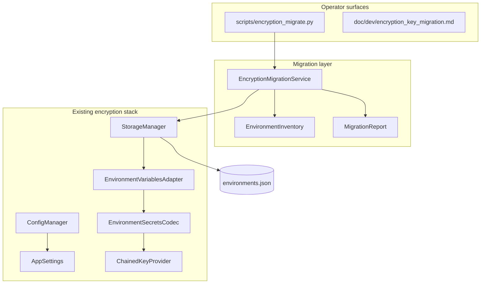

# Environment Encryption Key Migration

## Overview

PYPOST-487 adds operator tooling and runbooks for migrating environment encryption key sources,
enabling encryption on existing plaintext hidden values, and optional bulk re-encryption after key
rotation. The migration layer does not change envelope format, codec behavior, or key provider
contracts — it orchestrates existing `StorageManager` load/save paths.

For encryption fundamentals (sources, settings, rotation registries), see
[Environment Encryption at Rest](environment_encryption_at_rest.md). This document focuses on
staged rollout, scenario procedures, CLI usage, and failure playbooks.

## Architecture



| Component | Module | Responsibility |
| --- | --- | --- |
| Migration service | `pypost/core/encryption_migration.py` | Verify, inventory, bulk re-encrypt, encrypt-plaintext |
| Operator CLI | `scripts/encryption_migrate.py` | Headless subcommands; loads `AppSettings` via `ConfigManager` |
| Inventory | `EnvironmentInventory` | Per-env and aggregate `kid`/plaintext stats |
| Report | `MigrationReport` | Structured outcome: counts, errors, dry-run, backup path |
| Storage | `pypost/core/storage.py` | Unchanged I/O; migration calls load/save |
| Adapter | `pypost/core/environment_variables_adapter.py` | Lazy encrypt-on-save; migration relies on re-save |

**Safety properties:**

- Writes use the existing atomic `tmp` + `os.replace` path in `StorageManager`.
- `--dry-run` performs full decrypt without `save_environments`.
- Write commands back up `environments.json` to a timestamped sibling by default; pass
  `--no-backup` to skip.
- Migration does not run automatically on settings change.
- Fails closed: missing `kid` or decrypt errors abort before write; no partial file update.

## Rollout stages

Stages are operator guidance only — they are not persisted in settings.

| Stage | Audience | Primary source | Typical fallback | Prerequisites |
| --- | --- | --- | --- | --- |
| **0 — Legacy env-only** | Solo desktop, CI, quick start | `environment` | none | `PYPOST_ENV_ENCRYPTION_KEY` when encryption on |
| **1 — Env with registry** | Rotation on env channel | `environment` | none | `PYPOST_ENV_ENCRYPTION_KEYS_FILE` with active + historical keys |
| **2 — Desktop keyring** | Individual developer workstation | `keyring` | `environment` | `keyring` installed; entries under `pypost/env-encryption`; backup taken |
| **3 — Team secret file** | Small team, shared machine image | `secret_store` | `environment` or `keyring` | Spec file + file backend; access controls on registry path |
| **4 — Central secrets** | Centrally managed deployments | `secret_store` (vault backend) | ordered chain per ops | Vault/token or env-indirection backend configured (PYPOST-500+) |

### Go/no-go between stages

Before promoting to the next stage:

1. Run `encryption_migrate verify` — exit code 0, no `missing_kids`.
2. Confirm sample decrypt succeeds (verify performs full deserialize).
3. Take a backup of `environments.json` (manual copy or rely on the default backup before
   write commands; use `--no-backup` only when you already have a copy).
4. Confirm the new primary source yields an active key.
5. When fallback is relied upon, test intentionally (e.g. disable primary in a dry check) and
   confirm chain resolution logs show expected fallback success.

## Migration scenarios

| ID | Scenario | CLI / action |
| --- | --- | --- |
| **M1** | Stay on env-only legacy | None required |
| **M2** | Adopt env registry for rotation | Provision `KEYS_FILE`; `verify` |
| **M3** | Change primary to keyring/secret_store | Reconfigure settings; keep old source in fallback; `verify`; remove fallback when confident |
| **M4** | Enable encryption on plaintext hidden values | Enable in Settings; `encrypt-plaintext` |
| **M5** | Change fallback order only | Update Settings; `verify`; no bulk rewrite |
| **M6** | Rotate active key | Update registry per [rotation workflow](environment_encryption_at_rest.md#key-rotation-workflow); `verify` |
| **M7** | Bulk re-encrypt under active key | `re-encrypt` (backup is default) |
| **M8** | Retire historical key material | Only after M7 confirms no envelopes reference retired `kid` |

### M3 — Change primary key source (cutover)

1. Provision key material in the new source (same Fernet bytes or new active key per rotation policy).
2. In Settings, set the new primary source and add the previous source to **fallback**.
3. Restart PyPost if you changed env vars or registry files outside Settings.
4. Run `python scripts/encryption_migrate.py verify`.
5. Operate normally; monitor logs for `*_resolved_via_fallback` warnings.
6. When confident, remove the old source from fallback and run `verify` again.

### M4 — Enable encryption on plaintext data

1. Enable encryption in Settings (**Enabled**) or set `PYPOST_ENV_ENCRYPTION_ENABLED=true`.
2. Ensure an active key is available in the configured chain.
3. Run inventory: `python scripts/encryption_migrate.py report` — note `plaintext_hidden` count.
4. Dry run: `python scripts/encryption_migrate.py encrypt-plaintext --dry-run`.
5. Apply: `python scripts/encryption_migrate.py encrypt-plaintext` (creates backup by default).
6. Confirm `plaintext_hidden: 0` in output.

Equivalent to editing and saving each environment manually; suitable for one-shot migration.

### M6 + M7 — Rotate then bulk re-encrypt

**Rotation** updates the active key in the registry. Existing envelopes keep their historical `kid`
until re-encrypted.

1. Introduce new active key; retain historical keys under their `kid` values.
2. `python scripts/encryption_migrate.py verify`
3. Use the app normally; new saves use the new active `kid`.
4. When ready to retire old key material: `python scripts/encryption_migrate.py re-encrypt --dry-run`
5. `python scripts/encryption_migrate.py re-encrypt`
6. Confirm `kid_histogram` shows a single active `kid`.
7. Remove retired keys from registry (M8).

## Operator CLI

Run from the repository root (or any environment where PyPost dependencies and data dir are
available). The CLI loads `AppSettings` via `ConfigManager` and respects `PYPOST_ENV_ENCRYPTION_*`
env overrides the same way the desktop app does.

```bash
python scripts/encryption_migrate.py verify
python scripts/encryption_migrate.py report
python scripts/encryption_migrate.py re-encrypt [--dry-run] [--no-backup]
python scripts/encryption_migrate.py encrypt-plaintext [--dry-run] [--no-backup]
```

| Command | Writes | Purpose |
| --- | --- | --- |
| `verify` | No | Check all stored `kid` values resolve; full decrypt of every environment |
| `report` | No | Inventory `kid` histogram and plaintext/encrypted counts |
| `re-encrypt` | Yes (unless `--dry-run`) | Rewrite all hidden values under the current active key |
| `encrypt-plaintext` | Yes (unless `--dry-run`) | Encrypt plain hidden strings after enabling encryption |

**Exit codes:** `0` on success; `1` on verification or migration failure (errors printed to stderr).

**Example output:**

```
environments: 3
hidden_values: 12
encrypted_envelopes: 10
plaintext_hidden: 2
kid_histogram:
  abc123def4567890: 8
  fedcba0987654321: 2
```

With `--dry-run` on write commands, `kid_histogram` reflects the projected state after re-encryption
under the active key.

### Verification checklist

Use before production cutover or after rotation:

- [ ] `verify` exits 0
- [ ] `report` shows `missing_kids` empty (section omitted when none)
- [ ] Backup of `environments.json` exists
- [ ] Primary source yields active key (app can save a test hidden value)
- [ ] Fallback tested when configured
- [ ] For M7: `re-encrypt --dry-run` then `re-encrypt` with backup

## API / Usage (developers)

### `EncryptionMigrationService(storage: StorageManager)`

Facade for programmatic migration (CLI and optional future Settings actions).

#### `build_inventory(settings: AppSettings | None) -> EnvironmentInventory`

Scans raw `environments.json` for envelope-shaped hidden values. Checks configured key provider
for missing `kid` entries. Does not decrypt values.

#### `verify_decrypt_access(settings: AppSettings | None) -> MigrationReport`

Builds inventory, checks missing `kid`, then deserializes every environment. Returns
`success=False` with error details on failure.

#### `bulk_re_encrypt(settings, *, dry_run=False, backup=True) -> MigrationReport`

Loads all environments, decrypts, saves unchanged in-memory values so the adapter re-encrypts with
the active key. Requires encryption enabled. Aborts if any `kid` is missing or decrypt fails.

#### `encrypt_plaintext_hidden(settings, *, dry_run=False, backup=True) -> MigrationReport`

Same rewrite path as `bulk_re_encrypt`, but succeeds immediately when `plaintext_hidden_count` is 0.
Requires encryption enabled.

#### `backup_environments_file(path: Path) -> Path`

Copies `environments.json` to `{stem}.backup.{UTC-timestamp}{suffix}` alongside the original.

### Data types

- `EnvironmentInventory` — `environment_count`, `hidden_value_count`, `encrypted_envelope_count`,
  `plaintext_hidden_count`, `kid_histogram`, `missing_kids`
- `MigrationReport` — `inventory`, `dry_run`, `backup_path`, `errors`, `success`

## Configuration

Migration uses the same policy as runtime encryption. No new settings fields.

| Setting / variable | Effect on migration |
| --- | --- |
| `env_encryption_enabled` / `PYPOST_ENV_ENCRYPTION_ENABLED` | Required for `re-encrypt` and `encrypt-plaintext` |
| `env_encryption_key_source` | Primary source for active key during rewrite |
| `env_encryption_key_source_fallback` | Chain order for `kid` lookup |
| `PYPOST_ENV_ENCRYPTION_KEY`, `KEYS_FILE`, `SECRETS_FILE` | Source-specific key material (see [encryption doc](environment_encryption_at_rest.md#configuration)) |

Data directory defaults follow `ConfigManager` / `StorageManager` (same as the desktop app).

## Fallback and safe-failure matrix

Behavior is implemented in `KeySourceChain` (unchanged). Use this table during migration
cutovers.

| Condition | Active key | Historical `kid` | Operator experience |
| --- | --- | --- | --- |
| Primary unavailable, fallback yields key | Uses fallback; logs `*_resolved_via_fallback` | Tries each source in order | Normal operation |
| No source yields active key | — | — | Save/migration fails; `encryption_key_unavailable` |
| Active ok, historical `kid` missing | — | All sources return `None` | `verify` fails; `missing_kids` listed |
| Encryption disabled | N/A for new encrypt | Decrypt still runs for envelopes on load | `re-encrypt` / `encrypt-plaintext` error |
| Legacy env-only, single var | Env key is active | `get_key_by_id` only when `kid` matches | Rotation requires registry (Stage 1+) |

## Troubleshooting

### `verify` reports missing `kid`

**Cause:** Historical key material removed from all sources in the chain while envelopes still
reference that `kid`.

**Fix:** Restore the key under the correct `kid` in a reachable source (env registry, keyring entry,
or secret-store spec). Run `report` to see the histogram. See
[decrypt failure troubleshooting](environment_encryption_at_rest.md#environments-missing-or-empty-after-load-decrypt-failure).

### `re-encrypt` or `encrypt-plaintext` fails with "Encryption is not enabled"

**Cause:** `resolve_encryption_enabled(settings)` is false.

**Fix:** Enable encryption in Settings or set `PYPOST_ENV_ENCRYPTION_ENABLED=true`, then re-run.

### `encrypt-plaintext` succeeds immediately with no file change

**Expected** when `plaintext_hidden_count` is 0 — all hidden values are already envelopes.

### Dry-run `kid_histogram` shows one key but live file shows many

**Expected.** Dry-run projects counts after re-encryption under the active key without writing.

### Write failed after backup was created

Save is atomic. A failed replace leaves the original file intact. Restore from the timestamped
backup sibling if needed:

```bash
cp environments.json.backup.20260611T120000Z environments.json
```

### CLI cannot find settings or data directory

**Cause:** Running outside the normal app context without the expected data dir.

**Fix:** Run from the same user account and environment as PyPost, or set data paths per project
setup. Ensure `ConfigManager` can load `settings.json`.

### Settings changed but CLI sees old key source

**Cause:** External env or registry file changes not reflected until restart.

**Fix:** Restart shells or re-export env vars; confirm `settings.json` and env overrides. See
[env var changes ignored](environment_encryption_at_rest.md#env-var-or-registry-file-changes-ignored-while-app-is-running).

## Tests

Focused suites:

```bash
QT_QPA_PLATFORM=offscreen .venv/bin/python -m pytest \
  tests/test_encryption_migration.py \
  tests/test_encryption_migrate_cli.py
```

Full regression:

```bash
make test
```

## Related documentation

- [Environment Encryption at Rest](environment_encryption_at_rest.md) — sources, settings, rotation,
  codec format
- [Async Environment Storage](environment_storage_async.md) — UI threading when encryption is enabled
