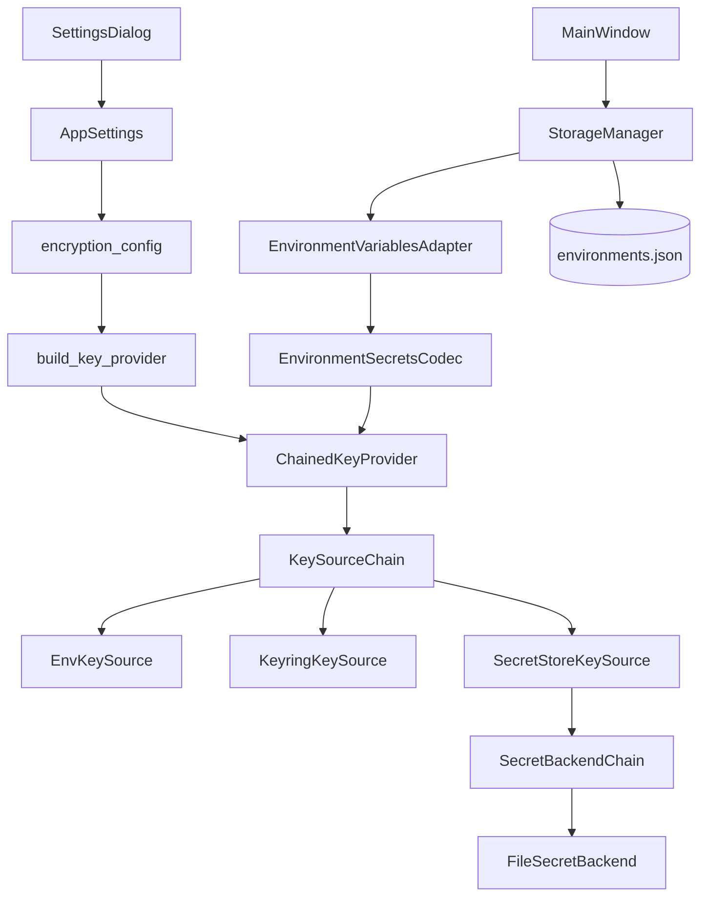
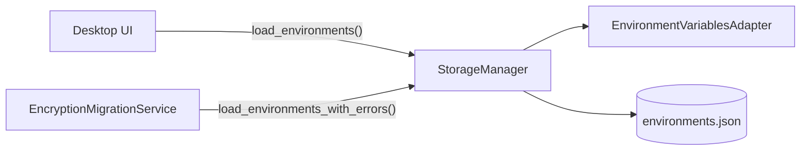

# Environment Encryption at Rest

## Overview

PYPOST-447 introduces optional encryption-at-rest for sensitive environment variable values.
PYPOST-481 adds user-facing controls in **Settings** so developers can enable or disable
encryption and choose a key source strategy without editing process environment variables.
PYPOST-483 extends key resolution to a provider chain with OS keyring and secret-store sources,
configurable fallback order, and a rotation-friendly key registry model.
PYPOST-486 runs encrypted load/save off the UI thread via
[Async Environment Storage](environment_storage_async.md) so large datasets do not freeze the
desktop window.
PYPOST-482 extracts environment variable serialization and encryption policy from
`StorageManager` into `EnvironmentVariablesAdapter` for clearer boundaries and unit testing.
PYPOST-485 optimizes save performance by reusing unchanged encrypted envelopes instead of
re-encrypting every hidden key on each persist.
PYPOST-484 centralizes v1 envelope schema validation in the typed
`EncryptedValueEnvelope.from_payload()` model used by `EnvironmentSecretsCodec.decrypt`.
PYPOST-487 adds operator migration tooling and the
[Encryption Key Migration](encryption_key_migration.md) runbook (verify, bulk re-encrypt,
encrypt-plaintext).
PYPOST-525 adds `StorageManager.load_environments_with_errors()` so migration tooling reports
per-environment decrypt failures through a supported public API without changing desktop load
behavior.

This feature protects **hidden-key values only** in persisted environment storage
(`environments.json`). Variables not marked Hidden remain **plaintext on disk** even when
encryption is enabled. Settings shows this scope under **Environment encryption at rest**.

Runtime request execution is unchanged: components still consume plain
`Environment.variables: Dict[str, str]` after load-time decryption.

## Architecture



| Component | Module | Responsibility |
| --- | --- | --- |
| Settings model | `pypost/models/settings.py` | Encryption toggle, primary source, fallback |
| Policy resolver | `pypost/core/encryption_config.py` | Enabled flag, chain, provider factory |
| Key sources | `pypost/core/key_sources/` | Env, keyring, secret-store resolution |
| Key provider | `pypost/core/key_provider.py` | `ChainedKeyProvider` facade for codec |
| Storage orchestration | `pypost/core/storage.py` | Paths, collections, atomic env file I/O; desktop and migration load contracts |
| Variable encoding | `pypost/core/environment_variables_adapter.py` | Policy, serialize/deserialize, metrics/logs |
| Settings UI | `pypost/ui/dialogs/settings_dialog.py` | Encryption and source controls |
| Controller wiring | `pypost/ui/main_window.py` | Apply settings on init and after save |
| Crypto codec | `pypost/core/environment_secrets_codec.py` | Envelope encrypt/decrypt |
| Observability | `pypost/core/metrics.py` | Encryption counters and error labels |
| Async orchestration | `pypost/core/environment_storage_gateway.py` | Off-UI-thread load/save when encryption enabled (PYPOST-486) |

When encryption is enabled, the UI uses `EnvironmentStorageGateway` and
`EnvironmentStorageWorker` instead of calling `StorageManager` on the main thread. See
[Async Environment Storage](environment_storage_async.md) for queueing, startup ordering, and
troubleshooting.

### Key source chain

Key material is resolved through an ordered **key source chain**. Each source implements the
`KeySource` protocol (`try_resolve_active`, `try_resolve_by_id`) and returns `None` when
unavailable rather than raising.

| Source | Class | Active key | Historical key (`kid`) |
| --- | --- | --- | --- |
| `environment` | `EnvKeySource` | Env var or registry active id | Registry or env by `kid` |
| `keyring` | `KeyringKeySource` | Keyring entry `active` | Keyring entry `{key_id}` |
| `secret_store` | `SecretStoreKeySource` | Spec `active_key_id` | Spec `keys` map by `kid` |

`ChainedKeyProvider` delegates to `KeySourceChain`, which tries sources in order until one
returns key material. Encrypt paths call `get_current_key()`; decrypt paths call
`get_key_by_id(kid)` so values encrypted before rotation remain readable when historical keys
are still registered.

`LocalKeyProvider` remains as a thin backward-compatible subclass wired to an env-only chain.

### File-backed registry caching (`MtimeFileCache`)

`EnvKeySource` and `SecretStoreKeySource` each cache their parsed JSON registry/spec file in a
module-level `pypost.core.key_sources.file_cache.MtimeFileCache` instance (`_registry_cache` in
`env.py`, `_spec_cache` in `secret_store.py`), keyed by `path.stat().st_mtime_ns`.
`MtimeFileCache.get(path, loader)` re-parses only when the path or `st_mtime_ns` changes since the
last call, so repeated key lookups within one process do not re-read and re-validate the
registry/spec file on every call.

**Explicit invalidation (PYPOST-1088):**

| Function | Module | Clears |
| --- | --- | --- |
| `MtimeFileCache.clear()` | `pypost/core/key_sources/file_cache.py` | The calling cache instance's `_path` / `_mtime_ns` / `_value` |
| `clear_registry_cache()` | `pypost/core/key_sources/env.py` | The module-level `_registry_cache` used by `EnvKeySource` |
| `clear_spec_cache()` | `pypost/core/key_sources/secret_store.py` | The module-level `_spec_cache` used by `SecretStoreKeySource` |

Production read paths do not need to call these — `MtimeFileCache` self-invalidates the next time
`get()` observes a different `st_mtime_ns`. They exist for callers (today: tests, and any future
admin/reload tooling) that rewrite the registry/spec file and need the *next* read to be
guaranteed fresh without depending on filesystem timestamp resolution.

**Why this matters — same-tick stale-cache race:** `st_mtime_ns` is still filesystem-resolution
bound. Two writes to the same registry file within the same timestamp tick (common on fast
filesystems during automated tests — e.g. simulating a key rotation with two back-to-back
`Path.write_text()` calls) can leave `st_mtime_ns` unchanged, so `MtimeFileCache.get()` returns the
*stale* pre-rewrite value instead of re-reading. This caused order-dependent flakiness in
encryption-migration tests that rotate the active key mid-test (PYPOST-1088):
`tests/test_encryption_migration.py` and `tests/test_encryption_migrate_cli.py` now call
`clear_registry_cache()` immediately after rewriting the registry file mid-test, forcing the next
resolve to re-read instead of risking a race with the mtime tick.
`tests/test_key_sources_chain_coverage.py` covers a different angle of the same mechanism: its
`test_clear_registry_cache_forces_reload` / `test_clear_spec_cache_forces_reload` write the
registry/spec file only once, then call `clear_registry_cache()` / `clear_spec_cache()` and
re-resolve the *same*, unrewritten file to verify the loader function is invoked a second time —
proving the cache-clear functions force a fresh load rather than reproducing the rotation race
itself.

`tests/conftest.py` also registers an autouse `_reset_key_source_caches` fixture that calls
`clear_registry_cache()` and `clear_spec_cache()` before and after every test, so cache state from
one test's registry/spec file writes never leaks into the next test. That fixture only resets
*between* tests — a test that rewrites the registry/spec file mid-test still needs its own
explicit `clear_registry_cache()` / `clear_spec_cache()` call right after the rewrite (see above).

**Known asymmetry (tracked separately, not fixed by PYPOST-1088 — PYPOST-1112):**
`SecretStoreKeySource._read_spec_file` guards against syntactically-valid but non-object JSON
(`isinstance(data, dict)`), returning `None` instead of raising. `EnvKeySource._read_registry_file`
performs the structurally identical read but has no equivalent guard — a registry file containing
valid non-object JSON (e.g. `[]`, `"x"`, `42`) raises `AttributeError` from the first `.get()` call
instead of returning `None`. This gap predates PYPOST-1088 and is intentionally left as-is here;
mirroring the guard onto `env.py` is filed as a follow-up.

### Data flow

1. User edits environment values in UI.
2. `EnvPresenter` saves via the async gateway (encryption on) or calls
   `StorageManager.save_environments()` directly (encryption off).
3. `StorageManager.save_environments()` delegates payload encoding to
   `EnvironmentVariablesAdapter.serialize_environment()`.
4. The adapter encrypts hidden-key values via `EnvironmentSecretsCodec` when encryption is enabled.
   Unchanged hidden values reuse the prior on-disk envelope (selective re-encrypt); changed or
   newly hidden values are encrypted fresh. Snapshots refresh on load/save; policy changes clear
   the cache via `apply_encryption_settings`.
5. Data is written atomically to `environments.json`.
6. On load, encrypted payloads are decrypted before creating `Environment` instances (load may
   run on a worker thread when encryption is enabled).

Changing encryption settings does **not** immediately re-save all environments. The new policy
applies on the next save or load cycle.

### Selective re-encrypt benchmark (PYPOST-534)

CI guards regression in selective re-encrypt for large environments (120 hidden keys by
default):

```bash
.venv/bin/python -m pytest tests/test_environment_save_selective_reencrypt_benchmark.py -v
```

| Guard | Assertion |
| --- | --- |
| Reuse stats | Second unchanged save: `reused_count == 120`, `encrypted_count == 0` |
| Single edit | One changed key: `reused_count == 119`, `encrypted_count == 1` |
| Metrics | `environment_value_encryptions_total` unchanged after reuse save |
| Timing | Full re-encrypt (cache cleared) ≥ 2× slower than reuse second save |
| Storage E2E | `StorageManager.save_environments` preserves unchanged envelopes |

Local profiling (optional, not run in CI):

```bash
.venv/bin/python scripts/benchmark_env_save.py --keys 120 --iterations 5
```

Example output fields: `first_save_ms`, `reuse_second_save_ms`, `full_reencrypt_ms`,
`speedup_full_over_reuse`. Requires `cryptography` and `PYPOST_ENV_ENCRYPTION_ENABLED=true`; the
script generates a temporary key when `PYPOST_ENV_ENCRYPTION_KEY` is unset.

### Overwrite import × selective re-encrypt (PYPOST-999)

Import **Overwrite** preserves the existing environment `id`, so the next
save still hits the adapter reuse cache for that id. Adapter unit tests and
the selective-re-encrypt benchmark do not call `plan_import`; CI locks the
combination here:

```bash
# Node id: test_overwrite_import_reuses_unchanged_and_reencrypts_changed_hidden
.venv/bin/python -m pytest tests/test_environment_import.py -k \
  test_overwrite_import_reuses_unchanged -v
```

| Guard | Assertion |
| --- | --- |
| Identity | Planned env keeps pre-import `id` after Overwrite |
| Unchanged Hidden | On-disk envelope equal to pre-import (reuse) |
| Changed Hidden | Envelope differs; still encrypted; reload is new plaintext |
| Stats | `reused_count >= 1` and `encrypted_count >= 1` after import save |

Uses a local Fernet key and `tmp_path` `StorageManager` — no live key
services.

### Encrypted export file round-trip (PYPOST-1009)

Export with encryption enabled writes Hidden values as Fernet envelopes (the
same protection as local `environments.json`). PYPOST-988 locked export →
import only with encryption **off**. CI now inspects the written file and
re-imports on the same installation with the same key:

```bash
# Node id: test_write_encrypted_export_file_round_trips_through_import
.venv/bin/python -m pytest tests/test_environment_export.py -k \
  test_write_encrypted_export_file_round_trips -v
```

| Guard | Assertion |
| --- | --- |
| Encryption on | `PYPOST_ENV_ENCRYPTION_ENABLED` plus `AppSettings` enabled |
| Temp key | Generated Fernet key in `PYPOST_ENV_ENCRYPTION_KEY` |
| Envelope on disk | Hidden field is v1 Fernet envelope; secret string absent |
| Non-Hidden | Host remains plaintext in the export file |
| Same-key re-import | `load_import_candidates` restores name, Hidden flag, plaintext |

Uses `_make_encrypted_storage` and `tmp_path` — no live keyring or
secret-store services. Different-key / cross-machine import is out of scope.

### Environment load contracts (PYPOST-525)

Two public load methods coexist on `StorageManager`:

| Method | Consumer | On per-item failure | On file-level failure |
| --- | --- | --- | --- |
| `load_environments()` | Desktop UI (`EnvPresenter`, async gateway) | Returns `[]`; logs `load_environments_failed` | Returns `[]` |
| `load_environments_with_errors()` | `EncryptionMigrationService` | Continues batch; returns `EnvironmentLoadFailure` | Returns `([], ())`; logs `load_environments_with_errors_failed` |

Desktop resilience is unchanged: any decrypt or deserialize error still yields an empty list for
the UI. Migration needs every failure listed while still loading remaining environments.



## API / Usage

### `AppSettings` fields

- `env_encryption_enabled: Optional[bool] = None`
  - `None` — follow `PYPOST_ENV_ENCRYPTION_ENABLED` (default, backward compatible)
  - `True` / `False` — explicit override persisted in `settings.json`
- `env_encryption_key_source: Optional[str] = None`
  - `None` — defaults to `"environment"`
  - `"environment"` — env var and optional env-channel registry file
  - `"keyring"` — OS credential store via `keyring` package
  - `"secret_store"` — operator spec file and backend chain
- `env_encryption_key_source_fallback: Optional[list[str]] = None`
  - Ordered additional sources to try after the primary source
  - `None` or empty — only the primary source is attempted

Settings store policy only. **Do not** put Fernet key material in `settings.json`.

### `resolve_encryption_enabled(settings: AppSettings | None) -> bool`

Returns whether encryption is active. Explicit `settings.env_encryption_enabled` wins; otherwise
falls back to the `PYPOST_ENV_ENCRYPTION_ENABLED` process env var.

### `resolve_key_source(settings: AppSettings | None) -> str`

Returns the primary key source label for logging and telemetry. Unsupported persisted values log
`encryption_key_source_unsupported` and fall back to `"environment"`.

### `resolve_key_source_chain(settings: AppSettings | None) -> list[str]`

Returns the ordered source list used to build the provider: primary source first, then configured
fallback entries (deduplicated, unsupported names skipped).

### `build_key_provider(settings: AppSettings | None) -> KeyProvider`

Builds a `ChainedKeyProvider` from `resolve_key_source_chain(settings)`. Logs
`encryption_key_provider_built` with the effective chain.

### `EncryptedValueEnvelope` / `EncryptedValueEnvelopeV2` (`pypost/core/environment_secrets_codec.py`)

Typed envelopes for encrypted environment values. `encrypt()` returns a v1 instance; persisted
JSON uses `to_json()`.

- `EncryptedValueEnvelope` — v1 schema (`VERSION=1`, `ALGORITHM=fernet`).
- `EncryptedValueEnvelopeV2` — v2 schema (`VERSION=2`); supports `fernet` and `aes-gcm` with
  optional `meta` and algorithm-specific `iv`/`tag` fields (see Payload Format).
- `from_payload(payload: dict[str, Any]) -> EnvelopePayload` — version dispatch entry point.
  Returns `EncryptedValueEnvelope` for `v=1` or `EncryptedValueEnvelopeV2` for `v=2`. Raises
  `EnvironmentEncryptionError` for missing markers, unsupported version/algorithm, or missing
  required fields. Coerces string fields.
- `EnvironmentSecretsCodec.decrypt(payload)` — delegates validation to `from_payload`, decrypts
  v1 and v2 envelopes via algorithm-specific handlers (`fernet` token decrypt; `aes-gcm` with
  base64 `iv`, `ct`, and `tag`). Key material for both algorithms is resolved by `kid` from the
  configured key provider (AES-GCM uses the raw 32-byte key decoded from the Fernet key string).

### `StorageManager.apply_encryption_settings(settings: AppSettings | None) -> None`

Reconfigures the storage layer when settings change. Rebuilds `EnvironmentSecretsCodec` with the
resolved key provider and logs the effective policy (`storage_encryption_config_applied` includes
`source_chain`).

Call sites:

- `MainWindow.__init__` — apply settings on startup.
- `MainWindow.open_settings()` — waits for `EnvPresenter.wait_storage_idle()`, then re-applies
  after the user saves Settings. Calls `EnvPresenter.reload_current_env()` to refresh the active
  environment (variables, MCP, signals) without reaching into private handlers.

### `EnvironmentLoadFailure` (`pypost/core/storage.py`)

Frozen value object for one stored environment record that failed decrypt or deserialize during a
migration-oriented batch load.

| Field | Source | Notes |
| --- | --- | --- |
| `name` | `raw_env.get("name", "unknown")` | Operator-facing identity |
| `environment_id` | `raw_env.get("id")` when present | Stable id for logs; optional |
| `reason` | `str(exc)` from caught exception | Sanitized; no key material |

`format_operator_message() -> str` returns `"name: reason"` for CLI and `MigrationReport.errors`.

### `StorageManager.load_environments_with_errors() -> tuple[list[Environment], tuple[EnvironmentLoadFailure, ...]]`

Loads every record in `environments.json`, collecting per-item failures without stopping the
batch.

**Prerequisites:** call `apply_encryption_settings(settings)` first when encryption policy
matters (same as `load_environments()`).

**Returns:**

- `environments` — successfully deserialized records in on-disk order (failed records omitted).
- `failures` — one `EnvironmentLoadFailure` per record that could not be deserialized.

**Per-item exceptions:** `EnvironmentEncryptionError` and Pydantic `ValidationError` become
failures and the loop continues. Other unexpected exceptions log
`load_environments_with_errors_item_failed` and are also recorded as failures.

**File-level behavior:** missing file returns `([], ())` silently. Invalid JSON or a non-list root
logs `load_environments_with_errors_failed` and returns `([], ())`. File-level errors are not
included in the failure tuple.

**Logging:** batch completion logs `load_environments_with_errors_completed` with `count`,
`error_count`, and `file`. Event names are distinct from desktop `load_environments_failed` for
log filtering.

**Primary consumer:** `EncryptionMigrationService._deserialize_all()` maps failures via
`format_operator_message()`. See [Encryption Key Migration](encryption_key_migration.md).

### Settings UI

`SettingsDialog` exposes:

- **Environment encryption at rest** — `Use environment variable default` / `Enabled` / `Disabled`
- **Encryption key source** — primary strategy:
  - `Environment variable (PYPOST_ENV_ENCRYPTION_KEY)`
  - `OS keyring (pypost/env-encryption)`
  - `Secret store spec file (PYPOST_ENV_ENCRYPTION_SECRETS_FILE)`
- **Encryption key source fallback** — comma-separated list of additional sources (e.g.
  `environment, secret_store`). Parsed by `parse_key_source_fallback()`; empty field means no
  fallback.

A helper label below the source controls shows per-source setup guidance (`KEY_SOURCE_HELP`). Key
material is never persisted in settings.

## Configuration

Encryption can be configured from **Settings** or from process environment variables.
Application settings take precedence when explicitly set; otherwise behavior follows env vars.

### Application settings (`settings.json`)

| Field | Purpose |
| --- | --- |
| `env_encryption_enabled` | `null` (follow env), `true`, or `false` |
| `env_encryption_key_source` | Primary source: `environment`, `keyring`, `secret_store` |
| `env_encryption_key_source_fallback` | Optional ordered list of additional sources |

When fallback is unset, only the primary source is attempted (preserves strict env-only setups).

### Fallback order configuration

The effective chain is **primary + fallback list** (deduplicated). Example: primary `keyring`,
fallback `environment, secret_store` yields chain `["keyring", "environment", "secret_store"]`.

Resolution behavior:

- **Active key** — each source is tried in order until `try_resolve_active()` returns a key.
- **Historical key** — each source is tried in order until `try_resolve_by_id(kid)` returns a key.
- A source that is missing, misconfigured, or unavailable returns `None`; the chain continues.
- If no source succeeds, `EnvironmentEncryptionError` is raised with a safe message (no key bytes).

In Settings, enter fallback sources as a comma-separated list matching supported source names.

### Process environment variables

| Variable | Used by |
| --- | --- |
| `PYPOST_ENV_ENCRYPTION_ENABLED` | Encryption toggle fallback when settings field is `None` |
| `PYPOST_ENV_ENCRYPTION_KEY` | `EnvKeySource` active key (existing path) |
| `PYPOST_ENV_ENCRYPTION_KEYS_FILE` | Optional env-channel JSON key registry (rotation) |
| `PYPOST_ENV_ENCRYPTION_SECRETS_FILE` | Path to secret-store spec for `SecretStoreKeySource` |

**Operator distinction — `KEYS_FILE` vs `SECRETS_FILE`**

- `PYPOST_ENV_ENCRYPTION_KEYS_FILE` supplements the **environment** source when it is in the
  configured chain. It points to a JSON registry of Fernet keys (active + historical). It does
  not drive `SecretStoreKeySource`.
- `PYPOST_ENV_ENCRYPTION_SECRETS_FILE` is used only by **`SecretStoreKeySource`**. It points to
  an operator spec with `active_key_id`, `keys`, and ordered `backends` for `SecretBackendChain`.

### Key registry files

Rotation relies on registries that hold multiple keys outside `settings.json`.

**Env-channel registry** (`PYPOST_ENV_ENCRYPTION_KEYS_FILE`, optional):

```json
{
  "active_key_id": "abc123def4567890",
  "keys": {
    "abc123def4567890": "<fernet-key-active>",
    "fedcba0987654321": "<fernet-key-historical>"
  }
}
```

When unset, env-only mode uses `PYPOST_ENV_ENCRYPTION_KEY` as the active key; historical lookup
succeeds only when stored `kid` matches that key.

**Secret-store spec** (`PYPOST_ENV_ENCRYPTION_SECRETS_FILE`):

```json
{
  "active_key_id": "abc123def4567890",
  "keys": {
    "abc123def4567890": "<fernet-key-active>",
    "fedcba0987654321": "<fernet-key-historical>"
  },
  "backends": [
    {
      "type": "file",
      "path": "/secure/pypost-encryption-keys.json"
    }
  ]
}
```

Supported `backends` entries (tried in order; inline `keys` used when all fail):

| `type` | Class | Config |
| --- | --- | --- |
| `file` | `FileSecretBackend` | `path` — local JSON registry file |
| `env-indirection` | `EnvIndirectionSecretBackend` | `active_key_id`, `keys` map (`kid` → env var name) |
| `vault` | `VaultSecretBackend` | `url` (KV read endpoint), optional `token_env` (default `VAULT_TOKEN`), `timeout` |

The spec's inline `keys` map is used when backends fail; backend payloads return registry-shaped
JSON (`active_key_id`, `keys`). Vault KV v2 responses unwrap `data.data`.

**Keyring conventions**

- Service: `pypost/env-encryption`
- Username `active`: current Fernet key string
- Username `{key_id}`: historical Fernet key string
- Missing `keyring` package or OS backend → source unavailable (chain continues)

**Keyring packaging (desktop installs)**

`keyring` is listed in `requirements.txt` for teams that use the OS credential store, but
PyPost runs without it when encryption keys come from `environment` or `secret_store` only.
Install explicitly when Settings primary/fallback includes `keyring`:

```bash
pip install keyring
```

Ensure the target OS credential backend is available (macOS Keychain, Windows Credential
Locker, Secret Service on Linux). If `keyring` is missing or the backend is unavailable,
the provider chain skips keyring and continues with configured fallbacks.

### Key rotation workflow

Rotation does not change the envelope format. Each encrypted value stores a `kid` (sha256 prefix
of key material). New encryption uses the active key; decryption resolves by `kid`.

Operator steps:

1. **Introduce new active key** — generate Fernet material; register as active in the chosen
   source (env var, keyring `active`, or registry `active_key_id`). New `kid` is derived
   automatically.
2. **Retain historical keys** — keep prior key material registered under its `kid` in the same
   source or a source reachable in the configured chain.
3. **Verify** — load environments; confirm pre-rotation values decrypt and new saves use the new
   active key (`kid` on new envelopes matches the new active key).
4. **Complete** — mixed `kid` values in `environments.json` are expected until optional bulk
   re-encryption. Removing historical key material too soon breaks decrypt for values still
   referencing that `kid`. Use the [Encryption Key Migration](encryption_key_migration.md) runbook
   and `scripts/encryption_migrate.py re-encrypt` for bulk rewrite under the active key.

Backward compatibility: deployments with only `PYPOST_ENV_ENCRYPTION_KEY` behave as before — a
single key serves as active and satisfies `get_key_by_id` when `kid` matches.

### Secure setup (environment source)

1. Generate a Fernet key:

   ```bash
   python -c "from cryptography.fernet import Fernet; print(Fernet.generate_key().decode())"
   ```

2. Export the key in your shell profile, launch script, or service environment:

   ```bash
   export PYPOST_ENV_ENCRYPTION_KEY="<generated-key>"
   ```

3. Enable encryption via Settings (**Enabled**) or env var:

   ```bash
   export PYPOST_ENV_ENCRYPTION_ENABLED=true
   ```

4. Restart PyPost if you changed environment variables outside the app.

If encryption is enabled and no configured source yields an active key, save/load error paths are
triggered and reported via logs and metrics.

## Payload Format

Encrypted values are stored as envelope objects in the `variables` map. All versions share:

- `enc`: encryption marker (`true`)
- `v`: payload version (`1` or `2`)
- `alg`: algorithm identifier
- `kid`: key identifier (sha256 prefix of key material)
- `ct`: ciphertext (algorithm-specific encoding)

### Version 1 (on-disk default)

`encrypt()` emits v1 only. Fields: `enc`, `v=1`, `alg=fernet`, `kid`, `ct`.

### Version 2 (decrypt supported; encrypt still v1-only)

| Field | Required | Notes |
| --- | --- | --- |
| `enc`, `v=2`, `alg`, `kid`, `ct` | yes | Same semantics as v1 base fields |
| `iv`, `tag` | aes-gcm only | Base64 nonce and authentication tag |
| `meta` | no | String-to-string metadata map |

Algorithm rules: `fernet` must not include `iv`/`tag`; `aes-gcm` requires both. `encrypt()` still
emits v1 only for runtime saves. `encrypt_v2()` emits v2 fernet (or aes-gcm) for migration tooling.
Use `encryption_migrate upgrade-v2` to bulk-rewrite v1 on-disk envelopes to v2 fernet.

Validation and version dispatch are centralized in `EncryptedValueEnvelope.from_payload()`.
Callers should not re-implement field checks before `EnvironmentSecretsCodec.decrypt()`.

Plain string values remain supported for backward compatibility.

## Metrics

Prometheus counters:

- `environment_value_encryptions_total`
- `environment_value_decryptions_total`
- `environment_encryption_errors_total{stage,reason}`

`stage` values:

- `save`
- `load`

`reason` values currently emitted:

- `encrypt_failed`
- `decrypt_failed`
- `unsupported_format`

## Troubleshooting

### Encryption enabled but environments fail to save

**Symptoms:** save errors,
`environment_encryption_errors_total{stage="save",reason="encrypt_failed"}` increments, logs
mention `encryption_key_unavailable` with `reason=no_source_provided_active_key`.

**Cause:** No configured source in the chain yields an active key while encryption is enabled.

**Fix:** provision key material in the primary source (and fallbacks if configured). For env-only
setups, export a valid Fernet key in `PYPOST_ENV_ENCRYPTION_KEY`. Disable encryption in Settings
until key material is configured.

### Migration verify lists per-environment errors but desktop shows no environments

**Symptoms:** `encryption_migrate verify` prints `"Dev: … could not be decrypted"` for one
environment while the desktop app shows an empty environment list.

**Cause:** Expected dual-contract behavior (PYPOST-525). `load_environments_with_errors()`
continues the batch and reports each failure; `load_environments()` returns `[]` when any record
fails.

**Fix:** repair or remove the failing stored environment (restore key material, fix corrupt
envelope, or restore from backup). Re-run `verify` until exit code 0.

### Environments missing or empty after load (decrypt failure)

**Symptoms:** load returns no environments, `decrypt_failed` metrics/logs,
`encryption_key_rotation_lookup_failed` with `reason=no_source_provided_key`.

**Causes:**

- Historical key material removed after rotation while stored envelopes still reference old `kid`.
- Key changed without retaining the prior key in the registry.
- Corrupt or manually edited envelope in `environments.json`.
- Encryption disabled in settings but file still contains encrypted envelopes (decrypt still runs
  for envelope-shaped values).

**Fix:** restore historical key material under the correct `kid` in a source reachable by the
configured chain, repair the payload, or restore `environments.json` from backup. Compare stored
`kid` values with registered keys.

### Key changed since encryption (pre-rotation env-only)

**Symptoms:** decrypt failures after replacing `PYPOST_ENV_ENCRYPTION_KEY` without a registry.

**Cause:** Old envelopes reference the previous key's `kid`; a single env var only satisfies
lookup when `kid` matches the current key.

**Fix:** use a key registry (`PYPOST_ENV_ENCRYPTION_KEYS_FILE` or keyring/secret-store registry)
and retain the old key under its `kid`, or restore the original key.

### Primary source unavailable; fallback expected

**Symptoms:** WARNING logs `key_source_chain_active_fallback` or
`key_source_chain_by_id_fallback`; INFO `key_source_chain_active_resolved_via_fallback` when a
later source succeeds.

**Cause:** Primary source missing package, file, or credential (e.g. `keyring` not installed,
secrets spec path wrong).

**Fix:** configure fallback sources in Settings, or fix the primary source. If no source succeeds,
resolution fails with `encryption_key_unavailable`.

### Keyring selected but not working

**Symptoms:** chain skips keyring; fallback warnings; active key not found when keyring is sole
source.

**Causes:**

- `keyring` package not installed (`pip install keyring`).
- OS credential backend unavailable in the runtime environment.
- Missing entries under service `pypost/env-encryption` (`active` and historical `{key_id}`).

**Fix:** install `keyring`, store keys in the OS credential store, or add `environment` as
fallback.

### Secret store spec or backend file problems

**Symptoms:** DEBUG logs `secret_spec_missing`, `secret_backend_file_missing`, or WARNING
`secret_backend_chain_fallback`.

**Cause:** `PYPOST_ENV_ENCRYPTION_SECRETS_FILE` unset, invalid JSON, or backend path in spec not
readable.

**Fix:** verify spec path, JSON shape (`active_key_id`, `keys`, `backends`), and file backend
paths. Only `type: file` is supported in v1.

### Settings change does not re-encrypt existing values immediately

**Expected behavior.** Policy applies on the next save/load. Edit and save an environment (or
run `scripts/encryption_migrate.py encrypt-plaintext`) to encrypt plain-text hidden values after
enabling encryption. See [Encryption Key Migration](encryption_key_migration.md).

### Env var or registry file changes ignored while app is running

**Cause:** `StorageManager.apply_encryption_settings()` rebuilds the provider when Settings are
saved, but external env or file changes may not be picked up until restart or re-apply.

**Fix:** restart PyPost after changing `PYPOST_ENV_ENCRYPTION_*` variables or registry files
outside the Settings dialog.

### Unsupported key source in persisted settings

**Symptoms:** warning log `encryption_key_source_unsupported`, fallback to environment variable
source.

**Fix:** open Settings and select a supported primary source (`environment`, `keyring`, or
`secret_store`).

## Tests

Primary coverage files:

- `tests/test_encryption_config.py`
- `tests/test_settings_encryption.py`
- `tests/test_environment_secrets_codec.py`
- `tests/test_environment_variables_adapter.py`
- `tests/test_key_provider.py`
- `tests/test_key_sources_secret_store.py`
- `tests/test_storage_environments.py`
- `tests/test_env_persistence_e2e.py`
- `tests/test_environment_storage_worker.py`
- `tests/test_environment_storage_gateway.py`
- `tests/test_env_storage_responsiveness.py`
- `tests/test_encryption_migration.py`
- `tests/test_encryption_migrate_cli.py`
- `tests/test_environment_export.py`
- `tests/test_key_sources_chain_coverage.py`

`tests/test_key_sources_chain_coverage.py` covers `MtimeFileCache.clear()`
(`test_mtime_file_cache_clear`) and the `clear_registry_cache()` / `clear_spec_cache()` entry
points forcing a fresh `EnvKeySource` / `SecretStoreKeySource` load
(`test_clear_registry_cache_forces_reload`, `test_clear_spec_cache_forces_reload`). See § File-backed
registry caching above for why these exist and how tests use them to avoid the same-tick
stale-cache race.

Async orchestration details: [environment_storage_async.md](environment_storage_async.md).
Migration procedures: [encryption_key_migration.md](encryption_key_migration.md).

Project-wide regression:

```bash
make test
```
