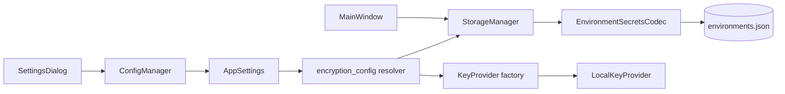

# Environment Encryption at Rest

## Overview

PYPOST-447 introduces optional encryption-at-rest for sensitive environment variable values.
PYPOST-481 adds user-facing controls in **Settings** so developers can enable or disable
encryption and choose a key source strategy without editing process environment variables.

This feature protects hidden-key values in persisted environment storage (`environments.json`).
Runtime request execution is unchanged: components still consume plain
`Environment.variables: Dict[str, str]` after load-time decryption.

## Architecture



| Component | Module | Responsibility |
| --- | --- | --- |
| Settings model | `pypost/models/settings.py` | Persist encryption toggle and key source strategy |
| Policy resolver | `pypost/core/encryption_config.py` | Resolve enabled flag and key source from settings + env fallback |
| Storage orchestration | `pypost/core/storage.py` | Apply resolved policy on save/load |
| Settings UI | `pypost/ui/dialogs/settings_dialog.py` | User-facing encryption controls |
| Controller wiring | `pypost/ui/main_window.py` | Apply settings to storage on init and after save |
| Crypto codec | `pypost/core/environment_secrets_codec.py` | Envelope validation and encrypt/decrypt |
| Key resolution | `pypost/core/key_provider.py` | Resolve Fernet key from configured source |
| Observability | `pypost/core/metrics.py` | Encryption counters and error labels |

### Data flow

1. User edits environment values in UI.
2. `StorageManager.save_environments()` serializes environment payload.
3. Hidden-key values are encrypted with `EnvironmentSecretsCodec` when encryption is enabled.
4. Data is written atomically to `environments.json`.
5. On load, encrypted payloads are decrypted before creating `Environment` instances.

Changing encryption settings does **not** immediately re-save all environments. The new policy
applies on the next save or load cycle.

## API / Usage

### `AppSettings` fields

- `env_encryption_enabled: Optional[bool] = None`
  - `None` — follow `PYPOST_ENV_ENCRYPTION_ENABLED` (default, backward compatible)
  - `True` / `False` — explicit override persisted in `settings.json`
- `env_encryption_key_source: Optional[str] = None`
  - `None` — defaults to `"environment"`
  - `"environment"` — read Fernet key from `PYPOST_ENV_ENCRYPTION_KEY`

### `resolve_encryption_enabled(settings: AppSettings | None) -> bool`

Returns whether encryption is active. Explicit `settings.env_encryption_enabled` wins; otherwise
falls back to the `PYPOST_ENV_ENCRYPTION_ENABLED` process env var.

### `resolve_key_source(settings: AppSettings | None) -> str`

Returns the key source strategy. Unsupported persisted values log a warning and fall back to
`"environment"`.

### `build_key_provider(source: str) -> KeyProvider`

Factory for key providers. Currently supports only `"environment"` (`LocalKeyProvider`).

### `StorageManager.apply_encryption_settings(settings: AppSettings | None) -> None`

Reconfigures the storage layer when settings change. Rebuilds `EnvironmentSecretsCodec` with the
resolved key provider and logs the effective policy (`storage_encryption_config_applied`).

Call sites:

- `MainWindow.__init__` — apply settings on startup.
- `MainWindow.open_settings()` — re-apply after the user saves Settings.

### Settings UI

`SettingsDialog` exposes:

- **Environment encryption at rest** — `Use environment variable default` / `Enabled` / `Disabled`
- **Encryption key source** — `Environment variable (PYPOST_ENV_ENCRYPTION_KEY)` (only option in
  this release)

A helper label reminds users to keep Fernet key material in the process environment, not in
`settings.json`.

## Configuration

Encryption can be configured from **Settings** or from process environment variables.
Application settings take precedence when explicitly set; otherwise behavior follows env vars.

### Application settings (`settings.json`)

- **Environment encryption at rest**
  - `Use environment variable default` — follows `PYPOST_ENV_ENCRYPTION_ENABLED` (backward compatible)
  - `Enabled` / `Disabled` — explicit override persisted in settings
- **Encryption key source**
  - `Environment variable (PYPOST_ENV_ENCRYPTION_KEY)` — only supported source in this release

Settings store policy only. **Do not** put Fernet key material in `settings.json`.

### Process environment variables

- `PYPOST_ENV_ENCRYPTION_ENABLED`
  - truthy values: `1`, `true`, `yes`, `on`
  - used when app setting is `Use environment variable default`
- `PYPOST_ENV_ENCRYPTION_KEY`
  - Fernet key used for encrypt/decrypt when key source is environment variable

### Secure setup

1. Generate a Fernet key:

   ```bash
   python -c "from cryptography.fernet import Fernet; print(Fernet.generate_key().decode())"
   ```

2. Export the key in your shell profile, launch script, or service environment:

   ```bash
   export PYPOST_ENV_ENCRYPTION_KEY="<generated-key>"
   ```

3. Enable encryption via Settings (**Enabled**) or env var:

   ```bash
   export PYPOST_ENV_ENCRYPTION_ENABLED=true
   ```

4. Restart PyPost if you changed environment variables outside the app.

If encryption is enabled and the key is missing, save/load error paths are triggered and
reported via logs and metrics.

## Payload Format

Encrypted values are stored as envelope objects in `variables` map:

- `enc`: encryption marker (`true`)
- `v`: payload version (currently `1`)
- `alg`: algorithm (`fernet`)
- `kid`: key identifier (sha256 prefix of key material)
- `ct`: ciphertext token

Plain string values remain supported for backward compatibility.

## Metrics

Prometheus counters:

- `environment_value_encryptions_total`
- `environment_value_decryptions_total`
- `environment_encryption_errors_total{stage,reason}`

`stage` values:

- `save`
- `load`

`reason` values currently emitted:

- `encrypt_failed`
- `decrypt_failed`
- `unsupported_format`

## Troubleshooting

### Encryption enabled but environments fail to save

**Symptoms:** save errors, `environment_encryption_errors_total{stage="save",reason="encrypt_failed"}`
increments, logs mention missing or invalid key.

**Cause:** `PYPOST_ENV_ENCRYPTION_KEY` is unset or not a valid Fernet key while encryption is
enabled (via Settings or env var).

**Fix:** export a valid Fernet key before launching PyPost, or disable encryption in Settings
until the key is configured.

### Environments missing or empty after load

**Symptoms:** load returns no environments, `decrypt_failed` or `unsupported_format` metrics/logs.

**Causes:**

- Key changed since data was encrypted (key-id mismatch).
- Corrupt or manually edited envelope in `environments.json`.
- Encryption disabled in settings but file still contains encrypted envelopes (decrypt still runs
  for envelope-shaped values).

**Fix:** restore the original `PYPOST_ENV_ENCRYPTION_KEY`, repair the payload, or restore
`environments.json` from backup. Check `kid` in stored envelopes matches the current key.

### Settings change does not re-encrypt existing values immediately

**Expected behavior.** Policy applies on the next save/load. Edit and save an environment (or
trigger a bulk save) to encrypt plain-text hidden values after enabling encryption.

### Env var changes ignored while app is running

**Cause:** `LocalKeyProvider` reads `PYPOST_ENV_ENCRYPTION_KEY` at use time, but the enabled flag
may be cached via settings. Mixed configuration is easiest to reason about after restart.

**Fix:** restart PyPost after changing `PYPOST_ENV_ENCRYPTION_ENABLED` or
`PYPOST_ENV_ENCRYPTION_KEY` outside the Settings dialog.

### Unsupported key source in persisted settings

**Symptoms:** warning log `encryption_key_source_unsupported`, fallback to environment variable
source.

**Fix:** open Settings and confirm key source is `Environment variable (PYPOST_ENV_ENCRYPTION_KEY)`.
Additional providers are planned in follow-up tasks (PYPOST-483).

## Tests

Primary coverage files:

- `tests/test_encryption_config.py`
- `tests/test_settings_encryption.py`
- `tests/test_environment_secrets_codec.py`
- `tests/test_key_provider.py`
- `tests/test_storage_environments.py`
- `tests/test_env_persistence_e2e.py`

Project-wide regression:

```bash
make test
```
