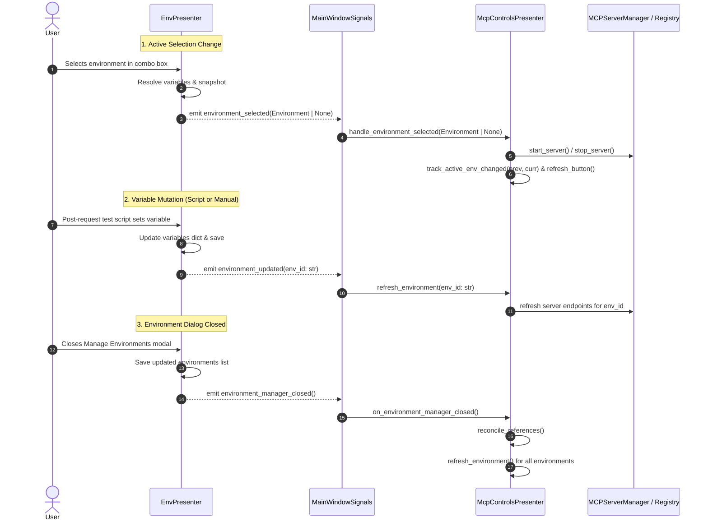

# Environment-to-MCP State Propagation and Domain Signals

## Overview

In PyPost, the **Environment** subsystem manages workspace environment definitions, variables,
and active selection, while the **Model Context Protocol (MCP)** subsystem manages local tool
servers, tool counts, and activity logs.

Historically, [`EnvPresenter`](file:///home/src/pypost/ui/presenters/env_presenter.py) held a direct
reference to [`McpControlsPresenter`](file:///home/src/pypost/ui/presenters/mcp_controls_presenter.py)
and invoked its operational methods directly (`handle_environment_selected`, `refresh_environment`,
`reconcile_references`, `track_active_env_changed`, `refresh_tools_button`).

Under **PYPOST-1108**, this direct operational coupling is eliminated. `EnvPresenter` communicates
all environment state transitions strictly by emitting domain-specific Qt signals.
The application's centralized mediator,
[`main_window_signals.py`](file:///home/src/pypost/ui/main_window_signals.py), connects these
domain signals to the corresponding slots on `McpControlsPresenter`.

---

## Architecture

### Decoupled Interaction Model

Rather than allowing presenters to directly inspect or mutate each other's internal state,
communication follows an asynchronous event-driven design pattern:



### Component Boundaries

| Component | Responsibility Boundary | Out-of-Scope Concerns |
|---|---|---|
| [`EnvPresenter`](file:///home/src/pypost/ui/presenters/env_presenter.py) | Environment dropdown, storage gateway save/load, variable snapshotting, variable name validation. | Does **not** know whether MCP servers are running, how tools are counted, or when metrics are logged. |
| [`McpControlsPresenter`](file:///home/src/pypost/ui/presenters/mcp_controls_presenter.py) | MCP toolbar buttons, status labels, server lifecycle (start/stop), active environment change metrics, reference reconciliation. | Does **not** manipulate environment dropdowns or storage files directly. |
| [`MainWindowSignals`](file:///home/src/pypost/ui/main_window_signals.py) | Wires signals emitted by `EnvPresenter` to consumers across the window (`TabsPresenter`, `McpControlsPresenter`). | Contains no business logic; acts purely as a routing hub. |

---

## Domain Qt Signals on `EnvPresenter`

`EnvPresenter` declares three dedicated domain Qt signals:

```python
class EnvPresenter(QObject):
    """Owns the environment selector: loading envs, propagating vars, and selection."""

    environment_selected = Signal(object)  # payload: Environment | None
    environment_updated = Signal(str)      # payload: environment_id: str
    environment_manager_closed = Signal()  # payload: None
```

### 1. `environment_selected`
- **Signature**: `Signal(object)`
- **Payload**: `Environment` instance if an environment was selected, or `None` if "No Environment"
  was selected.
- **Trigger**: Emitted from `EnvPresenter._on_env_changed(index)` whenever the user changes the
  environment dropdown selection or when the selection is programmatically synchronized.
- **Consumers**:
  - `McpControlsPresenter.handle_environment_selected`: Evaluates whether the new environment has
    MCP enabled, starts or stops the legacy MCP server, updates the tools button, and records
    transition metrics.

### 2. `environment_updated`
- **Signature**: `Signal(str)`
- **Payload**: `str` representing the unique identifier (`id`) of the updated environment.
- **Trigger**:
  - Emitted from `EnvPresenter.on_env_update(vars)` after post-request test scripts update
    environment variables and save changes to storage.
  - Emitted from `EnvPresenter.handle_variable_set_request(key, value)` after manual user variable
    additions via the context menu or response viewer.
- **Consumers**:
  - `McpControlsPresenter.refresh_environment(environment_id)`: Reconciles server configurations
    and refreshes running tool endpoints associated with the updated environment ID.

### 3. `environment_manager_closed`
- **Signature**: `Signal()`
- **Payload**: None.
- **Trigger**: Emitted from `EnvPresenter._open_env_manager()` immediately after the modal
  `EnvironmentDialog.exec()` finishes and modified environment definitions are saved to storage.
- **Consumers**:
  - `McpControlsPresenter.on_environment_manager_closed`: Coordinates full reference reconciliation
    and refreshes all known environments across the MCP server registry.

---

## Central Signal Wiring (`main_window_signals.py`)

All presenter-to-presenter connections are registered centrally in `wire_presenter_signals()`
located in [`pypost/ui/main_window_signals.py`](file:///home/src/pypost/ui/main_window_signals.py):

```python
def wire_presenter_signals(window: MainWindow) -> None:
    """Connect collections, tabs, env, and history panel cross-presenter signals."""
    ...
    # Environment -> MCP Controls (PYPOST-1108 decoupled domain signals)
    window.env.environment_selected.connect(
        window.mcp_controls.handle_environment_selected
    )
    window.env.environment_updated.connect(
        window.mcp_controls.refresh_environment
    )
    window.env.environment_manager_closed.connect(
        window.mcp_controls.on_environment_manager_closed
    )
    ...
```

By concentrating wiring in this mediator, presenters can be initialized and tested in total
isolation without instantiating or mocking their cross-domain peers.

---

## Slot Implementations in `McpControlsPresenter`

To support signal decoupling, `McpControlsPresenter` encapsulates state that was previously queried
or manipulated externally:

### 1. Internalized Active Environment Tracking
`McpControlsPresenter` maintains `self._active_environment: Environment | None`. This enables it
to independently detect previous vs. current environment transitions:

```python
def handle_environment_selected(self, selected: object) -> None:
    """Apply the single-server start/stop rule and track active env transition."""
    selected_env = selected if isinstance(selected, Environment) else None
    mcp_was_running = self.legacy_server_running()
    previous = self._active_environment

    if self._mcp_registry is not None:
        self._active_environment = selected_env
        self._refresh_mcp_tools_button()
        if mcp_was_running:
            self.track_active_env_changed(previous, selected_env)
        return

    if selected_env is not None and selected_env.enable_mcp:
        self._mcp_manager.start_server(
            port=self._settings.mcp_port,
            tools=self._get_mcp_tools(),
            host=self._settings.mcp_host,
        )
        self._show_mcp_starting()
    else:
        self._mcp_manager.stop_server()

    self._active_environment = selected_env
    self._refresh_mcp_tools_button()
    if mcp_was_running:
        self.track_active_env_changed(previous, selected_env)
```

### 2. Batch Dialog Synchronization Slot
When the environment management modal closes, `McpControlsPresenter.on_environment_manager_closed`
reconciles references and updates running environments:

```python
def on_environment_manager_closed(self) -> None:
    """Reconcile references and refresh configurations after dialog closes."""
    logger.debug("mcp_on_environment_manager_closed")
    self.reconcile_references()
    for environment in self._get_environments():
        self.refresh_environment(environment.id)
    self._refresh_mcp_tools_button()
```

---

## Developer Guidance: Adding Future Cross-Presenter Signals

When extending PyPost UI presenters with new cross-domain interactions, adhere to the following
rules:

1. **Never Call Direct Methods on Sibling Presenters**:
   - Presenter $A$ should never call `self._presenter_b.do_something()`.
   - Do not query state flags across presenters (e.g. `self._other.is_running()`). Encapsulate that
     state inside the owning presenter.

2. **Define Descriptive Domain Signals**:
   - Declare signals on the emitting presenter class using `Signal(...)`.
   - Name signals in past tense or state-change verbs (`environment_selected`,
     `collections_changed`, `request_saved`).
   - Use atomic payloads (`str`, `dict`, `object`, or domain model instances).

3. **Wire in `main_window_signals.py` Only**:
   - Always connect signals in `pypost/ui/main_window_signals.py::wire_presenter_signals`.
   - Keep connection statements explicit:
     `window.<source_presenter>.<signal>.connect(window.<target_presenter>.<slot>)`.

4. **Verify Logging & Observability**:
   - Log signal emissions at `DEBUG` or `INFO` level using structured key-value pairs
     (e.g., `logger.debug("environment_updated_emitted env_id=%s source=script", env_id)`).
   - Never log secret variable values, tokens, or authorization headers.

---

## Testing Patterns & Timeout Conventions

Automated testing of signal-driven presenter interactions must adhere to repository test standards:

### 1. Test Isolation & Spy Connections
Unit tests verify signal emission by connecting spy mocks directly to presenter signals:

```python
def test_env_presenter_emits_environment_updated_signal(qapp) -> None:
    env1 = Environment(id="e1", name="Env1", variables={"K": "V"})
    p = _make_presenter([env1])
    try:
        p.load_environments()
        p._env_selector.setCurrentIndex(1)

        spy = MagicMock()
        p.environment_updated.connect(spy)

        p.on_env_update({"API_KEY": "new_secret"})
        spy.assert_called_with("e1")
    finally:
        p.widget.deleteLater()
```

### 2. Verifying Disconnection / No Direct Calls
Assert that mocked peer presenters receive zero direct method calls from the emitting presenter:

```python
def test_env_presenter_does_not_directly_invoke_mcp_controls(qapp) -> None:
    p = _make_presenter([env1])
    try:
        mock_mcp_controls = MagicMock()
        p._mcp_controls = mock_mcp_controls

        p._env_selector.setCurrentIndex(1)
        mock_mcp_controls.handle_environment_selected.assert_not_called()
    finally:
        p.widget.deleteLater()
```

### 3. Central Wiring Verification
Verify that `wire_presenter_signals` links signals to expected slots using a mock window:

```python
def test_wire_presenter_signals_connects_env_domain_signals_to_mcp_controls() -> None:
    window = MagicMock()
    wire_presenter_signals(window)
    window.env.environment_selected.connect.assert_any_call(
        window.mcp_controls.handle_environment_selected
    )
```

### 4. Timeout Conventions
- **Module Timeout**: Always include `pytestmark = pytest.mark.timeout(60)` at top of test files
  involving Qt event loops or presenter orchestration.
- **Individual Test Timeout**: Use `@pytest.mark.timeout(10)` or `@pytest.mark.timeout(15)` on
  modal or dialog test cases to prevent test hangs in headless environments.
- **Resource Cleanup**: Always clean up created widgets using `widget.deleteLater()` in `finally`
  blocks or via fixtures.

---

## Troubleshooting

- **MCP Tools Not Updating on Environment Switch**:
  - Verify that `main_window_signals.wire_presenter_signals(window)` was executed during window
    initialization.
  - Check that `EnvPresenter._on_env_changed` emits `self.environment_selected.emit(selected_env)`.
- **Environment Updates from Scripts Lost by MCP Servers**:
  - Verify that `EnvPresenter.on_env_update` emits `self.environment_updated.emit(selected.id)`.
  - Check logs for `environment_updated_emitted env_id=<id>`.
- **Stale Tool References After Environment Dialog Close**:
  - Verify `EnvPresenter._open_env_manager` emits `self.environment_manager_closed.emit()`.
  - Ensure `McpControlsPresenter.on_environment_manager_closed` executes and iterates over
    all current environments.
