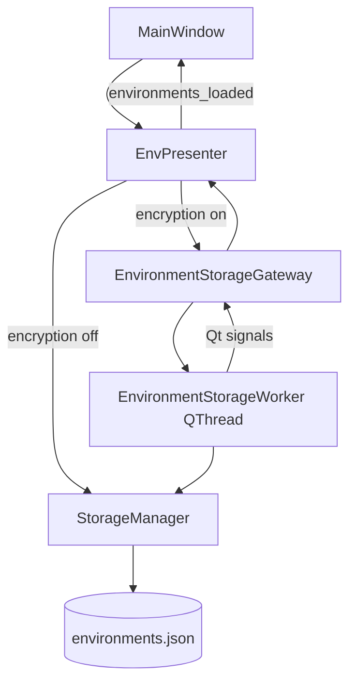

# Async Environment Storage (Encrypted Load/Save)

## Overview

PYPOST-486 moves encrypted environment load and save off the Qt main thread so the desktop UI stays
responsive when many environments or hidden keys require Fernet encrypt/decrypt work. When
encryption is disabled, behavior is unchanged: `EnvPresenter` calls `StorageManager` synchronously.

Crypto semantics, atomic save guarantees, metrics, and user-visible error handling are preserved.
See [Environment Encryption at Rest](environment_encryption_at_rest.md) for policy, key sources, and
payload format.

## Architecture



| Component | Module | Responsibility |
| --- | --- | --- |
| Worker | `pypost/core/environment_storage_worker.py` | Runs one load or save on a background `QThread` |
| Gateway | `pypost/core/environment_storage_gateway.py` | Single-flight queue, save coalescing, signal bridge |
| Presenter | `pypost/ui/presenters/env_presenter.py` | Routes sync vs async; applies load results; save errors |
| Startup | `pypost/ui/main_window.py` | Defers tab/tree restore until `environments_loaded` when encrypted |
| Storage | `pypost/core/storage.py` | Unchanged sync encrypt/decrypt and atomic I/O (called from worker) |

### Operation flow (encrypted load)

1. UI calls `EnvPresenter.load_environments()`.
2. Presenter dispatches `EnvironmentStorageGateway.load_async()`.
3. Gateway starts `EnvironmentStorageWorker` if idle; otherwise sets `_pending_load`.
4. Worker calls `StorageManager.load_environments()` off the UI thread.
5. Gateway emits `load_completed` on the main thread.
6. Presenter runs `_apply_loaded_environments()`, then emits `environments_loaded`.

### Queue and coalescing

- **Single-flight:** at most one worker runs at a time.
- **Save coalescing:** if a save is requested while busy, the pending payload is replaced with the
  latest deep-copied snapshot (`model_copy(deep=True)`).
- **Load after save:** a load requested while busy is queued and runs after the current operation
  and any pending save drain.

## API / Usage

### `EnvironmentStorageWorker`

Background thread wrapper around synchronous storage calls.

```python
class EnvironmentStorageWorker(QThread):
    load_finished = Signal(list)
    load_failed = Signal(object)
    save_finished = Signal()
    save_failed = Signal(object)
```

- **load:** `run()` → `storage.load_environments()` → `load_finished` or `load_failed`.
- **save:** `run()` → `storage.save_environments(environments)` → `save_finished` or
  `save_failed`.

Worker objects are created per operation and discarded when the thread finishes.

### `EnvironmentStorageGateway`

Owned by `EnvPresenter` (parented to the presenter `QObject`).

```python
gateway = EnvironmentStorageGateway(storage, parent=presenter)
gateway.load_async()
gateway.save_async(environments)  # deep-copied internally

gateway.is_busy() -> bool
gateway.has_pending_work() -> bool
gateway.wait_idle(timeout_ms=30000) -> bool
```

Signals (main thread via queued connections):

- `load_completed(list[Environment])`
- `load_failed(object)`
- `save_completed()` — emitted but not consumed by the presenter today
- `save_failed(object)`

### `EnvPresenter` integration

| Method / signal | Role |
| --- | --- |
| `load_environments()` | Async when `resolve_encryption_enabled(settings)`; else sync |
| `_save_environments()` | Async save when encryption enabled |
| `_apply_loaded_environments()` | Rebuilds env combo and selection |
| `environments_loaded` | Emitted after load UI refresh (sync and async paths) |
| `wait_storage_idle()` | Delegates to gateway; used before applying encryption settings |
| `_pending_env_manager_refresh` | Defers `_on_env_changed` until async reload after env manager close |

Save failure handler shows `QMessageBox.warning` with the exception message. Load failures that
reach the gateway apply an empty environment list and still emit `environments_loaded` so startup
does not hang.

### `MainWindow` startup (encryption enabled)

```python
if resolve_encryption_enabled(self.settings):
    self.env.environments_loaded.connect(self._on_startup_environments_loaded)
    self.env.load_environments()
else:
    self.env.load_environments()
    self.tabs.restore_tabs()
    self.collections.restore_tree_state()
```

When encryption is off, the synchronous sequence is unchanged.

### Settings change coordination

`MainWindow.open_settings()` calls `env.wait_storage_idle()` before
`storage.apply_encryption_settings()` so the worker does not read storage codec state mid-operation.

## Configuration

No new settings or environment variables. Async routing follows existing encryption policy from
[Environment Encryption at Rest](environment_encryption_at_rest.md):

- `AppSettings.env_encryption_enabled` or `PYPOST_ENV_ENCRYPTION_ENABLED`
- Key source chain unchanged

When encryption is disabled, the async gateway is not used.

## Observability

Async orchestration adds structured logs in the worker, gateway, and presenter (see
`ai-tasks/PYPOST-486/50-observability.md`). Storage-layer metrics and logs still emit from
`StorageManager` on the worker thread:

- `environment_value_encryptions_total`
- `environment_value_decryptions_total`
- `environment_encryption_errors_total{stage,reason}`

Trace path: `environment_storage_async_*_dispatched` → gateway queue/coalesce → worker run →
storage encrypt/decrypt counters.

Settings coordination logs (`wait_idle`):

- `environment_storage_gateway_wait_idle_started`
- `environment_storage_gateway_wait_idle_completed` (`elapsed_ms`)
- `environment_storage_gateway_wait_idle_timeout` (`elapsed_ms`) — see Troubleshooting

## Troubleshooting

### UI still feels slow with encryption enabled

**Cause:** PYPOST-486 removes main-thread blocking; total CPU time for Fernet operations is
unchanged. Very large environment sets may still take noticeable wall time before load completes.

**Fix:** monitor worker/storage logs and metrics; per-value overhead is tracked separately in
[PYPOST-485](https://pypost.atlassian.net/browse/PYPOST-485).

### Environment combo empty briefly at startup

**Expected when encryption is enabled.** Tabs and collection tree restore after
`environments_loaded`. Do not call `restore_tabs()` before that signal when testing encrypted
startup.

### Save error dialog but in-memory edits look correct

**Expected.** Failed saves do not replace `environments.json` (atomic `.tmp` + `os.replace` in
`StorageManager`). In-memory state is kept; user must fix the key/config issue and save again.

### Settings change while a save is running

**Mitigation:** `open_settings()` waits for `wait_storage_idle()` before
`apply_encryption_settings()`. External env or registry file changes outside Settings still require
restart or re-apply per encryption-at-rest docs.

### Rapid saves only one write

**Expected.** Coalescing keeps the latest snapshot; intermediate saves while busy are merged.

### Env manager close: selection updates after a short delay

**Expected with encryption on.** Save and reload are serialized on the gateway;
`_pending_env_manager_refresh` applies env-changed signals after async load completes.

### `wait_storage_idle` timeout warning

**Symptoms:** log `environment_storage_gateway_wait_idle_timeout`.

**Cause:** operation exceeded default 30s timeout (large dataset or stuck I/O).

**Fix:** investigate worker/storage logs; avoid calling `apply_encryption_settings` until idle.

## Tests

Focused suites:

```bash
QT_QPA_PLATFORM=offscreen .venv/bin/python -m pytest \
  tests/test_environment_storage_worker.py \
  tests/test_environment_storage_gateway.py \
  tests/test_env_storage_responsiveness.py \
  tests/test_env_presenter.py
```

Persistence and crypto regression (unchanged sync API):

```bash
QT_QPA_PLATFORM=offscreen .venv/bin/python -m pytest tests/test_storage_environments.py
```

Full regression:

```bash
make test
```
