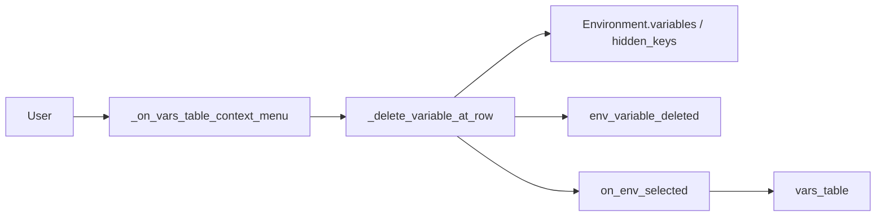

# Environment Variable Delete

## Overview

PYPOST-467 adds an explicit **Delete** action for environment variables in **Manage
Environments**. Users right-click a populated variable row and remove the key from the
selected environment without clearing the name cell manually.

The alternate path from before PYPOST-467 still works: clearing the variable name removes
it from the environment via `on_var_changed` rebuild logic.

## Architecture

- **`EnvironmentDialog`** (`pypost/ui/dialogs/env_dialog.py`):
  - `vars_table` (`QTableWidget`) uses `CustomContextMenu` policy.
  - `_on_vars_table_context_menu(pos)` resolves the row with `rowAt(pos.y())`, shows
    **Delete** only when `COL_VAR` has a non-empty key, and delegates to
    `_delete_variable_at_row`.
  - `_delete_variable_at_row(row)` mutates the in-memory `Environment` for the currently
    selected list row: `variables.pop(key)` and `hidden_keys.discard(key)`, logs
    `env_variable_deleted`, then reloads the table via `on_env_selected(env_row)`.
- **`Environment`** (`pypost.models.models.Environment`): unchanged schema (`variables`,
  `hidden_keys`).
- **`HiddenToggleLogPolicy`**: formats the deleted key name in logs (masked by default).
- **`EnvPresenter`**: unchanged — opens the dialog with a reference to
  `self._environments`; saves after `dialog.exec()` returns.



## API / Usage

### User flow

1. Open **Manage Environments** and select an environment.
2. Right-click a variable row (any column on that row, including **Hidden**).
3. Choose **Delete** — the row disappears immediately.
4. Close the dialog; `EnvPresenter` persists the updated environment list.

### `_on_vars_table_context_menu(self, pos) -> None`

Shows **Delete** for populated variable rows only.

- Returns early when `rowAt(pos.y()) < 0` (blank table area).
- Returns early when the name cell is missing or empty (trailing add row).

### `_delete_variable_at_row(self, row: int) -> None`

Removes one variable from the selected environment and reloads the table.

- Guards: valid `env_list.currentRow()`, populated key on `row`.
- No confirmation dialog (single-item, reversible edit inside Manage Environments).
- Reload uses `on_env_selected` to preserve trailing add row, hidden widgets, and masks.

### Alternate delete path

Clearing the variable name cell still drops the key on the next `on_var_changed` rebuild.
No context menu is shown for the trailing empty row.

## Configuration

No new settings or environment variables. Delete logs respect the existing
`log_hidden_key_names` policy snapshotted when Manage Environments opens (see
[Hidden Variables](hidden_variables.md#hidden-flag-toggle-logging-pypost-448)).

### Log event

```
env_variable_deleted env_name=<name> key=<masked_or_plain>
```

- Level: **INFO**
- `key` via `HiddenToggleLogPolicy.format_key_name(...)` — never logs variable values.

## Troubleshooting

- **Delete menu does not appear**
  - Right-click must land on a row with a non-empty variable name. The trailing add row
    and blank table areas are ignored.
  - Right-clicking the **Hidden** checkbox column is supported (`rowAt` resolves the row).
- **Variable still used after delete**
  - Confirm Manage Environments was closed so `EnvPresenter` saved environments.
  - Check another environment is not still selected in the main combo.
- **Hidden key metadata lingers**
  - Delete should call `hidden_keys.discard(key)`. Run `tests/test_env_dialog.py`
    `test_delete_hidden_variable_clears_hidden_keys` if behaviour regresses.
- **Full table reload on delete**
  - Current implementation reloads via `on_env_selected` (acceptable for typical env
    sizes). See follow-up [PYPOST-493](https://pypost.atlassian.net/browse/PYPOST-493).

## Related Tests

- `tests/test_env_dialog.py`
  - `test_delete_variable_via_handler_removes_from_model`
  - `test_delete_hidden_variable_clears_hidden_keys`
  - `test_delete_variable_keeps_trailing_add_row`
  - `test_vars_table_context_menu_ignores_trailing_row`
  - `test_delete_variable_logs_masked_key_by_default`
  - `test_delete_variable_logs_readable_key_when_enabled`
  - `test_clear_name_still_removes_variable`

## See Also

- [Hidden Variables](hidden_variables.md) — hidden flag, masking, toggle logging
- [Environment Encryption at Rest](environment_encryption_at_rest.md) — at-rest protection
