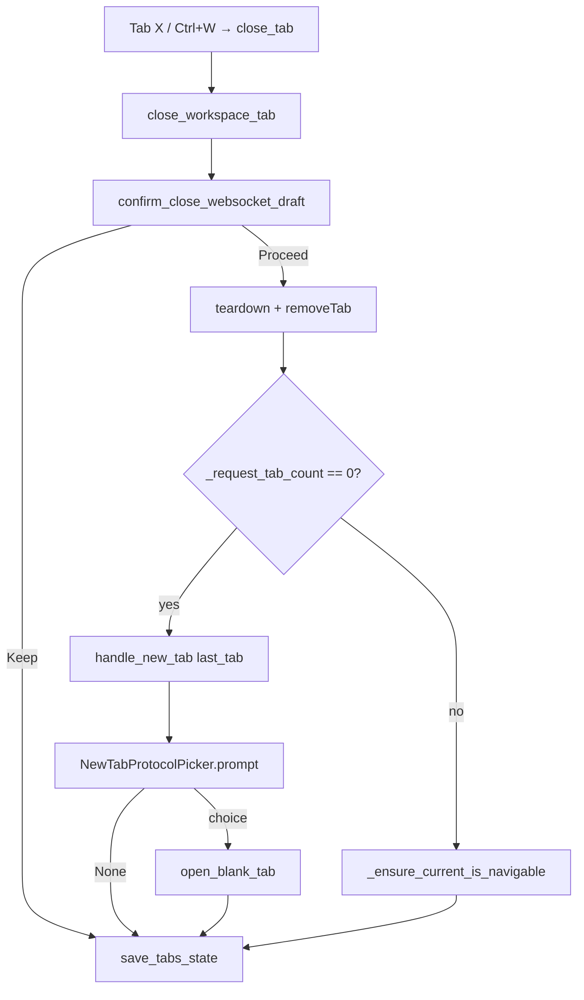

# Last-tab close protocol picker (PYPOST-1159)

## Overview

WS-TM-3 ([PYPOST-1159](https://pypost.atlassian.net/browse/PYPOST-1159))
closes the **empty-workspace replacement** gap. `Ctrl+N` and the tab-bar
**+** already show the protocol picker before a blank tab opens
([PYPOST-1157](https://pypost.atlassian.net/browse/PYPOST-1157)). Closing
the **last** workspace tab used to call `add_new_tab(save_state=False)` and
silently open a blank HTTP `RequestTab`.

Now, when `_request_tab_count() == 0` after a close, the product calls
`handle_new_tab("last_tab")` — the same picker, cancel rule, and
`open_blank_tab` routing as keyboard and **+**. Dismissing the menu leaves
the workspace empty (plus chrome only). Session **restore** of saved HTTP
and WebSocket profiles is unchanged and never shows the picker.

Picker details: [new_tab_protocol_picker.md](new_tab_protocol_picker.md).
WebSocket draft persist and dirty-close:
[websocket_draft_tab.md](websocket_draft_tab.md).

## Architecture

- **`close_workspace_tab`**
  (`pypost/ui/presenters/tabs_presenter_close.py`): extracted from
  `TabsPresenter.close_tab` so `tabs_presenter.py` stays under the 785 LOC
  cap. Plus-tab guard, dirty WebSocket confirm, teardown, `removeTab`.
- **Empty strip** → `presenter.handle_new_tab("last_tab")` (not
  `add_new_tab`).
- **Non-empty strip** → `_ensure_current_is_navigable`; no picker, no
  replacement tab.
- **`TabsPresenter.close_tab`**: thin delegate to `close_workspace_tab`.
- **Metrics**: completed choice records
  `gui_new_tab_actions_total{source="last_tab",protocol=...}`. Cancel
  does not increment.



| Path | Picker? | Replacement |
| --- | --- | --- |
| Close last workspace tab | **Yes** (`last_tab`) | HTTP / WebSocket / MCP draft, or **none** on cancel |
| Close non-last tab | No | None |
| Dirty unsaved WS draft, **Keep** | No | Tab stays |
| Dirty unsaved WS draft, **Discard** on last tab | Yes (after remove) | Same as last-tab row |
| `restore_tabs` saved HTTP / WS / mixed | No | Saved tabs only |
| `restore_tabs` nothing saved | No | Blank HTTP (unchanged) |
| `close_tabs_for_request_ids` empties strip | No (out of scope) | Blank HTTP (unchanged) |

`restore_tabs` and Collections delete paths are **not** blank-tab entry
points. Do not add the picker there.

## API / Usage

### `close_workspace_tab(presenter, index, *, prompt_close=None)`

```python
def close_workspace_tab(
    presenter: TabsPresenter,
    index: int,
    *,
    prompt_close: PromptClose | None = None,
) -> None:
    """Close one workspace tab; last-tab empty strip uses handle_new_tab('last_tab')."""
```

1. Ignore plus-tab index.
1. `confirm_close_websocket_draft` — **before** teardown (PYPOST-1158).
   Return early if user **Keeps** a dirty unsaved WebSocket draft.
1. Call tab `presenter.teardown()` when present.
1. `removeTab(index)`.
1. If `_request_tab_count() == 0`: `handle_new_tab("last_tab")`.
   Else: `_ensure_current_is_navigable(max(0, index - 1))`.
1. `save_tabs_state()` (empty `open_tabs` after cancel is valid).

### `TabsPresenter.handle_new_tab("last_tab")`

Same implementation as `shortcut` / `plus_button`; only the `source`
argument differs. Logs `new_tab_action_triggered source=last_tab`.
Cancel → `new_tab_action_cancelled`; confirm → `open_blank_tab`.

### `track_gui_new_tab_action("last_tab", protocol=...)`

`last_tab` is in `_NEW_TAB_ACTION_SOURCES`. Protocol values:
`http`, `websocket`, `mcp_client`. See
[Prometheus Monitoring](../prometheus_monitoring.md).

### Injectable `protocol_picker`

Tests use the same injection as PYPOST-1157. Never call live
`QMenu.exec()` in CI. See
`TestCloseLastTabProtocolPicker` in `tests/test_tabs_presenter.py`.

## Configuration

No last-tab-specific settings or environment variables.

## Troubleshooting

### Last close still opens HTTP without a picker

Empty fallback must call `handle_new_tab("last_tab")`, not
`add_new_tab(save_state=False)`. Check `tabs_presenter_close.py`.

### Picker appears when closing a non-last tab

Should not happen. Only `_request_tab_count() == 0` after `removeTab`
triggers the picker.

### Dirty WebSocket draft shows picker on **Keep**

Discard / Keep runs first. **Keep** returns before `removeTab`; picker
must not run.

### Workspace empty after last close — is that a bug?

No. Cancel after last close matches `Ctrl+N` / **+** cancel: no tab, no
metric. Plus button remains; user can open a new tab voluntarily.

### Restore shows the picker or drops saved WebSocket tabs

`restore_tabs` must not call `handle_new_tab`. Saved ids still resolve
via registry; unsaved WebSocket drafts stay omitted (PYPOST-1158).

### Metric records `source=unknown` for last-tab confirm

Register `last_tab` in `_NEW_TAB_ACTION_SOURCES` and pass
`"last_tab"` (not `"shortcut"`) from `close_workspace_tab`.

## Tests

| Test | Behavior verified |
| --- | --- |
| `TestCloseLastTabProtocolPicker` in `tests/test_tabs_presenter.py` | Picker on last close; HTTP/WS confirm; cancel empty; non-last skip; dirty WS keep/discard |
| `test_track_gui_new_tab_action_last_tab_source` in `tests/test_metrics_manager.py` | Prometheus `source=last_tab` |

Run:

```bash
make test PYTEST_ARGS="tests/test_tabs_presenter.py -k CloseLastTabProtocolPicker -v"
make test PYTEST_ARGS="tests/test_metrics_manager.py -k last_tab -v"
```
