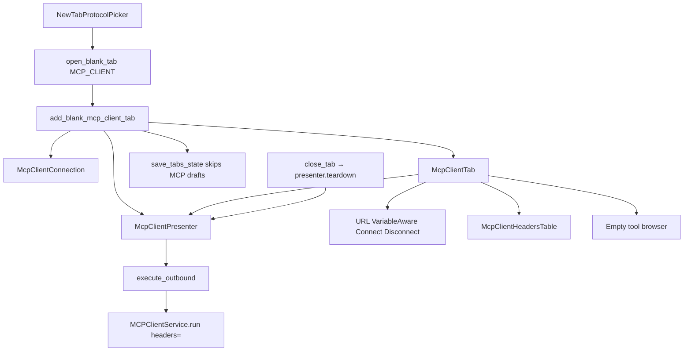

# MCP Client draft tab (PYPOST-1166 / PYPOST-1167)

## Overview

MCP-TM-2 ([PYPOST-1166](https://pypost.atlassian.net/browse/PYPOST-1166))
fills the PYPOST-1165 placeholder **inside the same tab kind**. Confirming
**MCP Client** from `Ctrl+N` / **+** still calls
`TabsPresenter.add_blank_mcp_client_tab()` and still yields `McpClientTab`,
not `RequestTab` or `WebSocketTab`. The page is an unsaved outbound
draft editor: URL bar, **Headers** table, **Connect** and **Disconnect**,
a disconnected state badge, and an empty remote-tool list.

MCP-TM-5 ([PYPOST-1167](https://pypost.atlassian.net/browse/PYPOST-1167))
adds the Headers table (parity with HTTP Headers), environment
templating on URL and header names/values, and
`McpClientPresenter.execute_outbound`. That method is the only MCP
Client path that must call `MCPClientService.run(..., headers=)`.

Connect is **local chrome**. `connect_requested` does not call
`MCPClientService`. Live initialize and `list_tools` are
[PYPOST-1169](https://pypost.atlassian.net/browse/PYPOST-1169) (MCP-TM-3)
and **must** call `execute_outbound` so resolved headers cannot be
dropped. Collections save/open is
[PYPOST-1172](https://pypost.atlassian.net/browse/PYPOST-1172) (MCP-TM-7).
User Guide copy is
[PYPOST-1168](https://pypost.atlassian.net/browse/PYPOST-1168) — do not
rewrite `doc/user/` here.

Picker identity and `gui_new_tab_actions_total{protocol=mcp_client}` stay
as shipped in PYPOST-1165. See
[new_tab_protocol_picker.md](new_tab_protocol_picker.md).

## Architecture

- **`McpClientConnection`** (`pypost/models/mcp_client.py`): in-memory
  draft (`id` UUID, `name="New MCP Client"`, `url=""`,
  `headers={}`). Not on `Collection.mcp_clients` (that field does not
  exist yet). MCP-TM-7 persists headers.
- **`McpClientSessionState`**: `disconnected` (initial), `connecting`
  (reserved for MCP-TM-3), `connected` (local chrome only).
- **`McpClientPresenter`**: Connect / Disconnect / teardown stay local.
  Owns `set_variables` / `set_hidden_keys`, `resolve_outbound_fields`,
  and `execute_outbound`. Lazy-imports `MCPClientService` only when
  execute runs (inject `mcp_client=` in tests).
- **`McpClientTab`**: hosts the connection bar, Headers table, and empty
  tool browser. Exposes `connection_data` and `presenter` like
  `WebSocketTab`. Page id `MCP_CLIENT_TAB_PAGE`.
- **`McpClientConnectionBar`**: URL `VariableAwareLineEdit`, **Connect**,
  **Disconnect**, state `QLabel`.
- **`McpClientHeadersTable`**: `VariableAwareTableWidget` Key/Value
  editor with a trailing empty row. Not `RequestEditor.KeyValueTable`
  and not `WebSocketKeyValueTable`.
- **`McpClientToolBrowser`**: labeled **Remote tools**; empty
  `QListWidget`. MCP-TM-3 fills this widget. Not inbound
  `McpToolsOverviewDialog`.
- **`TabsPresenter`**: thin factory + duck-typed close teardown and env
  fan-out. Chrome must not live in `tabs_presenter.py` (LOC cap 785;
  **779 / 785** after PYPOST-1167).



### Headers table and outbound templating (PYPOST-1167)

Headers belong on MCP Client chrome, not on HTTP method **MCP** and not
in `tabs_presenter.py`. The table sits under the connection bar and
above the tool browser. Edits write `connection_data.headers` in memory.

Resolution uses `TemplateService.render_string` (HTTP parity, **not**
`resolve_proxy_headers`). Missing env vars leave the original `{{ }}`
text. Empty table → `headers={}`. Header **names and values** both
render.

`execute_outbound(operation, call_params=None)`:

1. Sync URL and headers from the tab when bound.
2. Render URL and each header key/value with the env snapshot.
3. Call `MCPClientService.run(url, operation, call_params, headers=)`.

Connect does **not** run that path. MCP-TM-3 / MCP-TM-4 must call
`execute_outbound` (or equivalent) for `list_tools` / `call_tool`.

HTTP method **MCP** already forwards resolved headers through
`RequestService._execute_mcp` (PYPOST-1173). Do not re-wire that path.
Do not edit inbound `pypost/core/qt/mcp_server.py`.

Ctrl+H (`handle_switch_to_headers_global`) stays on `RequestTab` only.

### Environment fan-out

`add_blank_mcp_client_tab` passes `env_vars=self._current_variables` and
`hidden_keys=self._current_hidden_keys` into `McpClientPresenter`.
`on_env_variables_changed` / `on_env_hidden_keys_changed` duck-type
`tab.presenter.set_variables` / `set_hidden_keys` for non-HTTP tabs
(WebSocket and MCP Client) so there is no third `isinstance`.

The presenter pushes the snapshot onto the URL field and Headers table
(`VariableAwareLineEdit` / `VariableAwareTableWidget`). Hover preview
and hidden-key masking (`********`) reuse the HTTP widgets. See
[variable_propagation.md](variable_propagation.md) and
[hidden_variables.md](hidden_variables.md).

### Draft omission vs WebSocket

| Kind | Written to `open_tabs`? | Restored? |
| --- | --- | --- |
| HTTP / WebSocket tabs with ids | Yes | If collection/registry finds the id |
| Blank WebSocket draft | Yes (UUID written); restore often misses | Unchanged |
| Blank MCP Client draft | **No** | **No** — no `restore_tabs` MCP branch |
| Saved MCP Client profile | MCP-TM-7 | MCP-TM-7 |

`save_tabs_state` appends `RequestTab.request_data.id` and
`WebSocketTab.connection_data.id` only. Restart with only unsaved MCP
Client drafts follows the empty-workspace path and opens blank HTTP
(`restore_tabs_no_saved_tabs`). That is FR-3, not a new picker.

### Teardown

`close_tab` duck-types `tab.presenter.teardown` when callable. One path
covers `WebSocketTab` and `McpClientTab`. Teardown is idempotent when
`_session` is already `None`. Do not skip teardown because Connect is
still a no-network stub (Postman disconnect-leak lesson).

`_request_tab_count` already includes `McpClientTab`. Closing the last
HTTP tab while an MCP Client tab remains must not treat the strip as
empty and auto-open HTTP.

## API / Usage

### `McpClientConnection`

```python
class McpClientConnection(BaseModel):
    id: str = Field(default_factory=lambda: str(uuid.uuid4()))
    name: str = "New MCP Client"
    url: str = ""
    headers: dict[str, str] = Field(default_factory=dict)
```

### `McpClientPresenter`

```python
class McpClientPresenter:
    def __init__(
        self,
        connection: McpClientConnection,
        env_vars: dict[str, str] | None = None,
        hidden_keys: set[str] | None = None,
        template_service: TemplateService | None = None,
        mcp_client: MCPClientService | None = None,
    ) -> None: ...
    def set_tab(self, tab: McpClientTab) -> None: ...
    def set_variables(self, variables: dict[str, str]) -> None: ...
    def set_hidden_keys(self, hidden_keys: set[str]) -> None: ...
    def resolve_outbound_fields(self) -> tuple[str, dict[str, str]]: ...
    def execute_outbound(
        self,
        operation: str,
        call_params: dict[str, Any] | None = None,
    ) -> ResponseData: ...
    def connect_requested(self) -> None: ...
    def disconnect_requested(self) -> None: ...
    def teardown(self) -> None: ...
```

- **`set_variables` / `set_hidden_keys`**: snapshot + fan-out to URL and
  Headers widgets when a tab is bound.
- **`resolve_outbound_fields`**: `render_string` on URL and header
  names/values. Empty headers → `{}`. Missing vars leave placeholders.
  DEBUG `mcp_client_outbound_fields_resolved` logs `connection_id` and
  `header_count` only (no keys, values, URL, or env map).
- **`execute_outbound`**: resolve, then
  `run(url, operation, call_params, headers=resolved)`. Inject
  `mcp_client` in tests; production lazy-imports `MCPClientService`.
- **`connect_requested`**: copies URL and headers from the tab, sets
  `_session`, state `CONNECTED`. Does not call `MCPClientService`. Empty
  URL is allowed (no validation this story).
- **`disconnect_requested` / `teardown`**: `_session = None`, state
  `DISCONNECTED`, then `_sync_ui`.

### `McpClientHeadersTable`

```python
class McpClientHeadersTable(VariableAwareTableWidget):
    def set_data(self, data: dict[str, str]) -> None: ...
    def get_data(self) -> dict[str, str]: ...
```

- Columns **Key** / **Value**. Filling the last row adds a new empty
  row. `get_data()` drops rows with an empty name (after strip).
- Widget id `MCP_CLIENT_HEADERS_TABLE`
  (`pypost_mcp_client_headers_table`). User-visible label **Headers**.

### `McpClientTab`

```python
class McpClientTab(QWidget):
    def __init__(
        self,
        connection: McpClientConnection,
        presenter: McpClientPresenter,
        parent: QWidget | None = None,
    ) -> None: ...
    connection_data: McpClientConnection
    presenter: McpClientPresenter
    def set_variables(self, variables: dict[str, str]) -> None: ...
    def set_hidden_keys(self, hidden_keys: set[str]) -> None: ...
    def headers_data(self) -> dict[str, str]: ...
```

There is no one-arg `McpClientTab()` ctor. Tests and the factory pass
connection and presenter.

### `TabsPresenter.add_blank_mcp_client_tab(*, save_state=True)`

Builds `McpClientConnection()` + `McpClientPresenter` (with cached env
kwargs) + `McpClientTab`, inserts before the plus tab with title
**New MCP Client**, optionally calls `save_tabs_state` (which still
omits the draft id).

### `TabsPresenter.close_tab(index)`

Plus-tab index is ignored. Otherwise `teardown()` if present, then
`removeTab`. Empty strip still opens HTTP via
`add_new_tab(save_state=False)` (PYPOST-1159).

## Configuration

No settings or environment variables for the draft shell.

Observability (no URL dumps, no header maps, no secrets):

| Event | When |
| --- | --- |
| `mcp_client_connect_initiated connection_id=%s` | Connect clicked |
| `mcp_client_disconnect_initiated connection_id=%s` | Disconnect clicked |
| `mcp_client_presenter_teardown connection_id=%s` | `close_tab` teardown |
| `mcp_client_outbound_fields_resolved connection_id=%s header_count=%d` | After resolve (DEBUG) |
| `mcp_operation_start ... header_count=%d` | `MCPClientService.run` (DEBUG; PYPOST-1173) |

Connect INFO must not mention `headers`. Resolve logs **count** only.
No new Prometheus counters. Picker still increments
`gui_new_tab_actions_total{protocol=mcp_client}`. Outbound
`connect` / `list_tools` / `call_tool` counters are MCP-TM-3 / TM-4.

Widget ids (`pypost/ui/widget_ids.py`), scoped to the current tab:

| Constant | `objectName` |
| --- | --- |
| `MCP_CLIENT_TAB_PAGE` | `pypost_mcp_client_tab_page` |
| `MCP_CLIENT_URL_INPUT` | `pypost_mcp_client_url_input` |
| `MCP_CLIENT_CONNECT_BUTTON` | `pypost_mcp_client_connect_button` |
| `MCP_CLIENT_DISCONNECT_BUTTON` | `pypost_mcp_client_disconnect_button` |
| `MCP_CLIENT_STATE_BADGE` | `pypost_mcp_client_state_badge` |
| `MCP_CLIENT_TOOL_BROWSER` | `pypost_mcp_client_tool_browser` |
| `MCP_CLIENT_HEADERS_TABLE` | `pypost_mcp_client_headers_table` |

`MCP_CLIENT_TOOL_BROWSER` is on the inner `QListWidget`, not the wrapper.
Tests `findChild` that list. User-visible badge text is **Disconnected** /
**Connecting** / **Connected**. URL placeholder is
`http://127.0.0.1:1080/mcp`.

## Troubleshooting

### MCP Client confirm still looks like HTTP

Assert `isinstance(current, McpClientTab)` and
`findChild(..., METHOD_COMBO) is None`. Routing must hit
`add_blank_mcp_client_tab()` before the HTTP fallback. Details:
[new_tab_protocol_picker.md](new_tab_protocol_picker.md).

### Headers table missing

`findChild` for `pypost_mcp_client_headers_table` must succeed on the
current `McpClientTab`. Chrome lives in
`pypost/ui/widgets/mcp_client/`, not `tabs_presenter.py`. Do not reuse
`RequestEditor` or WebSocket handshake tables.

### `{{ var }}` not resolved on execute

Env must reach the presenter via factory kwargs or duck-typed
`set_variables`. Resolution runs only in `resolve_outbound_fields` /
`execute_outbound`, not on Connect. Hover preview uses the same
variable-aware widgets as HTTP. Missing vars stay as `{{ }}` (HTTP
parity, not proxy fail-fast).

### Outbound call has no headers

MCP-TM-3 must call `execute_outbound`, not `MCPClientService.run`
directly. Empty table is a keyword `headers={}`. Method **MCP** Send
is a separate path (`_execute_mcp`); keep PYPOST-1173 tests green
instead of rewriting it.

### Draft reappears after restart

`save_tabs_state` must not append `tab.connection_data.id`. A WebSocket
copy-paste that writes the UUID then hopes restore misses the collection
item fails FR-3. Look at `StateManager.get_open_tabs()`.

### Close does not call `teardown`

`close_tab` must duck-type `presenter.teardown`, not
`isinstance(tab, WebSocketTab)` only. INFO
`mcp_client_presenter_teardown connection_id=...` should appear.

### Connect talks to a live MCP server

The Connect **button** must not. Patch `MCPClientService.run` when
testing `execute_outbound`; Connect never calls it. Local **Connected**
with an empty tool list is expected until MCP-TM-3.

### Tool browser has inbound catalog tools

Wrong surface. Use `McpClientToolBrowser`, not
`McpToolsOverviewDialog`. Count must be zero until `list_tools`.

### `tabs_presenter.py` exceeds 785 LOC

Chrome belongs in `pypost/ui/widgets/mcp_client/`. Extract shared
insert-before-plus before growing the presenter. Current snapshot:
`ai-tasks/PYPOST-376/baseline-metrics.md` (**779 / 785** after
PYPOST-1167). Headroom is tracked as PYPOST-1184.

### User docs still omit the draft chrome

Intentional. [PYPOST-1168](https://pypost.atlassian.net/browse/PYPOST-1168).

## Tests

- `tests/test_tabs_presenter.py`: draft factory, `open_tabs` omission,
  `close_tab` teardown, env kwargs / duck-typed fan-out.
- `tests/test_mcp_client_tab.py`: chrome + widget ids (including
  Headers table); empty tools; INFO connect / disconnect / teardown
  without URL dumps or the substring `headers`.
- `tests/test_mcp_client_presenter.py`: `execute_outbound` forwards
  resolved URL and headers (and empty `headers={}`); resolve DEBUG
  logs `header_count`, not values.
- PYPOST-1173 regression (method **MCP**):
  `test_execute_mcp_forwards_resolved_headers_to_mcp_client`,
  `test_execute_mcp_forwards_empty_headers_to_mcp_client`,
  `test_run_passes_headers_to_create_mcp_http_client`.

Run:

```bash
make test PYTEST_ARGS="tests/test_mcp_client_tab.py tests/test_mcp_client_presenter.py -v"
```

## Related

- [Blank-tab protocol picker](new_tab_protocol_picker.md)
- [UI widget identity](ui_identity.md)
- [Logging event names](logging.md)
- [TemplateService](template_service.md)
- [Variable propagation](variable_propagation.md)
- [State manager](state_manager.md)
- [MCP integration (planned tab mode)](mcp_integration.md#planned-mcp-client-tab-mode-pypost-1164)
