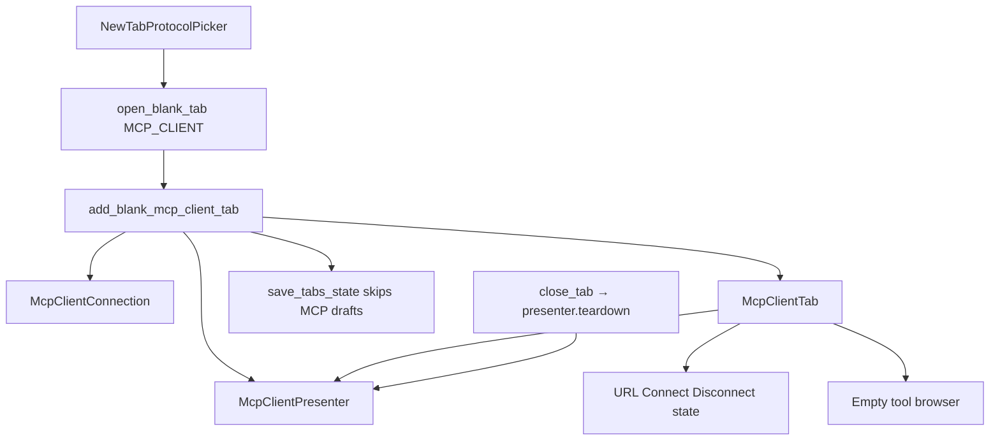

# MCP Client draft tab shell (PYPOST-1166)

## Overview

MCP-TM-2 ([PYPOST-1166](https://pypost.atlassian.net/browse/PYPOST-1166))
fills the PYPOST-1165 placeholder **inside the same tab kind**. Confirming
**MCP Client** from `Ctrl+N` / **+** still calls
`TabsPresenter.add_blank_mcp_client_tab()` and still yields `McpClientTab`,
not `RequestTab` or `WebSocketTab`. The page is now an unsaved outbound
draft editor: empty URL bar, **Connect** and **Disconnect**, a disconnected
state badge, and an empty remote-tool list.

Connect is **local chrome**. `McpClientPresenter` does not call
`MCPClientService`. Live initialize and `list_tools` are
[PYPOST-1169](https://pypost.atlassian.net/browse/PYPOST-1169) (MCP-TM-3).
Collections save/open is
[PYPOST-1172](https://pypost.atlassian.net/browse/PYPOST-1172) (MCP-TM-7).
User Guide copy is
[PYPOST-1168](https://pypost.atlassian.net/browse/PYPOST-1168) — do not
rewrite `doc/user/` here.

Picker identity and `gui_new_tab_actions_total{protocol=mcp_client}` stay
as shipped in PYPOST-1165. See
[new_tab_protocol_picker.md](new_tab_protocol_picker.md).

## Architecture

- **`McpClientConnection`** (`pypost/models/mcp_client.py`): in-memory
  draft (`id` UUID, `name="New MCP Client"`, `url=""`). Not on
  `Collection.mcp_clients` (that field does not exist yet).
- **`McpClientSessionState`**: `disconnected` (initial), `connecting`
  (reserved for MCP-TM-3), `connected` (local chrome only).
- **`McpClientPresenter`**: slots for Connect / Disconnect; `teardown()`
  releases the local session holder. `_session` is `object()` after
  Connect so close always has something to drop.
- **`McpClientTab`**: hosts the connection bar and empty tool browser.
  Exposes `connection_data` and `presenter` like `WebSocketTab`. Page id
  `MCP_CLIENT_TAB_PAGE`.
- **`McpClientConnectionBar`**: URL `QLineEdit`, **Connect**,
  **Disconnect**, state `QLabel`.
- **`McpClientToolBrowser`**: labeled **Remote tools**; empty
  `QListWidget`. MCP-TM-3 fills this widget. Not inbound
  `McpToolsOverviewDialog`.
- **`TabsPresenter`**: thin factory + duck-typed close teardown. Chrome
  must not live in `tabs_presenter.py` (LOC cap 785).



### Draft omission vs WebSocket

| Kind | Written to `open_tabs`? | Restored? |
| --- | --- | --- |
| HTTP / WebSocket tabs with ids | Yes | If collection/registry finds the id |
| Blank WebSocket draft | Yes (UUID written); restore often misses | Unchanged |
| Blank MCP Client draft | **No** | **No** — no `restore_tabs` MCP branch |
| Saved MCP Client profile | MCP-TM-7 | MCP-TM-7 |

`save_tabs_state` appends `RequestTab.request_data.id` and
`WebSocketTab.connection_data.id` only. Restart with only unsaved MCP
Client drafts follows the empty-workspace path and opens blank HTTP
(`restore_tabs_no_saved_tabs`). That is FR-3, not a new picker.

### Teardown

`close_tab` duck-types `tab.presenter.teardown` when callable. One path
covers `WebSocketTab` and `McpClientTab`. Teardown is idempotent when
`_session` is already `None`. Do not skip teardown because Connect is
still a no-network stub (Postman disconnect-leak lesson).

`_request_tab_count` already includes `McpClientTab`. Closing the last
HTTP tab while an MCP Client tab remains must not treat the strip as
empty and auto-open HTTP.

## API / Usage

### `McpClientConnection`

```python
class McpClientConnection(BaseModel):
    id: str = Field(default_factory=lambda: str(uuid.uuid4()))
    name: str = "New MCP Client"
    url: str = ""
```

### `McpClientPresenter`

```python
class McpClientPresenter:
    def __init__(self, connection: McpClientConnection) -> None: ...
    def set_tab(self, tab: McpClientTab) -> None: ...
    def connect_requested(self) -> None: ...
    def disconnect_requested(self) -> None: ...
    def teardown(self) -> None: ...
```

- **`connect_requested`**: copies URL from the tab, sets `_session`,
  state `CONNECTED`. Does not call `MCPClientService`. Empty URL is
  allowed (no validation this story).
- **`disconnect_requested` / `teardown`**: `_session = None`, state
  `DISCONNECTED`, then `_sync_ui`.

### `McpClientTab`

```python
class McpClientTab(QWidget):
    def __init__(
        self,
        connection: McpClientConnection,
        presenter: McpClientPresenter,
        parent: QWidget | None = None,
    ) -> None: ...
    connection_data: McpClientConnection
    presenter: McpClientPresenter
```

There is no one-arg `McpClientTab()` ctor. Tests and the factory pass
connection and presenter.

### `TabsPresenter.add_blank_mcp_client_tab(*, save_state=True)`

Builds `McpClientConnection()` + `McpClientPresenter` + `McpClientTab`,
inserts before the plus tab with title **New MCP Client**, optionally
calls `save_tabs_state` (which still omits the draft id).

### `TabsPresenter.close_tab(index)`

Plus-tab index is ignored. Otherwise `teardown()` if present, then
`removeTab`. Empty strip still opens HTTP via
`add_new_tab(save_state=False)` (PYPOST-1159).

## Configuration

No settings or environment variables for the draft shell.

Observability (no URL dumps):

| Event | When |
| --- | --- |
| `mcp_client_connect_initiated connection_id=%s` | Connect clicked |
| `mcp_client_disconnect_initiated connection_id=%s` | Disconnect clicked |
| `mcp_client_presenter_teardown connection_id=%s` | `close_tab` teardown |

No new Prometheus counters. Picker still increments
`gui_new_tab_actions_total{protocol=mcp_client}`. Outbound
`connect` / `list_tools` / `call_tool` counters are MCP-TM-3 / TM-4.

Widget ids (`pypost/ui/widget_ids.py`), scoped to the current tab:

| Constant | `objectName` |
| --- | --- |
| `MCP_CLIENT_TAB_PAGE` | `pypost_mcp_client_tab_page` |
| `MCP_CLIENT_URL_INPUT` | `pypost_mcp_client_url_input` |
| `MCP_CLIENT_CONNECT_BUTTON` | `pypost_mcp_client_connect_button` |
| `MCP_CLIENT_DISCONNECT_BUTTON` | `pypost_mcp_client_disconnect_button` |
| `MCP_CLIENT_STATE_BADGE` | `pypost_mcp_client_state_badge` |
| `MCP_CLIENT_TOOL_BROWSER` | `pypost_mcp_client_tool_browser` |

`MCP_CLIENT_TOOL_BROWSER` is on the inner `QListWidget`, not the wrapper.
Tests `findChild` that list. User-visible badge text is **Disconnected** /
**Connecting** / **Connected**. URL placeholder is
`http://127.0.0.1:1080/mcp`.

## Troubleshooting

### MCP Client confirm still looks like HTTP

Assert `isinstance(current, McpClientTab)` and
`findChild(..., METHOD_COMBO) is None`. Routing must hit
`add_blank_mcp_client_tab()` before the HTTP fallback. Details:
[new_tab_protocol_picker.md](new_tab_protocol_picker.md).

### Draft reappears after restart

`save_tabs_state` must not append `tab.connection_data.id`. A WebSocket
copy-paste that writes the UUID then hopes restore misses the collection
item fails FR-3. Look at `StateManager.get_open_tabs()`.

### Close does not call `teardown`

`close_tab` must duck-type `presenter.teardown`, not
`isinstance(tab, WebSocketTab)` only. INFO
`mcp_client_presenter_teardown connection_id=...` should appear.

### Connect talks to a live MCP server

It must not. Patch `MCPClientService.run` in later stories; this shell
never imports the service. Local **Connected** with an empty tool list
is expected until MCP-TM-3.

### Tool browser has inbound catalog tools

Wrong surface. Use `McpClientToolBrowser`, not
`McpToolsOverviewDialog`. Count must be zero until `list_tools`.

### `tabs_presenter.py` exceeds 785 LOC

Chrome belongs in `pypost/ui/widgets/mcp_client/`. Extract shared
insert-before-plus before growing the presenter. Current snapshot:
`ai-tasks/PYPOST-376/baseline-metrics.md` (771 / 785 after this story).

### User docs still omit the draft chrome

Intentional. [PYPOST-1168](https://pypost.atlassian.net/browse/PYPOST-1168).

## Tests

- `tests/test_tabs_presenter.py`: draft factory, `open_tabs` omission,
  `close_tab` teardown.
- `tests/test_mcp_client_tab.py`: chrome + widget ids; empty tools; INFO
  connect / disconnect / teardown without URL dumps.

Run:

```bash
make test PYTEST_ARGS="tests/test_mcp_client_tab.py tests/test_tabs_presenter.py -k 'mcp_client' -v"
```

## Related

- [Blank-tab protocol picker](new_tab_protocol_picker.md)
- [UI widget identity](ui_identity.md)
- [Logging event names](logging.md)
- [State manager](state_manager.md)
- [MCP integration (planned tab mode)](mcp_integration.md#planned-mcp-client-tab-mode-pypost-1164)
