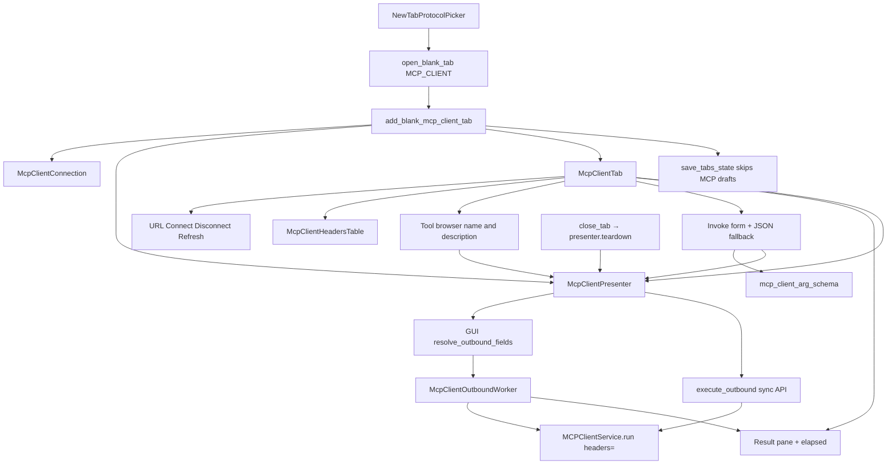

# MCP Client draft tab (PYPOST-1166–1170, PYPOST-1185, PYPOST-1186)

## Overview

MCP-TM-2 ([PYPOST-1166](https://pypost.atlassian.net/browse/PYPOST-1166))
fills the PYPOST-1165 placeholder **inside the same tab kind**. Confirming
**MCP Client** from `Ctrl+N` / **+** still calls
`TabsPresenter.add_blank_mcp_client_tab()` and still yields `McpClientTab`,
not `RequestTab` or `WebSocketTab`. The page is an unsaved outbound
draft editor: URL bar, **Headers** table, **Connect**, **Disconnect**,
**Refresh**, a state badge, an in-tab status/error line, and a remote-tool
list.

MCP-TM-5 ([PYPOST-1167](https://pypost.atlassian.net/browse/PYPOST-1167))
adds the Headers table (parity with HTTP Headers), environment
templating on URL and header names/values, and
`McpClientPresenter.execute_outbound`. That method remains the **sync**
header-aware API (resolve then `MCPClientService.run(..., headers=)`).
Tests may call it on the GUI thread. Live Invoke does **not**.

MCP-TM-3 ([PYPOST-1169](https://pypost.atlassian.net/browse/PYPOST-1169))
makes **Connect** and **Refresh** live `list_tools`. The GUI thread runs
`resolve_outbound_fields`; a presenter-owned `McpClientOutboundWorker`
calls `MCPClientService.run` with the already-resolved URL and headers.
Success fills `McpClientToolBrowser` with tool **name** and
**description**. Connect failure leaves **Failed** chrome and an empty
list. Refresh failure stays **Connected**, keeps last-known (stale)
tools, and shows in-tab error chrome that must not match failed Connect.

MCP-TM-4 ([PYPOST-1170](https://pypost.atlassian.net/browse/PYPOST-1170))
adds select → fill → **Invoke** → inspect on that same tab. The catalog
keeps `inputSchema`. A Qt-free classifier chooses a simple form, JSON
fallback, or no-arg invoke. **Invoke** starts the same worker with
`operation=call_tool` and `kind=invoke`. The result pane shows content,
optional `structuredContent`, errors, and `elapsed_time`. Failed invoke
stays **Connected** and keeps tools. User Guide copy is still
[PYPOST-1168](https://pypost.atlassian.net/browse/PYPOST-1168) — do not
rewrite `doc/user/` here.

Picker identity and `gui_new_tab_actions_total{protocol=mcp_client}` stay
as shipped in PYPOST-1165. See
[new_tab_protocol_picker.md](new_tab_protocol_picker.md).

PYPOST-1185 closes verification debt from PYPOST-1166 follow-up 7:
hermetic GUI proofs that clicking **Connect** / **Disconnect** updates
the connection-state badge without a live MCP server. Production chrome
was already correct (no-op); the durable signal is in
`tests/test_mcp_client_tab.py` (see Tests below).

PYPOST-1186 extracts the Headers empty-row Key/Value editor into shared
`EmptyRowKeyValueTable` (HTTP / WS / MCP wrappers). MCP still must not
import `request_editor`. See
[empty_row_key_value_table.md](empty_row_key_value_table.md).

## Architecture

- **`McpClientConnection`** (`pypost/models/mcp_client.py`): in-memory
  draft (`id` UUID, `name="New MCP Client"`, `url=""`,
  `headers={}`). Not on `Collection.mcp_clients` (that field does not
  exist yet). MCP-TM-7 persists headers.
- **`McpRemoteTool`**: in-memory catalog row (`name`, `description`,
  `input_schema`). Not persisted (MCP-TM-7).
- **`McpClientSessionState`**: `disconnected` (initial), `connecting`
  (Connect in flight only), `connected` (last successful discovery),
  `failed` (failed Connect only). Refresh and Invoke in flight stay
  `connected`. Invoke never uses `FAILED`.
- **`McpClientPresenter`**: Connect / Refresh / Invoke / Disconnect /
  teardown. Owns catalog + selection, `select_tool` /
  `invoke_requested`, `set_variables` / `set_hidden_keys`,
  `resolve_outbound_fields` (GUI thread), sync `execute_outbound`,
  generation + `_list_in_flight` / `_invoke_in_flight`, and three apply
  paths (Connect vs Refresh vs Invoke). Optional `metrics=` (factory
  does not inject; `tabs_presenter.py` stays untouched). Lazy-imports
  `MCPClientService` (inject `mcp_client=` in tests).
- **`mcp_client_arg_schema`**: Qt-free classifier (`simple_form` /
  `json_only` / `no_args`) and `list_arg_fields`.
- **`McpClientOutboundWorker`**: one-shot `QThread`. Calls
  `run(url, operation, call_params, headers=)` with values captured on
  the GUI thread. No Qt widgets, no `resolve_outbound_fields`, no
  `execute_outbound`. Stamps `generation` and `kind` (`connect` /
  `refresh` / `invoke`) on the result signals.
- **`McpClientTab`**: hosts the connection bar, status/error label,
  Headers table, tool browser, invoke form, and result pane. Exposes
  `connection_data` and `presenter` like `WebSocketTab`. Page id
  `MCP_CLIENT_TAB_PAGE`.
- **`McpClientConnectionBar`**: URL `VariableAwareLineEdit`, **Connect**,
  **Disconnect**, **Refresh**, state `QLabel`. Invoke in flight disables
  Connect and Refresh; Disconnect stays allowed.
- **`McpClientHeadersTable`**: thin wrapper around shared
  `EmptyRowKeyValueTable` (`strip_keys=True`). Imports
  `pypost.ui.widgets.empty_row_key_value_table` only — not
  `request_editor`. See
  [empty_row_key_value_table.md](empty_row_key_value_table.md)
  (PYPOST-1186).
- **`McpClientToolBrowser`**: labeled **Remote tools**; inner
  `QListWidget` filled by `set_tools`. Emits `tool_selected` with the
  name stored in `UserRole`. Not inbound `McpToolsOverviewDialog`.
- **`McpClientToolInvokeForm`**: schema form, **Use JSON** fallback,
  **Invoke**. Collects a JSON object or raises `ArgValidationError`.
- **`McpResultView`**: result body + elapsed label. Sanitizes displayed
  text. Image/audio blocks are `[image content]` / `[audio content]`.
- **`TabsPresenter`**: thin factory + duck-typed close teardown and env
  fan-out. Chrome must not live in `tabs_presenter.py` (LOC cap **1165**;
  measured **1059 / 1165**, PYPOST-1194). PYPOST-1169 and PYPOST-1170 do
  **not** edit this file.



### Live Connect and Refresh (PYPOST-1169)

Connect is **not** local chrome. `connect_requested` resolves on the GUI
thread and starts a worker `list_tools`. `CONNECTED` means last
successful discovery, not a held `ClientSession`. Each `run` still
initialize + list or `call_tool` + close. A session holder is later
work, not this tab.

Connect success (including `{"tools": []}`) is Connected with a new list.
Connect failure (empty URL, network, timeout, auth, protocol) is Failed
with an empty list. Refresh failure stays Connected with last-known tools.

| Outcome | Session | Tools | Chrome |
| --- | --- | --- | --- |
| Connect success | Connected | New list | Clear error |
| Connect failure | **Failed** | **Empty** | Error; not Connected |
| Refresh success | Connected | New list | Clear error |
| Refresh failure | **Connected** | **Stale list** | Error; not Failed |
| Disconnect / teardown | Disconnected | Empty | Clear error |

In-flight is **not** the session enum:

| Action in flight | Session enum | Progress chrome | Buttons |
| --- | --- | --- | --- |
| Connect | `CONNECTING` | Connecting badge | Disable Connect and Refresh |
| Refresh | **`CONNECTED`** | In-tab **Refreshing tools...** | Disable Refresh (and Connect) |
| Invoke | **`CONNECTED`** | Result **Invoking...** | Disable Invoke, Connect, Refresh |
| Idle after success | `CONNECTED` | Clear status | Refresh enabled |
| Idle after failed Connect | `FAILED` | Connect error | Refresh disabled |

Late worker results apply Connect vs Refresh policy from the **kind
stamped when the worker started**. Stale generation (Disconnect,
teardown, superseded list) is ignored and does not increment counters.

**Parse:** `json.loads(response.body)` → `tools` list. Each row:
`name = str(item.get("name") or "")`,
`description = str(item.get("description") or "")`,
`input_schema` when `inputSchema` is a dict (else `None`). Skip empty
names. Missing `tools` key or unparseable JSON is failure
(`invalid_tools`), not empty success. `{"tools": []}` is success.
First page only (no `nextCursor` loop).

**Empty URL:** after resolve, `resolved_url.strip() == ""` → do not call
`run`. Message **Enter a server URL.** Connect → Failed + empty tools.
Refresh with empty URL is still Refresh failure: stay Connected, keep
tools, show the same message.

**Error text:** `ExecutionError.message` (or unexpected fallback) through
`sanitize_text(..., env_vars, hidden_keys)`. Do not log the message,
URL, or headers.

Do not reuse `TabsPresenter` / `RequestWorker`. Do not call the current
`execute_outbound` body on the worker (`resolve_outbound_fields` reads
Qt widgets).

### Invoke, schema form, and result pane (PYPOST-1170)

Select a browser row. The presenter binds `McpRemoteTool` into
`McpClientToolInvokeForm`. Invoke does **not** re-list tools. It uses
the same resolved URL/headers as Connect (`kind=invoke`).

**Classifier** (`pypost/core/mcp_client_arg_schema.py`):

- **`json_only`**: missing schema, not an object, composition (`$ref` /
  `oneOf` / `anyOf` / `allOf`), nested object / array, or unknown
  types. UI is the JSON editor only (placeholder `{}`).
- **`no_args`**: `type: object` with no / empty `properties`. No dummy
  fields. Payload is `{}`.
- **`simple_form`**: flat `string` / `number` / `integer` / `boolean`
  (string `enum` OK). Form with required names marked ` *`, plus
  **Use JSON**.

Form collect: empty required field raises `ArgValidationError` (no
`run`). Optional empty fields are omitted. JSON collect: text must parse
to a JSON **object**; empty / array / primitive is validation (no
`run`). `no_args` always returns `{}`.

Switching tools replaces the argument area and clears the last result.
Refresh keeps selection and bound args when the name is still in the
new list; otherwise it clears selection, args, and result.

**Invoke start (GUI thread):**

1. Ignore if `_invoke_in_flight` or `_list_in_flight` (`reason=in_flight`).
2. If not `CONNECTED`, show result-area error; no `run`
   (`reason=not_connected`).
3. If no selected tool, show result-area error; no `run`
   (`reason=no_selection`).
4. `collect_arguments()`. On `ArgValidationError`, show sanitized
   message; no `run` (`reason=validation`).
5. INFO `mcp_client_call_tool_initiated`; `resolve_outbound_fields()`.
6. Bump generation; `_invoke_in_flight`; result **Invoking...**.
7. Worker `run(..., "call_tool", {"name", "arguments"}, headers=)` with
   `kind=invoke`.

**Apply (never Connect-fail):**

- Parsed `ResponseData`: stay Connected, keep tools. Show content and
  optional `structuredContent`. `isError: true` prefixes **Error**.
  Show elapsed from `elapsed_time`. Counter `success` (including
  `isError`).
- Unparseable body: stay Connected, keep tools. Sanitized invalid-result
  text. Counter `error` (`reason=invalid_result`).
- `ExecutionError`: stay Connected, keep tools. Sanitized message in
  the result pane. Counter `error`.
- Client validation: session unchanged. Sanitized message, no elapsed.
  Counter not incremented (`reason=validation` and siblings).
- Stale generation: ignore. Counter not incremented (`reason=stale`).

Sanitize `content` text blocks and `structuredContent` with
`sanitize_text` (env + hidden keys) before display. Logs never include
URL, headers, tool names, or argument payloads.

Disconnect / teardown bumps generation, drops the worker, and clears
tools, selection, args, and the result pane.

### Headers table and outbound templating (PYPOST-1167)

Headers belong on MCP Client chrome, not on HTTP method **MCP** and not
in `tabs_presenter.py`. The table sits under the connection bar / status
line and above the tool browser. Edits write `connection_data.headers`
in memory.

Resolution uses `TemplateService.render_string` (HTTP parity, **not**
`resolve_proxy_headers`). Missing env vars leave the original `{{ }}`
text. Empty table → `headers={}`. Header **names and values** both
render.

`execute_outbound(operation, call_params=None)` (sync, GUI thread):

1. Sync URL and headers from the tab when bound.
2. Render URL and each header key/value with the env snapshot.
3. Call `MCPClientService.run(url, operation, call_params, headers=)`.

Live Connect/Refresh use the same resolve + `headers=` contract, but
the worker calls `run` with fields already resolved. Sync
`execute_outbound` stays for tests. Live Invoke uses the worker, not
this method.

Legacy HTTP method **MCP** collection items convert on open via
`pypost/core/mcp_client_migration.py` (PYPOST-1171); outbound calls
no longer go through `RequestService`.
Do not edit inbound `pypost/core/qt/mcp_server.py`.

Ctrl+H (`handle_switch_to_headers_global`) stays on `RequestTab` only.

### Environment fan-out

`add_blank_mcp_client_tab` passes `env_vars=self._current_variables` and
`hidden_keys=self._current_hidden_keys` into `McpClientPresenter`.
`on_env_variables_changed` / `on_env_hidden_keys_changed` duck-type
`tab.presenter.set_variables` / `set_hidden_keys` for non-HTTP tabs
(WebSocket and MCP Client) so there is no third `isinstance`.

The presenter pushes the snapshot onto the URL field and Headers table
(`VariableAwareLineEdit` / `VariableAwareTableWidget`). Hover preview
and hidden-key masking (`********`) reuse the HTTP widgets. See
[variable_propagation.md](variable_propagation.md) and
[hidden_variables.md](hidden_variables.md).

### Draft omission vs WebSocket

| Kind | Written to `open_tabs`? | Restored? |
| --- | --- | --- |
| HTTP tabs with ids | Yes | If collection finds the id |
| Saved WebSocket profile | **Yes** (id in `WebSocketRegistry`) | Yes (`open_websocket_tab`) |
| Blank WebSocket draft | **No** (registry-gated omit) | **No** (see draft lifecycle doc) |
| Blank MCP Client draft | **No** | **No** — no `restore_tabs` MCP branch |
| Saved MCP Client profile | MCP-TM-7 | MCP-TM-7 |

`save_tabs_state` appends `RequestTab.request_data.id` and **saved**
`WebSocketTab.connection_data.id` only (PYPOST-1158 registry gate).
Unsaved WebSocket drafts are omitted the same way MCP Client drafts
are, but the WS predicate is registry membership — not "omit every
`WebSocketTab`". Restart with only unsaved MCP Client drafts follows
the empty-workspace path and opens blank HTTP
(`restore_tabs_no_saved_tabs`). That is FR-3, not a new picker.

### Teardown

`close_tab` duck-types `tab.presenter.teardown` when callable. One path
covers `WebSocketTab` and `McpClientTab`. For **unsaved dirty WebSocket
drafts**, `confirm_close_websocket_draft` may prompt Discard / Keep
before teardown ([websocket_draft_tab.md](websocket_draft_tab.md)).
MCP Client drafts have no dirty-close prompt. Teardown bumps
generation, drops the worker, clears tools, invoke chrome, and the
result pane, and is idempotent when never connected.

`_request_tab_count` already includes `McpClientTab`. Closing the last
HTTP tab while an MCP Client tab remains must not treat the strip as
empty and auto-open HTTP. Blank-open title (**New MCP Client**), page
identity (`MCP_CLIENT_TAB_PAGE` / `pypost_mcp_client_tab_page`), and
that last-HTTP-close-with-MCP edge are locked by hermetic presenter
proofs in `tests/test_tabs_presenter.py`
([PYPOST-1183](https://pypost.atlassian.net/browse/PYPOST-1183); see
[new_tab_protocol_picker.md](new_tab_protocol_picker.md) and
[last_tab_protocol_picker.md](last_tab_protocol_picker.md)).

## API / Usage

### `McpClientConnection`

```python
class McpClientConnection(BaseModel):
    id: str = Field(default_factory=lambda: str(uuid.uuid4()))
    name: str = "New MCP Client"
    url: str = ""
    headers: dict[str, str] = Field(default_factory=dict)
```

### `McpRemoteTool`

```python
@dataclass(frozen=True)
class McpRemoteTool:
    name: str
    description: str = ""
    input_schema: dict[str, Any] | None = None
```

Presenter memory only. Not written to `McpClientConnection` (MCP-TM-7).

### `McpClientPresenter`

```python
class McpClientPresenter:
    def __init__(
        self,
        connection: McpClientConnection,
        env_vars: dict[str, str] | None = None,
        hidden_keys: set[str] | None = None,
        template_service: TemplateService | None = None,
        mcp_client: MCPClientService | None = None,
        metrics: MetricsTrackerProtocol | None = None,
    ) -> None: ...
    def set_tab(self, tab: McpClientTab) -> None: ...
    def set_variables(self, variables: dict[str, str]) -> None: ...
    def set_hidden_keys(self, hidden_keys: set[str]) -> None: ...
    def resolve_outbound_fields(self) -> tuple[str, dict[str, str]]: ...
    def execute_outbound(
        self,
        operation: str,
        call_params: dict[str, Any] | None = None,
    ) -> ResponseData: ...
    def connect_requested(self) -> None: ...
    def refresh_requested(self) -> None: ...
    def disconnect_requested(self) -> None: ...
    def teardown(self) -> None: ...
    def select_tool(self, name: str | None) -> None: ...
    def invoke_requested(self) -> None: ...
```

- **`set_variables` / `set_hidden_keys`**: snapshot + fan-out to URL and
  Headers widgets when a tab is bound.
- **`resolve_outbound_fields`**: `render_string` on URL and header
  names/values. Empty headers → `{}`. Missing vars leave placeholders.
  DEBUG `mcp_client_outbound_fields_resolved` logs `connection_id` and
  `header_count` only (no keys, values, URL, or env map). **GUI thread
  only.**
- **`execute_outbound`**: resolve, then
  `run(url, operation, call_params, headers=resolved)` on the **calling**
  thread. Inject `mcp_client` in tests; production lazy-imports
  `MCPClientService`. Do not call this from `McpClientOutboundWorker`.
- **`connect_requested`**: ignore if `_list_in_flight` or already
  `CONNECTED`. Else `_start_list(kind=connect)`: resolve, empty-URL
  reject, `CONNECTING`, worker `run(..., "list_tools", headers=)`.
- **`refresh_requested`**: ignore unless `CONNECTED` and not in flight.
  Else `_start_list(kind=refresh)`: stay `CONNECTED`, in-tab progress,
  same worker `list_tools`.
- **`disconnect_requested` / `teardown`**: bump generation, `_session =
  None`, `DISCONNECTED`, clear tools, invoke column, result, and
  status, drop worker, then `_sync_ui`.
- **`select_tool`**: bind `McpRemoteTool` (or clear). Unknown names
  become `None`. Clears the result pane.
- **`invoke_requested`**: validate; GUI resolve; worker
  `call_tool` / `kind=invoke`. Do not call `execute_outbound`.

### `McpClientOutboundWorker`

```python
class McpClientOutboundWorker(QThread):
    finished_ok = Signal(int, str, object)
    finished_error = Signal(int, str, object)

    def __init__(
        self,
        client: MCPClientService,
        url: str,
        headers: dict[str, str],
        operation: str,
        call_params: dict[str, Any] | None,
        generation: int,
        kind: str,
    ) -> None: ...
```

Signals carry `(generation, kind, ResponseData | ExecutionError)`.
Unexpected exceptions emit a sanitized `ExecutionError` and ERROR
`mcp_client_outbound_worker_unexpected generation=%s kind=%s` (no URL).

### `McpClientToolBrowser`

```python
class McpClientToolBrowser(QWidget):
    tool_selected = Signal(object)  # str name or None

    def set_tools(self, tools: list[tuple[str, str]]) -> None: ...
    def clear_tools(self) -> None: ...
    def select_tool_by_name(self, name: str) -> None: ...
```

Each row is `"{name} - {description}"` when description is non-empty,
else `name`. Tooltip is the description. Canonical name is
`Qt.ItemDataRole.UserRole`. Widget id `MCP_CLIENT_TOOL_BROWSER` stays
on the inner `QListWidget`. `select_tool_by_name` does not emit
`tool_selected` (Refresh restore).

### `classify_arg_schema` / `list_arg_fields`

```python
class ArgSchemaKind(str, Enum):
    SIMPLE_FORM = "simple_form"
    JSON_ONLY = "json_only"
    NO_ARGS = "no_args"

def classify_arg_schema(schema: dict | None) -> ArgSchemaKind: ...
def list_arg_fields(schema: dict | None) -> list[ArgFieldSpec]: ...
```

Qt-free. `list_arg_fields` is empty unless the kind is `simple_form`.

### `McpClientToolInvokeForm`

```python
class McpClientToolInvokeForm(QWidget):
    invoke_clicked = Signal()

    def bind_tool(self, tool: McpRemoteTool | None) -> None: ...
    def set_invoke_enabled(self, enabled: bool) -> None: ...
    def collect_arguments(self) -> dict[str, Any]: ...
```

`collect_arguments` raises `ArgValidationError` on empty required
fields or non-object JSON. Widget ids: `MCP_CLIENT_ARG_FORM`,
`MCP_CLIENT_ARG_JSON`, `MCP_CLIENT_INVOKE_BUTTON`.

### `McpResultView`

```python
class McpResultView(QWidget):
    def set_in_progress(self) -> None: ...
    def set_result(
        self, payload: dict, elapsed_s: float, *, is_error: bool,
    ) -> None: ...
    def set_error(self, message: str, elapsed_s: float | None) -> None: ...
    def clear(self) -> None: ...
```

Elapsed text is `Elapsed: {elapsed_s:g} s` on
`MCP_CLIENT_ELAPSED_LABEL`. Body id `MCP_CLIENT_RESULT_PANE`.

### `McpClientHeadersTable`

```python
class McpClientHeadersTable(EmptyRowKeyValueTable):
    def __init__(self, parent: QWidget | None = None) -> None: ...
    # Inherited: set_data / get_data / set_read_only (MCP does not lock)
```

- Subclasses shared `EmptyRowKeyValueTable` with `strip_keys=True`
  ([empty_row_key_value_table.md](empty_row_key_value_table.md)).
- Columns **Key** / **Value**. Filling the last row adds a new empty
  row. `get_data()` drops rows with an empty name (after strip).
- Widget id `MCP_CLIENT_HEADERS_TABLE`
  (`pypost_mcp_client_headers_table`). User-visible label **Headers**.
- Must not import `pypost.ui.widgets.request_editor` (FR-5).

### `McpClientTab`

```python
class McpClientTab(QWidget):
    def __init__(
        self,
        connection: McpClientConnection,
        presenter: McpClientPresenter,
        parent: QWidget | None = None,
    ) -> None: ...
    connection_data: McpClientConnection
    presenter: McpClientPresenter
    def set_variables(self, variables: dict[str, str]) -> None: ...
    def set_hidden_keys(self, hidden_keys: set[str]) -> None: ...
    def headers_data(self) -> dict[str, str]: ...
    def set_session_state(
        self,
        state: McpClientSessionState,
        *,
        list_in_flight: bool = False,
        invoke_in_flight: bool = False,
    ) -> None: ...
    def set_status_text(self, text: str) -> None: ...
    def set_tools(self, tools: list[tuple[str, str]]) -> None: ...
    def select_tool_by_name(self, name: str) -> None: ...
    def clear_tools(self) -> None: ...
    def bind_invoke_tool(self, tool: McpRemoteTool | None) -> None: ...
    def collect_invoke_arguments(self) -> dict[str, Any]: ...
    def set_invoke_enabled(self, enabled: bool) -> None: ...
    def set_invoke_in_progress(self) -> None: ...
    def set_invoke_result(
        self, payload: dict, elapsed_s: float, *, is_error: bool,
    ) -> None: ...
    def set_invoke_error(
        self, message: str, elapsed_s: float | None = None,
    ) -> None: ...
    def clear_result(self) -> None: ...
    def clear_invoke(self) -> None: ...
```

There is no one-arg `McpClientTab()` ctor. Tests and the factory pass
connection and presenter.

### `TabsPresenter.add_blank_mcp_client_tab(*, save_state=True)`

Builds `McpClientConnection()` + `McpClientPresenter` (with cached env
kwargs) + `McpClientTab`, inserts before the plus tab with title
**New MCP Client**, optionally calls `save_tabs_state` (which still
omits the draft id). Does **not** pass `metrics=` (FILE_CAPS inventory;
no growth this story). GUI tests inject `metrics=` on the presenter.

### `TabsPresenter.close_tab(index)`

Plus-tab index is ignored. Unsaved dirty WebSocket drafts may prompt
Discard / Keep first ([websocket_draft_tab.md](websocket_draft_tab.md)).
Otherwise `teardown()` if present, then `removeTab`. Empty strip calls
`handle_new_tab("last_tab")` (protocol picker; not silent
`add_new_tab`) — see
[last_tab_protocol_picker.md](last_tab_protocol_picker.md)
(PYPOST-1159).

## Configuration

No settings or environment variables for the draft shell.

Observability (no URL dumps, no header maps, no secrets, no tool names):

| Event | Level | When |
| --- | --- | --- |
| `mcp_client_connect_initiated` | INFO | Connect clicked (`connection_id`) |
| `mcp_client_refresh_initiated` | INFO | Refresh clicked (`connection_id`) |
| `mcp_client_disconnect_initiated` | INFO | Disconnect clicked (`connection_id`) |
| `mcp_client_presenter_teardown` | INFO | `close_tab` teardown (`connection_id`) |
| `mcp_client_list_tools_succeeded` | INFO | Parsed tools (`kind`, `tool_count`) |
| `mcp_client_list_rejected` | WARNING | Empty resolved URL; no `run` |
| `mcp_client_list_tools_failed` | ERROR | Worker error or `reason=invalid_tools` |
| `mcp_client_list_tools_ignored` | DEBUG | Stale generation |
| `mcp_client_outbound_fields_resolved` | DEBUG | After resolve (`header_count`) |
| `mcp_client_outbound_worker_started` | DEBUG | Worker `run` start |
| `mcp_client_outbound_worker_unexpected` | ERROR | Uncaught worker exception |
| `mcp_operation_start` | DEBUG | `MCPClientService.run` (`header_count`) |
| `mcp_client_call_tool_initiated` | INFO | Worker `call_tool` started |
| `mcp_client_call_tool_succeeded` | INFO | Parsed result (incl. `isError`) |
| `mcp_client_call_tool_failed` | ERROR | Worker error or `invalid_result` |
| `mcp_client_call_tool_ignored` | DEBUG | `reason` token only |

Connect / Refresh / Invoke INFO must not mention `headers`, URL, tool
names, or argument payloads. Resolve logs **count** only. Failure ERROR
does not log the exception message (hidden env values must not leak).
DEBUG ignore reasons: `in_flight`, `not_connected`, `no_selection`,
`validation`, `stale`.

Outbound Prometheus counters (distinct from inbound
`mcp_requests_received_total`):

| Metric | Labels | Meaning |
| --- | --- | --- |
| `mcp_client_connect_total` | `result` | Connect settle only (`success` / `error`) |
| `mcp_client_list_tools_total` | `result`, `operation` | Connect or Refresh settle |
| `mcp_client_call_tool_total` | `result` | Invoke worker settle only |

Stale worker results and client-side validation do not increment
counters. Factory does not wire `TabsPresenter._metrics`; scrape of live
GUI Connect / Invoke waits on a later `metrics=` injection
([PYPOST-1184](https://pypost.atlassian.net/browse/PYPOST-1184) / Step 7
note). Tests inject `MetricsRegistry`.

Picker still increments
`gui_new_tab_actions_total{protocol=mcp_client}`.

Widget ids (`pypost/ui/widget_ids.py`), scoped to the current tab:

| Constant | `objectName` |
| --- | --- |
| `MCP_CLIENT_TAB_PAGE` | `pypost_mcp_client_tab_page` |
| `MCP_CLIENT_URL_INPUT` | `pypost_mcp_client_url_input` |
| `MCP_CLIENT_CONNECT_BUTTON` | `pypost_mcp_client_connect_button` |
| `MCP_CLIENT_DISCONNECT_BUTTON` | `pypost_mcp_client_disconnect_button` |
| `MCP_CLIENT_REFRESH_BUTTON` | `pypost_mcp_client_refresh_button` |
| `MCP_CLIENT_STATE_BADGE` | `pypost_mcp_client_state_badge` |
| `MCP_CLIENT_ERROR_LABEL` | `pypost_mcp_client_error_label` |
| `MCP_CLIENT_TOOL_BROWSER` | `pypost_mcp_client_tool_browser` |
| `MCP_CLIENT_HEADERS_TABLE` | `pypost_mcp_client_headers_table` |
| `MCP_CLIENT_INVOKE_BUTTON` | `pypost_mcp_client_invoke_button` |
| `MCP_CLIENT_ARG_FORM` | `pypost_mcp_client_arg_form` |
| `MCP_CLIENT_ARG_JSON` | `pypost_mcp_client_arg_json` |
| `MCP_CLIENT_RESULT_PANE` | `pypost_mcp_client_result_pane` |
| `MCP_CLIENT_ELAPSED_LABEL` | `pypost_mcp_client_elapsed_label` |

`MCP_CLIENT_TOOL_BROWSER` is on the inner `QListWidget`, not the wrapper.
Tests `findChild` that list. User-visible badge text is **Disconnected** /
**Connecting** / **Connected** / **Failed**. Status line shows sanitized
Connect/Refresh errors or **Refreshing tools...**. Invoke errors and
**Invoking...** live in the result pane, not the Connect error label.
URL placeholder is `http://127.0.0.1:1080/mcp`.

## Troubleshooting

### MCP Client confirm still looks like HTTP

Assert `isinstance(current, McpClientTab)` and
`findChild(..., METHOD_COMBO) is None`. Routing must hit
`add_blank_mcp_client_tab()` before the HTTP fallback. Also assert
strip title **New MCP Client** and
`objectName == pypost_mcp_client_tab_page` after
`open_blank_tab(MCP_CLIENT)` (PYPOST-1183). Details:
[new_tab_protocol_picker.md](new_tab_protocol_picker.md).

### Headers table missing

`findChild` for `pypost_mcp_client_headers_table` must succeed on the
current `McpClientTab`. Chrome lives in
`pypost/ui/widgets/mcp_client/`, not `tabs_presenter.py`. Do not reuse
`RequestEditor` or WebSocket handshake tables.

### `{{ var }}` not resolved on Connect

Env must reach the presenter via factory kwargs or duck-typed
`set_variables`. Live Connect/Refresh call `resolve_outbound_fields` on
the GUI thread before the worker. Hover preview uses the same
variable-aware widgets as HTTP. Missing vars stay as `{{ }}` (HTTP
parity, not proxy fail-fast).

### Outbound call has no headers

Connect/Refresh must pass already-resolved `headers=` into
`MCPClientService.run` (empty table is `headers={}`). Do not call `run`
from the worker without resolving first. Method **MCP** Send is a
separate path (`_execute_mcp`); keep PYPOST-1173 tests green instead of
rewriting it.

### Connect looks Connected with an empty list after a network error

Failed Connect must be `FAILED` + empty tools + error on
`MCP_CLIENT_ERROR_LABEL`. If the badge is Connected, the worker likely
applied Refresh policy, or Connect never ran `list_tools`.

### Refresh failure looks like failed Connect

Refresh must stay `CONNECTED`, keep previous rows, and show error while
the badge stays **Connected**. Do not share a single “clear tools and
disconnect” handler with Connect.

### GUI freezes on Connect

`MCPClientService.run` uses `anyio.run` and can block up to 25s. It
must run on `McpClientOutboundWorker`, not on the Qt main thread and
not via sync `execute_outbound` from Connect.

### Draft reappears after restart

`save_tabs_state` must not append `tab.connection_data.id` for MCP
Client drafts. WebSocket drafts use a **registry gate** (omit unsaved
ids, persist saved ids) rather than omitting every `WebSocketTab` —
see [websocket_draft_tab.md](websocket_draft_tab.md). Look at
`StateManager.get_open_tabs()`.

### Close does not call `teardown`

`close_tab` must duck-type `presenter.teardown`, not
`isinstance(tab, WebSocketTab)` only. INFO
`mcp_client_presenter_teardown connection_id=...` should appear.

### Tool browser has inbound catalog tools

Wrong surface. Use `McpClientToolBrowser`, not
`McpToolsOverviewDialog`. Rows come from outbound `list_tools` JSON.

### Invoke looks like failed Connect

Failed Invoke must stay `CONNECTED` with tools kept. The error belongs
on `MCP_CLIENT_RESULT_PANE`, not Failed-Connect chrome (empty browser +
**Failed** badge). Do not route invoke through `_apply_connect_failure`.

### Nested schema still shows a field form

`classify_arg_schema` must return `json_only` for nested objects,
arrays, and composition keywords. The JSON editor id is
`pypost_mcp_client_arg_json`. Empty JSON text is validation, not `{}`.

### Empty required field still called `run`

Form collect must raise `ArgValidationError` and skip `call_tool`.
DEBUG `mcp_client_call_tool_ignored reason=validation`. The counter
must not increment.

### Result pane shows secrets from the environment

Presenter `_sanitize_invoke_payload` plus `McpResultView` must run
`sanitize_text` on text `content` and `structuredContent`. Tests:
`test_invoke_result_masks_hidden_values_in_content`.

### GUI freezes on Invoke

Same as Connect: `MCPClientService.run` must stay on
`McpClientOutboundWorker`. Do not call `execute_outbound("call_tool")`
from the GUI thread.

### `tabs_presenter.py` exceeds 1165 LOC

Chrome belongs in `pypost/ui/widgets/mcp_client/` and
`mcp_client_presenter.py`. Extract shared insert-before-plus before
growing the presenter. Current snapshot is **1059 / 1165** (PYPOST-1194).
Canonical inventory:
`ai-tasks/PYPOST-376/baseline-metrics.md`. Prefer extraction before
raising again (PYPOST-1184). PYPOST-1169 and PYPOST-1170 must not edit
this file.

### User docs still omit Invoke

Intentional for this story.
[PYPOST-1168](https://pypost.atlassian.net/browse/PYPOST-1168).

### Connect / Disconnect badge proofs fail under CI

Prefer the PYPOST-1185 chrome tests over presenter-direct calls. Assert
`_click_connect` / `_click_disconnect` and badge helpers, with
`mcp_client=` injected. Do not require a live MCP server. If Connect
never reaches Connected, check worker settlement (`wait_until` +
`_CONNECT_SETTLE_S`) and that Disconnect stays disabled until Connected.

## Tests

- `tests/test_tabs_presenter.py`: draft factory, `open_tabs` omission,
  `close_tab` teardown, env kwargs / duck-typed fan-out; PYPOST-1183
  blank-open proofs (`test_open_blank_tab_mcp_client_sets_title_new_mcp_client`,
  `test_open_blank_tab_mcp_client_sets_widget_id`), suite count alignment
  (`test_request_tab_count_helper_counts_mcp_client`), and
  last-HTTP-close-with-MCP
  (`test_close_last_http_with_mcp_remaining_does_not_auto_open_http`).
- `tests/test_mcp_client_tab.py`: chrome + widget ids (Refresh, error
  label, Invoke, form, JSON, result, elapsed); Headers empty-row UX;
  Headers table edit → sync `execute_outbound` → resolved `headers=`
  (PYPOST-1187); Headers hover masks hidden keys as `********`
  (PYPOST-1187); Connect fills name/description; Connect error → Failed
  + empty tools; Refresh failure → Connected + stale list; Invoke
  `call_tool` + structured result + elapsed; invoke error stays Connected
  with tools; nested schema JSON fallback; empty required field does not
  `run`; result sanitizer; INFO omits URL / `headers` / secrets /
  arguments; outbound metrics. Construction
  `objectName == MCP_CLIENT_TAB_PAGE` remains complementary to the
  presenter blank-open identity proof.
- `tests/test_mcp_client_arg_schema.py`: Qt-free classifier
  (`simple_form` / `json_only` / `no_args`).
- `tests/test_mcp_client_presenter.py`: `execute_outbound` forwards
  resolved URL and headers (and empty `headers={}`); resolve DEBUG
  logs `header_count`, not values.
- `tests/test_metrics_registry.py` / `tests/test_metrics_otel.py`:
  `track_mcp_client_connect`, `track_mcp_client_list_tools`,
  `track_mcp_client_call_tool`.
- PYPOST-1173 regression (method **MCP**):
  `test_execute_mcp_forwards_resolved_headers_to_mcp_client`,
  `test_execute_mcp_forwards_empty_headers_to_mcp_client`,
  `test_run_passes_headers_to_create_mcp_http_client`.

### Hermetic Headers table → execute_outbound and hidden-key hover (PYPOST-1187)

Presenter unit tests seed `McpClientConnection(headers=...)` without a
tab. PYPOST-1187 locks the **live Headers table → sync path**:

- `test_headers_table_edit_execute_outbound_forwards_widget_headers` —
  type Key/Value on `pypost_mcp_client_headers_table` (empty ctor
  headers), call `presenter.execute_outbound("list_tools")` with
  injected `mcp_client=`, assert `run(..., headers=)` is the
  environment-resolved map from widget data (`_sync_fields_from_tab` /
  `headers_data`).
- `test_mcp_client_headers_table_hover_masks_hidden_keys` — value cell
  with `{{token}}` and `hidden_keys={"token"}`; `_resolve_cell_hover`
  yields `********` and omits the secret (same pattern as WebSocket
  Headers hover tests).

No live MCP server. Module `pytestmark = pytest.mark.timeout(30)`.

Targeted run:

```bash
make test PYTEST_ARGS="tests/test_mcp_client_tab.py -k \
  'headers_table_edit_execute_outbound or headers_table_hover_masks' -v"
```

### Hermetic Connect / Disconnect badge button paths (PYPOST-1185)

Live Connect already mocks `MCPClientService.run` (no live MCP server).
PYPOST-1185 adds focused **button → badge** proofs so chrome wiring
cannot hide behind tool-list or presenter-direct asserts:

- `_click_connect` / `_click_disconnect` — `QPushButton.click()` on
  controls (not presenter entry points).
- `_is_connected_badge` / `_is_disconnected_badge` — badge text only
  (Disconnected/idle vs Connected).
- `test_click_connect_updates_badge_to_connected_hermetic` — FR-1 /
  FR-2: Connect → **Connected**; inject `mcp_client=`.
- `test_click_disconnect_returns_badge_to_disconnected` — FR-3: after
  hermetic Connect, Disconnect → **Disconnected**.

Hermetic isolation means inject a `MagicMock` (or fake) via
`_build_draft_tab(mcp_client=...)` so CI never opens sockets. Successful
Connect may call the injected client's `run`; that is expected under
live Connect. Do **not** freeze “never call `run` on success” as a
product rule.

Presenter logging tests that call `connect_requested` /
`disconnect_requested` directly remain complementary; they do **not**
replace the button-path proofs. Tool-browser Connect tests still assert
Connected as a side effect; the chrome tests above are the FR-1 / FR-3
signal that must stay green if tools asserts change.

Module `pytestmark = pytest.mark.timeout(30)`. Settlement uses bounded
`wait_until(..., timeout=_CONNECT_SETTLE_S)`.

Run:

```bash
make test PYTEST_ARGS="tests/test_mcp_client_tab.py \
  tests/test_mcp_client_presenter.py tests/test_mcp_client_arg_schema.py -v"
```

Targeted badge button-path only:

```bash
make test PYTEST_ARGS="tests/test_mcp_client_tab.py -k \
  'click_connect_updates_badge_to_connected_hermetic or \
  click_disconnect_returns_badge_to_disconnected' -v"
```

## Related

- [MCP Client user guide](../user/mcp-client.md) — outbound connect, list, invoke (PYPOST-1168;
  contract tests in `tests/test_mcp_tab_mode_user_docs.py`)
- [Blank-tab protocol picker](new_tab_protocol_picker.md)
- [Last-tab close protocol picker](last_tab_protocol_picker.md)
- [Blank WebSocket draft tab lifecycle](websocket_draft_tab.md)
- [UI widget identity](ui_identity.md)
- [Logging event names](logging.md)
- [Prometheus monitoring](../prometheus_monitoring.md)
- [TemplateService](template_service.md)
- [Variable propagation](variable_propagation.md)
- [State manager](state_manager.md)
- [MCP integration (planned tab mode)](mcp_integration.md#planned-mcp-client-tab-mode-pypost-1164)
