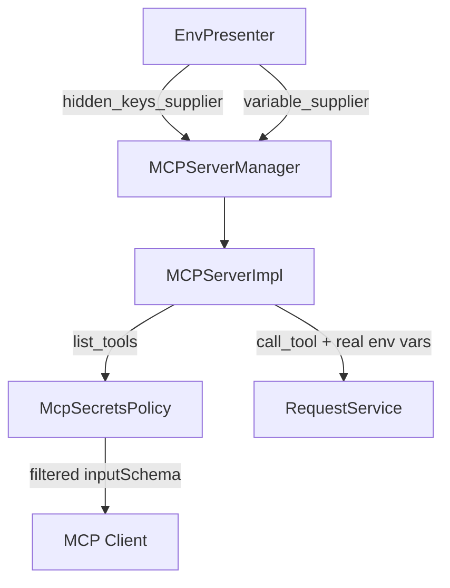

# MCP Secrets Policy (PYPOST-554)

## Overview

`McpSecretsPolicy` defines what local AI agents may see over **network MCP** versus what
PyPost uses at execution time. Hidden environment variables and other env placeholders are
**execution-only**; they must not appear in `list_tools` JSON Schema. Real values (including
hidden keys) are still merged at `call_tool` — same as GUI sends.

## Architecture

- **Policy**: `pypost.core.mcp_secrets_policy.McpSecretsPolicy`
- **Enforcement**: `MCPServerImpl._generate_schema` filters param specs before schema build
- **Hidden keys source**: `EnvPresenter._current_hidden_keys` via `hidden_keys_supplier`
- **Env values source**: `EnvPresenter._current_variables` via `variable_supplier` (PYPOST-550)



## Policy rules

| Data | Agent-visible (`list_tools`) | Execution (`call_tool`) |
| --- | --- | --- |
| `{{ mcp.request.* }}` placeholders | Yes — tool input parameters | From agent arguments |
| Environment `{{ var }}` placeholders | No | Real values from active env |
| Hidden env keys (`Environment.hidden_keys`) | No — stripped from schema | Real values |
| Explicit `mcp_params` for hidden keys | No — filtered | N/A |

## API / Usage

### `McpSecretsPolicy.extract_mcp_request_variables(request)`

Discovers agent tool input names from `{{ mcp.request.VAR }}` placeholders in the
request URL, body, headers, and params. Uses module-level `_MCP_REQUEST_VAR_PATTERN`
(compiled via `import re` at file top — see `mcp_secrets_policy.py`).

### `McpSecretsPolicy.filter_agent_param_specs(specs, request, template_service, hidden_keys)`

Returns a copy of MCP param metadata with env-only and hidden keys removed.

### `McpSecretsPolicy.execution_environment_variables(env_vars)`

Returns a shallow copy of env vars with **real** hidden values for execution.

### `McpSecretsPolicy.safe_execution_log_fields(env_var_count, hidden_key_count, mcp_arg_count)`

Returns count-only dict for DEBUG logging.

### Wiring

```python
# EnvPresenter (init)
self._mcp_manager.set_hidden_keys_supplier(
    lambda: set(self._current_hidden_keys)
)

# MCPServerManager
def set_hidden_keys_supplier(self, supplier):
    self._impl.set_hidden_keys_supplier(supplier)
```

## Configuration

No new settings. Policy uses `Environment.hidden_keys` from the active environment when MCP
is enabled.

## Troubleshooting

| Symptom | Likely cause | Resolution |
| --- | --- | --- |
| Agent schema missing expected param | Key matches hidden env var name | Rename env var or use `mcp.request.*` placeholder |
| Tool auth fails | Hidden var not in active environment | Define variable in environment; execution still uses real value |
| Schema shows env var name | Var is `mcp.request.*`, not env-only | Expected — agent supplies that argument |

## Related tests

```bash
.venv/bin/python -m pytest \
  tests/test_mcp_secrets_policy.py \
  tests/test_mcp_server_impl.py -v
```

See also `doc/dev/mcp_integration.md` and `doc/dev/hidden_variables.md`.
