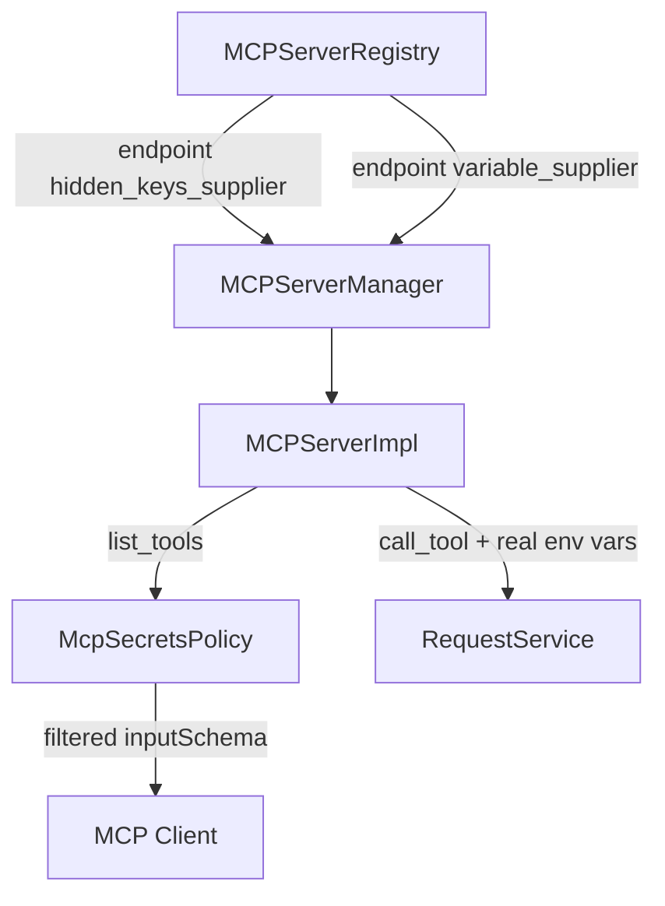

# MCP Secrets Policy (PYPOST-554)

## Overview

`McpSecretsPolicy` defines what local AI agents may see over **network MCP** versus what
PyPost uses at execution time. Hidden environment variables and other env placeholders are
**execution-only**; they must not appear in `list_tools` JSON Schema. Real values (including
hidden keys) are still merged at `call_tool` — same as GUI sends.

## Architecture

- **Policy**: `pypost.core.mcp_secrets_policy.McpSecretsPolicy`
- **Enforcement**: `MCPServerImpl._generate_schema` filters param specs before schema build
- **Hidden keys source**: `MCPServerRegistry` copies the selected environment's hidden keys
  into each endpoint's `hidden_keys_supplier`.
- **Env values source**: `MCPServerRegistry` copies the selected environment's values into
  each endpoint's `variable_supplier`.



## Policy rules

| Data | Agent-visible (`list_tools`) | Execution (`call_tool`) |
| --- | --- | --- |
| `mcp.request.*` placeholders (bare or wrapped) | Yes — tool input parameters | From agent arguments |
| Environment `{{ var }}` placeholders | No | Real values from the endpoint's selected environment |
| Hidden env keys (`Environment.hidden_keys`) | No — stripped from schema | Real values from the endpoint's selected environment |
| Explicit `mcp_params` for hidden keys | No — filtered | N/A |

## API / Usage

### `McpSecretsPolicy.extract_mcp_request_variables(request)`

Discovers agent tool input names from `mcp.request.VAR` expressions—both bare
placeholders (e.g. `{{ mcp.request.VAR }}`) and function-wrapped expressions (e.g.
`{{ to_int(mcp.request.VAR) }}`)—across the request URL, body, headers, and params
(PYPOST-1052). Uses module-level `_MCP_REQUEST_VAR_PATTERN` (compiled via
`re.compile(r"mcp\.request\.([a-zA-Z0-9_]+)")` at file top — see
`mcp_secrets_policy.py`).

### `McpSecretsPolicy.filter_agent_param_specs(specs, request, template_service, hidden_keys)`

Returns a copy of MCP param metadata with env-only and hidden keys removed.

### `McpSecretsPolicy.execution_environment_variables(env_vars)`

Returns a shallow copy of env vars with **real** hidden values for execution.

### `McpSecretsPolicy.safe_execution_log_fields(env_var_count, hidden_key_count, mcp_arg_count)`

Returns count-only dict for DEBUG logging.

### Wiring

```python
# MCPServerRegistry._start_manager(...)
tools, variables, hidden_keys = runtime
manager.set_variable_supplier(lambda: dict(variables))
manager.set_hidden_keys_supplier(lambda: set(hidden_keys))

# MCPServerManager
def set_hidden_keys_supplier(self, supplier):
    self._impl.set_hidden_keys_supplier(supplier)
```

`EnvPresenter` supplies its active-environment cache only to the retained
compatibility single-manager adapter, never to registry-owned endpoints.

## Configuration

For registry-owned endpoints, the policy uses `Environment.hidden_keys` from the endpoint's
configured environment snapshot. It does not follow the top-bar environment selection. The
legacy single-manager path still receives its supplier from `EnvPresenter`.

## Troubleshooting

| Symptom | Likely cause | Resolution |
| --- | --- | --- |
| Agent schema missing expected param | Key matches hidden env var name | Rename env var or use `mcp.request.*` placeholder |
| Tool auth fails | Hidden var not in the endpoint environment | Define the variable in the endpoint's configured environment; execution still uses the real value |
| Schema shows env var name | Var is `mcp.request.*`, not env-only | Expected — agent supplies that argument |

## Related tests

```bash
.venv/bin/python -m pytest \
  tests/test_mcp_secrets_policy.py \
  tests/test_mcp_server_impl.py -v
```

See also `doc/dev/mcp_integration.md` and `doc/dev/hidden_variables.md`.
