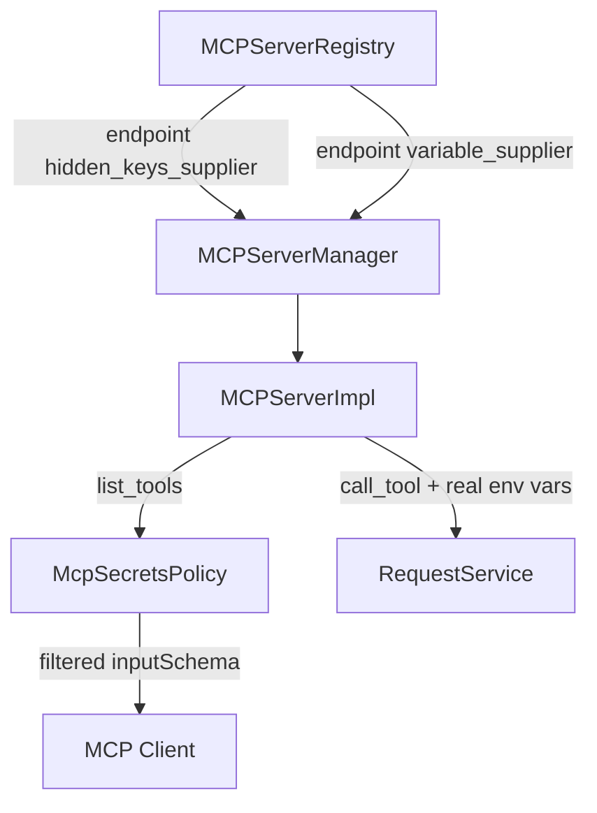

# MCP Secrets Policy (PYPOST-554)

## Overview

`McpSecretsPolicy` defines what local AI agents may see over **network MCP** versus what
PyPost uses at execution time. Hidden environment variables and other env placeholders are
**execution-only**; they must not appear in `list_tools` JSON Schema. Real values (including
hidden keys) are still merged at `call_tool` — same as GUI sends.

## Architecture

- **Policy**: `pypost.core.mcp_secrets_policy.McpSecretsPolicy`
- **Enforcement**: `MCPServerImpl._generate_schema` filters param specs before schema build
- **Hidden keys source**: `MCPServerRegistry` copies the selected environment's hidden keys
  into each endpoint's `hidden_keys_supplier`.
- **Env values source**: `MCPServerRegistry` copies the selected environment's values into
  each endpoint's `variable_supplier`.



## Policy rules

| Data | Agent-visible (`list_tools`) | Execution (`call_tool`) |
| --- | --- | --- |
| `mcp.request.*` placeholders (bare or wrapped) | Yes — tool input parameters | From agent arguments |
| Environment `{{ var }}` placeholders | No | Real values from the endpoint's selected environment |
| Hidden env keys (`Environment.hidden_keys`) | No — stripped from schema | Real values from the endpoint's selected environment |
| Explicit `mcp_params` for hidden keys | No — filtered | N/A |
| Overridable env keys (`Environment.mcp_overridable_keys`, not Hidden) | Yes — advertised as optional string schema properties when the key is also referenced by the request | Agent-supplied argument value replaces the environment value for that call only, if permitted |

## Per-variable MCP override (`mcp_overridable_keys`, PYPOST-1283)

`Environment.mcp_overridable_keys: Set[str]` (default `set()`,
`pypost/models/models.py`) marks individual environment variables an MCP
agent is allowed to override per call — for example letting an agent target a
different `jira_project_key` for one request without editing the environment.
It is opt-in per variable, per environment; nothing is overridable by
default.

**Hidden always wins.** A key present in *both* `mcp_overridable_keys` and
`hidden_keys` is never treated as overridable — Hidden is a stronger,
security-relevant guarantee (the value must never leave PyPost's control to
an agent) and always takes precedence over the override opt-in. This is
computed **fresh from the two raw sets on every call**, never trusted from
whatever was persisted to storage:

- `McpSecretsPolicy.effective_overridable_keys(mcp_overridable_keys,
  hidden_keys) -> Set[str]` returns `set(mcp_overridable_keys) -
  set(hidden_keys)` — the actual, current permission set.
- `mcp_tool_contract.validate_environment_overrides(arguments, env_vars,
  mcp_overridable_keys, hidden_keys)` recomputes `effective_overridable_keys`
  at call time and raises `McpArgumentValidationError(name, "override",
  "override_not_permitted")` for any call argument that names a known env var
  outside that effective set — enforced as a preflight check in
  `MCPServerImpl._call_tool_inner`, before execution.
- `McpSecretsPolicy.apply_permitted_overrides(env_vars, arguments,
  mcp_overridable_keys, hidden_keys)` returns a **copy** of `env_vars` with
  only the permitted overrides applied (never mutates its input), used to
  build execution variables for that one call.

Recomputing on every call (rather than trusting a cached/stored
"effective overridable" set) means a key that is somehow present in both sets
in storage — e.g. from a malformed import, or a UI/data bug — can never be
exploited to override a value that should be Hidden; the two GUI toggles for
Hidden and MCP Override are also mutually exclusive in
`EnvironmentVariablesWidget` (checking one unchecks and disables the other),
but the runtime enforcement does not rely on that UI invariant holding.

**Schema visibility**: `list_tools`/`MCPServerImpl._generate_schema`
advertise an overridable, non-hidden key as an optional string tool-input
property only when the request actually references that key (i.e. it's in
the request's discovered environment-variable names — see
`extract_environment_variable_names` below). An overridable key the request
doesn't use is not advertised, since there is nothing for the agent to
override.

**Supplier wiring**: the effective overridable-keys set for an endpoint flows
the same way hidden keys and variable values do —
`EnvVariableSnapshot.update`/`snapshot_overridable_keys` → `EnvPresenter`
(passes `selected.mcp_overridable_keys`) → `MCPServerManager`
(`set_overridable_keys_supplier`) → `MCPServerImpl` /
`MCPProxyServerImpl` → `MCPServerRegistry` (`refresh_environment`,
`_runtime_inputs`) → `LibraryRuntimeResolver` (`RuntimeInputs.overridable_keys`,
sourced from the selected `Environment.mcp_overridable_keys`; library-only
secrets have no override concept). `MCPProxyServerImpl` accepts and stores
the supplier for interface parity with `MCPServerImpl` only — the proxy
forwards calls to an upstream MCP server rather than executing a local HTTP
request, so it has no local env-var override to enforce (documented in-code;
see `ai-tasks/PYPOST-1283/60-tech-debt.md` item 1 for the forward-looking
caveat if the proxy ever gains local execution).

## API / Usage

### `McpSecretsPolicy.extract_mcp_request_variables(request)`

Discovers agent tool input names from `mcp.request.VAR` expressions—both bare
placeholders (e.g. `{{ mcp.request.VAR }}`) and function-wrapped expressions (e.g.
`{{ to_int(mcp.request.VAR) }}`)—across the request URL, body, headers, and params
(PYPOST-1052). Uses module-level `_MCP_REQUEST_VAR_PATTERN` (compiled via
`re.compile(r"mcp\.request\.([a-zA-Z0-9_]+)")` at file top — see
`mcp_secrets_policy.py`).

### `McpSecretsPolicy.extract_environment_variable_names(request, template_service)`

Parses each request template field to a Jinja AST and returns the top-level
names `jinja2.meta.find_undeclared_variables` reports as undeclared (minus
`mcp`) — i.e. the names the template expects to come from the environment.
Relies on every local `` in the template being **unconditional**
(not nested inside ``); see [Dual-Mode Example
Requests](dual_mode_example_requests.md) for why this matters and the rule to
follow when writing a template with local `` variables.

### `McpSecretsPolicy.filter_agent_param_specs(specs, request, template_service, hidden_keys)`

Returns a copy of MCP param metadata with env-only and hidden keys removed.

### `McpSecretsPolicy.execution_environment_variables(env_vars)`

Returns a shallow copy of env vars with **real** hidden values for execution.

### `McpSecretsPolicy.safe_execution_log_fields(env_var_count, hidden_key_count, mcp_arg_count)`

Returns count-only dict for DEBUG logging.

### Wiring

```python
# MCPServerRegistry._start_manager(...)
tools, variables, hidden_keys = runtime
manager.set_variable_supplier(lambda: dict(variables))
manager.set_hidden_keys_supplier(lambda: set(hidden_keys))

# MCPServerManager
def set_hidden_keys_supplier(self, supplier):
    self._impl.set_hidden_keys_supplier(supplier)
```

`EnvPresenter` supplies its active-environment cache only to the retained
compatibility single-manager adapter, never to registry-owned endpoints.

## Configuration

For registry-owned endpoints, the policy uses `Environment.hidden_keys` from the endpoint's
configured environment snapshot. It does not follow the top-bar environment selection. The
legacy single-manager path still receives its supplier from `EnvPresenter`.

## Troubleshooting

| Symptom | Likely cause | Resolution |
| --- | --- | --- |
| Agent schema missing expected param | Key matches hidden env var name | Rename env var or use `mcp.request.*` placeholder |
| Tool auth fails | Hidden var not in the endpoint environment | Define the variable in the endpoint's configured environment; execution still uses the real value |
| Schema shows env var name | Var is `mcp.request.*`, not env-only | Expected — agent supplies that argument |

## Related tests

```bash
.venv/bin/python -m pytest \
  tests/test_mcp_secrets_policy.py \
  tests/test_mcp_server_impl.py -v
```

See also `doc/dev/mcp_integration.md`, `doc/dev/hidden_variables.md`, and
[Dual-Mode Example Requests](dual_mode_example_requests.md) (the
`mcp_overridable_keys` / `` interaction in the bundled
`jira-create-issue` example).
