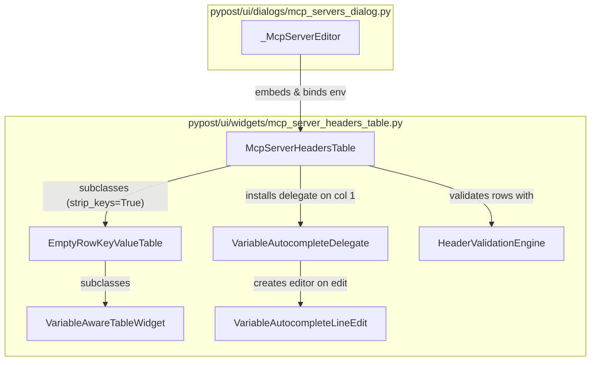

# MCP Server Custom Headers Editor (PYPOST-1104)

## Overview

When configuring Upstream Proxy Model Context Protocol (MCP) servers in PyPost, clients
and agents often require custom HTTP headers to authenticate, route, or authorize requests
sent to remote upstream endpoints (e.g. `Authorization: Bearer {{ API_KEY }}`,
`X-Workspace-ID: {{ WORKSPACE }}`).

Previously, `_McpServerEditor` used a multiline plain-text edit (`QPlainTextEdit`) where users
manually typed `Key: Value` lines. This approach led to silent formatting errors (missing
colons, stray whitespace), lacked variable discovery, provided no inline feedback for invalid
tokens or undefined variables, and diverged from tabular editors used elsewhere in PyPost.

PYPOST-1104 upgraded this component to a structured, interactive two-column table:
`McpServerHeadersTable` in `pypost/ui/widgets/mcp_server_headers_table.py`.

Key capabilities:
- **Tabular Key-Value Editing**: Two distinct columns for "Key" and "Value" with automatic
  trailing empty-row addition, row deletion via context menu, and Delete/Backspace shortcuts.
- **Inline Variable Autocomplete**: Typing `{{` in the Value column triggers a floating
  suggestion popup with environment variable candidates from the active environment.
- **RFC 7230 Key Validation**: Header names are validated against HTTP token specifications
  (RFC 7230 / RFC 9110), blocking saves if names contain spaces, colons, or invalid characters.
- **Template Syntax & Undefined Variable Warnings**: Detects unclosed braces (`{{ ...`),
  empty expressions (`{{ }}`), and missing environment variables, offering visual cues without
  blocking saves.
- **Dynamic Environment Binding**: Automatically refreshes autocomplete suggestions and
  validation hints whenever the user switches environments in the editor dialog.
- **Defense-in-Depth Secret Protection**: Integrates with `VariableAwareTableWidget` hover
  tooltips to preview resolved variable values while keeping secret/hidden values masked.

See also:
- [MCP Reverse Proxy (Developer Guide)](mcp_proxy.md) for proxy transport and header resolution.
- [Shared empty-row Key/Value table (PYPOST-1186)](empty_row_key_value_table.md) for table base.
- [Environment-to-MCP State Propagation (PYPOST-1108)](environment_mcp_signals.md).
- [Sensitive Data Masking Policy (PYPOST-446)](sensitive_data_masking_policy.md).

---

## Architecture

The headers editor is composed of modular components adhering to Qt's Model/View architecture:



### 1. `McpServerHeadersTable`

Subclasses `EmptyRowKeyValueTable` with `strip_keys=True`:
- **Columns**: Column 0 ("Key") and Column 1 ("Value"), both configured with stretch resize.
- **Trailing Empty Row**: Inherited from `EmptyRowKeyValueTable`. When editing the trailing row,
  a new empty row is appended automatically.
- **Validation State**: Maintains internal lists of `_structural_errors` and `_validation_warnings`.
- **Environment Synchronization**: `set_environment(environment)` extracts variables and
  `hidden_keys` from the selected `Environment` model, synchronizes the hover resolver, and
  triggers row re-validation.
- **Row Removal**: `remove_selected_rows()` removes selected rows (except trailing empty row)
  with signal blocking, while `clear_all_rows()` resets the table to a single blank row.
- **Shortcut & Context Menu**: Right-click displays "Delete Row" and "Clear All". Pressing
  Delete or Backspace when not in cell editing mode removes selected rows.

### 2. `VariableAutocompleteDelegate`

Subclasses `QStyledItemDelegate`:
- Intercepts editing for column 1 (Value).
- In `createEditor`, instantiates a `VariableAutocompleteLineEdit` populated with
  `table.environment_variable_names`.
- Bridges `setEditorData` and `setModelData` using `Qt.ItemDataRole.EditRole`.
- Manages geometry placement via `updateEditorGeometry`.

### 3. `VariableAutocompleteLineEdit`

Subclasses `QLineEdit`:
- Hosts an internal frameless popup: `_popup = QListWidget(self)` configured with
  `Qt.WindowType.Popup | Qt.WindowType.FramelessWindowHint` and `Qt.FocusPolicy.NoFocus`.
- Monitors `textEdited` signals to trigger autocomplete candidate matching.
- Intercepts keyboard navigation in `keyPressEvent`:
  - `Key_Down` / `Key_Up`: Navigates candidate list with modulo wrap-around.
  - `Key_Return` / `Key_Enter` / `Key_Tab`: Applies completion for the selected item.
  - `Key_Escape`: Dismisses popup without canceling cell editing.
- Dismisses popup on `focusOutEvent` and `hideEvent`.

### 4. `HeaderValidationEngine`

Namespace and standalone functions providing validation rules:
- `validate_header_key(key: str, has_value: bool) -> HeaderValidationResult | None`
- `validate_header_value(value: str, env_vars: set[str] | None) -> list[HeaderValidationResult]`
- Encapsulated by `HeaderValidationEngine.validate_key` and `validate_value`.

---

## Inline Autocomplete

The autocompletion engine allows users to insert environment variable references without
leaving the cell or consulting the Environment Manager dialog.

### Trigger Detection & Candidate Matching

Autocomplete evaluates text preceding the cursor using regex:

```python
m = re.search(r"\{\{\s*([a-zA-Z0-9_]*)$", prefix_text)
```

- When the user types `{{`, the regex matches with an empty prefix token `""`.
- All variable names from the bound environment are matched as candidates.
- If additional characters are typed (e.g. `{{ API_`), candidates are filtered with
  case-insensitive prefix matching: `[v for v in variables if v.upper().startswith(token.upper())]`.
- If no candidates match or the pattern does not match, the popup is dismissed.

### Keyboard & Mouse Interaction

| Action | Key / Event | Behavior |
| ------ | ----------- | -------- |
| Navigate candidates | `Down` / `Up` | Cycles selection through candidate list with wrap-around. |
| Accept suggestion | `Enter` / `Return` / `Tab` | Inserts selected variable placeholder into line edit. |
| Dismiss popup | `Escape` / Click outside | Hides popup; line edit remains focused in edit mode. |
| Mouse selection | Click item in popup | Calls `apply_completion` with clicked candidate name. |

### Completion Formatting

When a candidate (e.g. `API_KEY`) is applied:
- Replaces the typed trigger token with `{{ API_KEY }}`.
- If existing trailing closing braces `}}` are present directly after the cursor, they are
  consumed to prevent accidental syntax errors like `{{ API_KEY }}}}}`.
- Places the cursor immediately after the inserted closing braces, ready for further typing.

---

## Syntax Validation

The validation engine distinguishes between **blocking structural errors** and
**advisory warnings**:

```
┌─────────────────────────────────────────────────────────────┐
│                    Validation Pipeline                      │
└──────────────────────────────┬──────────────────────────────┘
                               │
               ┌───────────────┴───────────────┐
               ▼                               ▼
     [Header Key Validation]        [Header Value Validation]
               │                               │
       ┌───────┴───────┐               ┌───────┴───────┐
       ▼               ▼               ▼               ▼
  RFC 7230 Error   Key Valid    Template Syntax   Undefined Var
  (Space, Colon,                Warning (Unclosed (Warning, not
   Missing Key)                  Brace, Empty)     blocking)
       │                               │               │
       ▼                               ▼               ▼
 Structural Error              Advisory Warning Advisory Warning
 (Red #b00020,                 (Orange #e65100, (Orange #e65100,
  Blocks Save)                  Allows Save)     Allows Save)
```

### 1. Structural Errors (Blocking)

Structural errors indicate invalid HTTP protocol syntax or incomplete pairs that would fail
at runtime:
- **Empty Key with Specified Value**: A value was entered on a row, but the header key was left blank.
- **Spaces / Tabs in Key**: HTTP header field names cannot contain spaces or tabs.
- **Colons in Key**: Colons are header delimiters in HTTP/1.1 and cannot appear in field names.
- **RFC 7230 Character Violations**: Key contains characters outside token characters
  (`^[a-zA-Z0-9!#$%&'*+\-.^_`|~]+$`).

**Behavior**:
- The cell text foreground is tinted red (`#b00020`).
- A tooltip explains the exact error (e.g. `Header key 'X Key' cannot contain spaces.`).
- `table.has_structural_errors()` returns `True`.
- The parent dialog blocks saving and displays an error message.

### 2. Advisory Warnings (Non-Blocking)

Advisory warnings notify the user of potential issues without preventing configuration saves:
- **Unclosed Template Expression**: Header value contains `{{` without matching `}}`.
- **Empty Placeholder**: Header value contains `{{}}` or `{{  }}`.
- **Undefined Environment Variable**: Header references `{{ VAR }}`, but `VAR` does not exist
  in the currently selected environment.

**Behavior**:
- The cell text foreground is tinted orange (`#e65100`).
- A tooltip details the warning (e.g. `Variable 'TOKEN' is not defined in the active environment.`).
- `table.has_structural_errors()` returns `False`.
- Does **not** block dialog acceptance, allowing users to configure headers before creating
  or importing corresponding environment variables.

---

## Dialog Integration (`_McpServerEditor`)

`_McpServerEditor` in `pypost/ui/dialogs/mcp_servers_dialog.py` embeds and coordinates
`McpServerHeadersTable`:

```python
# Initialization in _McpServerEditor
self._headers_table = McpServerHeadersTable(self)
self._layout.addRow("Custom Headers:", self._headers_table)

# Environment selection change wiring
self._environment.currentIndexChanged.connect(self._on_environment_changed)
```

### Environment Synchronization

When the user changes the active environment dropdown:
1. `_on_environment_changed()` retrieves the selected environment ID from `self._environment`.
2. Resolves the `Environment` object from `self._environments_by_id`.
3. Calls `self._headers_table.set_environment(env)`.
4. The table updates candidate lists for autocompletion, resets variable hover resolvers,
   and re-runs row validation against the newly selected environment.

### Visibility Gating

In `_on_server_type_changed()`:
- When server type is `"local"`: Custom headers table and its label are hidden.
- When server type is `"proxy"`: Custom headers table and its label are shown.

### Save Gating & Serialization

In `_accept_if_complete()`:
1. Verifies required fields (host, upstream URL for proxy mode).
2. Calls `self._headers_table.has_structural_errors()`.
3. If structural errors exist:
   - Formats error message: `Custom headers error: <first_error_message>`.
   - Displays message in dialog error label (`self._error`).
   - Logs warning and halts acceptance (`return`).
4. If valid, calls `self.accept()`.

In `configuration() -> McpServerConfiguration`:
- Headers are serialized using `self._headers_table.get_data()`.
- Strips whitespace around keys and ignores blank trailing rows.

---

## Developer Guidelines & Testing Patterns

### Conventions

- **Module Import Boundaries**: `McpServerHeadersTable` must import `EmptyRowKeyValueTable`
  from `pypost.ui.widgets.empty_row_key_value_table`. It must never import HTTP request editors
  or unrelated UI modules.
- **Key Stripping**: Always initialize with `strip_keys=True` to conform with proxy header
  specifications.
- **Signal Blocking**: When modifying table row counts or bulk populating data, wrap calls
  with `self.blockSignals(True)` / `self.blockSignals(False)` to avoid recursive change events.
- **Secret Masking**: Do not log header values or variable substitutions in debug logs.
  Validation messages and logs should reference header names or variable keys only, never
  raw secret values.

### Testing Patterns

Automated tests for headers table and dialog integration reside in:
- `tests/test_mcp_server_headers_table.py`
- `tests/test_mcp_servers_dialog.py`

When writing tests for this component:
1. **Explicit Timeouts**: Qt GUI tests must declare a test-level timeout:
   ```python
   pytestmark = pytest.mark.timeout(60)
   ```
2. **Offscreen Platform**: Tests run headless using `QT_QPA_PLATFORM=offscreen`.
3. **QApp Fixture**: Use the shared `qapp` fixture to ensure `QApplication` lifecycle is managed:
   ```python
   @pytest.mark.usefixtures("qapp")
   def test_custom_headers_table():
       ...
   ```
4. **Delegate & Autocomplete Testing**: Test `VariableAutocompleteLineEdit` directly or
   via `VariableAutocompleteDelegate.createEditor` to verify trigger detection, key navigation,
   and completion insertion without relying on asynchronous OS windowing events.
5. **Roundtrip Invariants**: Verify that `set_data(d)` followed by `get_data()` produces
   an identical dictionary for valid headers.
