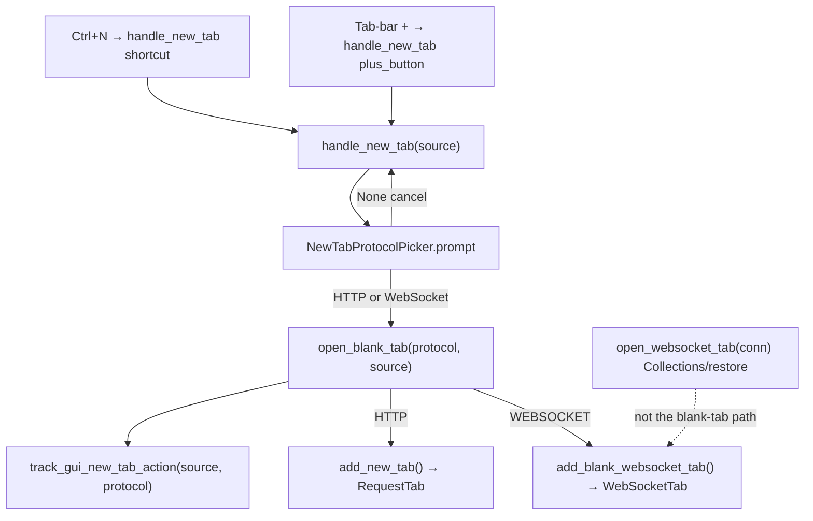

# Blank-tab protocol picker (PYPOST-1157)

## Overview

`Ctrl+N` and the tab-bar **+** show a protocol picker **before** any new
workspace editor is created. The user chooses **HTTP Request** (default) or
**WebSocket**. Confirming HTTP opens a blank `RequestTab`. Confirming
WebSocket opens a blank `WebSocketTab` via `add_blank_websocket_tab` (not
the Collections/restore path). Dismissing the menu creates no tab and
emits no new-tab metric.

This is WS-TM-1 under epic
[PYPOST-1155](https://pypost.atlassian.net/browse/PYPOST-1155). The picker
is Option A: a popup `QMenu` with **HTTP Request** first and
`setActiveAction` so Enter confirms HTTP.

User-facing copy of `Ctrl+N` / **+** in `doc/user/websocket.md`,
`doc/user/interface.md`, and `doc/user/hotkeys.md` is
[PYPOST-1163](https://pypost.atlassian.net/browse/PYPOST-1163) — do not
rewrite those pages here.

## Architecture

- **`NewTabProtocolPicker`**
  (`pypost/ui/widgets/new_tab_protocol_picker.py`):
  Option A `QMenu`. Labels **HTTP Request** then **WebSocket**.
  `prompt()` returns `TabProtocol | None`.
- **`TabProtocol`**: enum values `http` / `websocket` — the same strings
  used as metrics `protocol` labels.
- **`TabsPresenter.handle_new_tab(source)`**: logs
  `new_tab_action_triggered`, calls the injectable picker, then either
  returns (cancel) or `open_blank_tab(protocol, source)`.
- **`TabsPresenter.open_blank_tab(protocol, source)`**: single routing
  API. Records metrics, then HTTP → `add_new_tab()`, WebSocket →
  `add_blank_websocket_tab()`.
- **`RequestTabHeader`**: unchanged. **+** still emits
  `new_tab_requested` → `handle_new_tab("plus_button")`.
- **`MainWindow`**: `Ctrl+N` still calls `handle_new_tab("shortcut")`.



| Path | API | Tab kind | Metric |
| --- | --- | --- | --- |
| `Ctrl+N` / **+**, HTTP | `open_blank_tab(HTTP, source)` | Blank `RequestTab` | `source` + `protocol=http` |
| `Ctrl+N` / **+**, WebSocket | `open_blank_tab(WEBSOCKET, source)` | Blank `WebSocketTab` | `source` + `protocol=websocket` |
| `Ctrl+N` / **+**, cancel | `handle_new_tab` returns | Unchanged | None |
| Collections / restore WS | `open_websocket_tab(conn)` | Saved `WebSocketTab` | Unchanged |
| Collections **New tab** HTTP | `add_new_tab(copy)` | Isolated `RequestTab` | `collections_context` + `protocol=unknown` |
| Close last tab | `add_new_tab(save_state=False)` | HTTP blank | Unchanged (PYPOST-1159) |

`add_blank_websocket_tab` builds `WebSocketConnection()` +
`WebSocketPresenter` + `WebSocketTab` and inserts before the plus tab.
It must **not** call `open_websocket_tab` (that API dedups by saved
connection id and is the Collections/restore path).

### Out of scope

| Topic | Owner |
| --- | --- |
| Blank WebSocket draft editor, default name, session-restore exclusion | [PYPOST-1158](https://pypost.atlassian.net/browse/PYPOST-1158) |
| Close-last-tab / empty-workspace picker | [PYPOST-1159](https://pypost.atlassian.net/browse/PYPOST-1159) |
| **MCP Client** picker item / `TabProtocol.MCP_CLIENT` | [PYPOST-1165](https://pypost.atlassian.net/browse/PYPOST-1165) |
| User documentation rewrite | [PYPOST-1163](https://pypost.atlassian.net/browse/PYPOST-1163) |

WS-TM-1 WebSocket confirm is a placeholder `WebSocketTab` (FR-4.3).
Full draft-editor semantics are PYPOST-1158.

## API / Usage

### `TabProtocol`

```python
class TabProtocol(str, Enum):
    HTTP = "http"
    WEBSOCKET = "websocket"
```

### `NewTabProtocolPicker.build_menu(parent=None) -> QMenu`

Constructs the menu without showing it.

- Actions in order: **HTTP Request**, **WebSocket**. No MCP Client.
- First action is `setActiveAction` so Enter confirms HTTP.
- Widget id: `NEW_TAB_PROTOCOL_MENU` (`pypost_new_tab_protocol_menu`)
  via `set_widget_id`.
- Action `data()` is `TabProtocol.HTTP` / `TabProtocol.WEBSOCKET`.

Unit-test chrome here. Do **not** call `exec()` in CI.

### `NewTabProtocolPicker.prompt(parent=None, *, anchor=None) -> TabProtocol | None`

Shows the menu at `anchor`, or under the plus button when `parent`
contains `PLUS_TAB_BUTTON`, else `QCursor.pos()`. Passes the HTTP
action as `exec(pos, http_action)` so the default stays highlighted.

- **Returns**: chosen `TabProtocol`, or `None` if Esc / click-away /
  unmatched action.

`handle_new_tab` calls `_protocol_picker(self._tabs)` (parent only).

### `TabsPresenter.handle_new_tab(source: str = "unknown")`

Shared entry for `Ctrl+N` (`shortcut`) and **+** (`plus_button`).

1. INFO `new_tab_action_triggered source=<source> tabs_before=<count>`.
1. `protocol = self._protocol_picker(self._tabs)`.
1. If `None`: INFO `new_tab_action_cancelled source=<source>`; return
   (no tab, no metric).
1. Else `open_blank_tab(protocol, source)`.

### `TabsPresenter.open_blank_tab(protocol: TabProtocol, source: str)`

Single routing API after a completed choice.

1. INFO `new_tab_action_completed source=<source> protocol=<value>`.
1. `track_gui_new_tab_action(source, protocol=protocol.value)`.
1. `TabProtocol.WEBSOCKET` → `add_blank_websocket_tab()`.
1. Otherwise → `add_new_tab()` (HTTP blank `RequestTab`).

Later entry points (PYPOST-1159) should call this after a choice, not
duplicate factories.

### `TabsPresenter.add_blank_websocket_tab(*, save_state: bool = True) -> WebSocketTab`

Blank WebSocket workspace tab (placeholder until PYPOST-1158). Fresh
`WebSocketConnection()` (unique UUID, name `"New WebSocket"`, empty
URL). Inserts before the plus tab, same as `add_new_tab`.

### Injectable `protocol_picker`

```python
TabsPresenter(
    ...,
    protocol_picker: Callable[..., TabProtocol | None] | None = None,
)
```

Default is `NewTabProtocolPicker().prompt`. Tests pass a lambda and
**never** call live `QMenu.exec()` (it blocks the Qt event loop).

Presenter and plus-click tests inject HTTP:

```python
TabsPresenter(
    ...,
    protocol_picker=lambda *_a, **_k: TabProtocol.HTTP,
)
```

Cancel / WebSocket:

```python
protocol_picker=lambda *_a, **_k: None
protocol_picker=lambda *_a, **_k: TabProtocol.WEBSOCKET
```

Golden plus-click e2e patches after session ready (constructor is
already live):

```python
session.window.tabs._protocol_picker = (
    lambda *_a, **_k: TabProtocol.HTTP
)
```

Picker unit tests (`tests/test_new_tab_protocol_picker.py`) use
`build_menu()` only.

### `track_gui_new_tab_action(source, protocol="unknown")`

Counter `gui_new_tab_actions_total` with labels `source` and
`protocol`. Prometheus serializes labels alphabetically:

```text
gui_new_tab_actions_total{protocol="http",source="plus_button"}
```

| Label | Allowed values |
| --- | --- |
| `source` | `plus_button`, `shortcut`, `collections_context`, `unknown` |
| `protocol` | `http`, `websocket`, `unknown` |

Normalization: any other string becomes `unknown`. Picker confirm
passes `protocol.value` (`http` / `websocket`). Collections **New tab**
calls `track_gui_new_tab_action("collections_context")` and keeps the
default `protocol=unknown`. Cancel does not increment.

No payload fields (URL, headers, body) — there is no URL yet.

See [Prometheus Monitoring](../prometheus_monitoring.md) for the
operator inventory.

## Configuration

No picker-specific settings or environment variables.

Observability host/port remain global:

- `settings.metrics_host`
- `settings.metrics_port`

Widget ids (`pypost/ui/widget_ids.py`):

- `NEW_TAB_PROTOCOL_MENU` = `pypost_new_tab_protocol_menu`
- `PLUS_TAB_BUTTON` = `pypost_plus_tab_button` (anchor lookup)

## Troubleshooting

### Tests hang after `Ctrl+N` or **+**

Live `QMenu.exec()` blocks the Qt event loop. Inject `protocol_picker`
(or patch `_protocol_picker` on a live session). Never call
`prompt()` / `exec()` in CI.

### Cancel appears to be a bug (no tab)

Dismissing the menu (Esc or click away) is FR-3: no tab, no metric.
Look for INFO `new_tab_action_cancelled source=...`.

### WebSocket confirm opens an HTTP `RequestTab`

Routing must use `add_blank_websocket_tab()`, not `add_new_tab()` and
not `open_websocket_tab()`. Assert current page is `WebSocketTab`.

### Two blank WebSocket tabs collapse into one

`open_websocket_tab` dedups by `connection.id`. Blank tabs must use
`add_blank_websocket_tab` (fresh UUID each time).

### New-tab metric missing after a picker confirm

Expect both labels. Example scrape text:

```text
gui_new_tab_actions_total{protocol="http",source="shortcut"} 1
```

Cancel never increments. Collections **New tab** uses
`protocol="unknown"`, not `http`.

### Close-last-tab does not show the picker

Intentional. `close_tab` still calls `add_new_tab(save_state=False)`
when `_request_tab_count() == 0`. Picker reuse is PYPOST-1159.

### MCP Client is missing from the menu

Intentional. Menu is HTTP Request then WebSocket only. Third item is
PYPOST-1165.

### User docs still say `Ctrl+N` opens a draft HTTP tab

User Guide rewrite is PYPOST-1163. Developer docs in `doc/dev/` are
the source of truth for the picker until that story lands.

## Tests

| Test | Behavior verified |
| --- | --- |
| `tests/test_new_tab_protocol_picker.py` | Labels, order, active action, widget id; no `exec()` |
| `TestHandleNewTabProtocolPicker` in `tests/test_tabs_presenter.py` | Picker before editor; HTTP/WS confirm; cancel; metrics |
| Plus-click tests in `tests/test_tabs_presenter.py` | Inject HTTP picker so **+** does not hang |
| `test_agent_golden_plus_tab_create_when_no_blank_tab` | Patches `_protocol_picker` before `ui_click(PLUS_TAB_BUTTON)` |

Run:

```bash
make test PYTEST_ARGS="tests/test_new_tab_protocol_picker.py tests/test_tabs_presenter.py -k 'HandleNewTabProtocolPicker or plus_tab or new_tab' -v"
```
