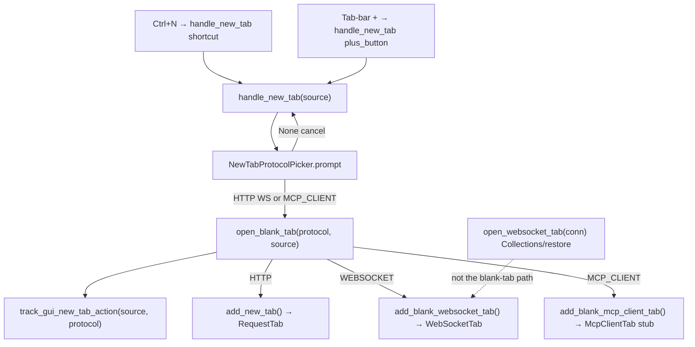

# Blank-tab protocol picker (PYPOST-1157, PYPOST-1165)

## Overview

`Ctrl+N` and the tab-bar **+** show a protocol picker **before** any new
workspace editor is created. The user chooses **HTTP Request** (default),
**WebSocket**, or **MCP Client**. Confirming HTTP opens a blank
`RequestTab`. Confirming WebSocket opens a blank `WebSocketTab` via
`add_blank_websocket_tab` (not the Collections/restore path). Confirming
**MCP Client** opens a stub `McpClientTab` via `add_blank_mcp_client_tab`
(not HTTP). Dismissing the menu creates no tab and emits no new-tab
metric.

WS-TM-1 ([PYPOST-1157](https://pypost.atlassian.net/browse/PYPOST-1157))
shipped the picker with two items. MCP-TM-1
([PYPOST-1165](https://pypost.atlassian.net/browse/PYPOST-1165)) added
the third item. The picker is Option A: a popup `QMenu` with **HTTP
Request** first and `setActiveAction` so Enter still confirms HTTP.

User-facing copy of `Ctrl+N` / **+** is
[PYPOST-1163](https://pypost.atlassian.net/browse/PYPOST-1163) (WebSocket)
and [PYPOST-1168](https://pypost.atlassian.net/browse/PYPOST-1168)
(MCP Client). Do not rewrite `doc/user/` here.

## Architecture

- **`NewTabProtocolPicker`**
  (`pypost/ui/widgets/new_tab_protocol_picker.py`):
  Option A `QMenu`. Labels **HTTP Request**, **WebSocket**, **MCP Client**.
  `prompt()` returns `TabProtocol | None`.
- **`TabProtocol`**: enum values `http` / `websocket` / `mcp_client` —
  the same strings used as metrics `protocol` labels.
- **`McpClientTab`** (`pypost/ui/widgets/mcp_client/mcp_client_tab.py`):
  stub workspace page (label `"MCP Client"`, widget id
  `MCP_CLIENT_TAB_PAGE`). Draft chrome (URL bar, Connect / Disconnect,
  tool browser) is [PYPOST-1166](https://pypost.atlassian.net/browse/PYPOST-1166).
- **`TabsPresenter.handle_new_tab(source)`**: logs
  `new_tab_action_triggered`, calls the injectable picker, then either
  returns (cancel) or `open_blank_tab(protocol, source)`.
- **`TabsPresenter.open_blank_tab(protocol, source)`**: single routing
  API. Records metrics, then HTTP → `add_new_tab()`, WebSocket →
  `add_blank_websocket_tab()`, MCP Client → `add_blank_mcp_client_tab()`.
  The MCP branch is **explicit and before** the HTTP fallback so
  `MCP_CLIENT` never falls through to `add_new_tab()`.
- **`RequestTabHeader`**: unchanged. **+** still emits
  `new_tab_requested` → `handle_new_tab("plus_button")`.
- **`MainWindow`**: `Ctrl+N` still calls `handle_new_tab("shortcut")`.



| Path | API | Tab kind | Metric |
| --- | --- | --- | --- |
| `Ctrl+N` / **+**, HTTP | `open_blank_tab(HTTP, source)` | Blank `RequestTab` | `source` + `protocol=http` |
| `Ctrl+N` / **+**, WebSocket | `open_blank_tab(WEBSOCKET, source)` | Blank `WebSocketTab` | `source` + `protocol=websocket` |
| `Ctrl+N` / **+**, MCP Client | `open_blank_tab(MCP_CLIENT, source)` | Stub `McpClientTab` | `source` + `protocol=mcp_client` |
| `Ctrl+N` / **+**, cancel | `handle_new_tab` returns | Unchanged | None |
| Collections / restore WS | `open_websocket_tab(conn)` | Saved `WebSocketTab` | Unchanged |
| Collections **New tab** HTTP | `add_new_tab(copy)` | Isolated `RequestTab` | `collections_context` + `protocol=unknown` |
| Close last tab | `add_new_tab(save_state=False)` | HTTP blank | Unchanged (PYPOST-1159) |
| HTTP method **MCP** Send | `RequestService._execute_mcp` | Existing HTTP editor | Unchanged (MCP-TM-6) |

`add_blank_websocket_tab` builds `WebSocketConnection()` +
`WebSocketPresenter` + `WebSocketTab` and inserts before the plus tab.
It must **not** call `open_websocket_tab` (that API dedups by saved
connection id and is the Collections/restore path).

`add_blank_mcp_client_tab` constructs `McpClientTab()` and inserts
before the plus tab with title `"New MCP Client"`. It must **not** call
`add_new_tab` or `open_websocket_tab`. `_request_tab_count` includes
`McpClientTab` so close-last-tab does not treat an MCP-only strip as
empty. Session restore of the stub is out of scope (PYPOST-1166).

### Out of scope

| Topic | Owner |
| --- | --- |
| Blank WebSocket draft editor, default name, session-restore exclusion | [PYPOST-1158](https://pypost.atlassian.net/browse/PYPOST-1158) |
| Close-last-tab / empty-workspace picker | [PYPOST-1159](https://pypost.atlassian.net/browse/PYPOST-1159) |
| MCP Client draft shell (URL, Connect, tools) | [PYPOST-1166](https://pypost.atlassian.net/browse/PYPOST-1166) |
| User documentation rewrite (MCP Client) | [PYPOST-1168](https://pypost.atlassian.net/browse/PYPOST-1168) |

MCP-TM-1 confirm is a **stub** `McpClientTab` (FR-4.4). Full draft-editor
chrome is PYPOST-1166.

## API / Usage

### `TabProtocol`

```python
class TabProtocol(str, Enum):
    HTTP = "http"
    WEBSOCKET = "websocket"
    MCP_CLIENT = "mcp_client"
```

### `NewTabProtocolPicker.build_menu(parent=None) -> QMenu`

Constructs the menu without showing it.

- Actions in order: **HTTP Request**, **WebSocket**, **MCP Client**.
- First action is `setActiveAction` so Enter confirms HTTP.
- Widget id: `NEW_TAB_PROTOCOL_MENU` (`pypost_new_tab_protocol_menu`)
  via `set_widget_id`.
- Action `data()` is `TabProtocol.HTTP` / `WEBSOCKET` / `MCP_CLIENT`.

Unit-test chrome here. Do **not** call `exec()` in CI.

### `NewTabProtocolPicker.prompt(parent=None, *, anchor=None) -> TabProtocol | None`

Shows the menu at `anchor`, or under the plus button when `parent`
contains `PLUS_TAB_BUTTON`, else `QCursor.pos()`. Passes the HTTP
action as `exec(pos, http_action)` so the default stays highlighted
when a third item is present.

- **Returns**: chosen `TabProtocol` (`HTTP`, `WEBSOCKET`, or
  `MCP_CLIENT`), or `None` if Esc / click-away / unmatched action.

`prompt()` maps action `data()` via `TabProtocol(data)`. Unmapped data
returns `None` (looks like cancel).

`handle_new_tab` calls `_protocol_picker(self._tabs)` (parent only).

### `TabsPresenter.handle_new_tab(source: str = "unknown")`

Shared entry for `Ctrl+N` (`shortcut`) and **+** (`plus_button`).

1. INFO `new_tab_action_triggered source=<source> tabs_before=<count>`.
1. `protocol = self._protocol_picker(self._tabs)`.
1. If `None`: INFO `new_tab_action_cancelled source=<source>`; return
   (no tab, no metric).
1. Else `open_blank_tab(protocol, source)`.

### `TabsPresenter.open_blank_tab(protocol: TabProtocol, source: str)`

Single routing API after a completed choice.

1. INFO `new_tab_action_completed source=<source> protocol=<value>`.
1. `track_gui_new_tab_action(source, protocol=protocol.value)`.
1. `TabProtocol.WEBSOCKET` → `add_blank_websocket_tab()`.
1. `TabProtocol.MCP_CLIENT` → `add_blank_mcp_client_tab()`.
1. Otherwise → `add_new_tab()` (HTTP blank `RequestTab`).

HTTP remains the final fallback for `TabProtocol.HTTP` only. Do not
treat every non-WebSocket confirm as HTTP.

Later entry points (PYPOST-1159) should call this after a choice, not
duplicate factories.

### `TabsPresenter.add_blank_websocket_tab(*, save_state: bool = True) -> WebSocketTab`

Blank WebSocket workspace tab. Fresh `WebSocketConnection()` (unique
UUID, name `"New WebSocket"`, empty URL). Inserts before the plus tab,
same as `add_new_tab`.

### `TabsPresenter.add_blank_mcp_client_tab(*, save_state: bool = True) -> McpClientTab`

Blank MCP Client workspace tab (stub until PYPOST-1166). Fresh
`McpClientTab()` — no presenter, no `McpClientConnection`, no MCP SDK.
Inserts before the plus tab with title `"New MCP Client"`.

### `McpClientTab`

```python
class McpClientTab(QWidget):
    """Blank MCP Client workspace page (placeholder until PYPOST-1166)."""

    def __init__(self, parent: QWidget | None = None) -> None: ...
```

Re-exported from `pypost.ui.widgets.mcp_client`. Page widget id:
`MCP_CLIENT_TAB_PAGE` (`pypost_mcp_client_tab_page`).

### Injectable `protocol_picker`

```python
TabsPresenter(
    ...,
    protocol_picker: Callable[..., TabProtocol | None] | None = None,
)
```

Default is `NewTabProtocolPicker().prompt`. Tests pass a lambda and
**never** call live `QMenu.exec()` (it blocks the Qt event loop).

Presenter and plus-click tests inject HTTP:

```python
TabsPresenter(
    ...,
    protocol_picker=lambda *_a, **_k: TabProtocol.HTTP,
)
```

Cancel / WebSocket / MCP Client:

```python
protocol_picker=lambda *_a, **_k: None
protocol_picker=lambda *_a, **_k: TabProtocol.WEBSOCKET
protocol_picker=lambda *_a, **_k: TabProtocol.MCP_CLIENT
```

Golden plus-click e2e patches after session ready (constructor is
already live):

```python
session.window.tabs._protocol_picker = (
    lambda *_a, **_k: TabProtocol.HTTP
)
```

Picker unit tests (`tests/test_new_tab_protocol_picker.py`) use
`build_menu()` only.

### `track_gui_new_tab_action(source, protocol="unknown")`

Counter `gui_new_tab_actions_total` with labels `source` and
`protocol`. Prometheus serializes labels alphabetically:

```text
gui_new_tab_actions_total{protocol="http",source="plus_button"}
gui_new_tab_actions_total{protocol="mcp_client",source="shortcut"}
```

| Label | Allowed values |
| --- | --- |
| `source` | `plus_button`, `shortcut`, `collections_context`, `unknown` |
| `protocol` | `http`, `websocket`, `mcp_client`, `unknown` |

Normalization: any other string becomes `unknown`. Picker confirm
passes `protocol.value` (`http` / `websocket` / `mcp_client`). Without
`mcp_client` on `_NEW_TAB_PROTOCOLS`, that label would collapse to
`unknown`. Collections **New tab** calls
`track_gui_new_tab_action("collections_context")` and keeps the
default `protocol=unknown`. Cancel does not increment.

No payload fields (URL, headers, body) — there is no URL yet. Outbound
MCP operation counters (`connect` / `list_tools` / `call_tool`) are
not part of this picker story.

See [Prometheus Monitoring](../prometheus_monitoring.md) for the
operator inventory.

## Configuration

No picker-specific settings or environment variables.

Observability host/port remain global:

- `settings.metrics_host`
- `settings.metrics_port`

Widget ids (`pypost/ui/widget_ids.py`):

- `NEW_TAB_PROTOCOL_MENU` = `pypost_new_tab_protocol_menu`
- `PLUS_TAB_BUTTON` = `pypost_plus_tab_button` (anchor lookup)
- `MCP_CLIENT_TAB_PAGE` = `pypost_mcp_client_tab_page` (stub page)

## Troubleshooting

### Tests hang after `Ctrl+N` or **+**

Live `QMenu.exec()` blocks the Qt event loop. Inject `protocol_picker`
(or patch `_protocol_picker` on a live session). Never call
`prompt()` / `exec()` in CI.

### Cancel appears to be a bug (no tab)

Dismissing the menu (Esc or click away) is FR-3: no tab, no metric.
Look for INFO `new_tab_action_cancelled source=...`.

### WebSocket confirm opens an HTTP `RequestTab`

Routing must use `add_blank_websocket_tab()`, not `add_new_tab()` and
not `open_websocket_tab()`. Assert current page is `WebSocketTab`.

### MCP Client confirm opens an HTTP `RequestTab`

Routing must use the explicit `TabProtocol.MCP_CLIENT` branch →
`add_blank_mcp_client_tab()`, **before** the HTTP `add_new_tab()`
fallback. Assert current page is `McpClientTab`, not `RequestTab` or
`WebSocketTab`. Also confirm `prompt()` maps the third action; unmapped
data returns `None` (looks like cancel).

### Two blank WebSocket tabs collapse into one

`open_websocket_tab` dedups by `connection.id`. Blank tabs must use
`add_blank_websocket_tab` (fresh UUID each time).

### New-tab metric missing after a picker confirm

Expect both labels. Example scrape text:

```text
gui_new_tab_actions_total{protocol="http",source="shortcut"} 1
gui_new_tab_actions_total{protocol="mcp_client",source="plus_button"} 1
```

Cancel never increments. Collections **New tab** uses
`protocol="unknown"`, not `http`. If MCP Client confirm scrapes as
`protocol="unknown"`, `_NEW_TAB_PROTOCOLS` is missing `mcp_client`.

### Close-last-tab does not show the picker

Intentional. `close_tab` still calls `add_new_tab(save_state=False)`
when `_request_tab_count() == 0`. Picker reuse is PYPOST-1159. The MCP
stub **is** counted so an MCP-only strip is not treated as empty.

### MCP Client tab has no URL bar / Connect

Intentional. PYPOST-1165 ships choice + identity + metrics. Chrome is
PYPOST-1166.

### User docs still omit **MCP Client**

User Guide rewrite is PYPOST-1168. Developer docs in `doc/dev/` are
the source of truth for the three-item picker until that story lands.

## Tests

| Test | Behavior verified |
| --- | --- |
| `tests/test_new_tab_protocol_picker.py` | Three labels, HTTP first + active, third is MCP Client; `prompt()` maps `MCP_CLIENT`; no live `exec()` |
| `TestHandleNewTabProtocolPicker` in `tests/test_tabs_presenter.py` | Picker before editor; HTTP/WS/MCP confirm; MCP ≠ HTTP; cancel; metrics `protocol=mcp_client` |
| Plus-click tests in `tests/test_tabs_presenter.py` | Inject HTTP picker so **+** does not hang |
| `test_track_gui_new_tab_action_records_mcp_client_protocol` | Prometheus + OTel allow-list records `mcp_client`, not `unknown` |
| `test_agent_golden_plus_tab_create_when_no_blank_tab` | Patches `_protocol_picker` before `ui_click(PLUS_TAB_BUTTON)` |

Run:

```bash
make test PYTEST_ARGS="tests/test_new_tab_protocol_picker.py tests/test_tabs_presenter.py tests/test_metrics_manager.py tests/test_metrics_otel.py -k 'HandleNewTabProtocolPicker or plus_tab or new_tab or mcp_client' -v"
```
