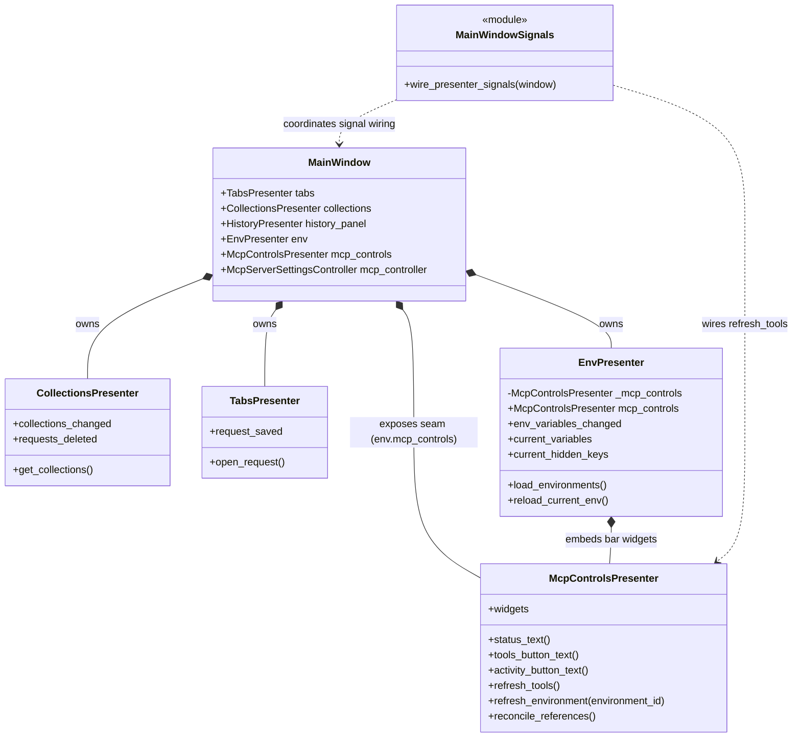
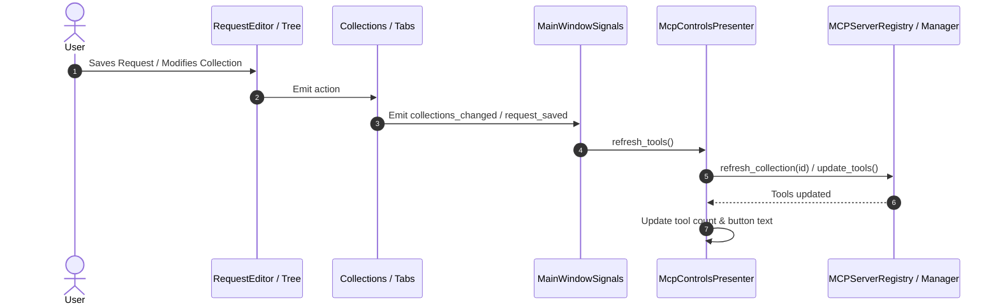

# Presenter Architecture and Interaction Model

## Overview

PyPost structures its desktop user interface (`pypost/ui/`) using the **Model-View-Presenter (MVP)** architectural pattern. In this architecture:
- **Views / Widgets** (`pypost/ui/widgets/`, `pypost/ui/dialogs/`) are responsible solely for layout, rendering, and capturing primitive user interactions (button clicks, text edits, selection changes). Views remain decoupled from business entities, asynchronous storage, and core services.
- **Presenters** (`pypost/ui/presenters/`) manage presentation logic, state synchronization, validation, event dispatching, and asynchronous task execution.
- **Core / Domain Models** (`pypost/core/`) encapsulate the business domain (collections, environments, HTTP transport, MCP protocols, cryptography, metrics).

This document details the presenter ecosystem, the separation of responsibilities between [`EnvPresenter`](file:///home/src/pypost/ui/presenters/env_presenter.py) and [`McpControlsPresenter`](file:///home/src/pypost/ui/presenters/mcp_controls_presenter.py), the retirement of legacy delegating shims ([PYPOST-1082](https://pypost.atlassian.net/browse/PYPOST-1082)), and the cross-presenter signal routing model.

---

## Presenter Architecture

### Presenter Ecosystem

The top-level [`MainWindow`](file:///home/src/pypost/ui/main_window.py) acts as the composition root for the UI layer. Rather than implementing orchestration logic directly, `MainWindow` instantiates dedicated domain presenters and establishes cross-domain signal wiring via [`main_window_signals.py`](file:///home/src/pypost/ui/main_window_signals.py).



### Core Presenter Catalog

| Presenter | File | Primary Responsibility |
|---|---|---|
| [`CollectionsPresenter`](file:///home/src/pypost/ui/presenters/collections_presenter.py) | `pypost/ui/presenters/collections_presenter.py` | Collection tree navigation, drag-and-drop hierarchy, import/export dialogs, item renaming, and deletion. |
| [`TabsPresenter`](file:///home/src/pypost/ui/presenters/tabs_presenter.py) | `pypost/ui/presenters/tabs_presenter.py` | Request, WebSocket, and stub MCP Client (`McpClientTab`) tab lifecycle (open, close, dirty state, save, `_request_tab_count`); blank-tab protocol picker (`handle_new_tab` → `open_blank_tab`); request execution delegation to worker threads. See [new_tab_protocol_picker.md](new_tab_protocol_picker.md). |
| [`HistoryPresenter`](file:///home/src/pypost/ui/presenters/history_presenter.py) | `pypost/ui/presenters/history_presenter.py` | Request execution history panel, search, filtering, and execution recall. |
| [`EnvPresenter`](file:///home/src/pypost/ui/presenters/env_presenter.py) | `pypost/ui/presenters/env_presenter.py` | Environment selection, loading/saving environments (sync and async encrypted gateway), variable snapshots, and new-variable flow validation. |
| [`McpControlsPresenter`](file:///home/src/pypost/ui/presenters/mcp_controls_presenter.py) | `pypost/ui/presenters/mcp_controls_presenter.py` | MCP UI status controls, tools overview dialog, activity log viewer, MCP Servers management dialog, and scoped tool list refreshes. |

---

## Domain Separation: `EnvPresenter` vs `McpControlsPresenter`

Originally, MCP status and controls were embedded directly inside `EnvPresenter` because MCP servers were tied 1:1 with an active environment. With the introduction of multi-server registry management (PYPOST-1044) and presenter modularization (PYPOST-1071), MCP presentation was separated into `McpControlsPresenter`.

### Responsibilities Matrix

```text
+-----------------------------------------------------------------------------------+
|                                   MainWindow                                      |
+-----------------------------------------------------------------------------------+
       |                                                    |
       v                                                    v
+------------------------------------+   +------------------------------------------+
|            EnvPresenter            |   |           McpControlsPresenter           |
|------------------------------------|   |------------------------------------------|
| * Environment dropdown selection   |   | * MCP status label (running/failed)      |
| * Environment loading & saving     |   | * MCP Tools overview button & dialog     |
| * Variable snapshots & propagation |   | * MCP Activity log button & dialog       |
| * Variable validation in new-flow  |   | * MCP Servers management button & dialog |
| * Encrypted storage gateway coord. |   | * Scoped tool refresh on collection edits|
| * Layout container for top-bar     |   | * Environment reference reconciliation   |
+------------------------------------+   +------------------------------------------+
```

### Retired Delegating Shims (PYPOST-1082)

In PYPOST-1071, four delegating shim methods were temporarily retained on `EnvPresenter` to maintain compatibility with legacy signal connections and tests:
1. `EnvPresenter.refresh_mcp_tools()`
2. `EnvPresenter.mcp_status_text()`
3. `EnvPresenter.mcp_tools_button_text()`
4. `EnvPresenter.mcp_activity_button_text()`

In **PYPOST-1082**, these shims were permanently retired:
- **Direct Accessor**: `EnvPresenter` exposes a public property `mcp_controls -> McpControlsPresenter`, making the contained presenter explicit without exposing fake facade methods.
- **Top-Level Seam**: `MainWindow` exposes `self.mcp_controls = self.env.mcp_controls`, providing a first-class presenter seam on the main window.
- **Class Docstring**: `EnvPresenter` docstring was updated to strictly reflect environment management (`"""Owns the environment selector: loading envs, propagating vars, and environment selection."""`).

---

## Signal Routing and Interaction Model

Cross-presenter interactions in PyPost follow a decoupled mediator pattern implemented in [`pypost/ui/main_window_signals.py`](file:///home/src/pypost/ui/main_window_signals.py). Presenters do not hold direct references to sibling presenters; instead, signals emitted by one presenter are connected to slot methods on another.

### MCP Tool List Refresh Flow

When collections or requests are modified (e.g. adding requests, renaming collections, deleting requests, or saving changes in tabs), the exposed MCP tool catalog must be updated.



### Signal Wiring Configuration (`main_window_signals.py`)

```python
def wire_presenter_signals(window: MainWindow) -> None:
    """Connect cross-presenter signals for MainWindow orchestration."""
    # CollectionsPresenter -> McpControlsPresenter (tool catalog sync)
    window.collections.collections_changed.connect(window.mcp_controls.refresh_tools)
    window.collections.requests_deleted.connect(window.mcp_controls.refresh_tools)

    # TabsPresenter -> McpControlsPresenter (saved request sync)
    window.tabs.request_saved.connect(window.mcp_controls.refresh_tools)

    # ResponseView / New-variable flow -> EnvPresenter
    window.tabs.request_variable_set_requested.connect(
        window.env.handle_variable_set_request
    )

    # EnvPresenter -> Tabs / RequestEditor (variable propagation)
    window.env.env_variables_changed.connect(window.tabs.on_env_variables_changed)
```

---

## API Reference

### `EnvPresenter` (`pypost/ui/presenters/env_presenter.py`)

```python
class EnvPresenter(QObject):
    """Owns the environment selector: loading envs, propagating vars, and environment selection."""

    # Public signals
    env_variables_changed = Signal(dict)
    env_hidden_keys_changed = Signal(list)

    @property
    def mcp_controls(self) -> McpControlsPresenter:
        """Expose the embedded MCP controls presenter."""
        return self._mcp_controls

    @property
    def widget(self) -> QWidget:
        """Top-bar container widget hosting the combo box, Manage button, and MCP widgets."""
        return self._container

    @property
    def current_variables(self) -> dict[str, str]:
        """Currently active resolved environment variables."""

    @property
    def current_hidden_keys(self) -> list[str]:
        """Currently active hidden/masked variable keys."""

    def load_environments(self) -> None:
        """Trigger asynchronous or synchronous loading of stored environments."""

    def reload_current_env(self) -> None:
        """Reload the currently selected environment from storage."""

    def handle_variable_set_request(self, key: str, value: str) -> None:
        """Handle request from response panel to add or update a variable in active environment."""

    def set_mcp_server_controller(self, controller: McpServerController) -> None:
        """Forward server lifecycle controller to McpControlsPresenter."""
```

### `McpControlsPresenter` (`pypost/ui/presenters/mcp_controls_presenter.py`)

```python
class McpControlsPresenter(QObject):
    """Owns MCP controls, status display, and MCP dialogs."""

    @property
    def widgets(self) -> list[QWidget]:
        """Widgets to insert into top-bar in display order: [tools_btn, activity_btn, servers_btn, status_lbl]."""

    def status_text(self) -> str:
        """Return the current text of the MCP status label."""

    def tools_button_text(self) -> str:
        """Return the current text of the MCP tools button."""

    def activity_button_text(self) -> str:
        """Return the current text of the MCP activity button."""

    def refresh_tools(self) -> None:
        """Re-scan collections and update registered MCP tools across all active endpoints."""

    def refresh_environment(self, environment_id: str) -> None:
        """Push updated environment variables to any server using this environment."""

    def reconcile_references(self) -> None:
        """Mark or stop servers referencing deleted collections or environments."""

    def set_server_controller(self, controller: McpServerController) -> None:
        """Attach the multi-server settings and lifecycle controller."""
```

---

## Testing Guidelines

When writing automated tests for UI presenters:

1. **Target the Appropriate Presenter Directly**:
   - For environment selection and variable assertions: interact with `window.env` or `env_presenter`.
   - For MCP controls, status strings, tool button text, and tool refreshes: interact with `window.mcp_controls` or `env_presenter.mcp_controls`.
2. **Avoid Private Attribute Reach-Throughs**:
   - Do **not** access `p._mcp_controls` or `p._storage_gateway` in integration tests. Use the public `p.mcp_controls` property and public presenter methods.
3. **Verify Signal Wiring**:
   - Test signal connections using mock spy objects on `window.mcp_controls.refresh_tools` to verify that triggering collection changes or request saves dispatches correctly.

---

## Troubleshooting

| Symptom | Cause | Solution |
|---|---|---|
| `AttributeError: 'EnvPresenter' object has no attribute 'refresh_mcp_tools'` | Caller using retired legacy shim removed in PYPOST-1082. | Update call site to use `env_presenter.mcp_controls.refresh_tools()` or `window.mcp_controls.refresh_tools()`. |
| `AttributeError: 'EnvPresenter' object has no attribute 'mcp_status_text'` | Test or caller using retired shim. | Update call site to use `env_presenter.mcp_controls.status_text()`. |
| MCP tools not updating after collection edits in UI | Signal routing in `main_window_signals.py` disconnected or uninitialized. | Ensure `wire_presenter_signals(window)` is called after both `window.collections` and `window.mcp_controls` are instantiated. |
| MCP Servers dialog shows no rows or does nothing | `McpServerSettingsController` was not set on presenter. | Verify that `window.env.set_mcp_server_controller(...)` was invoked during `MainWindow` initialization. |
