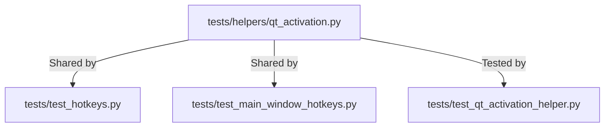

# Qt Window Activation Test Helper (PYPOST-1292)

## Overview

GUI shortcut and hotkey tests often require a real, active window in Qt to simulate authentic
keyboard events using `QTest.keyClick`. In offscreen or headless environments (e.g. CI or non-GUI
test workers), window activation can be unavailable or unreliable depending on the QPA platform.

The `tests.helpers.qt_activation` module centralizes window activation, standard skip handling,
and key simulation into a shared test utility, eliminating duplicated activation boilerplate across
hotkey test modules.

## Architecture

| Component | Location | Role |
| --- | --- | --- |
| `qt_activation.py` | `tests/helpers/qt_activation.py` | Standalone helper functions and context manager |
| `ACTIVATION_SKIP` | `tests/helpers/qt_activation.py` | Standardized skip message for unsupported QPA platforms |
| Unit verification | `tests/test_qt_activation_helper.py` | Regression tests verifying helper behavior |



## API / Usage

### `ACTIVATION_SKIP`

```python
ACTIVATION_SKIP: str = "window activation unavailable on this QPA platform"
```

The standardized message used when `QTest.qWaitForWindowActive` times out on headless platforms.

### `activate_window(window, focus_target=None, timeout_ms=2000)`

Shows and activates `window`. If `qWaitForWindowActive` fails within `timeout_ms`, the test is
skipped with `ACTIVATION_SKIP`. If `focus_target` is provided, sets focus on it and processes
events.

```python
from tests.helpers.qt_activation import activate_window

activate_window(main_window, focus_target=input_widget, timeout_ms=2000)
```

### `click_key(target, key, modifier=NoModifier)`

Sends a simulated key click to `target` via `QTest.keyClick` and flushes pending Qt events.

```python
from PySide6.QtCore import Qt
from tests.helpers.qt_activation import click_key

click_key(input_widget, Qt.Key.Key_F5)
click_key(input_widget, Qt.Key.Key_Return, Qt.KeyboardModifier.ControlModifier)
```

### `ActivatedWindow(timeout_ms=2000)`

Context manager that creates a bare `QWidget` with a child `QLineEdit`, automatically managing
showing, activating, and clean teardown on exit.

```python
from PySide6.QtCore import Qt
from tests.helpers.qt_activation import ActivatedWindow

with ActivatedWindow() as harness:
    harness.activate()
    harness.click(Qt.Key.Key_F5)
    assert harness.line_edit.hasFocus()
```

## Troubleshooting

- **Test skipped with `window activation unavailable on this QPA platform`**:
  This is expected on headless CI environments running without a window manager where the QPA
  platform cannot transition windows to the active state.
- **Import errors in tests**:
  Remember to place imports from `tests.helpers.qt_activation` at the top of test files before
  `pytestmark = pytest.mark.timeout(...)` to satisfy the E402 regression guard in
  `tests/test_lint_pytestmark_e402.py`.
