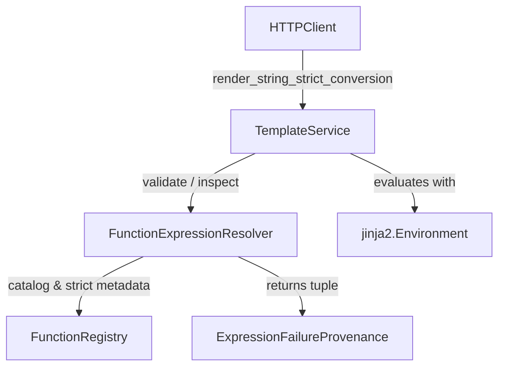

# Template Failure Provenance and Strict Conversion (PYPOST-1120)

## Overview

In PYPOST-1037, strict conversion semantics were introduced for `to_int(value)` to ensure that
HTTP request preparation fails closed with `IntegerConversionError` (`ExecutionError(TEMPLATE)`)
instead of silently sending malformed or unconverted literal template placeholders to external
APIs or MCP servers.

However, the initial implementation in `TemplateService` identified failed conversions using
lexical regular expression heuristics (`_DIRECT_TO_INT_CALL_RE` and `_STARTED_TO_INT_CALL_RE`).
This introduced tight coupling between the renderer and specific expression patterns:

- Nested strict conversion expressions (such as `{{ md5(to_int(val)) }}`) were missed by
  `_DIRECT_TO_INT_CALL_RE` because `to_int` was not the outermost function call. In templates
  with mixed expressions, this could incorrectly allow malformed integers to fall back to
  literal strings instead of failing closed.
- Any future strict conversion functions (such as `to_float` or `to_bool`) would require
  extending regex patterns in `TemplateService`.
- Whitespace variations or grammar evolutions required parallel maintenance in both
  `FunctionExpressionResolver` and `TemplateService`.

**PYPOST-1120** decouples HTTP template rendering from regex heuristics by introducing structured
failed-function provenance in `FunctionExpressionResolver`. `TemplateService` delegates all
strict conversion failure identification to the resolver, eliminating renderer regex attributes
while preserving safe literal fallback for benign errors.

---

## Architecture & Data Model

The following diagram illustrates the interaction between the components:



### `ExpressionFailureProvenance`

Defined in `pypost/core/template_expression_types.py`, this frozen dataclass encapsulates
diagnostic details for an invalid or failing expression:

```python
@dataclass(frozen=True)
class ExpressionFailureProvenance:
    code: str
    expression: str
    function_name: str | None = None
    is_strict_conversion: bool = False
    span: tuple[int, int] | None = None
```

- **`code`**: Machine-readable failure classification (e.g. `"unknown_function"`,
  `"invalid_syntax"`, `"invalid_arity"`, `"invalid_argument"`, `"conversion_error"`).
- **`expression`**: The inner expression text (e.g. `"to_int(bad)"` or `"md5(to_int(val))"`).
- **`function_name`**: The specific function associated with the failure, or `None` if syntax
  failed before an identifier was resolved.
- **`is_strict_conversion`**: `True` if the failure involves a function registered for strict
  conversion (e.g. `to_int`), whether called directly or nested.
- **`span`**: Optional `(start, end)` character offsets within the template string.
- **`is_strict`**: Backward-compatibility property alias returning `self.is_strict_conversion`.

### Enriched `ValidationResult`

`ValidationResult` in `pypost/core/template_expression_types.py` was extended to carry
structured failure provenance while remaining 100% backward compatible:

```python
@dataclass(frozen=True)
class ValidationResult:
    is_valid: bool
    code: str | None = None
    function_name: str | None = None
    expression: str | None = None
    failures: tuple[ExpressionFailureProvenance, ...] = ()

    @property
    def has_strict_failure(self) -> bool:
        """True if any recorded failure involves a strict conversion function."""
        return any(f.is_strict_conversion for f in self.failures)
```

Factory method `ValidationResult.error` accepts the optional `failures` tuple:

```python
ValidationResult.error(
    code: str,
    function_name: str | None = None,
    expression: str | None = None,
    failures: tuple[ExpressionFailureProvenance, ...] = (),
) -> ValidationResult
```

Existing callers inspecting scalar properties (`result.is_valid`, `result.code`,
`result.function_name`) continue to operate without modification.

---

## Function Registry Metadata

`FunctionRegistry` (`pypost/core/function_registry.py`) is the single source of truth for
template function classification:

- **`_strict_functions`**: Immutable `frozenset[str]` containing catalog functions that mandate
  fail-closed strict conversion (currently `frozenset({"to_int"})`).
- **`is_strict_conversion(function_name: str) -> bool`**: Returns `True` if the function name
  belongs to the strict conversion set.

Adding a new strict function requires only declaring it in `FunctionRegistry._strict_functions`;
no regexes or renderer logic need to be modified.

---

## Authoritative Resolver Inspection

`FunctionExpressionResolver` (`pypost/core/function_expression_resolver.py`) owns the template
expression grammar and AST traversal. It provides authoritative inspection methods:

### `inspect_failure_provenance(content, expressions=None)`

Analyzes raw template content and returns a `tuple[ExpressionFailureProvenance, ...]`.
(Aliased as `inspect_content_failures` for compatibility).

Key capabilities:

1. **Multi-Expression Templates**: Unlike standard validation which terminates at the first error,
   `inspect_failure_provenance` scans every placeholder in the template. If a template contains
   both an unknown function and a malformed `to_int` call (e.g.
   `{{not_allowed(x)}}/{{to_int(42, 99)}}`), provenance records are generated for both.
2. **Nested Expression Inspection**: Uses `contains_strict_function(expression)` and
   `extract_function_names(expression)` to traverse the AST. An expression like
   `{{ md5(to_int(val)) }}` accurately identifies `to_int` as a strict conversion failure even
   though `md5` is the outer wrapper.
3. **Unclosed Placeholder Detection**: Scans for unclosed delimiters (`{{...` without matching
   `}}`). It extracts the partial expression and identifier, matching it against
   `is_strict_conversion` and recording an `invalid_syntax` failure with character span.

### `has_strict_conversion_failure(content, variables=None, exc=None)`

Convenience helper returning `True` if an exception is an `IntegerConversionError` or if
`inspect_failure_provenance` discovers any strict conversion failures in the content.

---

## Renderer Integration

`TemplateService` (`pypost/core/template_service.py`) coordinates rendering and error
propagation:

### Elimination of Regex Attributes

The following regular expression attributes were removed:
- `_DIRECT_TO_INT_CALL_RE` (removed)
- `_STARTED_TO_INT_CALL_RE` (removed)

### Structured Strict Failure Handling

During `render_string(..., strict_conversion=True)` (invoked via
`render_string_strict_conversion`), when a rendering exception occurs, `TemplateService` invokes
`_contains_failed_to_int_call(content, exc, variables)`:

1. **Direct Exception Check**: If `exc` is already an `IntegerConversionError`, returns `True`.
2. **Provenance Check**: Queries `resolver.inspect_failure_provenance(content)`. If any
   provenance entry has `is_strict_conversion=True`, returns `True`.
3. **Dynamic Evaluation Check**: For each completed placeholder containing a strict function,
   validates and executes the placeholder in isolation against `variables`. If evaluation
   raises `IntegerConversionError`, returns `True`.
4. **Safe Fallback**: If no strict conversion failed, returns `False`, allowing benign errors
   (e.g., ordinary syntax errors or unknown non-strict functions) to fall back safely to literal
   template text without failing the request.

`_is_failed_to_int_expression` remains available as a backward-compatibility wrapper pointing to
`_contains_failed_to_int_call`.

---

## Observability & Security

### Structured Logging Events

Structured logging traces failure provenance across the resolver and renderer without
cluttering operational logs:

- **`FunctionExpressionResolver`**:
  - `strict_conversion_failure_provenance_detected` (`DEBUG`): Emitted when failure provenance
    for a strict function is identified (`function_name`, `code`, `span`).
  - `strict_conversion_failure_detected` (`DEBUG`): Emitted by `has_strict_conversion_failure`
    (`source`, `function_name`, `code`).
- **`TemplateService`**:
  - `strict_conversion_failure_identified` (`DEBUG`): Emitted when a strict failure is detected
    (`source`, `function_name`, `code`, `error_type`).
  - `strict_conversion_failure_propagated` (`INFO`): Emitted when failing closed and propagating
    as `IntegerConversionError` (`render_path`, `error_type`).

### Security & Secret Masking Invariants

- **No Secret Leaks**: Diagnostic provenance and logging statements never log variable values,
  resolved secrets, or payload bodies.
- **Bounded Metadata**: Only standard metadata (function names, error codes, integer spans,
  render paths) are emitted.
- **Fail-Closed**: Any failure in a strict conversion function guarantees the HTTP request will
  not be dispatched to external networks with unconverted placeholders.

---

## Developer Guidelines & Testing Patterns

### Adding New Strict Conversion Functions

To designate an expression function as requiring strict conversion semantics:

1. Register the function in `pypost/core/function_registry.py`.
2. Add the function name to `self._strict_functions` in `FunctionRegistry.__init__`.
3. Do **not** modify `TemplateService` or add regex patterns. The resolver automatically inherits
   the strict classification.

### Testing Requirements

When authoring tests for template failure provenance:

1. **Explicit Timeout**: Every test file must declare a bounded timeout:
   ```python
   pytestmark = pytest.mark.timeout(60)
   ```
2. **Repro Suite Verification**: Use `tests/test_template_service_strict_provenance.py` as the
   reference pattern for testing provenance contracts, unclosed placeholders, nested calls,
   and secret masking invariants.
3. **Quality Gate**: Validate all changes via the repository Makefile targets:
   ```bash
   make lint
   make test
   make verify-ai-tasks
   ```
