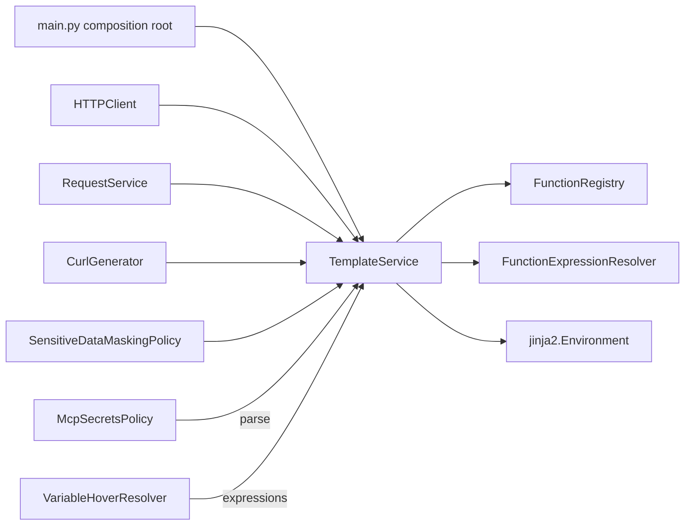

# TemplateService — central variable substitution

## Overview

`TemplateService` (`pypost/core/template_service.py`) is the **single runtime entry point** for
`{{...}}` placeholder substitution in PyPost. It replaced the removed `TemplateEngine` module
(PYPOST-18). PYPOST-134 verified that no duplicate Jinja2 render paths exist outside this
service.

Use `TemplateService` for:

- Rendering request URL, headers, params, and body before HTTP/MCP execution
- Generating copy-as-cURL strings with resolved values
- Masking sensitive values in history via re-render
- Parsing templates into AST for MCP secrets policy
- Hover preview of **function expressions** (`render_path="hover"`)

## Architecture



### Related modules

| Module | Role |
| --- | --- |
| `function_registry.py` | Allow-listed callable names (`urlencode`, `md5`, `base64`) |
| `function_expression_resolver.py` | Validates `{{func(...)}}` and safe dotted paths before render (PYPOST-1033) |
| `template_expression_tokenizer.py` | Shared `{{...}}` token patterns |
| `template_service_render.py` | Private render stages, metrics, and logging helpers (PYPOST-700) |

See also [template_expression_functions.md](template_expression_functions.md) for function
expression policy and test matrix.

## Consumer matrix

| Consumer | File | Method | Notes |
| --- | --- | --- | --- |
| HTTP transport | `http_client.py` | `render_string` | URL, header/param keys and values, body |
| Request orchestration | `request_service.py` | `render_string` | MCP/history URL and body |
| Copy as cURL | `curl_generator.py` | `render_string` | Injected service from caller |
| History masking | `sensitive_data_masking_policy.py` | `render_string` | Masked and raw render paths |
| MCP secrets | `mcp_secrets_policy.py` | `parse` | AST variable discovery |
| Hover tooltips | `ui/widgets/mixins.py` | `render_string(..., render_path="hover")` | Function expressions only |

### Injection

The **autonomous-default pattern** is documented on the `TemplateService` class itself
(`pypost/core/template_service.py`) — read that docstring first for when consumers create
their own instance vs. receive an injected one.

`main.py` constructs one `TemplateService(metrics=metrics_manager)` and passes it through
`MainWindow` → `TabsPresenter` → `RequestService` / `HTTPClient` / MCP stack. Components
accept `template_service: TemplateService | None = None` and fall back to a local instance when
omitted (see [testability.md](testability.md)).

## Lifecycle and test seams (PYPOST-143)

PYPOST-18 originally used a module-level `template_service = TemplateService()` singleton.
That global was **removed** in PYPOST-45. The accepted pattern today:

| Context | Pattern | Notes |
| --- | --- | --- |
| Production | One instance in `main.py` | Shared Jinja2 `Environment`; metrics wired at root |
| Core unit tests | Constructor injection | Pass `TemplateService()` or `MagicMock()` |
| Isolated leaf tests | Optional fallback | `HTTPClient()` creates a local instance when omitted |
| Hover UI | Module `_hover_template_service` | Exception — see below |

### Production chain

```
main.py → MainWindow → MCPServerManager / TabsPresenter
         → RequestService → HTTPClient   (same id() throughout)
```

Enable `DEBUG` logging to confirm identical `id()` values on startup and per request.

### Testing without globals

```python
# Core — inject at constructor
client = HTTPClient(template_service=mock_ts)

# Hover — assign class property (restored in finally)
original = VariableHoverHelper._template_service
try:
    VariableHoverHelper._template_service = mock_ts
    ...
finally:
    VariableHoverHelper._template_service = original
```

See [testability.md](testability.md) for full patterns and test class references.

### Hover exception

`VariableHoverResolver` uses a module-level `TemplateService` because mixins lack a presenter-
owned handle. `VariableHoverHelper._template_service` is a class property (metaclass) so tests
patch one shared instance. This is **not** a second runtime singleton in the request pipeline —
only the hover preview path.

### Why no DI container

At current project size, explicit constructor injection from `main.py` is sufficient. A framework
DI container would add indirection without measurable benefit. Revisit if call-site count grows
significantly or a second `TemplateService` implementation appears ([PYPOST-378](../../ai-tasks/PYPOST-378/60-review.md) TD-1).

## Hover exception (not duplication)

`VariableHoverResolver` keeps **plain** `{{name}}` chain resolution in the UI layer:

- Cycle and depth limits for tooltip preview (PYPOST-123)
- Hidden-key masking (`HIDDEN_MASK`)
- No request-time side effects

Function-style placeholders (`{{urlencode(db)}}`, nested calls) delegate to
`TemplateService.render_string` so hover matches runtime behavior. This split is intentional
(PYPOST-129); it is not a missing centralization step.

## API

### `render_string(content, variables, render_path="runtime") -> str`

Validation-first render:

1. Tokenize `{{...}}` placeholders
2. Validate expressions via `FunctionExpressionResolver` (catalog functions, nested
   calls, and safe dotted variable paths such as `mcp.request.issue_key`)
3. Render with shared `jinja2.Environment`
4. On validation or render failure: log, emit metrics, return **original content**

Safe-path grammar and MCP substitution details:
[template_expression_functions.md](template_expression_functions.md) (PYPOST-1033).

### `parse(content) -> AST`

Parses template source for variable discovery (MCP secrets filtering). Uses the same
`Environment` instance as `render_string`.

### `validate_function_expressions(content) -> ValidationResult`

Exposes resolver validation without rendering. Used by tests and future authoring checks.

## Troubleshooting

| Symptom | Check |
| --- | --- |
| Placeholder not substituted at send time | Confirm caller uses `TemplateService.render_string`, not manual string replace |
| `{{ mcp.request.* }}` left literal | Path must match safe-path grammar; variables must nest `mcp.request`; see expression docs |
| Hover differs from sent request for plain vars | Expected when chain depth/cycle limits apply in hover only |
| Function hover matches send but send fails | Compare `render_path` metrics; validation runs on both paths |
| Multiple `Environment` instances | Each fallback `TemplateService()` owns its own env — prefer injection from `main.py` |

## PYPOST-134 verdict

Audit date: 2026-06. **No migration required.** The PYPOST-15 debt item "move substitution to
`TemplateEngine`" is satisfied by `TemplateService` (PYPOST-18). Do not reintroduce
`template_engine.py` or ad-hoc `jinja2.Template` construction outside `TemplateService`.

## Single Jinja2 Environment (PYPOST-146)

Audit date: 2026-06. **Already satisfied.** Each `TemplateService` constructs one
`jinja2.Environment` in `__init__` and stores it on `self.env`. Both runtime paths use that
instance:

| Method | Jinja2 API | Env used |
| --- | --- | --- |
| `render_string` | `self.env.from_string(...).render(...)` | `self.env` |
| `parse` | `self.env.parse(...)` | `self.env` |

Production grep: the only `jinja2.Environment()` in `pypost/` is `template_service.py`.
`FunctionRegistry.register_into_env` binds allow-listed callables on the same env.

### Performance impact

- **Versus old `TemplateEngine`:** avoids creating a new `Environment` or ad-hoc `Template` on
  every render call.
- **`from_string` compile cache:** per-instance LRU (`maxsize=256`) on identical template
  strings (PYPOST-628). DEBUG logs expose `cache_info()` hits/misses.
- **Measured cost (PYPOST-455):** render work is sub-millisecond; network I/O dominates request
  latency.

### Compile cache (PYPOST-628)

**Outcome: implemented.** Strategy A from PYPOST-455 — bounded LRU on compile keyed by
template string content.

| Audit item | Result |
| --- | --- |
| `lru_cache` on compile | Per `TemplateService` instance, `maxsize=256` |
| `_render_with_jinja` | Uses `_compile_template(content)` |
| Guard tests | `tests/test_template_service_caching_eval.py` |

**Benchmark reference (PYPOST-455, local 2026-06-11):**

| Scenario | µs/render |
| --- | ---: |
| Plain two-placeholder template | ~130 |
| Single function expression | ~152 |
| Nested `base64(md5(...))` | ~182 |
| Simulated HTTP request | ~708 |

**Revisit when:** hover lag with function templates; sustained high
`template_expression_render_attempts`; templates routinely with 20+ placeholders. Prefer
`functools.lru_cache` on compile with `maxsize=256` (PYPOST-455 Strategy A).

Full analysis: [template_expression_functions.md](template_expression_functions.md) (Caching
evaluation) and `ai-tasks/PYPOST-455/20-architecture.md`.

### Regression test

`TestTemplateServiceSingleEnvironment` in `tests/test_template_service.py` asserts
`render_string` and `parse` keep the same `self.env` object on one service instance.
