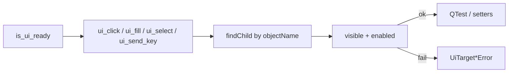

# UI Action Tools (PYPOST-836)

## Overview

Agents and automated harnesses drive named PyPost controls after `is_ui_ready`
via `pypost.agent.ui_actions`. Primitives address widgets by stable
`objectName` values ([UI widget identity](ui_identity.md)): click, fill
(default setters or opt-in keyClicks — PYPOST-917), select
(combo / list / tree / model list view — PYPOST-916, PYPOST-939), and send key/hotkey. Missing or
non-interactable targets raise actionable exceptions.

This is an **in-process Python agent API**, not a network MCP tool on
`MCPServerImpl`. Call it from tests or harnesses that already use
[AgentAppSession](agent_lifecycle.md). Combine with
[UI state snapshot](ui_snapshot.md) for post-action verification and
[UI settle / wait helpers](ui_wait.md) after Send, dialog open, or other async
updates.

## Out-of-process MCP packaging path (PYPOST-918)

Today UI actions are **in-process only**. When out-of-process MCP for these
primitives is prioritized, the documented **packaging path** is:

1. Ship a **dedicated** agent-UI MCP entry (stdio sidecar and/or separate
   loopback Streamable HTTP) that wraps `pypost.agent.ui_actions` (or a thin
   façade over the same primitives).
2. **Never mount** UI-action tools on product `MCPServerImpl`. Collection HTTP
   request tools stay solely on that server; clients that need both compose
   **two** MCP servers.
3. Do **not** implement a live bridge in this debt — PYPOST-918 closes the
   packaging answer only. Live delivery follows this path when prioritized.

Product MCP docs: [mcp_integration.md](mcp_integration.md),
[mcp_trust_model.md](mcp_trust_model.md). In-process agent e2e packaging
(`make test-agent-e2e`) is separate — see [agent_e2e.md](agent_e2e.md).

## Architecture

| Component | Role |
| --- | --- |
| `pypost/agent/ui_actions.py` | Lookup, interactable checks, primitives, errors |
| `AgentAppSession.ui_*` | Convenience after `start()`; root = main window
  (or current tab when `in_current_tab=True` — PYPOST-851) |
| `QTest.mouseClick` / `keyClick` / `keyClicks` | Click, single-key, and opt-in fill typing |
| Gate | `tests/test_ui_actions.py` under `make test` |



Fill branches on `via_key_clicks` (PYPOST-917): default clear + setters;
opt-in clear + focus + `QTest.keyClicks`.

Production UI must not import `pypost.agent`. Actions operate on widgets that
already exist; they do not change ready semantics or the identity catalog.

## API / Usage

### Errors

| Exception | When |
| --- | --- |
| `UiTargetNotFoundError` | No widget with that `widget_id` under the root |
| `UiTargetNotInteractableError` | Found but not visible/enabled, wrong type, or bad option/key |
| `UiActionError` | Base type for both (catch-all) |

Messages always include `widget_id=` (and a `reason=` for not-interactable).

### `find_widget(root, widget_id) -> QWidget`

First `QWidget` under `root` with matching `objectName` (also matches `root`
itself). Raises `UiTargetNotFoundError` if absent.

### `ui_click(root, widget_id)`

Left-click via `QTest.mouseClick`. Requires visible + enabled.

### `ui_fill(root, widget_id, text, *, via_key_clicks=False)`

Replace text on `QLineEdit` / `QPlainTextEdit` / `QTextEdit`. Wrong widget
types raise `UiTargetNotInteractableError`.

| Mode | Behaviour |
| --- | --- |
| `via_key_clicks=False` (default) | Clear + `setText` / `setPlainText` (one-shot) |
| `via_key_clicks=True` | Clear + focus + `QTest.keyClicks(widget, text)` |

Use the default for golden / seed / CI speed and stability. Opt into
keystroke fill when you need per-key validation, IME-style realism, or
typing-driven UI. For a **single** key or hotkey, use `ui_send_key` instead
(do not loop `ui_send_key` for whole-string typing).

Successful fills emit DEBUG `ui_action_applied` with scalar
`via_key_clicks=true|false` (lowercase); fill **text is never logged**.

### `ui_select(root, widget_id, option)`

Select an item by **display text** (`str`) or **zero-based index** (`int`) on:

| Widget | Text (`str`) | Index (`int`) |
| --- | --- | --- |
| `QComboBox` | `findText` + `setCurrentIndex` | `setCurrentIndex` |
| `QListWidget` | `findItems(MatchExactly)` + current item | `setCurrentRow` |
| `QTreeView` | Depth-first DisplayRole match via `pypost.agent.tree_index` (expands parent) | Top-level row only |
| `QListView` / flat `QAbstractItemView` | Column 0 DisplayRole scan + `setCurrentIndex` | Row index on root model |

`QListWidget` is handled before generic item views. Plain `QListView` and other
flat model-backed views use the last row; they require a model on column 0.

Missing option/index or unsupported widget type →
`UiTargetNotInteractableError`. Selection sets the current item; it does
**not** replace viewport *click* helpers used to open a collection request
(`tests/helpers/agent_e2e_tree.click_tree_row_by_text`). Both paths share
`find_tree_index_by_display_text` in `pypost/agent/tree_index.py`; e2e
helpers raise `AssertionError` on miss, while `ui_select` raises
`UiTargetNotInteractableError` (PYPOST-941).

```python
ui_select(root, METHOD_COMBO, "POST")   # combo by text
ui_select(root, METHOD_COMBO, 1)        # combo by index
ui_select(root, "fixture_list", "Beta") # list widget by text
ui_select(root, "fixture_list", 0)      # list widget by index
ui_select(root, "fixture_list_view", "Beta")  # QListView by text (PYPOST-939)
ui_select(root, "fixture_list_view", 0)      # QListView by index
ui_select(root, COLLECTION_TREE, "GET Seed GET")  # tree by text
ui_select(root, COLLECTION_TREE, 0)     # tree top-level index
```

### `ui_send_key(root, widget_id, key, *, modifiers=NoModifier)`

Focus the widget, then `QTest.keyClick`. `key` is a name (`"return"`,
`"backspace"`, `"a"`, …) or a `Qt.Key_*` suffix. Use `modifiers` for hotkeys
(e.g. `Qt.KeyboardModifier.ControlModifier`).

### Session helpers

```python
from PySide6.QtCore import Qt

from pypost.agent import AgentAppSession
from pypost.ui.widget_ids import METHOD_COMBO, URL_INPUT

with AgentAppSession(offscreen=True) as session:
    session.ui_fill(URL_INPUT, "https://example.com")
    session.ui_select(METHOD_COMBO, "POST")
    session.ui_select(METHOD_COMBO, 1)  # same combo by index (PYPOST-916)
    # Prefer current-tab scope for per-tab role ids (PYPOST-851):
    session.ui_fill(URL_INPUT, "https://example.com", in_current_tab=True)
    # Opt-in keystroke fill (PYPOST-917); same keyword on module ui_fill:
    session.ui_fill(URL_INPUT, "typed", via_key_clicks=True)
    session.find_in_current_tab(URL_INPUT)
    session.ui_send_key(
        URL_INPUT, "a", modifiers=Qt.KeyboardModifier.ControlModifier
    )
```

`AgentAppSession.ui_fill` mirrors `via_key_clicks` (and `in_current_tab`)
onto the module API.

Module-level functions accept any root. Session helpers default to the main
window; pass `in_current_tab=True` (or use `current_request_tab` /
`find_in_current_tab`) for multi-tab role ids ([ui_identity.md](ui_identity.md)).

## Configuration

No environment variables. Requires a started Qt app / `AgentAppSession` and
widgets that already have `objectName` set via `set_widget_id`.

## Troubleshooting

- **`UiTargetNotFoundError`** — Wrong id, UI not ready, or wrong lookup root
  (per-tab control searched from the wrong parent).
- **`not enabled` / `not visible`** — Control exists but cannot receive input;
  enable/show it or pick another target.
- **`not a text input` / `not a selectable list/combo/tree`** — Primitive does
  not match the widget type; use click/key or a different id.
- **`item view has no model`** — Model-backed list view has no model attached;
  set a model before selecting.
- **`option not found` / `option index out of range`** — Display text mismatch
  (case-sensitive) or index outside the control’s range. Tree index is
  top-level only; use text for nested rows.
- **Tree select did not open the request** — By design; `ui_select` sets
  current index. Use `click_tree_row_by_text` when the product needs a
  viewport click to open/activate.
- **Fill did not type character-by-character** — Default fill uses setters
  (`via_key_clicks=False`). For whole-string keystroke realism, call
  `ui_fill(..., via_key_clicks=True)`. Use `ui_send_key` only for a single
  key or hotkey, not to type an entire string.
- **Wrong tab’s URL/Send changed** — Default session helpers search from the
  main window; use `in_current_tab=True` or `find_in_current_tab` for multi-tab
  flows (PYPOST-851).

## Related

- [Agent UI E2E](agent_e2e.md) — umbrella + `make test-agent-e2e`
- [Agent lifecycle](agent_lifecycle.md) — launch → ready → shutdown
- [UI widget identity](ui_identity.md) — stable `objectName` catalog
- [UI state snapshot](ui_snapshot.md) — observe after acting
- [UI settle / wait helpers](ui_wait.md) — wait for exists / enabled / text / snapshot
- [Agent golden e2e](agent_golden_e2e.md) — composed Send → response proof
- [GUI testing](gui_testing.md) — offscreen Qt / `QTest` patterns
- [Logging](logging.md) — `ui_action_applied` DEBUG event
