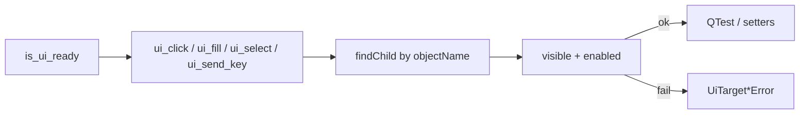

# UI Action Tools (PYPOST-836)

## Overview

Agents and automated harnesses drive named PyPost controls after `is_ui_ready`
via `pypost.agent.ui_actions`. Primitives address widgets by stable
`objectName` values ([UI widget identity](ui_identity.md)): click, fill
(default setters or opt-in keyClicks — PYPOST-917), select
(combo / list / tree / model list view — PYPOST-916, PYPOST-939), and send key/hotkey. Missing or
non-interactable targets raise actionable exceptions.

This is an **in-process Python agent API**, not a network MCP tool on
`MCPServerImpl`. Call it from tests or harnesses that already use
[AgentAppSession](agent_lifecycle.md). Combine with
[UI state snapshot](ui_snapshot.md) for post-action verification and
[UI settle / wait helpers](ui_wait.md) after Send, dialog open, or other async
updates.

## Out-of-process MCP packaging path (PYPOST-918)

Today UI actions are **in-process** when imported from Python harnesses.
**Live stdio sidecar (PYPOST-952):** run `pypost-agent-ui-mcp` or
`make run-agent-ui-mcp` — see [agent_ui_actions_mcp.md](agent_ui_actions_mcp.md).

When out-of-process MCP for these primitives is used, the **packaging path** is:

1. Ship a **dedicated** agent-UI MCP entry (stdio sidecar) that wraps
   `pypost.agent.ui_actions` (or a thin façade over the same primitives).
   Runnable entry: `pypost-agent-ui-mcp` (PYPOST-952).
2. **Never mount** UI-action tools on product `MCPServerImpl`. Collection HTTP
   request tools stay solely on that server; clients that need both compose
   **two** MCP servers.
3. PYPOST-918 documented the path; PYPOST-952 ships the stdio bridge. Optional
   loopback HTTP for agent-UI MCP remains future work.
4. **Attach** (bind to an already-running desktop) stays on the same agent-UI
   MCP surface — never on product `MCPServerImpl`. Shipped AF_UNIX attach
   (ATTACH-2 / [PYPOST-1207](https://pypost.atlassian.net/browse/PYPOST-1207));
   contract: [agent_ui_actions_mcp.md](agent_ui_actions_mcp.md). Proven vs
   manual verification matrix (ATTACH-3 /
   [PYPOST-1208](https://pypost.atlassian.net/browse/PYPOST-1208)):
   [Proven vs manual](agent_ui_actions_mcp.md#proven-vs-manual-attach-3--pypost-1208).

Product MCP docs: [mcp_integration.md](mcp_integration.md),
[mcp_trust_model.md](mcp_trust_model.md). In-process agent e2e packaging
(`make test-agent-e2e`) is separate — see [agent_e2e.md](agent_e2e.md).

## Architecture

| Component | Role |
| --- | --- |
| `pypost/agent/ui_actions.py` | Lookup, interactable checks, primitives, errors |
| `pypost/agent/tree_index.py` | Shared DisplayRole match + flat/tree index lookup
  (PYPOST-941 / PYPOST-971; ownership AST guard PYPOST-1041) |
| `AgentAppSession.ui_*` | Convenience after `start()`; root = main window
  (or current tab when `in_current_tab=True` — PYPOST-851) |
| `QTest.mouseClick` / `keyClick` / `keyClicks` | Click, single-key, and opt-in fill typing |
| Gate | `tests/test_ui_actions.py` under `make test` |



Fill branches on `via_key_clicks` (PYPOST-917): default clear + setters;
opt-in clear + focus + `QTest.keyClicks`.

Production UI must not import `pypost.agent`. Actions operate on widgets that
already exist; they do not change ready semantics or the identity catalog.

## API / Usage

### Errors

| Exception | When |
| --- | --- |
| `UiTargetNotFoundError` | No widget with that `widget_id` under the root |
| `UiTargetNotInteractableError` | Found but not visible/enabled, wrong type, or bad option/key |
| `UiActionError` | Base type for both (catch-all) |

Messages always include `widget_id=` (and a `reason=` for not-interactable).

### `find_widget(root, widget_id) -> QWidget`

First `QWidget` under `root` with matching `objectName` (also matches `root`
itself). Raises `UiTargetNotFoundError` if absent.

### `ui_click(root, widget_id)`

Left-click via `QTest.mouseClick`. Requires visible + enabled.

### `ui_fill(root, widget_id, text, *, via_key_clicks=False, delay=-1)`

Replace text on `QLineEdit` / `QPlainTextEdit` / `QTextEdit`. Wrong widget
types raise `UiTargetNotInteractableError`.

| Mode | Behaviour |
| --- | --- |
| `via_key_clicks=False` (default) | Clear + `setText` / `setPlainText` (one-shot); `delay` ignored |
| `via_key_clicks=True` | Clear + focus + `QTest.keyClicks(widget, text, delay=delay)` |

`delay` is milliseconds between simulated keys (Qt default `-1` when omitted).
Use only with `via_key_clicks=True` for paced typing in harnesses that need
debounced or animation-sensitive input without looping `ui_send_key`.

Use the default for golden / seed / CI speed and stability. Opt into
keystroke fill when you need per-key validation, IME-style realism, or
typing-driven UI. For a **single** key or hotkey, use `ui_send_key` instead
(do not loop `ui_send_key` for whole-string typing).

Successful fills emit DEBUG `ui_action_applied` with scalar
`via_key_clicks=true|false` (lowercase); fill **text is never logged**.
Fixture caplog contract: `test_ui_action_applied_caplog` parametrizes both
fill modes (`via_key_clicks=false|true`) and asserts fill text never appears
in logs (PYPOST-851/944). Behavioral keyClicks proofs:
`test_ui_fill_via_key_clicks_on_fixture` (line edit),
`test_ui_fill_via_key_clicks_emits_text_changed_per_keystroke` (per-key
`textChanged` count on line edit — PYPOST-946),
`test_ui_fill_via_key_clicks_on_plain_text_fixture`, and
`test_ui_fill_via_key_clicks_on_rich_text_fixture` (PYPOST-945).
Session agent e2e smokes: `test_ui_fill_via_key_clicks_session` (URL
`QLineEdit`; PYPOST-917) and
`test_ui_fill_via_key_clicks_session_request_body` (live `REQUEST_BODY_EDIT`
`CodeEditor` after POST method select; PYPOST-976).
Opt-in `delay` forwarding to `QTest.keyClicks` is locked by
`test_ui_fill_via_key_clicks_forwards_delay_kwarg` (PYPOST-947).

### `ui_select(root, widget_id, option)`

Select an item by **display text** (`str`) or **zero-based index** (`int`) on:

| Widget | Text (`str`) | Index (`int`) |
| --- | --- | --- |
| `QComboBox` | `findText` + `setCurrentIndex` | `setCurrentIndex` |
| `QListWidget` | `findItems(MatchExactly)` + current item | `setCurrentRow` |
| `QTreeView` | Recursive DFS via `find_tree_index_by_display_text`
  (expands parent) | Top-level row only |
| `QListView` / flat `QAbstractItemView` | Flat root scan via
  `find_child_index_by_display_text` + `setCurrentIndex` | Row index on root model |

`QListWidget` is handled before generic item views and stays on the widget-item
API (not the shared model DisplayRole helpers). Plain `QListView` and other
flat model-backed views require a model on column 0.

#### Shared DisplayRole matching (PYPOST-971)

Exact column-0 DisplayRole equality lives once in
`pypost.agent.tree_index`:

| Helper | Semantics |
| --- | --- |
| `display_role_equals(index, text)` | Shared predicate:
  `str(index.data(DisplayRole)) == text` |
| `find_child_index_by_display_text(model, text, parent=None)` | **Flat** —
  first match among **direct children** of `parent` (root when omitted);
  does **not** recurse |
| `find_tree_index_by_display_text(tree, text)` | **Recursive** —
  depth-first walk; compares each visited index via `display_role_equals` |

Flat item-view text selection calls the flat helper only (root siblings).
Tree text selection keeps DFS order and shares only the match predicate — it
does **not** call `find_child_index_by_display_text` at each level (that would
become siblings-first and change duplicate-label first-match). Ownership is
locked by `tests/test_display_role_scan_ownership.py` — see
[DisplayRole ownership boundary and its
guard](#displayrole-ownership-boundary-and-its-guard-pypost-1041) for the rule,
its AST enforcement, and the constraints on editing that suite.

Missing option/index or unsupported widget type →
`UiTargetNotInteractableError` with `reason=option not found` or
`reason=option index out of range` (same strings for combo, list, and tree).
Selection sets the current item; it does **not** replace viewport *click*
helpers used to open a collection request
(`tests/helpers/agent_e2e_tree.click_tree_row_by_text`). Tree `ui_select` and
e2e click both use `find_tree_index_by_display_text`; e2e helpers raise
`AssertionError` on miss, while `ui_select` raises
`UiTargetNotInteractableError` (PYPOST-941).

Fixture contract tests in `tests/test_ui_actions.py` lock select negative
paths: combo missing option (`test_select_missing_option_raises`) and
combo out-of-range index (`test_select_combo_index_out_of_range_raises`;
PYPOST-974); list/tree missing option and out-of-range index
(`test_select_list_missing_option_raises`,
`test_select_list_index_out_of_range_raises`,
`test_select_tree_missing_option_raises`,
`test_select_tree_index_out_of_range_raises`; PYPOST-942). Live product
`COLLECTION_TREE` negatives (same substrings via `session.ui_select` on
`seeded_agent_e2e_session`) are locked by
`test_live_collection_tree_missing_option_raises` and
`test_live_collection_tree_index_out_of_range_raises` (PYPOST-975).
Model-backed list view without a model is locked by
`test_select_list_view_no_model_raises` (PYPOST-972;
`reason=item view has no model`, distinct from `tree has no model`),
and model-less `QTreeView` is locked by its dedicated twin
`test_select_tree_no_model_raises` (PYPOST-1042; `reason=tree has no model`,
distinct from `item view has no model`).

```python
ui_select(root, METHOD_COMBO, "POST")   # combo by text
ui_select(root, METHOD_COMBO, 1)        # combo by index
ui_select(root, "fixture_list", "Beta") # list widget by text
ui_select(root, "fixture_list", 0)      # list widget by index
ui_select(root, "fixture_list_view", "Beta")  # QListView by text (PYPOST-939)
ui_select(root, "fixture_list_view", 0)      # QListView by index
ui_select(root, COLLECTION_TREE, "GET Seed GET")  # tree by text
ui_select(root, COLLECTION_TREE, 0)     # tree top-level index
```

#### DisplayRole ownership boundary and its guard (PYPOST-1041)

The DisplayRole ownership boundary described above is a rule about **source
shape**, not only behaviour, so it is enforced statically instead of by a
runtime test:

- `display_role_equals` in `pypost/agent/tree_index.py` is the only function
  **inside `pypost/agent`** that may read `Qt.ItemDataRole.DisplayRole` for
  text matching.
- `find_child_index_by_display_text` (flat) and
  `find_tree_index_by_display_text` (recursive DFS) both delegate the row
  comparison to it and never inline `ItemDataRole.DisplayRole`.
- `pypost/agent/ui_actions.py` imports `find_child_index_by_display_text` from
  `pypost.agent.tree_index` at **module level**, and `_select_item_view` calls
  it on the text branch and never reads `ItemDataRole.DisplayRole` itself. The
  guard's `_imports_from_tree_index` check runs over the whole `ui_actions.py`
  module AST, so it pins the module's import edge, not an import inside the
  function.
- `pypost.agent.tree_index.__all__` names all three helpers, keeping the
  shared public surface explicit.

**Scope.** This is a `pypost/agent` rule, not a repo-wide one. Product UI code
outside that package still reads the role directly — see
`pypost/ui/delegates/environment_name_delegate.py`,
`pypost/ui/widgets/websocket/stream_view.py`, and
`pypost/ui/widgets/websocket/stream_model.py` — and the AST guard parses only
`pypost/agent/tree_index.py` and `pypost/agent/ui_actions.py`, so nothing
outside those two files is checked.

A new caller **in `pypost/agent`** that needs display-text matching routes
through one of the two finders (or `display_role_equals`); it does not re-read
the role.

**Enforcement.** `tests/test_display_role_scan_ownership.py` parses
`tree_index.py` and `ui_actions.py` with `ast.parse` — the modules under test
are never imported, so no Qt app, display server, or fixture lifecycle is
involved — and asserts all four rules inside one test,
`test_flat_and_tree_share_display_role_match_helper` (module-level
`pytestmark = pytest.mark.timeout(10)`). Its AST helpers are `_calls_name`
(delegation), `_has_display_role_attr` (inline-DisplayRole probe),
`_imports_from_tree_index` (import edge), and `_module_all_exports` (literal
`__all__` manifest). The test also requires the recursive/tree lookup helper
`find_tree_index_by_display_text` and the item-view selection helper
`_select_item_view` to be present. The test is fail-fast: a run reports the
first violated rule only.

PYPOST-1240 adds two focused source-inspection repro tests in
`tests/test_display_role_scan_ownership_repro.py`:
`test_missing_recursive_lookup_diagnostic_names_owner_and_remedy` and
`test_missing_item_view_selection_diagnostic_names_owner_and_remedy`. They reuse
`_parse_file` and AST inspection to read the main ownership test's assertion
messages. Each pins the symbol, correct owner module, actionable remedy, and
one-line message. No new mutant or aggregate harness is required.

After the diagnostic change, this focused validation should pass:

```bash
make test PYTEST_ARGS='tests/test_display_role_scan_ownership_repro.py \
  tests/test_display_role_scan_ownership.py -q'
```

These messages are test-side quality-gate diagnostics. PYPOST-1240 is
diagnostic-only: it leaves UI behavior and production logging, metrics,
tracing, and telemetry unchanged.

**Guard of the guard.** `tests/test_display_role_scan_ownership_repro.py`
keeps *part of* the ownership suite from being quietly weakened. Three of its
tests read the ownership suite's *own* AST and look for one specific assertion
shape each; two monkeypatch the suite's `_parse` so it audits a synthetic
`tree_index` mutant (one inlines DisplayRole, one empties `__all__`) and must
raise `AssertionError`. The two additional PYPOST-1240 repro tests inspect the
main ownership test's assertion messages directly; they add no mutant. The
existing five repro tests remain intact and cover the flat-finder
delegation/no-inline checks and the `__all__` export check.

**What the repro actually pins** — five of the ownership suite's fourteen
ownership assertions:

- `_calls_name(find_child, "display_role_equals")` — the flat finder delegates.
- `not _has_display_role_attr(find_child)` — the flat finder does not inline.
- `expected_exports.issubset(tree_exports)` — the `__all__` manifest (pinned by
  the empty-`__all__` mutant test, not by a source-shape test).
- The main test's `find_tree_index_by_display_text` diagnostic message names
  `Tree Index` and says to restore recursive lookup.
- The main test's `_select_item_view` diagnostic message names `UI Actions` and
  says to restore item-view selection.

Delete one of those five and the repro turns red while the ownership suite
itself would stay green; deleting either message assertion also turns the new
source-inspection repro red. The repro intentionally does not prove that every
ownership assertion remains present or that the two existing synthetic mutants
cover the recursive/tree and item-view checks. `_refers_to_find_child` only
recognises a first argument that names the *flat* finder, so it never sees the
other two ownership pairs.

Two constraints follow from that coupling. Both apply when editing either
file:

- **Diagnostic wording is a machine-checked contract**
  (TD-9 in [60-tech-debt.md](../../ai-tasks/PYPOST-1041/60-tech-debt.md)).
  The repro locates the two main-test assertion messages by their local symbols
  and checks the symbol, owner, remedy, and one-line shape. Rewording either
  message means changing both files together; keep the owner and repair
  direction on the same line as the missing responsibility.
- **The repeated assertion pairs must stay repeated**
  (TD-5 in [60-tech-debt.md](../../ai-tasks/PYPOST-1041/60-tech-debt.md)).
  The three `_calls_name(...)` / `_has_display_role_attr(...)` pairs look like
  obvious duplication. Do not fold any of them into a loop or a shared
  `_assert_delegates(fn, ...)` helper — but they fail differently:

  - The **`find_child`** pair is the one the repro watches.
    `_refers_to_find_child` accepts a first argument that is either an
    `ast.Name` whose lowercased id contains `child`, *or* any expression whose
    `ast.dump` contains `find_child_index_by_display_text` — so an inline
    lookup such as `tree_defs["find_child_index_by_display_text"]` is accepted
    too, not only a bare name. A helper or loop rebinds that argument to a
    generic `fn`, which matches neither branch, so the repro stops seeing the
    assertion and reports the guard as missing (both source-shape repro tests
    go red).
  - The **`find_tree`** and **`_select_item_view`** pairs match neither branch
     today, so their delegation/no-inline assertions are not covered by the
     flat-finder source-shape checks. The new message repros cover only their
     missing-responsibility diagnostic strings; do not deduplicate the pairs.

  Revert such a dedup rather than loosening the repro.

### `ui_send_key(root, widget_id, key, *, modifiers=NoModifier)`

Focus the widget, then `QTest.keyClick`. `key` is a name (`"return"`,
`"backspace"`, `"a"`, …) or a `Qt.Key_*` suffix. Use `modifiers` for hotkeys
(e.g. `Qt.KeyboardModifier.ControlModifier`).

### Session helpers

```python
from PySide6.QtCore import Qt

from pypost.agent import AgentAppSession
from pypost.ui.widget_ids import METHOD_COMBO, URL_INPUT

with AgentAppSession(offscreen=True) as session:
    session.ui_fill(URL_INPUT, "https://example.com")
    session.ui_select(METHOD_COMBO, "POST")
    session.ui_select(METHOD_COMBO, 1)  # same combo by index (PYPOST-916)
    # Prefer current-tab scope for per-tab role ids (PYPOST-851):
    session.ui_fill(URL_INPUT, "https://example.com", in_current_tab=True)
    # Opt-in keystroke fill (PYPOST-917); optional per-key delay (PYPOST-947):
    session.ui_fill(URL_INPUT, "typed", via_key_clicks=True)
    session.ui_fill(URL_INPUT, "paced", via_key_clicks=True, delay=50)
    session.find_in_current_tab(URL_INPUT)
    session.ui_send_key(
        URL_INPUT, "a", modifiers=Qt.KeyboardModifier.ControlModifier
    )
```

`AgentAppSession.ui_fill` mirrors `via_key_clicks`, `delay`, and
`in_current_tab` onto the module API.

Module-level functions accept any root. Session helpers default to the main
window; pass `in_current_tab=True` (or use `current_request_tab` /
`find_in_current_tab`) for multi-tab role ids ([ui_identity.md](ui_identity.md)).

## Configuration

No environment variables. Requires a started Qt app / `AgentAppSession` and
widgets that already have `objectName` set via `set_widget_id`.

## Troubleshooting

- **`UiTargetNotFoundError`** — Wrong id, UI not ready, or wrong lookup root
  (per-tab control searched from the wrong parent).
- **`not enabled` / `not visible`** — Control exists but cannot receive input;
  enable/show it or pick another target.
- **`not a text input` / `not a selectable list/combo/tree`** — Primitive does
  not match the widget type; use click/key or a different id.
- **`item view has no model`** — Model-backed list view has no model attached;
  set a model before selecting. Fixture proof:
  `test_select_list_view_no_model_raises` (PYPOST-972).
- **`tree has no model`** — `QTreeView` has no model attached; set a model
  before selecting (distinct from the item-view reason above). Fixture proof:
  `test_select_tree_no_model_raises` (PYPOST-1042).
- **`option not found` / `option index out of range`** — Display text mismatch
  (case-sensitive exact DisplayRole via `display_role_equals`) or index
  outside the control’s range. Flat list views scan root rows only; trees
  walk depth-first for nested labels. Tree **index** selection is top-level
  only; use text for nested rows. Fixture proofs: list/tree select negatives
  (PYPOST-942). Live `COLLECTION_TREE` proofs:
  `test_live_collection_tree_missing_option_raises` /
  `test_live_collection_tree_index_out_of_range_raises` (PYPOST-975).
- **Ownership suite fails with `__all__ must export [...]; found []`** —
  either `pypost.agent.tree_index.__all__` really lost a name, or it was
  respelled as an annotated (`__all__: list[str] = [...]`) or computed
  assignment, which `_module_all_exports` skips because it matches `ast.Assign`
  only. Keep the plain literal list (TD-1 in
  [60-tech-debt.md](../../ai-tasks/PYPOST-1041/60-tech-debt.md)).
- **Repro fails but the ownership suite passes** — an ownership assertion was
  deleted, renamed, reworded, or folded into a helper/loop. Restore the
  assertion shape rather than relaxing
  `tests/test_display_role_scan_ownership_repro.py`; see
  [DisplayRole ownership boundary and its
  guard](#displayrole-ownership-boundary-and-its-guard-pypost-1041).
- **Tree select did not open the request** — By design; `ui_select` sets
  current index. Use `click_tree_row_by_text` when the product needs a
  viewport click to open/activate.
- **Fill did not type character-by-character** — Default fill uses setters
  (`via_key_clicks=False`). For whole-string keystroke realism, call
  `ui_fill(..., via_key_clicks=True)`. Optional `delay` (milliseconds between
  keys, default Qt `-1`) applies only on that path (PYPOST-947). Use
  `ui_send_key` only for a single key or hotkey, not to type an entire string.
- **Wrong tab’s URL/Send changed** — Default session helpers search from the
  main window; use `in_current_tab=True` or `find_in_current_tab` for multi-tab
  flows (PYPOST-851).
- **Find/action fails after tab strip** — Bare `QTabWidget.removeTab` leaves
  detached pages with the same per-tab role ids. Window-scoped finds can match
  orphans instead of the current tab. Destroy stripped pages with
  `setParent(None)` + `deleteLater()` + `processEvents`, then scope actions to
  the current tab. Full pattern:
  [agent golden e2e — removeTab orphans](agent_golden_e2e.md#tab-strip-hazards-removetab-orphans)
  (PYPOST-951).

## Related

- [Agent UI Actions MCP](agent_ui_actions_mcp.md) — stdio sidecar; spawn vs
  attach (PYPOST-952 / PYPOST-1207); ATTACH-3 proven vs manual
  ([PYPOST-1208](https://pypost.atlassian.net/browse/PYPOST-1208))
- [Agent UI E2E](agent_e2e.md) — umbrella + `make test-agent-e2e`
- [Agent lifecycle](agent_lifecycle.md) — launch → ready → shutdown
- [UI widget identity](ui_identity.md) — stable `objectName` catalog
- [UI state snapshot](ui_snapshot.md) — observe after acting
- [UI settle / wait helpers](ui_wait.md) — wait for exists / enabled / text / snapshot
- [Agent golden e2e](agent_golden_e2e.md) — composed Send → response proof
- [GUI testing](gui_testing.md) — offscreen Qt / `QTest` patterns
- [Logging](logging.md) — `ui_action_applied` DEBUG event
