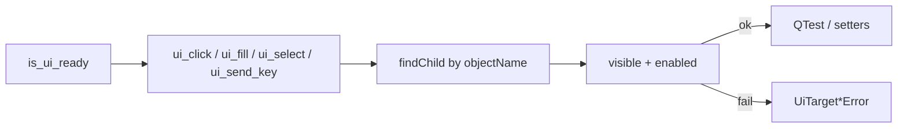

# UI Action Tools (PYPOST-836)

## Overview

Agents and automated harnesses drive named PyPost controls after `is_ui_ready`
via `pypost.agent.ui_actions`. Primitives address widgets by stable
`objectName` values ([UI widget identity](ui_identity.md)): click, fill, select,
and send key/hotkey. Missing or non-interactable targets raise actionable
exceptions.

This is an **in-process Python agent API**, not a network MCP tool on
`MCPServerImpl`. Call it from tests or harnesses that already use
[AgentAppSession](agent_lifecycle.md). Combine with
[UI state snapshot](ui_snapshot.md) for post-action verification and
[UI settle / wait helpers](ui_wait.md) after Send, dialog open, or other async
updates.

## Architecture

| Component | Role |
| --- | --- |
| `pypost/agent/ui_actions.py` | Lookup, interactable checks, primitives, errors |
| `AgentAppSession.ui_*` | Convenience after `start()`; root = main window |
| `QTest.mouseClick` / `keyClick` | Click and key delivery (matches GUI tests) |
| Gate | `tests/test_ui_actions.py` under `make test` |



Production UI must not import `pypost.agent`. Actions operate on widgets that
already exist; they do not change ready semantics or the identity catalog.

## API / Usage

### Errors

| Exception | When |
| --- | --- |
| `UiTargetNotFoundError` | No widget with that `widget_id` under the root |
| `UiTargetNotInteractableError` | Found but not visible/enabled, wrong type, or bad option/key |
| `UiActionError` | Base type for both (catch-all) |

Messages always include `widget_id=` (and a `reason=` for not-interactable).

### `find_widget(root, widget_id) -> QWidget`

First `QWidget` under `root` with matching `objectName` (also matches `root`
itself). Raises `UiTargetNotFoundError` if absent.

### `ui_click(root, widget_id)`

Left-click via `QTest.mouseClick`. Requires visible + enabled.

### `ui_fill(root, widget_id, text)`

Replace text on `QLineEdit` / `QPlainTextEdit` / `QTextEdit` (clear + set).
Wrong widget types raise `UiTargetNotInteractableError`.

### `ui_select(root, widget_id, option)`

Select a `QComboBox` item by **display text**. Missing option → not interactable.

### `ui_send_key(root, widget_id, key, *, modifiers=NoModifier)`

Focus the widget, then `QTest.keyClick`. `key` is a name (`"return"`,
`"backspace"`, `"a"`, …) or a `Qt.Key_*` suffix. Use `modifiers` for hotkeys
(e.g. `Qt.KeyboardModifier.ControlModifier`).

### Session helpers

```python
from PySide6.QtCore import Qt

from pypost.agent import AgentAppSession
from pypost.ui.widget_ids import METHOD_COMBO, URL_INPUT

with AgentAppSession(offscreen=True) as session:
    session.ui_fill(URL_INPUT, "https://example.com")
    session.ui_select(METHOD_COMBO, "POST")
    session.ui_send_key(
        URL_INPUT, "a", modifiers=Qt.KeyboardModifier.ControlModifier
    )
```

Module-level functions accept any root — use the **current request tab** when
resolving per-tab ids across multiple tabs (see [ui_identity.md](ui_identity.md)).

```python
from pypost.agent import ui_click
from pypost.ui.widget_ids import SEND_BUTTON

tab = session.window.tabs.widget.currentWidget()
ui_click(tab, SEND_BUTTON)
```

## Configuration

No environment variables. Requires a started Qt app / `AgentAppSession` and
widgets that already have `objectName` set via `set_widget_id`.

## Troubleshooting

- **`UiTargetNotFoundError`** — Wrong id, UI not ready, or wrong lookup root
  (per-tab control searched from the wrong parent).
- **`not enabled` / `not visible`** — Control exists but cannot receive input;
  enable/show it or pick another target.
- **`not a text input` / `not a combo box`** — Primitive does not match the
  widget type; use click/key or a different id.
- **`option not found`** — Combo display text mismatch (case-sensitive
  `findText`).
- **Fill did not type character-by-character** — By design; use `ui_send_key`
  for keystroke delivery.
- **Wrong tab’s URL/Send changed** — Session helpers search from the main
  window; scope to the current tab for multi-tab flows.

## Related

- [Agent lifecycle](agent_lifecycle.md) — launch → ready → shutdown
- [UI widget identity](ui_identity.md) — stable `objectName` catalog
- [UI state snapshot](ui_snapshot.md) — observe after acting
- [UI settle / wait helpers](ui_wait.md) — wait for exists / enabled / text / snapshot
- [Agent golden e2e](agent_golden_e2e.md) — composed Send → response proof
- [GUI testing](gui_testing.md) — offscreen Qt / `QTest` patterns
- [Logging](logging.md) — `ui_action_applied` DEBUG event
