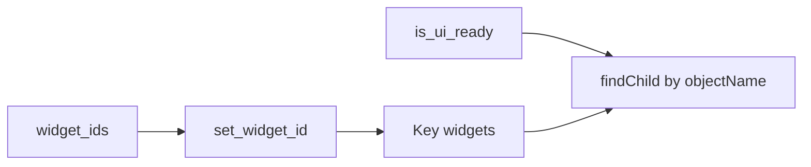

# UI Widget Identity (PYPOST-834)

## Overview

Agents and automated harnesses locate key PyPost controls by stable Qt
**`objectName`** values. These identities are English snake_case constants
prefixed with `pypost_`. They do **not** change with theme, and they are not
derived from visible labels (so future locale changes will not break lookup).

Canonical constants live in `pypost/ui/widget_ids.py`. Apply them with
`set_widget_id(widget, widget_id)`, which sets `objectName` and mirrors the
same string on `accessibleIdentifier` when the widget is a `QWidget`.

Do **not** use `accessibleName`, `windowTitle`, or button/label `text()` as the
sole automation identity.

## Architecture

| Component | Role |
| --- | --- |
| `pypost/ui/widget_ids.py` | Canonical id strings + `set_widget_id` |
| Key UI constructors | Call `set_widget_id` once when widgets are created |
| `AgentAppSession` | Ensures UI ready before agents look up widgets |
| Spot-check | `tests/test_ui_identity_spotcheck.py` under `make test`
  (includes theme/`apply_settings` identity lock — PYPOST-844; multi-tab role
  ids — PYPOST-846) |



Production UI must not import `pypost.agent`. Agents import constants from
`widget_ids` and resolve widgets on `session.window` after ready.

## Naming convention

| Rule | Detail |
| --- | --- |
| Form | `pypost_<surface>` — ASCII snake_case |
| Prefix | Always `pypost_` |
| Primary API | `QObject.objectName` |
| Mirror | `QWidget.accessibleIdentifier` = same string |
| Not identity | Localized or cosmetic display strings |
| Per-tab controls | Same role name on every tab; **scope lookup to the current tab** |

## Key identities

| Constant | `objectName` | Surface |
| --- | --- | --- |
| `MAIN_WINDOW` | `pypost_main_window` | Main window |
| `COLLECTION_TREE` | `pypost_collection_tree` | Collections tree |
| `COLLECTION_IMPORT_BUTTON` | `pypost_collection_import_button` | Import Collection… below the tree (not in KEY catalog) |
| `REQUEST_TABS` | `pypost_request_tabs` | Request tab widget |
| `METHOD_COMBO` | `pypost_method_combo` | HTTP method combo (per tab) |
| `URL_INPUT` | `pypost_url_input` | URL field (per tab) |
| `SEND_BUTTON` | `pypost_send_button` | Send button (per tab) |
| `REQUEST_BODY_EDIT` | `pypost_request_body_edit` | Request body editor (per tab) |
| `REQUEST_DETAIL_TABS` | `pypost_request_detail_tabs` | Params/Headers/Body/… tab widget |
| `RESPONSE_PANEL` | `pypost_response_panel` | Response panel / `ResponseView` (per tab) |
| `RESPONSE_STATUS` | `pypost_response_status` | Status label under `ResponseView` (per tab) |
| `RESPONSE_BODY` | `pypost_response_body` | Body editor under `ResponseView` (per tab) |
| `ENV_BAR` | `pypost_env_bar` | Environments top-bar container |
| `ENV_SELECTOR` | `pypost_env_selector` | Environment combo |
| `ENV_MANAGE_BUTTON` | `pypost_env_manage_button` | Manage environments |
| `SETTINGS_BUTTON` | `pypost_settings_button` | Settings entry |
| `SETTINGS_DIALOG` | `pypost_settings_dialog` | Settings dialog (modal; not in KEY catalog) |
| `PLUS_TAB_PLACEHOLDER` | `pypost_plus_tab_placeholder` | Trailing + tab page (not in KEY catalog) |
| `PLUS_TAB_BUTTON` | `pypost_plus_tab_button` | Embedded `+` button on plus chrome (not in KEY catalog) |
| `NEW_TAB_PROTOCOL_MENU` | `pypost_new_tab_protocol_menu` | Blank-tab protocol picker `QMenu` (PYPOST-1157; not in KEY catalog) |
| `MCP_CLIENT_TAB_PAGE` | `pypost_mcp_client_tab_page` | MCP Client draft page (per tab; not KEY) |
| `MCP_CLIENT_URL_INPUT` | `pypost_mcp_client_url_input` | MCP Client URL field (per tab; not KEY) |
| `MCP_CLIENT_CONNECT_BUTTON` | `pypost_mcp_client_connect_button` | MCP Client Connect (per tab; not KEY) |
| `MCP_CLIENT_DISCONNECT_BUTTON` | `pypost_mcp_client_disconnect_button` | MCP Client Disconnect (per tab; not KEY) |
| `MCP_CLIENT_REFRESH_BUTTON` | `pypost_mcp_client_refresh_button` | MCP Client Refresh (per tab; not KEY) |
| `MCP_CLIENT_STATE_BADGE` | `pypost_mcp_client_state_badge` | MCP Client state label (per tab; not KEY) |
| `MCP_CLIENT_ERROR_LABEL` | `pypost_mcp_client_error_label` | MCP Client status/error line (per tab; not KEY) |
| `MCP_CLIENT_TOOL_BROWSER` | `pypost_mcp_client_tool_browser` | Remote-tool `QListWidget` (per tab; not KEY) |
| `MCP_CLIENT_HEADERS_TABLE` | `pypost_mcp_client_headers_table` | MCP Client Headers table (per tab; not KEY) |
| `WS_TAB_PAGE` | `pypost_ws_tab_page` | WebSocket tab page (per tab) |
| `WS_URL_INPUT` | `pypost_ws_url_input` | WebSocket URL input (per tab) |
| `WS_CONNECT_BUTTON` | `pypost_ws_connect_button` | WebSocket Connect/Disconnect button (per tab) |
| `WS_STATE_BADGE` | `pypost_ws_state_badge` | WebSocket state status badge (per tab) |
| `WS_PARAMS_TABLE` | `pypost_ws_params_table` | WebSocket query parameters table (per tab) |
| `WS_HEADERS_TABLE` | `pypost_ws_headers_table` | WebSocket handshake headers table (per tab) |
| `WS_SUBPROTOCOLS_INPUT` | `pypost_ws_subprotocols_input` | WebSocket subprotocols input (per tab) |
| `WS_STREAM_VIEW` | `pypost_ws_stream_view` | WebSocket live stream viewer (per tab) |
| `WS_COMPOSER_EDIT` | `pypost_ws_composer_edit` | WebSocket message composer editor (per tab) |
| `WS_SEND_MESSAGE_BUTTON` | `pypost_ws_send_message_button` | WebSocket send message button (per tab) |
| `WS_STREAM_SEARCH_INPUT` | `pypost_ws_stream_search_input` | WebSocket stream search input (per tab) |
| `WS_STREAM_DIRECTION_FILTER` | `pypost_ws_stream_direction_filter` | WebSocket direction filter combo (per tab) |
| `WS_STREAM_KIND_FILTER` | `pypost_ws_stream_kind_filter` | WebSocket frame kind filter combo (per tab) |
| `WS_STREAM_CLEAR_BUTTON` | `pypost_ws_stream_clear_button` | WebSocket clear stream button (per tab) |
| `WS_STREAM_EXPORT_BUTTON` | `pypost_ws_stream_export_button` | WebSocket export stream button (per tab) |

## API / Usage

### `set_widget_id(widget, widget_id)`

Sets `objectName` to `widget_id`. If `widget` is a `QWidget`, also sets
`accessibleIdentifier` to the same string when the Qt API is available.

### Lookup after UI ready

Use [AgentAppSession](agent_lifecycle.md) and wait until `is_ui_ready` before
resolving widgets:

```python
from PySide6.QtWidgets import QPushButton, QTreeView

from pypost.agent import AgentAppSession
from pypost.ui.widget_ids import COLLECTION_TREE, SEND_BUTTON, SETTINGS_BUTTON

with AgentAppSession(offscreen=True) as session:
    window = session.window
    tree = window.findChild(QTreeView, COLLECTION_TREE)
    settings = window.findChild(QPushButton, SETTINGS_BUTTON)
    tab = window.tabs.widget.currentWidget()
    send = tab.findChild(QPushButton, SEND_BUTTON)
```

Window-level chrome (tree, tabs, env, settings) can be found from `MainWindow`.
URL / method / Send / response must be found from the **current** `RequestTab`
(or an equivalent scoped parent); shared role names would otherwise resolve to
the first tab in the tree. `RESPONSE_STATUS` and `RESPONSE_BODY` are applied in
`ResponseView.init_ui` (panel id stays on the view in `__init__`); scope them
the same way as `RESPONSE_PANEL` — per-tab under the current request tab.

## Configuration

No environment variables. Identity strings are compile-time constants in
`widget_ids.py`. Theme and settings apply must not rewrite them.

## Spot-check

`tests/test_ui_identity_spotcheck.py` asserts key identities after ready
(run via `make test`). `KEY_WIDGET_IDS` includes chrome plus per-tab controls
(`URL_INPUT`, `SEND_BUTTON`, `REQUEST_BODY_EDIT`, `REQUEST_DETAIL_TABS`,
`RESPONSE_PANEL`, `RESPONSE_STATUS`, `RESPONSE_BODY`, …); the spot-check finds
each id from the correct parent scope (window vs current tab).

## Troubleshooting

- **`findChild` returns `None`** — Wrong parent scope (use the current tab for
  per-tab ids), or the UI is not ready yet.
- **First tab Send instead of current** — Lookup used `MainWindow`; scope to
  `tabs.widget.currentWidget()`.
- **Identity changed after theme switch** — Should not happen; file a bug if
  `objectName` was cleared.
- **Adding a new key surface** — Add a constant to `widget_ids.py`, call
  `set_widget_id` at construction, then update this doc and the spot-check.


## Related

- [Agent UI E2E](agent_e2e.md) — umbrella + `make test-agent-e2e`
- [Agent lifecycle](agent_lifecycle.md) — launch → ready → shutdown
- [UI state snapshot](ui_snapshot.md) — visible-UI tree keyed by these names
- [UI action tools](ui_actions.md) — click / fill / select / send key by id
- [UI settle / wait helpers](ui_wait.md) — wait for conditions after actions
- [Agent golden e2e](agent_golden_e2e.md) — composed Send → response proof
- [GUI testing](gui_testing.md) — offscreen Qt test patterns
