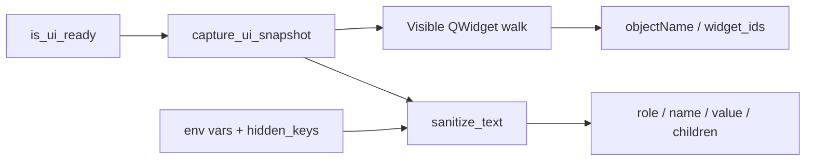

# UI State Snapshot (PYPOST-835)

## Overview

Agents and automated harnesses capture a **structured visible-UI tree** after
`is_ui_ready` via `pypost.agent.ui_snapshot`. Each node has `role`, `name`,
`value`, and `children`. Names come from stable `objectName` values
([UI widget identity](ui_identity.md)); string values are sanitized with the
active environment’s variables and `hidden_keys` before they leave the API.

This is an **in-process Python agent API**, not a network MCP tool on
`MCPServerImpl`. Call it from tests or harnesses that already use
[AgentAppSession](agent_lifecycle.md).

## Architecture

| Component | Role |
| --- | --- |
| `pypost/agent/ui_snapshot.py` | Capture API, walker, role/value extractors, truncation |
| `AgentAppSession.ui_snapshot()` | Convenience after `start()`; delegates to capture |
| `EnvPresenter.current_variables` / `current_hidden_keys` | Sanitizer context from the live window |
| `sanitize_text` | Same agent-visible redaction as MCP responses |
| Gate | `tests/test_ui_snapshot.py` under `make test` |



Production UI must not import `pypost.agent`. Snapshot walks widgets that
already exist; it does not change ready semantics or the identity catalog.

### What is included

- Visible `QWidget` descendants of the window root.
- Named key surfaces (`pypost_*`) and controls with values.
- Nested `children` reflecting parent/child hierarchy.

### What is pruned

Invisible widgets are skipped. Unnamed chrome with no value and no kept
descendants is dropped so the tree stays verification-sized.

## Snapshot shape

JSON-serializable nested dict. Every node has exactly these fields:

| Field | Type | Meaning |
| --- | --- | --- |
| `role` | `str` | Control kind (`window`, `button`, `line_edit`, …) |
| `name` | `str` | `objectName` if set, else `""` |
| `value` | `str` \| `null` | Visible value/summary after masking; `null` when N/A |
| `children` | `list` | Nested visible child nodes (same shape) |

Root is typically the main window (`name` = `pypost_main_window`).

Role vocabulary (snake_case, owned by the snapshot module):

| Qt type | `role` |
| --- | --- |
| `QMainWindow` | `window` |
| `QLineEdit` | `line_edit` |
| `QComboBox` | `combo_box` |
| `QPushButton` | `button` |
| `QLabel` | `label` |
| `QTabWidget` | `tab_widget` |
| `QTreeView` | `tree_view` |
| `QAbstractItemView` (other) | `item_view` |
| `QPlainTextEdit` / `QTextEdit` | `text_edit` |
| other `QWidget` | `widget` |

Value extractors (before sanitize + truncate): line/combo/button/label text;
current tab title; plain text from text edits; up to five selected item-view
cells joined by `", "`. Generic widgets emit `value: null`.

## API / Usage

### `capture_ui_snapshot(window) -> dict`

Walks the visible tree from `window` and returns the root node. Reads env
context from `window.env` when present (`current_variables`,
`current_hidden_keys`). Caller should ensure `is_ui_ready`.

```python
from pypost.agent import AgentAppSession, capture_ui_snapshot
from pypost.ui.widget_ids import MAIN_WINDOW, URL_INPUT

with AgentAppSession(offscreen=True) as session:
    assert session.window.is_ui_ready
    snap = capture_ui_snapshot(session.window)
    assert snap["name"] == MAIN_WINDOW
    assert snap["role"] == "window"
    assert isinstance(snap["children"], list)
```

### `AgentAppSession.ui_snapshot() -> dict`

Same result as `capture_ui_snapshot(self.window)`. Requires a started session
(accessing `window` before `start()` or after `shutdown()` raises
`RuntimeError`).

```python
with AgentAppSession(offscreen=True) as session:
    snap = session.ui_snapshot()
```

### Finding named nodes

Walk `children` recursively (or use a small helper) to locate `pypost_*`
names. Prefer snapshot names for post-action checks; use
[widget identity](ui_identity.md) `findChild` when you need a live widget
handle.

## Masking and truncation

Every emitted string `value` passes through:

```python
from pypost.core.sensitive_text_sanitizer import sanitize_text

sanitize_text(text, env_vars=env_vars, hidden_keys=hidden_keys)
```

Hidden env **values** are redacted; the same Bearer/query/JSON heuristics as
MCP responses apply. Widgets that already display the UI mask (`********`)
stay as shown. After sanitization, values longer than
`UI_SNAPSHOT_MAX_VALUE_LENGTH` (500) are truncated to that length.

Exported constant:

```python
from pypost.agent import UI_SNAPSHOT_MAX_VALUE_LENGTH  # 500
```

## Configuration

No environment variables. Truncation length is the module constant
`UI_SNAPSHOT_MAX_VALUE_LENGTH`. Env masking uses the live presenter accessors
on `window.env`, not a second secrets store.

## Observability

After a successful capture, `pypost.agent.ui_snapshot` logs at DEBUG:

| Event | Fields |
| --- | --- |
| `ui_snapshot_captured` | `node_count`, `named_count`, `duration_ms` |

Scalars only — never the tree, node values, `env_vars`, or `hidden_keys`. See
[logging.md](logging.md).

## Tests

`tests/test_ui_snapshot.py` covers shape/hierarchy, hidden-value masking,
truncation, and ready integration via `AgentAppSession` (run with
`make test`).

## Troubleshooting

- **Missing `pypost_*` names** — UI not ready, or identity not applied; check
  [ui_identity.md](ui_identity.md) and `is_ui_ready`.
- **Cleartext secret in `value`** — Confirm the key is in `hidden_keys` and
  the value is in `current_variables` for the active env; sanitizer only
  redacts known hidden values plus heuristics.
- **Huge / truncated body text** — Expected when over
  `UI_SNAPSHOT_MAX_VALUE_LENGTH`; assert prefixes, not full bodies.
- **Empty / sparse tree** — Invisible widgets and unnamed chrome without
  value or named descendants are pruned by design.
- **`RuntimeError` from `session.ui_snapshot()`** — Session not started, or
  already shut down.

## Out of scope

Network MCP `ui_snapshot` tool, click/type/select (PYPOST-836), settle waits
(837), golden flow (838), exhaustive offscreen/historical widgets.

## Related

- [Agent lifecycle](agent_lifecycle.md) — launch → ready → shutdown
- [UI widget identity](ui_identity.md) — stable `objectName` catalog
- [UI action tools](ui_actions.md) — click / fill / select / send key by id
- [GUI testing](gui_testing.md) — offscreen Qt test patterns
- [Sensitive data masking policy](sensitive_data_masking_policy.md) — broader
  secrets handling
