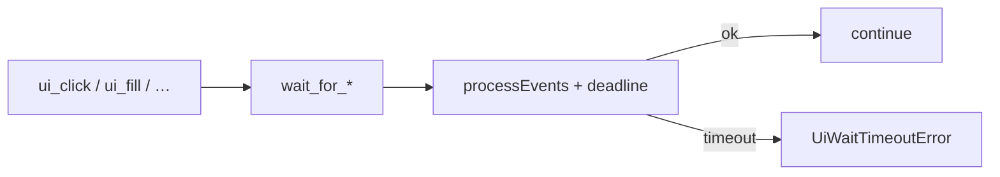

# UI Settle / Wait Helpers (PYPOST-837)

## Overview

Agents and harnesses wait for asynchronous UI outcomes after actions via
`pypost.agent.ui_wait`. Helpers poll with `QCoreApplication.processEvents` until
a condition is true or a wall-clock timeout expires. Use them after Send, dialog
open, deferred enablement, or any flaky-prone async update — not as a
replacement for lifecycle ready (`is_ui_ready`).

This is an **in-process Python agent API**, not a network MCP tool. Call it from
tests or harnesses that already use [AgentAppSession](agent_lifecycle.md),
[UI action tools](ui_actions.md), and [UI state snapshot](ui_snapshot.md).

Production code must **not** import `tests.helpers`. The historic test helper
`tests.helpers.qt_wait.wait_until` re-exports the production poll loop.

## Architecture

| Component | Role |
| --- | --- |
| `pypost/agent/ui_wait.py` | Poll loop, condition helpers, defaults, timeout error |
| `AgentAppSession.wait_*` | Convenience after `start()`; root = main window |
| `capture_ui_snapshot` | Used by `wait_for_snapshot` |
| `find_widget` | Used by widget/enabled/text waits |
| Gate | `tests/test_ui_wait.py` under `make test` |



## Timeouts

| Constant | Default | Meaning |
| --- | --- | --- |
| `DEFAULT_UI_WAIT_TIMEOUT_S` | `10.0` | Default budget for condition waits |
| `DEFAULT_UI_WAIT_INTERVAL_S` | `0.05` | Sleep between polls |

Lifecycle ready still uses `AgentAppSession(ready_timeout=30.0)` separately.
Override `timeout=` on any wait for slower dialogs or faster unit fixtures.

## API / Usage

### Errors

| Exception | When |
| --- | --- |
| `UiWaitTimeoutError` | Condition never true within `timeout` |

Attributes: `timeout_s`, `condition`, `diagnostics` (scalars / short strings).
Subclass of `TimeoutError` so existing `except TimeoutError` still works.

### `wait_until(condition, *, timeout=…, interval=…, message=…, …)`

Generic poll. Prefer the typed helpers below for common cases.

### `wait_for_widget(root, widget_id, *, timeout=…) -> QWidget`

Until a widget with that `objectName` exists under `root`.

### `wait_for_enabled(root, widget_id, *, timeout=…) -> QWidget`

Until the widget exists, is visible, and is enabled.

### `wait_for_text(root, widget_id, expected, *, timeout=…) -> QWidget`

Until text equals `expected` (string) or `expected(text)` is true. Supports
line/combo/label/button/plain/text edits.

### `wait_for_snapshot(root, predicate, *, timeout=…) -> dict`

Until `predicate(capture_ui_snapshot(root))` is true. Prefer widget/text waits
when they suffice — snapshot polls are heavier.

### Session helpers

```python
from pypost.agent import AgentAppSession
from pypost.ui.widget_ids import SEND_BUTTON, URL_INPUT

with AgentAppSession(offscreen=True) as session:
    session.ui_fill(URL_INPUT, "https://example.com")
    session.wait_for_text(URL_INPUT, "https://example.com")
    session.ui_click(SEND_BUTTON)
    session.wait_for_enabled(SEND_BUTTON)  # example settle
    session.wait_for_snapshot(
        lambda snap: snap.get("role") == "window",
        timeout=15.0,
    )
```

Module-level helpers accept any root — pass the current tab when resolving
per-tab ids.

## Configuration

No environment variables. Requires a started Qt app / `AgentAppSession`.

## Troubleshooting

| Symptom | Likely cause |
| --- | --- |
| `UiWaitTimeoutError` with `found=False` | Wrong id, wrong root, or widget never created |
| `visible=False` / `enabled=False` | Widget exists but not interactable yet (or ever) |
| `actual_text=…` mismatch | Expected string/predicate wrong; text not updated |
| Snapshot wait slow / times out | Predicate too strict; prefer `wait_for_widget`/`text` |
| Hang without timeout | Do not nest `QEventLoop.exec()`; always pass a timeout |

On timeout, read `err.diagnostics` and the exception message (includes key=value
pairs). DEBUG logs `ui_wait_settled` / `ui_wait_timeout` with timing scalars only.

## Related

- [Agent lifecycle](agent_lifecycle.md) — launch → ready → shutdown
- [UI action tools](ui_actions.md) — click / fill / select / send key
- [UI state snapshot](ui_snapshot.md) — observation tree for predicates
- [UI widget identity](ui_identity.md) — stable `objectName` catalog
- [GUI testing](gui_testing.md) — offscreen Qt / bounded waits
- [Logging](logging.md) — `ui_wait_settled` / `ui_wait_timeout`
