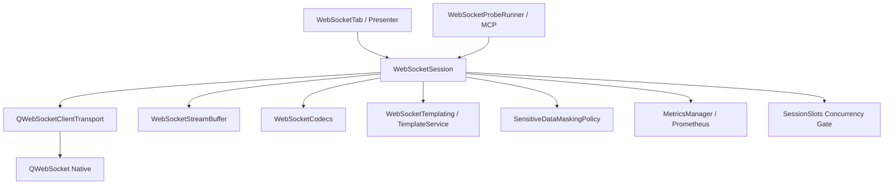
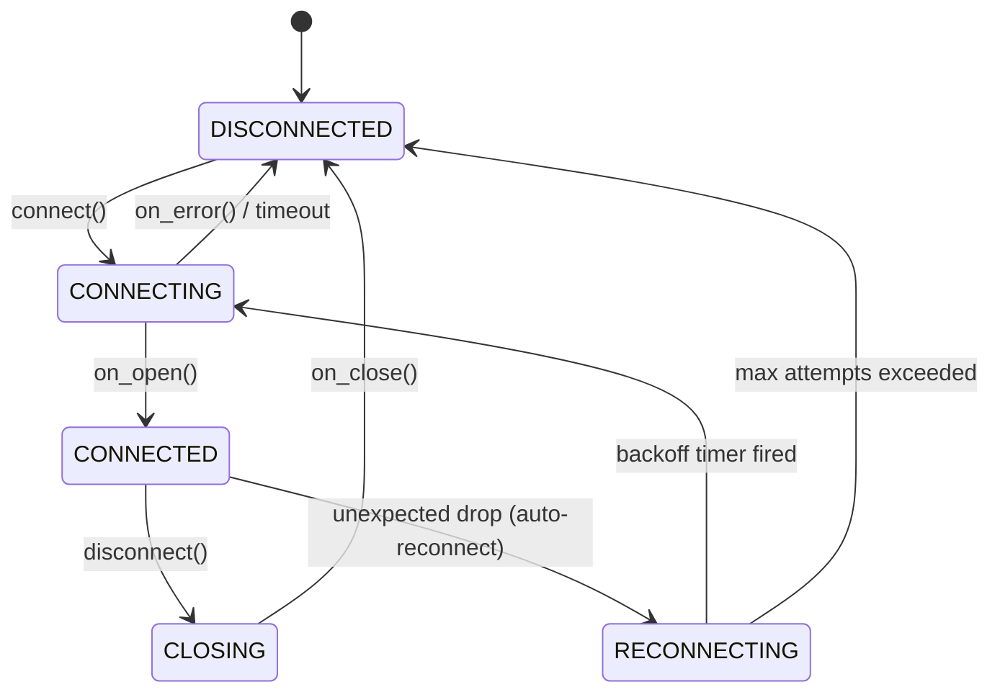

# WebSocket Subsystem Architecture (PYPOST-1138)

## Overview

The WebSocket subsystem provides interactive and automated bi-directional WebSocket
communication in PyPost. It encompasses connection lifecycle management, multi-format message
composition, bounded live stream buffering, sequence execution, variable templating with secret
masking, and Model Context Protocol (MCP) probe tooling.

The subsystem adheres strictly to PyPost layer boundaries:
- **Models (`pypost/models/`)**: Pure dataclasses/Pydantic schemas with stdlib dependencies only.
- **Core Engine (`pypost/core/`)**: Transport abstraction, stream buffer, codecs, masking, and
  metrics registration.
- **Qt Integration (`pypost/core/qt/` & `pypost/ui/`)**: `QWebSocketClientTransport`,
  `WebSocketPresenter`, and Qt widgets.

## Subsystem Architecture

## Layer Boundaries and Key Modules

| Module | Role | Layer / Dependencies |
| --- | --- | --- |
| `models/models.py` | `WebSocketProfile`, presets, sequences | Models (stdlib) |
| `core/websocket_client.py` | `WebSocketTransportProtocol` transport seam | Core / Transport |
| `core/websocket_session.py` | `WebSocketSession` lifecycle state machine | Core / Qt Signals |
| `core/websocket_stream.py` | `WebSocketStreamBuffer` ring buffer | Core (Qt-free) |
| `core/websocket_codecs.py` | Frame encoders/decoders (Text, JSON, Binary) | Core (Qt-free) |
| `core/websocket_export.py` | Stream export (JSON, NDJSON, CSV) | Core (Qt-free) |
| `core/websocket_session_slots.py` | `SessionSlots` session ceiling | Core (Qt-free) |
| `core/websocket_templating.py` | Variable interpolation & secret masking | Core |
| `core/websocket_tls.py` | SSL/TLS configuration & cert validation | Core |
| `core/mcp_websocket_probe.py` | Bounded MCP probe execution runner | Core / MCP |
| `ui/presenters/websocket_presenter.py` | `WebSocketPresenter` UI coordinator | UI Presenter |
| `ui/widgets/websocket_tab.py` | `WebSocketTab` main session tab widget | UI Widget |
| `ui/widgets/websocket_stream_view.py` | `WebSocketStreamView` live stream inspector | UI Widget |
| `ui/widgets/websocket_composer.py` | `WebSocketComposer` multi-format editor | UI Widget |

## Connection Lifecycle State Machine

Connection sessions are managed via `WebSocketSession` transitions:

- **`DISCONNECTED`**: No active network socket. All handshake fields (URL, params, headers,
  subprotocols) are editable in the UI.
- **`CONNECTING`**: Socket handshake in progress. Handshake configuration fields are locked.
- **`CONNECTED`**: Bi-directional frame streaming active. Heartbeat ping/pong timer running.
- **`RECONNECTING`**: Reconnection backoff timer active following an unexpected socket drop.
- **`CLOSING`**: Clean close handshake frame dispatched; awaiting server acknowledgment.

## Stream Buffer and Memory Eviction

High-throughput WebSocket endpoints can emit thousands of frames per second. To guarantee
bounded memory consumption without crashing the UI:

1. **`WebSocketStreamBuffer`**: Implements a bounded FIFO ring buffer tracking both total frame
   count and cumulative memory bytes.
2. **Eviction Policy**: When cumulative size exceeds `ws_max_stream_buffer_bytes` (default: 10 MB),
   the oldest frames are evicted.
3. **Drop Accounting**: Evictions increment a session drop counter (`dropped_count`) and trigger
   `pypost_websocket_drops_total` metric emission. The UI displays an alert banner notifying the
   user when frame eviction occurs.

## Concurrency Limiting (`SessionSlots`)

To avoid resource starvation:
- Global concurrent sessions are managed by `SessionSlots`.
- The maximum simultaneous open sockets is governed by `ws_max_concurrent_sessions` (default: 10).
- `SessionSlots.acquire()` returns `True` if a slot is available; otherwise it raises or returns
  `False`, causing the presenter to notify the user.

## Threading and Event Loop Affinity

- **GUI Mode**: In the desktop UI, `QWebSocket` operates on the main Qt GUI event loop, delivering
  frame events via Qt signal-slot dispatch.
- **MCP Probe Mode**: When invoked through MCP tools (`WebSocketProbeRunner`), execution runs in a
  dedicated worker thread with its own `QEventLoop`. Signals are processed synchronously within the
  worker until completion or timeout (`max_duration_sec`), preventing blocking the main desktop UI
  or MCP server event loops.

## Observability and Metrics

The subsystem exports structured Prometheus metrics registered in `MetricsRegistry`:

| Metric Name | Type | Labels | Description |
| --- | --- | --- | --- |
| `pypost_websocket_sessions_active` | Gauge | `protocol` | Current active WebSocket sessions |
| `pypost_websocket_sessions_total` | Counter | `protocol`, `status` | Total connection attempts |
| `pypost_websocket_messages_total` | Counter | `direction`, `kind` | Inbound and outbound frames |
| `pypost_websocket_bytes_total` | Counter | `direction` | Total frame bytes transferred |
| `pypost_websocket_drops_total` | Counter | `reason` | Total evicted frames due to buffer limits |
| `pypost_websocket_reconnects_total` | Counter | `status` | Automatic reconnection attempts |

Structured logging uses event prefixes conforming to the repository logging policy:
- `ws_session_connected`, `ws_session_disconnected`, `ws_session_error`
- `ws_frame_sent`, `ws_frame_received`, `ws_buffer_eviction`
- `ws_probe_started`, `ws_probe_completed`

## Related Documentation

- [UI Widget Identity](ui_identity.md) — stable widget IDs for automation
- [Testing Guide](testing.md) — test strategy and mock server fixture conventions
- [Architecture Overview](architecture.md) — overall repository topology
- [MCP Integration](mcp_integration.md) — Model Context Protocol architecture
