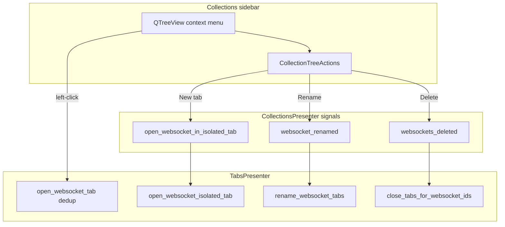

# Collections WebSocket Context Menu (PYPOST-1160)

## Overview

Saved WebSocket profiles in the Collections sidebar expose the same
right-click context menu as HTTP requests: **New tab**, **Export
Collection…**, **Rename**, and **Delete**. Left-click behavior is unchanged
— it still opens or focuses a single tab per profile id via deduplication.

**New tab** always inserts an isolated copy with its own live session.
**Rename** persists to disk and updates all open tab titles for that profile
id. **Delete** removes the profile from the collection and closes bound tabs,
prompting when a tab has unsaved edits or an active WebSocket session.

Epic: [PYPOST-1155](https://pypost.atlassian.net/browse/PYPOST-1155) (WS-TM-4).
Depends on blank WebSocket draft tabs ([PYPOST-1158](https://pypost.atlassian.net/browse/PYPOST-1158)).

## Architecture



| Component | Role |
| --- | --- |
| `CollectionTreeActions` | Resolves `WebSocketConnection` rows; builds menu; emits isolated open, rename, delete |
| `CollectionsPresenter` | Tree model (`ws {name}` labels); owns new signals |
| `websocket_persisted_fields` | Deep copy, snapshot, and equality for isolation and dirty detection |
| `TabsPresenter` | `open_websocket_isolated_tab` (no dedup), rename labels, close/prompt |
| `tabs_presenter_ws_close` | Extracted close/rename helpers (LOC cap) |
| `tab_dirty.is_websocket_saved_tab_dirty` | Saved-profile dirty vs `persisted_baseline` |
| `collection_item_dialogs.prompt_deleted_websocket_profile_tab_close` | Delete-profile tab safety dialog |
| `RequestManager._item_dispatch_context` | Supplies `WebSocketRegistry` for websocket rename/delete dispatch |
| `main_window_signals` | Wires collections ↔ tabs cross-presenter events |

HTTP reference: [Collection Tree Actions](collection_tree_actions.md),
[Open Request in Isolated Tab](open_request_in_isolated_tab.md).

### Isolated tab copy policy

`copy_websocket_for_isolated_tab` deep-copies all persisted editor fields but
**keeps the saved profile `id`**. Each `_insert_websocket_tab` call constructs a
fresh `WebSocketPresenter` and `WebSocketSessionController`, so sessions are
independent even when multiple tabs share one profile id.

Collection-backed tabs set `WebSocketTab.persisted_baseline` from
`snapshot_websocket_persisted_fields` on insert. Draft tabs (no collection row)
omit the baseline — see [websocket_draft_tab.md](websocket_draft_tab.md).

### Delete tab lifecycle

When a WebSocket profile or a collection containing profiles is deleted:

1. `CollectionTreeActions` collects affected websocket ids
   (`_affected_websocket_ids`).
2. `websockets_deleted` emits the id list.
3. `close_tabs_for_websocket_ids` scans open `WebSocketTab` widgets.
4. If a tab has unsaved edits (`is_websocket_saved_tab_dirty`) or an active
   session (`CONNECTING`, `RECONNECTING`, `OPEN`, `CLOSING`), the user sees
   `prompt_deleted_websocket_profile_tab_close`.
5. On proceed (or when clean and idle), tabs are removed; empty workspace falls
   back to a blank HTTP tab (existing rule).

HTTP delete continues silent close via `close_tabs_for_request_ids`.

## API / Usage

### `copy_websocket_for_isolated_tab(data)`

Located in `pypost/core/websocket_persisted_fields.py`. Returns a deep copy for
tab isolation; preserves `id` for tab binding.

### `TabsPresenter.open_websocket_isolated_tab(connection, save_state=True)`

Always inserts a new tab; never focus-dedups by profile id. Use for
collections **New tab** only. Left-click and restore use
`open_websocket_tab` (dedup).

### `TabsPresenter.rename_websocket_tabs(ws_id, new_name)`

Updates `connection_data.name`, tab header labels, and
`persisted_baseline.name` on all tabs sharing `ws_id`.

### `TabsPresenter.close_tabs_for_websocket_ids(ws_ids, prompt=None)`

Closes tabs bound to deleted profile ids. Optional `prompt` override for tests.

### `CollectionsPresenter` signals

```python
open_websocket_in_isolated_tab = Signal(object)  # WebSocketConnection deep copy
websocket_renamed = Signal(str, str)             # (ws_id, new_name)
websockets_deleted = Signal(list)                # ws ids for tab closure
```

### `prompt_deleted_websocket_profile_tab_close(parent, tab_title, ...)`

Returns `True` to close the tab and end the session; `False` to keep the tab
open when the profile was deleted from Collections.

## Configuration

No task-specific settings or environment variables. Metrics use existing GUI
counters (`gui_new_tab_actions_total`, `gui_collection_rename_actions_total`,
`gui_collection_delete_actions_total`). See
[Prometheus Monitoring](../prometheus_monitoring.md).

## Logging and metrics

| Event | Level | Location |
| --- | --- | --- |
| `collection_websocket_open_new_tab` | INFO | `collection_tree_actions` — **New tab** chosen |
| `close_tabs_for_deleted_websockets` | INFO | `tabs_presenter_ws_close` — tabs closed after delete |
| `gui_new_tab_actions_total{source=collections_context, protocol=websocket}` | metric | collections **New tab** |
| `gui_collection_rename_actions_total{item_type=websocket, …}` | metric | rename menu flow |
| `gui_collection_delete_actions_total{item_type=websocket, …}` | metric | delete menu flow |

## Automated tests

| Test class | File | Coverage |
| --- | --- | --- |
| `TestCollectionTreeActionsWebSocket` | `tests/test_collection_tree_actions.py` | Menu parity, new tab emit + metric, delete emits ids, collection cascade |
| `TestTabsPresenterWebSocketCollections` | `tests/test_tabs_presenter.py` | Isolated insert, independent presenters, rename labels, close silent vs prompt |

Run:

```bash
make test PYTEST_ARGS='-k "TestCollectionTreeActionsWebSocket or TestTabsPresenterWebSocketCollections"'
```

Harness: `tests/helpers/collections_tree.py` (`make_websocket`, `build_isolated_tree_actions`).

## Troubleshooting

| Symptom | Likely cause | What to check |
| --- | --- | --- |
| Right-click on WS row shows no menu | `_resolve_item_target` did not recognize `WebSocketConnection` in `Qt.UserRole` | Confirm `CollectionsPresenter._make_websocket_item` stores the model object |
| **New tab** focuses existing tab instead of adding one | Caller used `open_websocket_tab` instead of `open_websocket_isolated_tab` | Collections **New tab** must emit `open_websocket_in_isolated_tab` |
| Rename/delete does not persist | `ItemDispatchContext` missing `websocket_registry` | `RequestManager._item_dispatch_context` |
| Delete removes profile but tab stays open with no prompt | Tab is clean and session idle | Expected silent close; check `SessionState` and `is_websocket_saved_tab_dirty` |
| Delete prompt never appears when connected | Presenter state not in active set | `CONNECTING`, `RECONNECTING`, `OPEN`, `CLOSING` in `tabs_presenter_ws_close` |
| Tab title not updated after rename | `websocket_renamed` not wired | `main_window_signals` → `rename_websocket_tabs` |
| Metric shows `protocol=unknown` on WS **New tab** | Missing `protocol="websocket"` on `track_gui_new_tab_action` | `collection_tree_actions` websocket branch |

## Related work

| Story | Scope |
| --- | --- |
| [PYPOST-1158](https://pypost.atlassian.net/browse/PYPOST-1158) | Blank WebSocket draft tabs |
| [PYPOST-1161](https://pypost.atlassian.net/browse/PYPOST-1161) | Save / Save As to collection |
| [PYPOST-1163](https://pypost.atlassian.net/browse/PYPOST-1163) | User documentation |
| [PYPOST-1184](https://pypost.atlassian.net/browse/PYPOST-1184) | `tabs_presenter` insert-before-plus extract (`tabs_presenter_insert.py`) |
