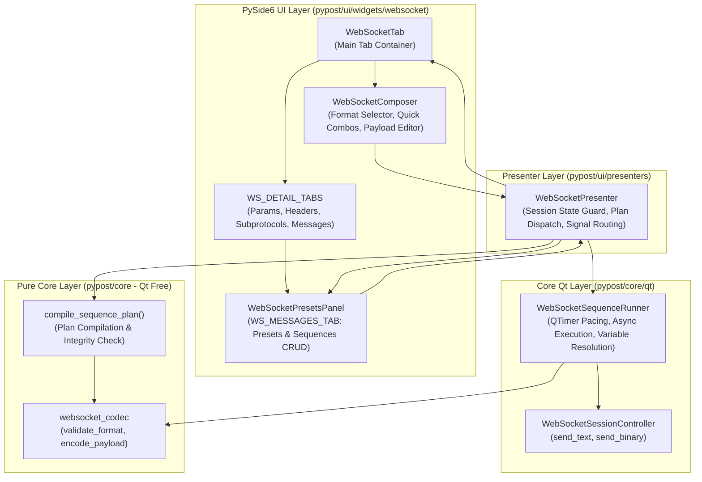
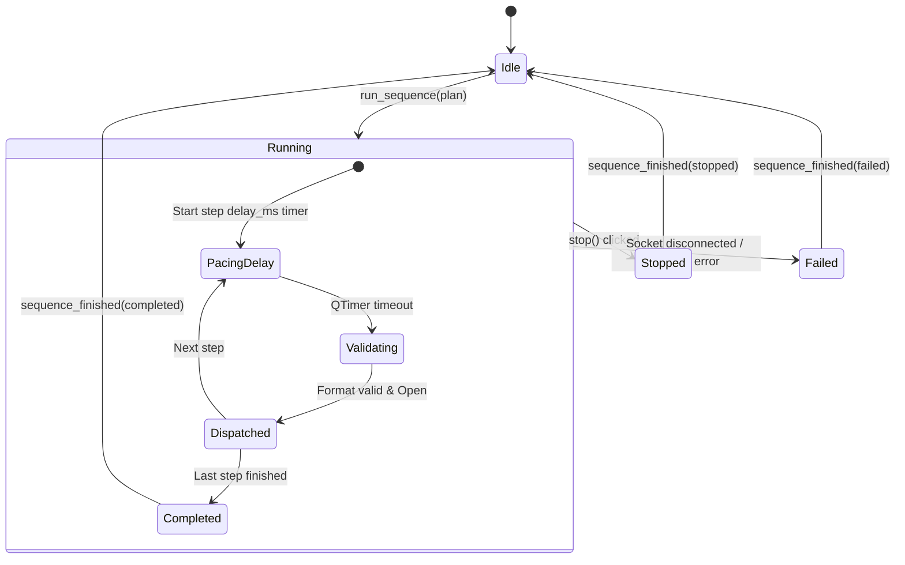

# WebSocket Multi-Format Composer, Saved Presets, and Sequence Runner (PYPOST-1134)

## Overview

The WebSocket Multi-Format Composer, Saved Presets, and Sequence Runner (**WS-6**, Epic PYPOST-1123, task PYPOST-1134) extends PyPost's WebSocket client subsystem with rich payload authoring across textual and binary codecs, message templating with saved presets, multi-step automated message workflows (sequences) with configurable step pacing, and non-blocking asynchronous execution.

### Key Capabilities

- **Multi-Format Payload Composition**: Full authoring support for `Text` (UTF-8), `JSON` (structural data), `Hex` (raw hexadecimal bytes), and `Base64` (binary encoding) with real-time inline validation feedback.
- **Saved Message Presets**: Template library for recurring payloads supporting full master/detail CRUD, duplication, quick loading into the composer, and immediate transmission (`Send now`) without mutating editor state.
- **Multi-Step Message Sequences**: Ordered message sequences combining preset references and inline payloads with per-step pre-flight delay pacing (`delay_ms`), step reordering, and step deletion.
- **Pure Plan Compilation Engine**: Qt-free compiler (`compile_sequence_plan`) that verifies sequence integrity, detects missing or deleted preset references (`<missing preset>`), and validates inline/preset payloads upfront.
- **Non-Blocking Asynchronous Runner**: `WebSocketSequenceRunner` driven by `QTimer` single-shot pacing that maintains UI responsiveness, supports template variable interpolation at dispatch time, and halts gracefully on user stop or runtime disconnection.
- **Messages Sub-Tab**: Dedicated management panel (`WS_MESSAGES_TAB` / `pypost_ws_messages_tab`) embedded in `WS_DETAIL_TABS` providing dual master/detail views and informative empty states.
- **Stable Automation Identities**: Deterministic `WS_COMPOSER_*`, `WS_PRESET_*`, `WS_SEQUENCE_*`, and `WS_MESSAGES_TAB` widget IDs registered in `KEY_WIDGET_IDS` for automated agent driving.

---

## Architecture & Component Design

### Component Hierarchy



### Module Responsibilities

| Component | Location | Responsibilities |
|---|---|---|
| `WebSocketComposer` | `pypost/ui/widgets/websocket/composer.py` | Multi-format message authoring widget featuring format switching, quick preset and sequence dropdowns, real-time syntax validation label, and `Send Message` action. |
| `WebSocketPresetsPanel` | `pypost/ui/widgets/websocket/presets_panel.py` | Messages sub-tab embedded in `WS_DETAIL_TABS` hosting master/detail views for saved presets and multi-step sequences, step reordering, and direct dispatch actions. |
| `compile_sequence_plan` | `pypost/core/websocket_sequence.py` | Pure Qt-free compiler resolving preset IDs against available presets, pre-validating payload formats, detecting missing presets, and producing immutable `SequenceExecutionPlan` objects. |
| `WebSocketSequenceRunner` | `pypost/core/qt/websocket_sequence_runner.py` | Asynchronous Qt runner orchestrating step pacing via `QTimer`, variable interpolation via `TemplateService`, payload encoding, dispatch over `WebSocketSessionController`, and state machine lifecycle events. |
| `WebSocketPresenter` | `pypost/ui/presenters/websocket_presenter.py` | Coordinates UI signals with session state checks (`SessionState.OPEN`), compiles plans, runs sequences, and triggers profile persistence via `WebSocketRegistry.save_websocket`. |
| `websocket_codec` | `pypost/core/websocket_codec.py` | Format validation (`validate_format`) and encoding (`encode_payload`) across Text, JSON, Hex, and Base64 representations. |

---

## Domain Data Models & Planning Structures

### Persisted Domain Models (`pypost/models/websocket.py`)

All presets and sequences persist as JSON fields within `WebSocketConnection` inside workspace collections:

```python
class WsMessageFormat(str, Enum):
    TEXT = "text"
    JSON = "json"
    HEX = "hex"
    BASE64 = "base64"

class WebSocketMessagePreset(BaseModel):
    id: str = Field(default_factory=lambda: str(uuid.uuid4()))
    name: str = "New Message"
    format: WsMessageFormat = WsMessageFormat.JSON
    payload: str = ""

class WebSocketSequenceStep(BaseModel):
    preset_id: Optional[str] = None
    inline_payload: str = ""
    format: WsMessageFormat = WsMessageFormat.JSON
    delay_ms: int = Field(default=0, ge=0, le=600_000)

class WebSocketSequence(BaseModel):
    id: str = Field(default_factory=lambda: str(uuid.uuid4()))
    name: str = "New Sequence"
    steps: List[WebSocketSequenceStep] = Field(default_factory=list)
```

### Pure Planning & Execution Models (`pypost/core/websocket_sequence.py`)

To decouple planning from Qt execution, immutable dataclasses represent compiled execution plans and step outcomes:

```python
@dataclass(frozen=True)
class StepExecutionPlan:
    step_index: int               # 0-based step index
    display_name: str             # Preset name or "<inline>"
    format: WsMessageFormat       # Target wire format
    raw_payload: str              # Raw template string
    delay_ms: int                 # Pacing delay in milliseconds before dispatch
    preset_id: Optional[str] = None

@dataclass(frozen=True)
class SequenceExecutionPlan:
    sequence_id: str
    sequence_name: str
    steps: tuple[StepExecutionPlan, ...]
    is_valid: bool
    validation_error: Optional[str] = None

@dataclass(frozen=True)
class StepExecutionResult:
    step_index: int
    display_name: str
    format: WsMessageFormat
    encoded_bytes_or_str: bytes | str
    byte_size: int
    delay_ms: int
    success: bool
    error_message: Optional[str] = None

@dataclass(frozen=True)
class SequenceRunOutcome:
    sequence_id: str
    sequence_name: str
    total_steps: int
    executed_steps: int
    status: str                   # "completed", "stopped", "failed"
    failure_step_index: Optional[int] = None
    failure_reason: Optional[str] = None
```

---

## Format Validation Rules and Codec Encoding

PyPost validates payloads before transmission and compiles them into appropriate wire-level representations:

| Format | Validation Rules (`validate_format`) | Encoding Behavior (`encode_payload`) | Wire Type |
|---|---|---|---|
| **Text** | Valid UTF-8 string. Always accepted. | Returns input `str` as-is. | UTF-8 Text Frame (`send_text`) |
| **JSON** | Syntactically valid JSON parseable by `json.loads(text)`. Empty string is accepted as empty text. | Returns input `str` as-is. | UTF-8 Text Frame (`send_text`) |
| **Hex** | Hexadecimal digits (`0-9`, `a-f`, `A-F`), optional whitespace ignored. Must have an even length of hex characters. | Strips whitespace and parses via `bytes.fromhex(text)`. | Binary Frame (`send_binary`) |
| **Base64** | Base64-encoded string validated via `base64.b64decode(text, validate=True)`. Enforces correct alphabet and padding. | Decodes into raw `bytes`. | Binary Frame (`send_binary`) |

---

## Messages Sub-Tab Interaction & Wireframes

The `Messages` sub-tab (`WS_MESSAGES_TAB`) is located inside `WS_DETAIL_TABS` (`pypost_ws_detail_tabs`) alongside `Params`, `Headers`, and `Subprotocols`.

### Sub-Tab Layout

```text
+- WS_DETAIL_TABS > [Params] [Headers] [Subprotocols] [Messages (WS_MESSAGES_TAB)] -+
|                                                                                   |
| Saved Messages (Presets)                              Preset Detail               |
| +- WS_PRESETS_LIST ----------------+ +------------------------------------------+ |
| | subscribe (json)                 | | Name:   [ subscribe                    ] | |
| | ping (text)                      | | Format: [ JSON v ] (WS_PRESET_FORMAT_*)  | |
| | binary-query (hex)               | | Payload: (WS_PRESET_PAYLOAD_EDIT)        | |
| |                                  | | {"op":"subscribe","channel":"ticker"}    | |
| +----------------------------------+ +------------------------------------------+ |
| [New] [Duplicate] [Delete]             [Load into composer] [Send now]            |
| (WS_PRESET_NEW_*)                      (WS_PRESET_LOAD_*)   (WS_PRESET_SEND_*)    |
+-----------------------------------------------------------------------------------+
| Sequences                                             Steps of "login+sub"        |
| +- WS_SEQUENCES_LIST --------------+ +------------------------------------------+ |
| | login+sub (3 steps)              | | # | Message / Preset | Format | Delay (ms) | |
| | ping-heartbeat (1 step)          | | 1 | auth (preset)    | json   |       0 ms | |
| |                                  | | 2 | subscribe (pr.)  | json   |     250 ms | |
| |                                  | | 3 | <inline>         | text   |    1000 ms | |
| +----------------------------------+ +------------------------------------------+ |
| [New sequence] [Duplicate] [Delete]   [Add step] [Remove step] [Up] [Down]        |
| (WS_SEQUENCE_NEW_*)                   (WS_SEQUENCE_STEP_ADD_*)                    |
+-----------------------------------------------------------------------------------+
```

### Composer Strip Controls

Located at the bottom of `WebSocketTab`:

```text
+- Composer Strip (WS_COMPOSER_EDIT) -----------------------------------------------+
| Format: [JSON v]  Preset: [subscribe v] [Save...]  Seq: [login+sub v] [Run] [Stop] |
| (WS_COMPOSER_FORMAT_*)  (WS_PRESET_COMBO)  (WS_PRESET_SAVE_*)  (WS_SEQUENCE_*)    |
| +-------------------------------------------------------------------------------+ |
| | {"op": "subscribe", "channel": "{{channel}}"}                                 | |
| +-------------------------------------------------------------------------------+ |
| [✓ Valid JSON]                                     [ Send Message (Ctrl+Enter) ]  |
|                                                    (WS_SEND_MESSAGE_BUTTON)       |
+-----------------------------------------------------------------------------------+
```

### Empty States Guidance

- **Empty Presets State**: When no presets exist, helper text informs the user:
  `"No saved messages yet. Compose one and choose Save... in the composer, or [New]."`
- **Empty Sequences State**: When no sequences exist, helper text informs the user:
  `"No sequences yet. [New sequence] builds one from saved messages or inline payloads."`

---

## Asynchronous Sequence Execution Model

Sequence execution uses non-blocking event-driven timers (`QTimer`) to pace transmissions without starving the Qt event loop:

### Execution State Machine



### Step Pacing & Timing Rules

1. **Pre-Step Delay**: For each step $i$, `delay_ms` defines the delay waited *before* the step is dispatched.
2. **Zero Delay Handling**: If `delay_ms == 0`, execution is scheduled immediately via `QTimer.singleShot(0)` to yield to the Qt event loop before execution.
3. **Mid-Run Cancellation (`stop()`)**:
   - Calling `runner.stop()` halts active `_pacing_timer` immediately.
   - Transitions runner state to `stopped` and emits `sequence_finished(outcome)`.
   - The underlying network socket remains `OPEN`.
4. **Disconnection Guard**:
   - Before dispatching each step, the runner verifies that `session_controller.is_open` is `True`.
   - If the connection dropped during the pacing delay, the runner aborts execution with `status="failed"` and reason `"Session disconnected during sequence execution"`.
5. **Template Interpolation**:
   - Payloads containing template placeholders (e.g. `{{AUTH_TOKEN}}`) are dynamically rendered using `TemplateService.render_string` and active environment variables at dispatch time.

---

## Stable UI Automation Identities (`widget_ids.py`)

All interactive elements expose deterministic `objectName` and `accessibleIdentifier` attributes:

| Constant | ID Value | Description |
|---|---|---|
| `WS_COMPOSER_FORMAT_COMBO` | `pypost_ws_composer_format_combo` | Composer format selector (`Text`, `JSON`, `Hex`, `Base64`) |
| `WS_PRESET_COMBO` | `pypost_ws_preset_combo` | Quick preset selector in composer strip |
| `WS_PRESET_SAVE_BUTTON` | `pypost_ws_preset_save_button` | `Save...` button in composer strip |
| `WS_SEQUENCE_COMBO` | `pypost_ws_sequence_combo` | Quick sequence selector in composer strip |
| `WS_SEQUENCE_RUN_BUTTON` | `pypost_ws_sequence_run_button` | `Run` button in composer strip |
| `WS_SEQUENCE_STOP_BUTTON` | `pypost_ws_sequence_stop_button` | `Stop` button in composer strip |
| `WS_MESSAGES_TAB` | `pypost_ws_messages_tab` | `Messages` sub-tab inside `WS_DETAIL_TABS` |
| `WS_PRESETS_LIST` | `pypost_ws_presets_list` | Saved messages master list |
| `WS_PRESET_NAME_INPUT` | `pypost_ws_preset_name_input` | Preset name line edit |
| `WS_PRESET_FORMAT_COMBO` | `pypost_ws_preset_format_combo` | Preset format combo in detail pane |
| `WS_PRESET_PAYLOAD_EDIT` | `pypost_ws_preset_payload_edit` | Preset payload text editor |
| `WS_PRESET_NEW_BUTTON` | `pypost_ws_preset_new_button` | `[New]` preset button |
| `WS_PRESET_DUPLICATE_BUTTON` | `pypost_ws_preset_duplicate_button` | `[Duplicate]` preset button |
| `WS_PRESET_DELETE_BUTTON` | `pypost_ws_preset_delete_button` | `[Delete]` preset button |
| `WS_PRESET_LOAD_BUTTON` | `pypost_ws_preset_load_button` | `[Load into composer]` button |
| `WS_PRESET_SEND_BUTTON` | `pypost_ws_preset_send_button` | `[Send now]` preset button |
| `WS_SEQUENCES_LIST` | `pypost_ws_sequences_list` | Sequences master list |
| `WS_SEQUENCE_NEW_BUTTON` | `pypost_ws_sequence_new_button` | `[New sequence]` button |
| `WS_SEQUENCE_DUPLICATE_BUTTON` | `pypost_ws_sequence_duplicate_button` | `[Duplicate]` sequence button |
| `WS_SEQUENCE_DELETE_BUTTON` | `pypost_ws_sequence_delete_button` | `[Delete]` sequence button |
| `WS_SEQUENCE_STEPS_TABLE` | `pypost_ws_sequence_steps_table` | Sequence steps `QTableWidget` |
| `WS_SEQUENCE_STEP_ADD_BUTTON` | `pypost_ws_sequence_step_add_button` | `[Add step]` button |
| `WS_SEQUENCE_STEP_REMOVE_BUTTON` | `pypost_ws_sequence_step_remove_button` | `[Remove step]` button |
| `WS_SEQUENCE_STEP_UP_BUTTON` | `pypost_ws_sequence_step_up_button` | `[Move Up]` step button |
| `WS_SEQUENCE_STEP_DOWN_BUTTON` | `pypost_ws_sequence_step_down_button` | `[Move Down]` step button |

---

## Testing Strategy & Test Suites

| Test Suite | Purpose | Execution |
|---|---|---|
| `tests/test_websocket_composer_and_sequence_repro.py` | 20 comprehensive unit and integration tests covering multi-format validation (Text, JSON, Hex, Base64), preset CRUD, sequence plan compilation, async Qt runner pacing, variable interpolation, mid-run stop, disconnected guards, and Messages sub-tab interactions. | `.venv/bin/pytest tests/test_websocket_composer_and_sequence_repro.py` |
| `tests/test_ui_identity_spotcheck.py` | Asserts identity preservation and registration for all 25 new `WS_COMPOSER_*`, `WS_PRESET_*`, `WS_SEQUENCE_*`, and `WS_MESSAGES_TAB` widget IDs. | `.venv/bin/pytest tests/test_ui_identity_spotcheck.py` |
| `tests/test_websocket_stream_and_codecs.py` | Validates codec encoding and decoding rules for binary frames, UTF-8 text, hex dumps, and JSON representations. | `.venv/bin/pytest tests/test_websocket_stream_and_codecs.py` |
