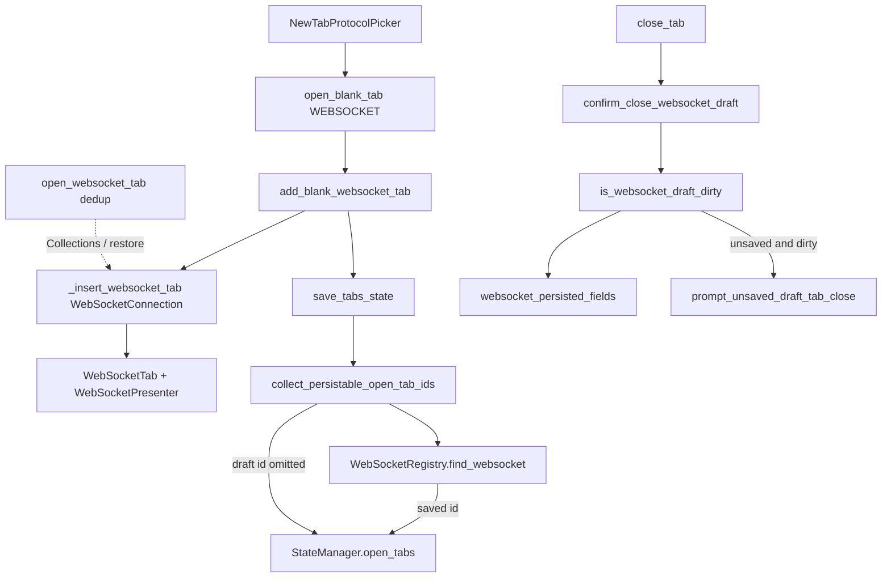

# Blank WebSocket draft tab lifecycle (PYPOST-1158)

## Overview

WS-TM-2 ([PYPOST-1158](https://pypost.atlassian.net/browse/PYPOST-1158))
closes the **workspace lifecycle** for unsaved WebSocket tabs. The blank
factory `TabsPresenter.add_blank_websocket_tab()` already shipped in
WS-TM-1 ([PYPOST-1157](https://pypost.atlassian.net/browse/PYPOST-1157)):
picker confirm builds a full `WebSocketTab` titled **New WebSocket** with
an empty URL (no host, path, or pre-filled scheme). This story does not
add a new editor widget.

What this story owns:

- **Registry-gated session persist.** `save_tabs_state` writes a WebSocket
  id only when `WebSocketRegistry.find_websocket(id)` finds a collection
  profile. Unsaved draft UUIDs stay out of `StateManager.open_tabs`.
- **Dirty-close Discard / Keep.** Closing an unsaved draft whose editor
  fields differ from factory defaults prompts **Discard** or **Keep the
  tab**. Saved profiles and factory-clean drafts skip the prompt.
- **Helper extraction.** Persist, dirty compare, and the dialog live
  outside `tabs_presenter.py` so that file stays at the **785 / 785** LOC
  cap.

Do **not** copy MCP Client's "omit every tab of this kind". Saved
WebSocket profiles must still restore. User-facing copy is
[PYPOST-1163](https://pypost.atlassian.net/browse/PYPOST-1163) — do not
rewrite `doc/user/` here. Save-to-collection is
[PYPOST-1161](https://pypost.atlassian.net/browse/PYPOST-1161).

Picker routing:
[new_tab_protocol_picker.md](new_tab_protocol_picker.md). WS-4 chrome:
[websocket_ui_client.md](websocket_ui_client.md). MCP peer omit:
[mcp_client_draft_tab.md](mcp_client_draft_tab.md).

## Architecture

- **`add_blank_websocket_tab()`** — thin factory from PYPOST-1157. Still
  `_insert_websocket_tab(WebSocketConnection())`. Never calls
  `open_websocket_tab` (that path dedups by saved id).
- **`WebSocketRegistry.find_websocket(id)`** — read-only "is this id
  saved?" gate. This story never calls `save_websocket`.
- **`tabs_presenter_draft.py`** — `collect_persistable_open_tab_ids` and
  `confirm_close_websocket_draft`. Owns the INFO persist/close logs.
- **`websocket_persisted_fields.py`** — Qt-free factory-compare (peer of
  `request_persisted_fields.py`). Ignores ephemeral `id`.
- **`tab_dirty.is_websocket_draft_dirty`** — reads editor widgets, then
  compares against `factory_websocket_draft()`.
- **`prompt_unsaved_draft_tab_close`** — shared Discard / Keep
  `QMessageBox`. Wired for **unsaved WebSocket drafts only**. HTTP
  `close_tab` still has no unsaved prompt
  ([PYPOST-647](https://pypost.atlassian.net/browse/PYPOST-647)).



### Draft vs saved identity

| Tab kind | Creation API | Dedup? | In `open_tabs`? | Restored? |
| --- | --- | --- | --- | --- |
| Saved WS profile | `open_websocket_tab(conn)` | Yes | **Yes** (registry) | Yes |
| Blank WS draft | `add_blank_websocket_tab()` | **No** | **No** | **No** |
| Blank HTTP draft | `add_new_tab()` | N/A | No (`request_data` None) | No |
| Blank MCP Client draft | `add_blank_mcp_client_tab()` | No | **No** (omit type) | No |

MCP omits every `McpClientTab`. WebSocket **cannot**: a saved profile
must still appear in `open_tabs`. The predicate is registry membership,
not widget class.

### Dirty-close rules (FR-8)

`close_tab` calls `confirm_close_websocket_draft` **before** teardown:

| Tab | Prompt? | Close proceeds? |
| --- | --- | --- |
| Non-`WebSocketTab` | No | Yes (existing HTTP / MCP path) |
| Saved WS (id in registry) | No | Yes |
| Unsaved WS, factory-clean | No | Yes (`teardown` still runs) |
| Unsaved WS, dirty | Yes | Discard closes; Keep leaves tab |

Dirty = editor-visible fields differ from a new `WebSocketConnection()`
(name, URL, params, headers, subprotocols, MCP flags/text, presets,
sequences). A live connection with no field edits is **not** dirty.
There is no `WebSocketTab.persisted_baseline` yet; PYPOST-1161 save can
adopt a snapshot later. The dialog has **no Save / Save As** path.

`tabs_presenter.py` stays at **785 / 785** LOC
(`scripts/audit_baseline_metrics.py`). Persist and close helpers must
not grow that file. Headroom is
[PYPOST-1184](https://pypost.atlassian.net/browse/PYPOST-1184).

## API / Usage

### `TabsPresenter.add_blank_websocket_tab(*, save_state=True)`

```python
def add_blank_websocket_tab(self, *, save_state: bool = True) -> WebSocketTab:
    return self._insert_websocket_tab(WebSocketConnection(), save_state=save_state)
```

Fresh in-memory `WebSocketConnection()` (unique UUID, name
`"New WebSocket"`, `url=""`). Inserts before the plus tab. Optional
`save_tabs_state` omits the draft id. Must **not** call
`open_websocket_tab`.

### `TabsPresenter.save_tabs_state()`

Delegates to `collect_persistable_open_tab_ids`, then
`StateManager.set_open_tabs`. HTTP tabs still contribute
`request_data.id` when present. `McpClientTab` is still omitted by
skipping non-HTTP / non-saved-WS widgets.

### `TabsPresenter.close_tab(index)`

Plus-tab index is ignored. Then:

1. `confirm_close_websocket_draft(...)`. **False** (Keep) returns with
   no teardown.
2. Duck-typed `presenter.teardown()` when callable.
3. `removeTab`. Empty strip opens HTTP via
   `add_new_tab(save_state=False)` ([PYPOST-1159](https://pypost.atlassian.net/browse/PYPOST-1159)).
4. `save_tabs_state()`.

### `TabsPresenter.open_websocket_tab(connection, save_state=True)`

Unchanged Collections / restore path. Dedup loop on
`tab.connection_data.id == connection.id`, then `_insert_websocket_tab`.
Saved ids still persist.

### `collect_persistable_open_tab_ids(tabs, *, websocket_id_is_saved)`

```python
def collect_persistable_open_tab_ids(
    tabs: QTabWidget,
    *,
    websocket_id_is_saved: Callable[[str], bool],
) -> list[str]: ...
```

Walks the tab strip. For each `WebSocketTab`, appends `connection.id`
only when `websocket_id_is_saved(id)` is True. Logs omit / persist
events. HTTP ids come from `request_data.id`.

### `websocket_id_is_saved(request_manager, ws_id)`

```python
def websocket_id_is_saved(request_manager: RequestManager, ws_id: str) -> bool:
    ...
```

Builds `WebSocketRegistry(request_manager, storage)` and returns
`find_websocket(ws_id) is not None`. `TabsPresenter` passes a lambda
into the collect / confirm helpers.

### `confirm_close_websocket_draft(parent, tab, *, websocket_id_is_saved, prompt_close=None)`

```python
def confirm_close_websocket_draft(
    parent: QWidget,
    tab: object,
    *,
    websocket_id_is_saved: Callable[[str], bool],
    prompt_close: PromptClose | None = None,
) -> bool:
    """Return True if close_tab should proceed."""
```

- Not a `WebSocketTab`, no connection, or saved id → `True`.
- Unsaved and not dirty → INFO `websocket_draft_clean_close`, `True`.
- Unsaved and dirty → call `prompt_close` (default
  `prompt_unsaved_draft_tab_close`). INFO with `choice=discard|keep`.
  Return the dialog result.

Tests inject `prompt_close` (or patch the dialog import on
`tabs_presenter`) so CI never execs a live `QMessageBox`.

### `is_websocket_draft_dirty(tab)`

```python
def is_websocket_draft_dirty(tab: WebSocketTab) -> bool:
    """True when editor-visible fields differ from factory defaults."""
```

Reads URL, params, headers, subprotocols, and MCP expose/description
from `tab.connection_editor`. Copies name, MCP probe fields, presets,
and sequences from `tab.connection_data`. Compares with
`websocket_draft_fields_equal` against `factory_websocket_draft()`.

### `factory_websocket_draft()` / `websocket_draft_fields_equal(a, b)`

```python
def factory_websocket_draft() -> WebSocketConnection:
    """WebSocketConnection() with a stable dummy id for comparisons."""

def websocket_draft_fields_equal(
    a: WebSocketConnection, b: WebSocketConnection
) -> bool: ...
```

Qt-free. Compared fields: `name`, `url`, `headers`, `params`,
`subprotocols`, `presets`, `sequences`, `expose_as_mcp`,
`mcp_description`, `mcp_params`, `mcp_probe_preset_id`,
`mcp_probe_max_messages`, `mcp_probe_max_duration_ms`. Ephemeral `id`
is ignored.

### `prompt_unsaved_draft_tab_close(parent, tab_title)`

```python
def prompt_unsaved_draft_tab_close(parent: QWidget, tab_title: str) -> bool:
    """True = Discard and close; False = Keep the tab."""
```

Window title **Unsaved Changes**. Buttons **Keep the tab** (default,
reject) and **Discard** (accept). No Save button. Lives in
`pypost/ui/collection_item_dialogs.py` with other tab dialogs.

## Configuration

No settings or environment variables for draft persist or dirty-close.

Factory defaults come from `WebSocketConnection()` (`name="New WebSocket"`,
`url=""`, empty handshake tables, `expose_as_mcp=False`). URL placeholder
text is a hint only, not a value.

`tabs_presenter.py` LOC cap: **785**. Do not add persist/close logic
inline; extend `tabs_presenter_draft.py` or `tab_dirty.py`.

Observability (INFO, `pypost.ui.presenters.tabs_presenter_draft`). Fields
are `connection_id`, `choice`, and counts only — no URL, headers,
subprotocols, or `WebSocketConnection` dumps:

| Event | When |
| --- | --- |
| `websocket_draft_omitted_from_open_tabs` | Unsaved WS id not written (`connection_id`) |
| `websocket_saved_tab_persisted_in_open_tabs` | Collection-backed WS id appended |
| `websocket_open_tabs_filter` | WS totals (`omitted_draft_count`, `persisted_ws_count`) |
| `websocket_draft_dirty_close_prompt` | Discard/Keep (`connection_id`, `choice`) |
| `websocket_draft_clean_close` | Unsaved factory-clean draft closed |

`websocket_open_tabs_filter` is emitted when either count is non-zero.

No new Prometheus instruments. Blank-tab **creation** still uses
`gui_new_tab_actions_total{protocol=websocket}` from PYPOST-1157.
Connect/teardown counters stay on `WebSocketPresenter`. After the omit
gate, leftover draft ids must not produce
`restore_tabs_item_not_found`.

See [logging.md](logging.md) for the event catalog.

## Troubleshooting

### Draft UUID reappears after restart

`save_tabs_state` must go through `collect_persistable_open_tab_ids` and
omit ids where `find_websocket` is `None`. Writing every
`WebSocketTab.connection_data.id` then hoping restore misses the
collection item fails FR-5. Look at `StateManager.get_open_tabs()`.

### Saved WebSocket tab does not restore

Do **not** skip every `WebSocketTab`. Only omit drafts. Lock:
`test_save_tabs_state_still_persists_saved_websocket_id`. Restore still
uses `open_websocket_tab`.

### Two blank WebSocket tabs collapse into one

`open_websocket_tab` dedups by `connection.id`. Blank tabs must use
`add_blank_websocket_tab` (fresh UUID each time). Lock:
`test_two_blank_websocket_tabs_do_not_merge`.

### Dirty close does not prompt

`close_tab` must call `confirm_close_websocket_draft` **before**
teardown. Dirty means editor fields differ from factory defaults (URL
edit is the usual test). Saved-profile tabs skip the prompt on purpose.

### Clean draft still prompts

Factory-clean unsaved drafts must close without
`prompt_unsaved_draft_tab_close`. INFO
`websocket_draft_clean_close connection_id=...` should appear. A live
session with no field edits is not dirty; `teardown()` still runs.

### Keep the tab still tears down the socket

`confirm_close_websocket_draft` returning `False` must `return` from
`close_tab` before `presenter.teardown()`. Patch the dialog to `False`
and assert teardown is not called.

### HTTP blank tab now prompts on close

Out of scope. This story wires the dialog for **unsaved WebSocket
drafts only**. HTTP close is still unprompted (PYPOST-647). Do not add
`WebSocketTab.persisted_baseline` until PYPOST-1161 save.

### `restore_tabs_item_not_found` for a draft id

The omit gate failed on the previous quit, or a test seeded `open_tabs`
with an ephemeral UUID. Drafts must never be written. Restore of a
stale leftover id still logs WARNING and falls through (blank HTTP if
nothing else restored).

### `tabs_presenter.py` exceeds 785 LOC

Extract into `tabs_presenter_draft.py` / `tab_dirty.py` /
`websocket_persisted_fields.py`. Current snapshot is **785 / 785**.
Further growth is PYPOST-1184.

### User docs still omit draft close / restore

Intentional.
[PYPOST-1163](https://pypost.atlassian.net/browse/PYPOST-1163).

## Tests

All in `tests/test_tabs_presenter.py` (`pytestmark` timeout 60, `qapp`):

| Test | Behavior |
| --- | --- |
| `test_save_tabs_state_omits_unsaved_websocket_draft` | Draft id omitted; restore opens no WS tab |
| `test_close_dirty_websocket_draft_prompts_discard_or_keep` | URL edit; Keep vs Discard |
| `test_two_blank_websocket_tabs_do_not_merge` | Two **New WebSocket** tabs, empty URL |
| `test_open_websocket_tab_still_dedups_saved_profile` | Second open focuses the first |
| `test_save_tabs_state_still_persists_saved_websocket_id` | Collection-backed id is written |
| `test_close_clean_websocket_draft_does_not_prompt` | Factory-clean close: no dialog |
| `TestWebsocketDraftObservability` | INFO omit/persist/Keep/Discard/clean |

GUI tests patch `prompt_unsaved_draft_tab_close` (no live `QMessageBox`).
No live network.

Run:

```bash
make test PYTEST_ARGS="tests/test_tabs_presenter.py \
  -k 'websocket_draft or blank_websocket or persists_saved_websocket or dedups_saved_profile' -v"
```

## Related

- [Blank-tab protocol picker](new_tab_protocol_picker.md)
- [WebSocket UI client (WS-4)](websocket_ui_client.md)
- [MCP Client draft tab (peer omit)](mcp_client_draft_tab.md)
- [State manager](state_manager.md)
- [Logging event names](logging.md)
- [Presenter architecture](presenter_architecture.md)
