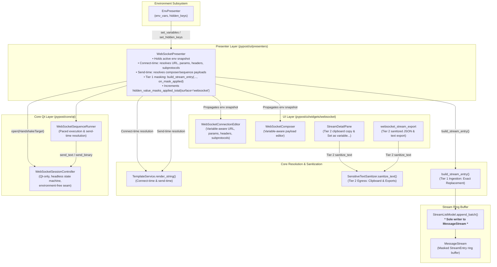
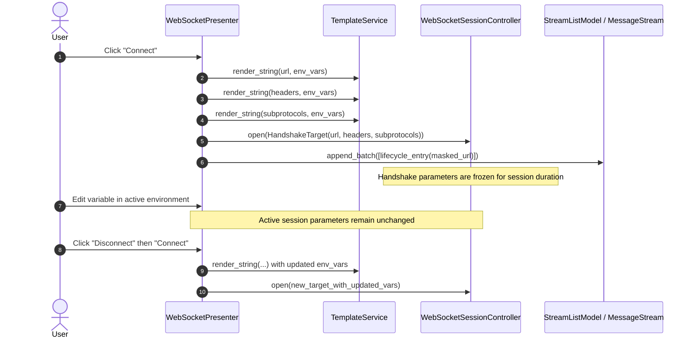
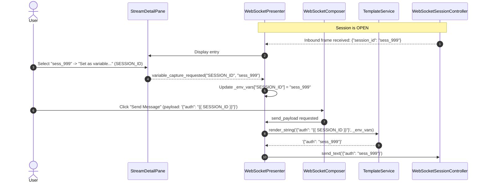

# WebSocket Environments, Templating, and Secret Masking (PYPOST-1135)

## Overview

PyPost provides unified workspace environment variable parameterization and defense-in-depth secret protection across all protocols. In WebSocket workflows (**WS-7**, Epic PYPOST-1123, task PYPOST-1135), the client subsystem extends the ingestion pipeline established in WS-4 to deliver:

- **Connect-Time Handshake Resolution**: Handshake parameters (`url`, query `params`, `headers`, `subprotocols`) resolve once at connection initiation using active environment variables via [`TemplateService`](file:///home/src/pypost/core/template_service.py). Mid-session variable modifications do not retroactively alter the active session or stream log.
- **Per-Send Dynamic Payload Resolution**: Outgoing message payloads (composer text, saved presets, sequence steps) evaluate `{{ VARIABLE }}` placeholders dynamically at the exact instant of transmission, enabling variables captured mid-session (e.g., dynamic session tokens or order IDs) to be sent immediately without reconnecting.
- **Inbound Literal Safety (Security Invariant)**: Inbound frames received from remote servers are strictly treated as immutable literal data and are **never** passed to [`TemplateService`](file:///home/src/pypost/core/template_service.py), eliminating template injection vulnerabilities.
- **Two-Tier Secret Masking**:
  - **Tier 1 (Stream Ingestion / Live Display)**: Exact substring replacement of values belonging to `hidden_keys` with `***` (`HIDDEN_PLACEHOLDER`) in [`build_stream_entry`](file:///home/src/pypost/core/websocket_stream.py). Preserves live debugging data structures without destructive heuristic regex mangling.
  - **Tier 2 (Egress / Outside Process)**: Deep heuristic sanitization via [`sanitize_text`](file:///home/src/pypost/core/sensitive_text_sanitizer.py) applied on all data leaving the process boundary (clipboard copy in [`StreamDetailPane`](file:///home/src/pypost/ui/widgets/websocket/stream_view.py), JSON and plain-text file exports in [`websocket_stream_export.py`](file:///home/src/pypost/core/websocket_stream_export.py), and MCP transcripts).
- **Variable-Aware Hover Tooltips**: Live variable inspection across all WebSocket input widgets ([`WebSocketConnectionEditor`](file:///home/src/pypost/ui/widgets/websocket/connection_editor.py) and [`WebSocketComposer`](file:///home/src/pypost/ui/widgets/websocket/composer.py)) displaying resolved values or `********` when marked hidden.
- **Observability & Telemetry Accounting**: Increments the Prometheus and OpenTelemetry counter `hidden_value_masks_applied_total{surface="websocket"}` whenever a hidden secret is masked, with strict zero-secret-leakage logging hygiene.
- **Architectural Seam Preservation**: [`WebSocketPresenter`](file:///home/src/pypost/ui/presenters/websocket_presenter.py) coordinates template resolution and secret masking; [`StreamListModel.append_batch`](file:///home/src/pypost/ui/widgets/websocket/stream_model.py) remains the sole writer to [`MessageStream`](file:///home/src/pypost/core/websocket_stream.py); and [`WebSocketSessionController`](file:///home/src/pypost/core/qt/websocket_session.py) remains headless, Qt-only, and environment-free.

---

## Architecture

### System Flow Diagram



### Module Responsibilities

| Module | Location | Primary Responsibilities |
|---|---|---|
| [`WebSocketPresenter`](file:///home/src/pypost/ui/presenters/websocket_presenter.py) | `pypost/ui/presenters/websocket_presenter.py` | Holds environment snapshot (`env_vars`, `hidden_keys` read-only properties backed by `_env_vars` / `_hidden_keys`), resolves connect-time parameters and send-time payloads via `TemplateService`, coordinates Tier 1 masking, propagates variables to UI widgets, and emits `hidden_value_masks_applied_total{surface="websocket"}` telemetry. |
| [`build_stream_entry`](file:///home/src/pypost/core/websocket_stream.py) | `pypost/core/websocket_stream.py` | Pure builder function applying Tier 1 exact hidden-secret masking (`_mask_secrets`), payload size truncation, and invoking `on_mask_applied` callback when secrets are replaced. |
| [`SensitiveTextSanitizer`](file:///home/src/pypost/core/sensitive_text_sanitizer.py) | `pypost/core/sensitive_text_sanitizer.py` | Pure Tier 2 heuristic secret sanitization engine (`sanitize_text`), matching regex patterns (Bearer tokens, API keys, JWTs) and exact hidden keys. |
| [`WebSocketStreamExport`](file:///home/src/pypost/core/websocket_stream_export.py) | `pypost/core/websocket_stream_export.py` | Dual-format transcript exporter (JSON & Plain Text) applying Tier 2 `sanitize_text` to all exported lines, payloads, details, and metadata. |
| [`WebSocketConnectionEditor`](file:///home/src/pypost/ui/widgets/websocket/connection_editor.py) | `pypost/ui/widgets/websocket/connection_editor.py` | Connection configuration pane hosting `VariableAwareLineEdit` and `WebSocketKeyValueTable` with interactive variable hover tooltips. |
| [`WebSocketComposer`](file:///home/src/pypost/ui/widgets/websocket/composer.py) | `pypost/ui/widgets/websocket/composer.py` | Message composer integrating `VariableHoverMixin` on the payload text editor with real-time format validation and dynamic send-time template resolution. |
| [`StreamDetailPane`](file:///home/src/pypost/ui/widgets/websocket/stream_view.py) | `pypost/ui/widgets/websocket/stream_view.py` | Inspects selected stream frames, enforces Tier 2 `sanitize_text` on clipboard copy actions, and supports capturing dynamic response values into environment variables via "Set as variable...". |
| [`WebSocketSequenceRunner`](file:///home/src/pypost/core/qt/websocket_sequence_runner.py) | `pypost/core/qt/websocket_sequence_runner.py` | Asynchronous sequence execution runner evaluating template variables per-step dynamically at dispatch time before encoding and transmission. |
| [`MetricsRegistry`](file:///home/src/pypost/core/metrics_registry.py) / [`MetricsOTel`](file:///home/src/pypost/core/metrics_otel.py) | `pypost/core/` | Registry managing `hidden_value_masks_applied_total` with `surface="websocket"`. |

---

## Resolution Timing and Lifecycles

### 1. Connect-Time Handshake Parameter Resolution

When the user initiates a connection (`handle_connect()`):
1. **Parameter Read**: Raw template strings are read from the connection editor:
   - Target URL (e.g. `{{ WS_HOST }}/v1/stream?token={{ WS_TOKEN }}`)
   - Query parameter table keys and values
   - Handshake header table keys and values (e.g. `Authorization: Bearer {{ AUTH_SECRET }}`)
   - Requested subprotocols (e.g. `{{ SUBPROTO }}, graphql-ws`)
2. **Template Evaluation**: Each field is resolved once using [`TemplateService.render_string(value, self._env_vars)`](file:///home/src/pypost/core/template_service.py).
3. **Frozen Target Construction**: An immutable [`HandshakeTarget`](file:///home/src/pypost/core/websocket_transport_protocol.py) is instantiated and passed to [`WebSocketSessionController.open()`](file:///home/src/pypost/core/qt/websocket_session.py).
4. **Lifecycle & Stream Logging**: The connection event recorded in [`MessageStream`](file:///home/src/pypost/core/websocket_stream.py) reflects the resolved URL (with sensitive query parameters masked) and sanitized headers.
5. **Mid-Session Independence**: Modifying environment variables while connected **does not** mutate the active connection's target or alter existing stream log entries.
6. **Reconnect Evaluation**: Reconnecting reads current environment variables, immediately picking up newly selected environments or updated values without requiring manual profile edits.



### 2. Per-Send Dynamic Payload Resolution

When an outgoing message is sent from the composer or during automated sequence execution:
1. **Dynamic Evaluation**: The raw template payload (e.g. `{"action": "subscribe", "token": "{{ SESSION_TOKEN }}"}`) is passed to [`TemplateService.render_string()`](file:///home/src/pypost/core/template_service.py) evaluated against active `_env_vars` at the exact moment of transmission.
2. **Immediate Availability of Captured Variables**: Variables extracted mid-session (such as session IDs or authentication nonces saved via "Set as variable...") are immediately resolved on the very next outgoing message without reconnecting.
3. **Codec Encoding**: The rendered string is validated and encoded into UTF-8 text or binary bytes via [`websocket_codec`](file:///home/src/pypost/core/websocket_codec.py).
4. **Wire Transmission**: Transmitted via `WebSocketSessionController.send_text()` or `send_binary()`.
5. **Tier 1 Stream Logging**: Outgoing stream entry is created with exact hidden-variable masking applied.



### 3. Inbound Literal Safety Invariant

Incoming messages from remote servers are strictly treated as data payloads:
- [`WebSocketPresenter._on_frame_received()`](file:///home/src/pypost/ui/presenters/websocket_presenter.py) passes incoming frames directly to [`build_stream_entry()`](file:///home/src/pypost/core/websocket_stream.py).
- [`TemplateService`](file:///home/src/pypost/core/template_service.py) is **never** invoked on received server frames.
- Payloads containing `{{ VAR }}`, `{{ 7*7 }}`, or Jinja control statements are preserved and displayed verbatim as literal text (subject only to Tier 1 exact hidden secret masking).

---

## Two-Tier Secret Masking Matrix

| Surface | Masking Tier | Implementation | Purpose & Invariant |
|---|---|---|---|
| **Outbound Frame Stream Log** | Tier 1 (Ingestion) | Exact replacement in [`build_stream_entry`](file:///home/src/pypost/core/websocket_stream.py) | Replaces exact values of variables in `hidden_keys` with `***` before storing in [`MessageStream`](file:///home/src/pypost/core/websocket_stream.py). |
| **Inbound Frame Stream Log** | Tier 1 (Ingestion) | Exact replacement in [`build_stream_entry`](file:///home/src/pypost/core/websocket_stream.py) | Protects credentials echoed by servers without applying destructive regex alterations to raw payloads. |
| **Lifecycle & Handshake Entries** | Tier 1 (Ingestion) | Exact replacement + URL query param sanitization | Prevents authorization tokens in headers and URLs from entering the UI ring buffer in plaintext. |
| **Detail Pane Clipboard Copy** | Tier 2 (Egress) | [`SensitiveTextSanitizer.sanitize_text`](file:///home/src/pypost/core/sensitive_text_sanitizer.py) | Sanitizes exact hidden variables and heuristic token patterns (Bearer tokens, API keys, JWTs) before writing to `QApplication.clipboard()`. |
| **JSON Transcript File Export** | Tier 2 (Egress) | [`export_stream_to_json_file`](file:///home/src/pypost/core/websocket_stream_export.py) | Fully sanitizes all exported entries, payloads, headers, and metadata before writing to disk. |
| **Plain Text File Export** | Tier 2 (Egress) | [`export_stream_to_text_file`](file:///home/src/pypost/core/websocket_stream_export.py) | Sanitizes all stream transcript lines before writing plain-text export files to disk. |
| **Application Logs** | Redacted | Structured logging with `url_masked` | Invariant: raw payloads, secret query parameters, and sensitive handshake header values are never written to logs. |
| **Metric Labels & Telemetry** | Low-cardinality | Fixed label `surface="websocket"` | Invariant: variable names, URLs, headers, and secret values are never included in metric labels. |

---

## Variable-Aware Hover Tooltips

All WebSocket parameter and payload input fields integrate PyPost's variable inspection framework:

```text
+-----------------------------------------------------------------------------------+
| URL: [ wss://api.example.com/v1/stream?token={{ AUTH_TOKEN }}                   ] |
|                                              |                                    |
|                                     +--------v---------+                          |
|                                     | Variable:        |                          |
|                                     | AUTH_TOKEN       |                          |
|                                     | Value:           |                          |
|                                     | ********         |  <-- Masked if in        |
|                                     +------------------+      hidden_keys         |
+-----------------------------------------------------------------------------------+
```

### Supported Input Surfaces

1. **[`WebSocketConnectionEditor`](file:///home/src/pypost/ui/widgets/websocket/connection_editor.py)**:
   - `WS_URL_INPUT` ([`VariableAwareLineEdit`](file:///home/src/pypost/ui/widgets/variable_aware_widgets.py))
   - `WS_SUBPROTOCOLS_INPUT` ([`VariableAwareLineEdit`](file:///home/src/pypost/ui/widgets/variable_aware_widgets.py))
   - `WS_PARAMS_TABLE` ([`WebSocketKeyValueTable`](file:///home/src/pypost/ui/widgets/websocket/connection_editor.py) / `VariableAwareTableWidget`)
   - `WS_HEADERS_TABLE` ([`WebSocketKeyValueTable`](file:///home/src/pypost/ui/widgets/websocket/connection_editor.py) / `VariableAwareTableWidget`)
2. **[`WebSocketComposer`](file:///home/src/pypost/ui/widgets/websocket/composer.py)**:
   - `WS_COMPOSER_EDIT` (Payload text editor with [`VariableHoverMixin`](file:///home/src/pypost/ui/widgets/mixins.py))
3. **[`WebSocketPresetsPanel`](file:///home/src/pypost/ui/widgets/websocket/presets_panel.py)**:
   - `WS_PRESET_PAYLOAD_EDIT` (Preset editor with [`VariableHoverMixin`](file:///home/src/pypost/ui/widgets/mixins.py))

### Hover Resolution Behavior

- **Visible Variable**: Displays resolved value string in tooltip.
- **Hidden Variable (`hidden_keys`)**: Displays `********` in tooltip.
- **Undefined Variable**: Displays indicator showing variable is unresolved in active environment.

---

## Observability & Telemetry

### Structured Logging Events

Structured log events follow the `snake_case_event key=value ...` formatting standard:

| Level | Event Name | Structured Context Fields | Purpose & Invariant |
|---|---|---|---|
| `INFO` | `websocket_connect_initiated` | `url=<masked_url>` | Logged on connection attempt. Target URL is sanitized via `sanitize_text` to redact query secrets. |
| `INFO` | `websocket_disconnect_initiated` | (none) | Logged when disconnect is requested. |
| `INFO` | `websocket_presenter_teardown` | (none) | Logged during presenter cleanup. |
| `INFO` | `websocket_stream_export_file_completed` | `format=<json\|text> entries_count=<n> path=<path>` | Logged upon successful sanitized transcript file export. |
| `DEBUG` | `websocket_sending_message` | `length=<n>` | Logs payload character length; strictly omits raw payload content. |
| `WARNING` | `websocket_send_blocked_not_open` | `state=<state>` | Logged when send is attempted while session is not in `OPEN` state. |
| `WARNING` | `run_sequence_blocked_not_open` | `state=<state>` | Logged when sequence execution is attempted on a non-open session. |
| `WARNING` | `websocket_stream_export_file_failed` | `format=<format> error=<exc>` | Logged when export write fails. |

### Metrics Tracking

- **Metric**: `hidden_value_masks_applied_total` (Counter)
- **Label**: `surface="websocket"`
- **Trigger**: Incremented each time a hidden secret value is replaced during Tier 1 stream ingestion (`build_stream_entry`) or Tier 2 egress sanitization (`sanitize_text`).
- **Telemetry Registries**: Registered in both [`MetricsRegistry`](file:///home/src/pypost/core/metrics_registry.py) (Prometheus client) and [`MetricsOTel`](file:///home/src/pypost/core/metrics_otel.py) (OpenTelemetry).

---

## API & Usage Examples

### 1. Operating `WebSocketPresenter` with Environment Snapshots

```python
from pypost.models.websocket import WebSocketConnection
from pypost.ui.presenters.websocket_presenter import WebSocketPresenter
from pypost.core.template_service import TemplateService
from pypost.core.metrics_registry import MetricsRegistry

connection = WebSocketConnection(
    url="{{ WS_BASE_URL }}/realtime",
    headers={"Authorization": "Bearer {{ WS_SECRET_TOKEN }}"},
)

presenter = WebSocketPresenter(
    connection=connection,
    env_vars={"WS_BASE_URL": "wss://api.example.com", "WS_SECRET_TOKEN": "secret_abc123"},
    hidden_keys={"WS_SECRET_TOKEN"},
    template_service=TemplateService(),
    metrics=MetricsRegistry(),
)

# Connect: resolves URL and headers at connect time
presenter.handle_connect()

# Dynamically update variables when workspace environment switches
presenter.set_variables({"WS_BASE_URL": "wss://prod.example.com", "WS_SECRET_TOKEN": "prod_sec_999"})
presenter.set_hidden_keys({"WS_SECRET_TOKEN"})

# Read active snapshots via public properties (defensive copies)
active_vars = presenter.env_vars
active_hidden = presenter.hidden_keys
```

### 2. Exporting Dual-Format Transcripts with Tier 2 Sanitization

```python
from pathlib import Path
from pypost.core.websocket_stream import MessageStream
from pypost.core.websocket_stream_export import export_stream_to_json_file, export_stream_to_text_file

stream = MessageStream(max_entries=1000)

env_vars = {"API_KEY": "super_secret_key_123"}
hidden_keys = {"API_KEY"}

# Export sanitized JSON transcript
json_path = export_stream_to_json_file(
    target_path=Path("/tmp/ws_transcript.json"),
    stream=stream,
    env_vars=env_vars,
    hidden_keys=hidden_keys,
)

# Export sanitized Plain Text transcript
text_path = export_stream_to_text_file(
    target_path=Path("/tmp/ws_transcript.txt"),
    stream=stream,
    env_vars=env_vars,
    hidden_keys=hidden_keys,
)
```

---

## Troubleshooting Guide

| Symptom | Probable Cause | Diagnostic / Solution |
|---|---|---|
| Handshake header or URL changes in environment editor mid-session but stream doesn't update | **Expected Behavior**. Handshake parameters resolve once at connect time to preserve historical wire accuracy. | Disconnect and click **Connect** again to initiate a new handshake using the updated environment variables. |
| Outgoing message payload fails to resolve `{{ VAR }}` | Variable is missing from the active environment or has a syntax typo. | Check active environment in the environment selector. Hover over `{{ VAR }}` in the composer to verify whether the variable resolves. |
| Inbound message containing `{{ ... }}` is not evaluated as a template | **Security Invariant**. Inbound server payloads are never evaluated by `TemplateService` to prevent template injection attacks. | If values from server responses need to be sent in outgoing messages, use **Set as variable...** in the stream detail pane to save the value into an environment variable. |
| Sensitive token appears in stream log | Variable containing the token is not marked in `hidden_keys` (not flagged as hidden). | Open the **Environments Dialog**, locate the variable, and enable the **Hidden** checkbox. |
| Clipboard copy contains `***` or masked placeholders | **Expected Behavior**. Tier 2 heuristic sanitization (`sanitize_text`) runs on clipboard copy in `StreamDetailPane` to prevent secret leakage. | Secret masking is an automated safety guarantee for hidden environment variables. |
| `hidden_value_masks_applied_total` metric does not increment | Presenter initialized without `MetricsRegistry` or `on_mask_applied` callback omitted. | Ensure `WebSocketPresenter` is constructed with `metrics=MetricsRegistry.get_instance()`. |

---

## Related Documentation

- [`doc/dev/websocket_session_engine.md`](websocket_session_engine.md) — Transport seam, `RawFrame`, and session controller.
- [`doc/dev/websocket_message_stream.md`](websocket_message_stream.md) — Stream ring buffer, dual FIFO eviction, and codecs.
- [`doc/dev/websocket_ui_client.md`](websocket_ui_client.md) — UI client tab, state badges, and splitters.
- [`doc/dev/websocket_stream_inspector.md`](websocket_stream_inspector.md) — Virtualized live stream model and detail pane.
- [`doc/dev/websocket_composer_presets_sequences.md`](websocket_composer_presets_sequences.md) — Composer format switching, presets CRUD, and sequence runner.
- [`doc/dev/template_service.md`](template_service.md) — Central Jinja-compatible variable substitution service.
- [`doc/dev/sensitive_data_masking_policy.md`](sensitive_data_masking_policy.md) — PyPost defense-in-depth masking policy.
- [`doc/dev/hidden_variables.md`](hidden_variables.md) — Hidden variable mechanics and environment storage.
