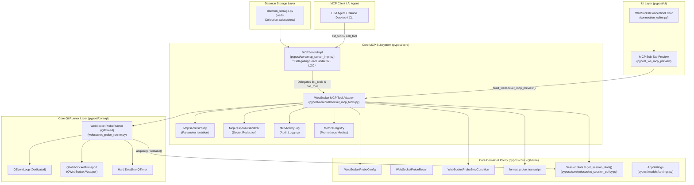
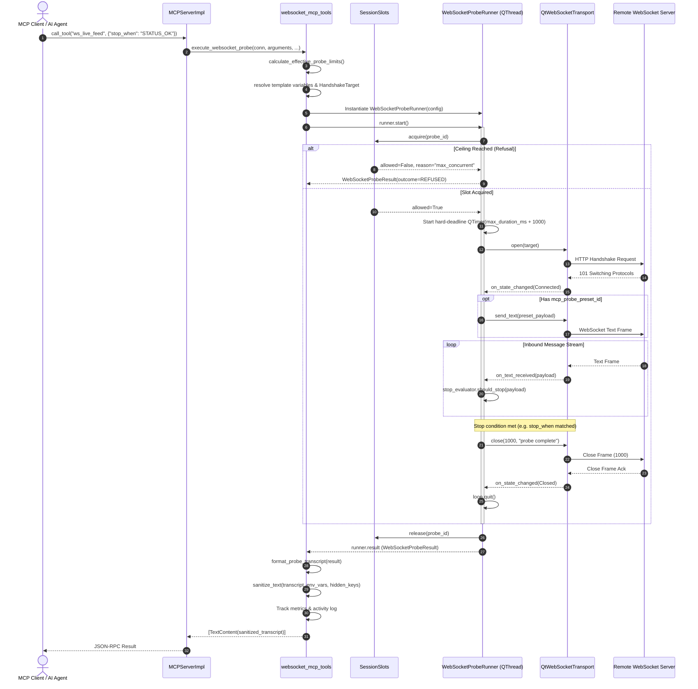

# Bounded MCP WebSocket Probe Tool (PYPOST-1137)

## Overview

The Bounded Model Context Protocol (MCP) WebSocket Probe Tool (**WS-9**, Epic PYPOST-1123, task
PYPOST-1137) equips AI agents and automated clients with a safe, deterministic, and bounded mechanism
to sample real-time WebSocket streams (such as live market data tickers, IoT feeds, event notification
streams, and telemetry channels) within PyPost.

### Motivation & Bounded Sampling Pattern (D-5)

Traditional HTTP endpoints operate on a standard request/response cycle where each transaction has a
finite completion boundary. In contrast, WebSocket connections are bidirectional, persistent, and
open-ended by design. Permitting automated AI agents to initiate unconstrained, persistent WebSocket
connections introduces critical operational risks:

- **Zombie Connections & Descriptor Leaks**: An agent that opens a connection but fails to explicitly
  close it leaves open TCP/TLS socket handles indefinitely.
- **Unbounded Memory Growth**: Continuous message ingestion on unmonitored connections rapidly
  exhausts process memory buffers.
- **Headless Daemon Hazards**: In server deployments managed by `pypost-daemon` without a GUI operator,
  abandoned sessions accumulate silently without interactive oversight.

To resolve these challenges, WS-9 applies PyPost's **Bounded Sampling Pattern (D-5)** (originally
proven for Server-Sent Events in HTTP request workflows) to WebSocket endpoints:

```text
+-----------------------------------------------------------------------------------+
|                           Bounded Probe Lifecycle                                 |
|                                                                                   |
|  [Agent calls tool]                                                               |
|          |                                                                        |
|          v                                                                        |
|  1. Acquire Slot (SessionSlots concurrency ceiling)                               |
|          |                                                                        |
|          v                                                                        |
|  2. Open Socket & Handshake (URL, headers, subprotocols resolved)                 |
|          |                                                                        |
|          v                                                                        |
|  3. Send Initial Preset (optional handshake/subscription payload)                 |
|          |                                                                        |
|          v                                                                        |
|  4. Buffer Inbound Frames until FIRST stopping condition:                         |
|     - Message count reaches effective max limit                                   |
|     - Duration reaches effective timeout (hard deadline)                          |
|     - Inbound message body matches 'stop_when' substring                          |
|     - Server closes or encounters error                                           |
|          |                                                                        |
|          v                                                                        |
|  5. Clean Close (RFC 6455 code 1000 "probe complete") & Thread Termination        |
|          |                                                                        |
|          v                                                                        |
|  6. Release Slot, Sanitize Transcript (mask secrets), Return List[TextContent]    |
+-----------------------------------------------------------------------------------+
```

### Key Capabilities

- **Single-Turn Sampling**: Transforms an open-ended streaming protocol into a deterministic, single-turn
  tool invocation returning a structured text transcript.
- **Strict Global Ceilings**: Enforces non-bypassable global bounds (`ws_mcp_probe_max_messages`,
  `ws_mcp_probe_max_duration_ms`) configured in [`AppSettings`](file:///home/src/pypost/models/settings.py).
- **Strict Parameter Isolation**: Exposes only `mcp.request.*` variables as schema arguments in
  `list_tools`; hidden keys, environment variables, and authentication tokens are strictly stripped
  from tool schemas and injected only at runtime.
- **Two-Tier Secret Redaction**: Applies [`SensitiveTextSanitizer.sanitize_text`](file:///home/src/pypost/core/sensitive_text_sanitizer.py)
  to all egress transcripts before returning results to agents.
- **Guaranteed Thread Lifetime**: Runs each probe in a short-lived [`WebSocketProbeRunner`](file:///home/src/pypost/core/qt/websocket_probe_runner.py)
  (`QThread`) with its own `QEventLoop` and a hard deadline `QTimer`, ensuring zero thread leaks even
  under peer hangs or network errors.
- **Process-Wide Concurrency Governance**: Integrates directly with [`SessionSlots`](file:///home/src/pypost/core/websocket_session_policy.py)
  to respect the `ws_max_concurrent_sessions` ceiling, returning safe, structured refusal messages
  when capacity is exhausted.
- **Headless Daemon Compatibility**: Runs on `QCoreApplication` without requiring an X11/Wayland display
  server; supported by strict collection snapshot loading in [`daemon_storage.py`](file:///home/src/pypost/core/daemon_storage.py).
- **UI Contract Preview**: Provides an interactive MCP preview sub-tab in the WebSocket connection
  editor ([`WebSocketConnectionEditor`](file:///home/src/pypost/ui/widgets/websocket/connection_editor.py))
  displaying the generated JSON schema, parameter table, and agent documentation.
- **Comprehensive Observability**: Logs every invocation in [`McpActivityLog`](file:///home/src/pypost/core/mcp_activity_log.py)
  and tracks durations and outcomes in Prometheus metrics (`websocket_probe_duration_seconds{outcome}`).

---

## Architecture & Component Design

### Component Architecture Diagram



### Module Responsibilities

| Module | Location | Layer | Primary Responsibilities |
|---|---|---|---|
| [`websocket_probe.py`](file:///home/src/pypost/core/websocket_probe.py) | `pypost/core/websocket_probe.py` | Core Domain (Qt-Free) | Dataclasses ([`WebSocketProbeConfig`](file:///home/src/pypost/core/websocket_probe.py), [`WebSocketProbeResult`](file:///home/src/pypost/core/websocket_probe.py), [`ProbeEvent`](file:///home/src/pypost/core/websocket_probe.py)), stopping condition evaluator ([`WebSocketProbeStopCondition`](file:///home/src/pypost/core/websocket_probe.py)), effective limit clamping ([`calculate_effective_probe_limits`](file:///home/src/pypost/core/websocket_probe.py)), and formatted transcript builder ([`format_probe_transcript`](file:///home/src/pypost/core/websocket_probe.py)). |
| [`websocket_probe_runner.py`](file:///home/src/pypost/core/qt/websocket_probe_runner.py) | `pypost/core/qt/websocket_probe_runner.py` | Core Qt | Short-lived `QThread` executing probe connections on a dedicated `QEventLoop`, managing initial preset transmission, evaluating stopping conditions, enforcing hard-deadline timers, and coordinating with `SessionSlots`. |
| [`websocket_mcp_tools.py`](file:///home/src/pypost/core/websocket_mcp_tools.py) | `pypost/core/websocket_mcp_tools.py` | MCP Core (Qt-Free) | Schema extraction with strict parameter isolation ([`extract_websocket_mcp_variables`](file:///home/src/pypost/core/websocket_mcp_tools.py), [`build_websocket_mcp_tool_schema`](file:///home/src/pypost/core/websocket_mcp_tools.py)), UI contract preview generation ([`build_websocket_mcp_preview`](file:///home/src/pypost/core/websocket_mcp_tools.py)), and execution dispatch bridge ([`execute_websocket_probe`](file:///home/src/pypost/core/websocket_mcp_tools.py)). |
| [`mcp_server_impl.py`](file:///home/src/pypost/core/mcp_server_impl.py) | `pypost/core/mcp_server_impl.py` | MCP Server | Central MCP server implementation. Delegates WebSocket tool discovery and execution dispatch to `websocket_mcp_tools.py`, maintaining strict LOC adherence under the 325-line cap. |
| [`websocket_session_policy.py`](file:///home/src/pypost/core/websocket_session_policy.py) | `pypost/core/websocket_session_policy.py` | Core Domain (Qt-Free) | Thread-safe [`SessionSlots`](file:///home/src/pypost/core/websocket_session_policy.py) manager enforcing the process-wide `ws_max_concurrent_sessions` ceiling across GUI tabs and background probe threads. |
| [`daemon_storage.py`](file:///home/src/pypost/core/daemon_storage.py) | `pypost/core/daemon_storage.py` | Storage | Strict collection snapshot loader for headless daemon mode, validating and providing `Collection.websockets` profiles to `MCPServerRegistry`. |
| [`connection_editor.py`](file:///home/src/pypost/ui/widgets/websocket/connection_editor.py) | `pypost/ui/widgets/websocket/connection_editor.py` | UI (PySide6) | Connection profile editor hosting the MCP configuration sub-tab with live contract preview rendering and input synchronization. |

---

## Domain Models & Policies

All domain models in [`pypost/core/websocket_probe.py`](file:///home/src/pypost/core/websocket_probe.py) are pure Python dataclasses without GUI or Qt dependencies.

### Domain Enums & Dataclasses

```python
class ProbeOutcome(str, Enum):
    """Possible terminal outcomes for a probe execution."""
    SUCCESS = "success"                      # Normal completed probe
    LIMIT_REACHED = "limit_reached"          # Reached max message count
    STOP_WHEN_MATCHED = "stop_when_matched"  # Inbound message matched stop_when substring
    TIMEOUT = "timeout"                      # Reached wall-clock duration limit
    ERROR = "error"                          # Socket / network / TLS / HTTP handshake failure
    REFUSED = "refused"                      # Refused due to session concurrency ceiling


@dataclass(frozen=True)
class ProbeEvent:
    """A single recorded event in the probe session transcript."""
    timestamp_iso: str                       # ISO-8601 UTC timestamp
    direction: str                           # "connect" | "sent" | "received" | "closed" | "error" | "timeout"
    payload: str                             # Event description or message payload text
    is_binary: bool = False                  # True for binary frames
    byte_size: int = 0                       # Payload size in bytes


@dataclass(frozen=True)
class WebSocketProbeConfig:
    """Immutable configuration passed to the probe runner."""
    target: HandshakeTarget                  # URL, headers, and subprotocols
    initial_payload: Optional[str] = None    # Rendered preset payload to send on connect
    initial_format: str = "json"             # Payload format: json, text, binary, hex
    max_messages: int = 10                   # Clamped maximum message limit
    max_duration_ms: int = 10_000            # Clamped maximum duration timeout in ms
    stop_when: Optional[str] = None          # Early termination substring
    probe_id: str = ""                       # Unique identifier for slot tracking


@dataclass
class WebSocketProbeResult:
    """Structured result produced upon probe completion."""
    outcome: ProbeOutcome
    messages_received: int
    duration_ms: float
    events: List[ProbeEvent] = field(default_factory=list)
    close_code: Optional[int] = None
    close_reason: Optional[str] = None
    error_message: Optional[str] = None
```

### Effective Limits Calculation

Per-profile settings configured on a [`WebSocketConnection`](file:///home/src/pypost/models/websocket.py)
(`mcp_probe_max_messages`, `mcp_probe_max_duration_ms`) can tighten probe bounds for specific
endpoints, but they **cannot** exceed the global limits configured in [`AppSettings`](file:///home/src/pypost/models/settings.py):

$$\text{effective\_messages} = \max\left(1, \min(\text{profile.mcp\_probe\_max\_messages} \text{ or } \text{settings.ws\_mcp\_probe\_max\_messages}, \text{settings.ws\_mcp\_probe\_max\_messages})\right)$$

$$\text{effective\_duration\_ms} = \max\left(100, \min(\text{profile.mcp\_probe\_max\_duration\_ms} \text{ or } \text{settings.ws\_mcp\_probe\_max\_duration\_ms}, \text{settings.ws\_mcp\_probe\_max\_duration\_ms})\right)$$

```python
def calculate_effective_probe_limits(
    conn: WebSocketConnection,
    settings: Optional[AppSettings] = None,
) -> tuple[int, int]:
    """Calculate message and duration bounds clamped by global ceilings."""
    global_max_msgs = settings.ws_mcp_probe_max_messages if settings else 10
    global_max_dur = settings.ws_mcp_probe_max_duration_ms if settings else 10_000

    profile_msgs = conn.mcp_probe_max_messages or global_max_msgs
    profile_dur = conn.mcp_probe_max_duration_ms or global_max_dur

    effective_msgs = max(1, min(profile_msgs, global_max_msgs))
    effective_dur = max(100, min(profile_dur, global_max_dur))
    return effective_msgs, effective_dur
```

### Stopping Condition Evaluator

The [`WebSocketProbeStopCondition`](file:///home/src/pypost/core/websocket_probe.py) evaluator inspects
each inbound frame sequentially:

```python
class WebSocketProbeStopCondition:
    """Evaluates whether message intake should terminate."""

    def __init__(self, max_messages: int, stop_when: Optional[str] = None) -> None:
        self.max_messages = max_messages
        self.stop_when = stop_when
        self.messages_count = 0

    def should_stop(self, message: str) -> tuple[bool, Optional[ProbeOutcome]]:
        self.messages_count += 1
        if self.stop_when and self.stop_when in message:
            return True, ProbeOutcome.STOP_WHEN_MATCHED
        if self.messages_count >= self.max_messages:
            return True, ProbeOutcome.LIMIT_REACHED
        return False, None
```

---

## Runner Lifecycle & Hard Deadline Guarantee

### Execution Model

MCP tool requests arrive via HTTP/SSE JSON-RPC endpoints handled on uvicorn's `asyncio` event loop.
Because `QWebSocket` requires a Qt event loop (`QEventLoop`) on the thread that created the socket,
probes cannot run directly on uvicorn's worker threads or block the Qt main GUI thread.

[`WebSocketProbeRunner`](file:///home/src/pypost/core/qt/websocket_probe_runner.py) solves this by
subclassing `QThread`:

```text
[ MCP Server: call_tool() ]
         |
         v (run_in_threadpool)
[ ThreadPool Worker Thread ]
         |
         v instantiates & starts
[ WebSocketProbeRunner (QThread) ]
   +-------------------------------------------------------------+
   | - Dedicated QEventLoop (loop.exec())                         |
   | - QtWebSocketTransport (QWebSocket wrapper)                 |
   | - Hard Deadline QTimer (max_duration_ms + 1000ms grace)     |
   | - Coordinates slot acquisition via SessionSlots             |
   | - Sends initial preset frame upon handshake completion      |
   | - Ingests frames & tests WebSocketProbeStopCondition        |
   | - Sends close code 1000 & quits loop on terminal condition  |
   +-------------------------------------------------------------+
         |
         v runner.wait(timeout) [Bounded synchronous join]
[ ThreadPool Worker Thread ]
         |
         v returns sanitized List[TextContent]
[ MCP Server: returns JSON-RPC response to Agent ]
```

### Sequence Diagram: `call_tool` Execution & Termination



### Guaranteed Thread Termination & Fallback Clean-up

To guarantee that probe threads never leak or hang the application:

1. **Normal Flow**: On reaching message limits, duration timeouts, or `stop_when` matches, the runner
   issues a clean WebSocket close frame (code 1000), stops the timer, and quits `QEventLoop`.
2. **Hard Deadline Timer**: A dedicated `QTimer` (`max_duration_ms + 1000ms grace`) fires if the
   remote peer stalls or ignores close frames, forcibly calling `transport.abort()` and `loop.quit()`.
3. **Bounded Thread Join**: The caller executes `runner.wait(timeout_ms)`.
4. **Fallback Termination**: If `runner.isRunning()` remains `True` after the wait window, the runner
   is forcibly aborted via `runner.terminate()` and `runner.wait(500)`.
5. **Session Slot Release**: Slot release occurs in a `finally:` block inside the runner's `run()` method,
   guaranteeing slot recovery under all circumstances (normal exit, exception, timeout, or abort).

---

## Parameter Isolation & Secret Redaction

### Schema Generation & Variable Discovery

PyPost implements a strict separation between user-configurable MCP parameters and private environment
secrets:

- **Placeholder Discovery**: [`extract_websocket_mcp_variables`](file:///home/src/pypost/core/websocket_mcp_tools.py)
  scans the connection's URL, headers, query parameters, and designated probe preset payload for
  `{{ mcp.request.<param_name> }}` placeholders using regex `r"mcp\.request\.([a-zA-Z0-9_]+)"`.
- **Secret Exclusion**: Any key present in `hidden_keys` or environment variables is strictly
  excluded from the generated JSON schema in `list_tools`.
- **Automatic `stop_when` Argument**: Every WebSocket probe tool automatically includes an optional
  `stop_when` string parameter in its schema, allowing agents to specify custom early-exit criteria.

```json
{
  "name": "ws_live_orderbook",
  "description": "Sample live orderbook streaming feed",
  "inputSchema": {
    "type": "object",
    "properties": {
      "symbol": {
        "type": "string",
        "description": "Trading pair symbol (e.g. BTCUSDT)"
      },
      "stop_when": {
        "type": "string",
        "description": "Stop probe early when an incoming message body contains this substring"
      }
    },
    "required": ["symbol"]
  }
}
```

### In-Flight Resolution & Runtime Context

When an agent invokes `call_tool`, parameters are resolved hierarchically via [`TemplateService`](file:///home/src/pypost/core/template_service.py):

```python
merged_vars = {
    **env_vars,
    "mcp": {
        "request": arguments or {}
    }
}
```

1. Handshake URL, headers, query params, and initial preset payload are rendered with `merged_vars`.
2. Secrets from `env_vars` (e.g. `{{ API_SECRET }}`) are securely injected into the transport
   handshake without ever having been exposed in `list_tools`.

### Two-Tier Secret Masking on Output Transcripts

Before the transcript is returned to the agent, [`format_probe_transcript`](file:///home/src/pypost/core/websocket_probe.py)
applies [`McpResponseSanitizer.sanitize_text`](file:///home/src/pypost/core/mcp_response_sanitizer.py)
with the active environment's variable values and `hidden_keys`:

```text
=== WebSocket Probe Transcript ===
Outcome: limit_reached
Duration: 142.5ms
Messages Received: 3
Close Code: 1000 (probe complete)
--- Event Log ---
[2026-08-23T22:30:00.100Z] [CONNECT] Connected to wss://stream.example.com/ws?token=***
[2026-08-23T22:30:00.120Z] [SENT] {"action":"auth","key":"***"}
[2026-08-23T22:30:00.150Z] [RECEIVED] {"status":"authenticated","user_id":"u_123"}
[2026-08-23T22:30:00.200Z] [RECEIVED] {"topic":"ticker","price":65432.10}
[2026-08-23T22:30:00.240Z] [RECEIVED] {"topic":"ticker","price":65435.00}
[2026-08-23T22:30:00.242Z] [CLOSED] Code: 1000, Reason: probe complete
```

---

## Concurrency Governance & SessionSlots

WebSocket probes share the process-wide concurrent session pool with interactive GUI tabs:

- **Atomic Acquisition**: Before establishing network connections, `WebSocketProbeRunner.run()` invokes
  `SessionSlots.acquire(probe_id)`.
- **Refusal Response**: If active sessions equal or exceed `AppSettings.ws_max_concurrent_sessions`,
  `acquire()` returns `allowed=False`. The probe immediately returns a structured refusal message
  without opening a socket or spawning background network operations:
  ```text
  WebSocket probe refused: session limit reached (8 of 8 active sessions). Disconnect an existing session to proceed.
  ```
- **Lockdown Mode**: When `ws_max_concurrent_sessions = 0`, all probe executions are deterministically
  blocked with operator-policy refusal messages.
- **Guaranteed Release**: `SessionSlots.release(probe_id)` is invoked in a `finally` block on every
  exit path, ensuring zero slot leaks.

---

## UI Contract Preview

The [`WebSocketConnectionEditor`](file:///home/src/pypost/ui/widgets/websocket/connection_editor.py)
provides an integrated **MCP** sub-tab in its detail tab collection:

```text
+-------------------------------------------------------------------------------+
|  Headers  |  Query Params  |  Subprotocols  |  Presets  |  Settings  |  MCP   |
+-------------------------------------------------------------------------------+
|  [X] Expose as MCP Tool                                                       |
|                                                                               |
|  Tool Description:                                                            |
|  [ Sample real-time telemetry from connected device                      ]    |
|                                                                               |
|  Initial Message Preset:                                                      |
|  [ Subscribe Telemetry (JSON)                                          v ]    |
|                                                                               |
|  Max Messages Override: [ 10 ]     Max Duration Override (ms): [ 5000 ]       |
|                                                                               |
|  --- Agent Tool Contract Preview (Read-Only) -------------------------------- |
|  Tool Name: ws_device_telemetry                                               |
|  Description: Sample real-time telemetry from connected device                |
|  JSON Schema:                                                                 |
|  {                                                                            |
|    "type": "object",                                                          |
|    "properties": {                                                            |
|      "device_id": { "type": "string", "description": "Target device ID" },   |
|      "stop_when": { "type": "string", "description": "Stop probe early..." }  |
|    },                                                                         |
|    "required": ["device_id"]                                                  |
|  }                                                                            |
+-------------------------------------------------------------------------------+
```

The preview updates in real-time as the connection name, URL, headers, parameters, presets, and
overrides are edited.

---

## Configuration & Global Settings

All MCP WebSocket probe operational limits are configured in [`AppSettings`](file:///home/src/pypost/models/settings.py):

| Setting Field | Type | Default | Operational Description |
|---|---|---|---|
| `ws_mcp_probe_max_messages` | `int` | `10` | Global hard ceiling on message count per probe execution. |
| `ws_mcp_probe_max_duration_ms` | `int` | `10000` | Global hard ceiling on duration (ms) per probe execution. |
| `ws_max_concurrent_sessions` | `int` | `8` | Process-wide ceiling on concurrent open sessions (GUI + MCP). |

---

## Observability & Auditability

### McpActivityLog Integration

Every probe execution records an entry in [`McpActivityLog`](file:///home/src/pypost/core/mcp_activity_log.py):

```python
activity_log.append(
    McpActivityEntry.new_call_tool(
        tool_name="ws_binance_ticker",
        outcome=result.outcome.value,
        mcp_arg_count=len(arguments),
        detail=result.error_message,
        duration_ms=result.duration_ms,
    )
)
```

### Prometheus Metrics

| Metric Name | Type | Labels | Description |
|---|---|---|---|
| `websocket_probe_duration_seconds` | Histogram | `outcome` (`success`, `limit_reached`, `stop_when_matched`, `timeout`, `error`, `refused`) | Probe execution duration distribution. |
| `websocket_session_start_refused_total` | Counter | `reason` (`max_concurrent`, `lockdown`) | Total refused connection attempts due to session ceilings. |

---

## Testing Strategy

The bounded MCP WebSocket probe implementation is validated by automated test suites under `tests/`:

- **Schema & Parameter Isolation Tests** ([`tests/test_websocket_mcp_probe_repro.py`](file:///home/src/tests/test_websocket_mcp_probe_repro.py)):
  Validates that `list_tools` produces expected schemas, isolates `mcp.request.*` parameters, and
  strictly excludes hidden keys.
- **Deterministic Execution Tests**:
  Validates message count bounds, duration timeouts, preset payload delivery, and `stop_when` substring
  matching against local [`ScriptedWebSocketServer`](file:///home/src/pypost/core/testing/scripted_websocket_server.py).
- **Thread Lifecycle & Termination Tests**:
  Verifies that `runner.isFinished()` is `True` and `runner.isRunning()` is `False` after every execution,
  confirming zero thread leaks under success, timeout, and network errors.
- **Concurrency & Refusal Tests**:
  Validates that `call_tool` returns a non-crashing refusal result when `SessionSlots` is full.
- **Headless Daemon Tests**:
  Verifies that probe tools execute correctly under `QCoreApplication` without display server dependencies.
