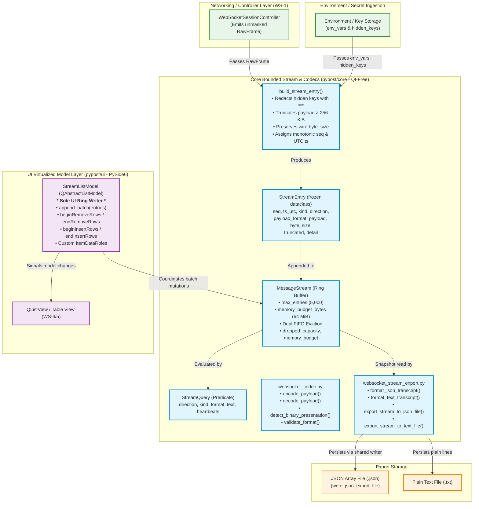
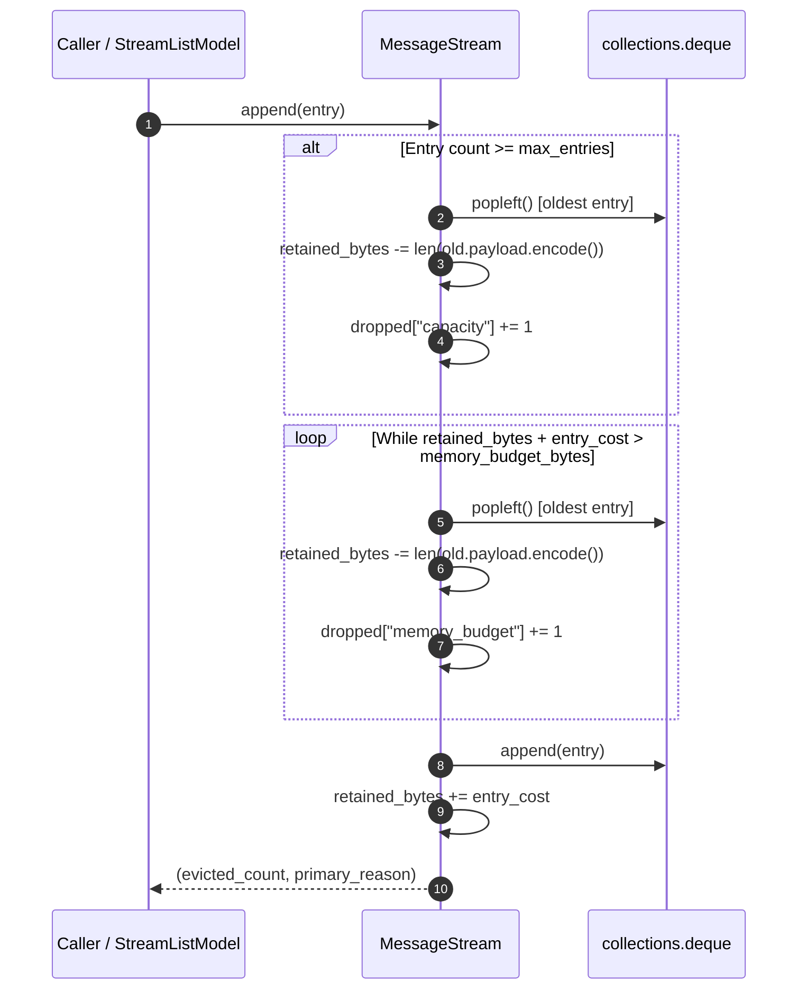
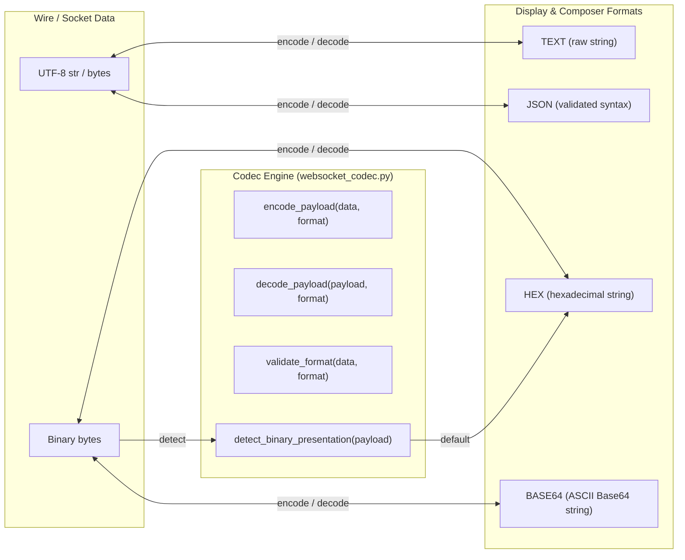
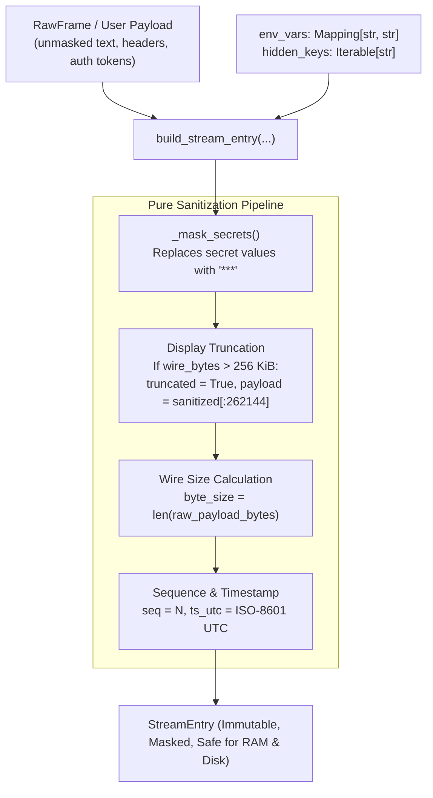
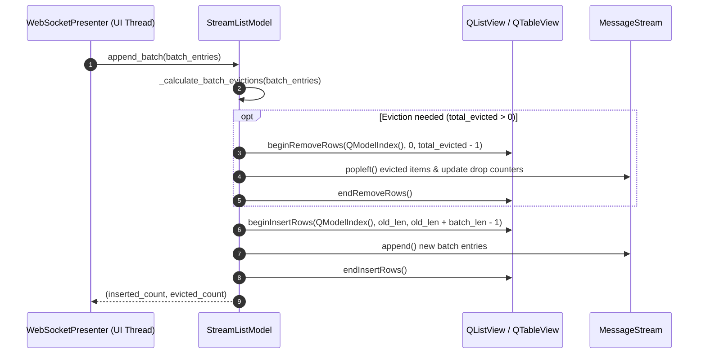

# WebSocket Message Stream, Codecs, and Transcript Export

## Overview

PyPost provides memory-bounded stream storage, payload codecs, transcript export engines, and virtualized UI list models for real-time WebSocket communication (**WS-3**, Epic PYPOST-1123). In high-throughput streaming environments, unbounded message retention poses severe risks of memory exhaustion, UI stutter, and data leakage. This subsystem establishes deterministic memory bounding, multi-format encoding/decoding, drop accounting, secret-safe exports, and high-frequency Qt list model synchronization.

Key architectural design principles include:
- **Dual-Dimension Bounded Retention**: In-memory message storage in [`MessageStream`](file:///home/src/pypost/core/websocket_stream.py#L75-L170) is strictly capped by both max entry count (`max_entries = 5000`) and payload byte budget (`memory_budget_bytes = 64 MiB`), operating strictly oldest-first (FIFO).
- **Transparent Drop Accounting**: Evicted messages are accurately tracked and categorized by eviction cause (`dropped["capacity"]`, `dropped["memory_budget"]`), and drop statistics are surfaced to UI presenters and embedded in export headers.
- **Pure Masking at Stream Entry Intake**: Secret masking occurs at write time before entries enter memory buffers or export files via the pure, Qt-free [`build_stream_entry`](file:///home/src/pypost/core/websocket_stream.py#L188-L274) factory using explicit environment variables and hidden keys.
- **Display Truncation with Wire Size Fidelity**: Messages exceeding `ws_display_truncate_bytes` (default 256 KiB) are retained truncated for fast UI rendering while preserving their true wire length in `StreamEntry.byte_size`.
- **Multi-Format Codecs & Validation**: Comprehensive encoders, decoders, and validators in [`websocket_codec`](file:///home/src/pypost/core/websocket_codec.py) supporting `text`, `json`, `hex`, and `base64` formats, with binary presentation defaulting to hexadecimal.
- **Deterministic Transcript Export**: Safe export of session transcripts to structured JSON arrays (reusing [`write_json_export_file`](file:///home/src/pypost/core/export_file_writer.py#L32-L73)) and plain text files with embedded drop metadata.
- **Virtualized Qt List Model**: [`StreamListModel`](file:///home/src/pypost/ui/widgets/websocket/stream_model.py#L27-L173) implements `QAbstractListModel` over the ring buffer, where [`append_batch`](file:///home/src/pypost/ui/widgets/websocket/stream_model.py#L123-L166) is the sole UI write path, emitting synchronized `beginRemoveRows`/`endRemoveRows` and `beginInsertRows`/`endInsertRows` signals.
- **Strict Layering & Qt-Free Core**: All stream, codec, query, and export modules reside in `pypost/core/` with zero Qt dependencies. PySide6 is restricted to `pypost/ui/widgets/websocket/stream_model.py`.

---

## Architecture

### System Module Diagram



---

## 4-Module Breakdown

The stream subsystem is organized into four decoupled modules across `pypost/core/` and `pypost/ui/widgets/websocket/`:

| Module | Location | Dependencies | Primary Responsibilities |
|---|---|---|---|
| [`websocket_stream`](file:///home/src/pypost/core/websocket_stream.py) | `pypost/core/websocket_stream.py` | Python stdlib (`dataclasses`, `collections`, `datetime`, `logging`, `typing`), [`websocket_transport_protocol`](file:///home/src/pypost/core/websocket_transport_protocol.py) | Defines [`StreamEntry`](file:///home/src/pypost/core/websocket_stream.py#L28-L41), [`StreamQuery`](file:///home/src/pypost/core/websocket_stream.py#L44-L73), [`MessageStream`](file:///home/src/pypost/core/websocket_stream.py#L75-L170) bounded ring buffer with dual eviction, and pure entry factory [`build_stream_entry`](file:///home/src/pypost/core/websocket_stream.py#L188-L274). **Zero Qt imports**. |
| [`websocket_codec`](file:///home/src/pypost/core/websocket_codec.py) | `pypost/core/websocket_codec.py` | Python stdlib (`base64`, `binascii`, `json`), [`WsMessageFormat`](file:///home/src/pypost/models/websocket.py#L69) | Bidirectional payload encoding, decoding, syntax validation, and binary presentation detection across `text`, `json`, `hex`, and `base64`. **Zero Qt imports**. |
| [`websocket_stream_export`](file:///home/src/pypost/core/websocket_stream_export.py) | `pypost/core/websocket_stream_export.py` | Python stdlib (`datetime`, `logging`, `pathlib`, `typing`), [`export_file_writer`](file:///home/src/pypost/core/export_file_writer.py), [`websocket_stream`](file:///home/src/pypost/core/websocket_stream.py) | Structured JSON array and Plain Text transcript formatting, embedding drop accounting metadata, and atomic disk persistence. **Zero Qt imports**. |
| [`stream_model`](file:///home/src/pypost/ui/widgets/websocket/stream_model.py) | `pypost/ui/widgets/websocket/stream_model.py` | `PySide6.QtCore` (`QAbstractListModel`, `QModelIndex`, `Qt`), [`websocket_stream`](file:///home/src/pypost/core/websocket_stream.py) | Virtualized Qt list model implementing [`StreamListModel`](file:///home/src/pypost/ui/widgets/websocket/stream_model.py#L27-L173), custom roles, and single-transaction [`append_batch`](file:///home/src/pypost/ui/widgets/websocket/stream_model.py#L123-L166) eviction/insertion signaling. **Sole PySide6 consumer in WS-3**. |

---

## Data Models & Ring Buffer Mechanics

### 1. `StreamEntry` Immutable Data Model

[`StreamEntry`](file:///home/src/pypost/core/websocket_stream.py#L28-L41) represents a single discrete event in a WebSocket session (message transmission, reception, or lifecycle transition):

```python
@dataclass(frozen=True)
class StreamEntry:
    seq: int              # Monotonic 1-based session sequence ID (stable identity)
    ts_utc: str           # ISO-8601 UTC timestamp with millisecond precision
    kind: str             # "message" or "lifecycle"
    direction: str        # "in", "out", or "none"
    payload_format: str   # "text", "json", "hex", or "base64"
    payload: str          # Masked payload text (truncated if exceeding display cap)
    byte_size: int        # True un-truncated wire byte size
    truncated: bool = False  # True if payload exceeded display truncate limit
    detail: str = ""      # Supplementary text (error reason, close code, etc.)
```

### 2. Dual FIFO Eviction & Drop Accounting

[`MessageStream`](file:///home/src/pypost/core/websocket_stream.py#L75-L170) stores entries in an append-only `collections.deque` and enforces two independent resource limits:

1. **Max Entries Capacity (`max_entries`)**:
   - Default: `5,000` entries.
   - When appending an entry causes `len(entries) > max_entries`, the oldest entry is popped from the left.
   - Increments `dropped["capacity"]`.
2. **Payload Memory Budget (`memory_budget_bytes`)**:
   - Default: `64 MiB` (`67,108,864` bytes).
   - Tracked via `_retained_bytes`, summing `len(payload.encode("utf-8"))` for all entries in the buffer.
   - While `_retained_bytes + new_entry_bytes > memory_budget_bytes`, oldest entries are popped from the left.
   - Increments `dropped["memory_budget"]`.



### 3. Stream Query Predicate

[`StreamQuery`](file:///home/src/pypost/core/websocket_stream.py#L44-L73) filters stream entries headlessly without Qt widget dependencies:
- `direction`: Filter by `"in"`, `"out"`, or `None` (all).
- `kind`: Filter by `"message"`, `"lifecycle"`, or `None` (all).
- `payload_format`: Filter by format (`"text"`, `"json"`, `"hex"`, `"base64"`).
- `search_text`: Case-insensitive substring match evaluated across both `payload` and `detail`.
- `show_heartbeats`: When `False`, filters out ping, pong, and heartbeat lifecycle entries.

---

## Codecs & Presentation Engine

[`websocket_codec.py`](file:///home/src/pypost/core/websocket_codec.py) provides bidirectional conversion between raw wire frames and user presentation formats:



### Supported Format Matrix

| Format | Wire Type | Display Format | Encoding Rule | Decoding Rule | Validation Constraint |
|---|---|---|---|---|---|
| `WsMessageFormat.TEXT` | `str` / `bytes` | UTF-8 String | Passthrough string | Decodes UTF-8 with `errors="replace"` | Always valid |
| `WsMessageFormat.JSON` | `str` / `bytes` | JSON String | Validates JSON via `json.loads`, returns text | Decodes UTF-8 with `errors="replace"` | Must parse as valid JSON |
| `WsMessageFormat.HEX` | `bytes` | Hex String (`"01020304"`) | `bytes.fromhex(data.strip())` | `payload.hex()` | Even number of hexadecimal characters (0-9, a-f, A-F) |
| `WsMessageFormat.BASE64` | `bytes` | Base64 ASCII (`"AQIDBA=="`) | `base64.b64decode(data.strip(), validate=True)` | `base64.b64encode(payload).decode("ascii")` | Valid RFC 4648 Base64 alphabet and padding |

### Binary Presentation Detection & Persistence
- Incoming binary frames (`FrameType.BINARY` / `bytes`) default to `WsMessageFormat.HEX` via [`detect_binary_presentation`](file:///home/src/pypost/core/websocket_codec.py#L67-L69).
- When a user changes the presentation format dropdown in the UI (WS-5), the preference is retained per session without altering the underlying raw frame bytes.

---

## Secret Masking & Intake Policy

Secret protection is enforced at the entry boundary via [`build_stream_entry`](file:///home/src/pypost/core/websocket_stream.py#L188-L274):



### Pure Function Invariants:
1. **Explicit Parameter Passing**: `build_stream_entry` takes explicit `env_vars` (`Mapping[str, str]`) and `hidden_keys` (`Iterable[str]`) rather than importing `Environment` domain models.
2. **Length-Ordered Substitution**: Secret values are sorted longest-first before replacement to prevent partial substring collisions.
3. **Detail Masking**: Lifecycle detail text (e.g. handshake headers, authorization error messages) is sanitized through the same masking pipeline.
4. **Display Truncation**: Payloads larger than `truncate_bytes` (default 256 KiB) are truncated to protect UI rendering performance, while `byte_size` preserves true wire length.

---

## Transcript Export Interchange

[`websocket_stream_export.py`](file:///home/src/pypost/core/websocket_stream_export.py) provides two standard transcript formats:

### 1. JSON Array Transcript Format (`format_json_transcript`)

Exports complete or bounded session transcripts using [`write_json_export_file`](file:///home/src/pypost/core/export_file_writer.py#L32-L73):

```json
{
  "schema_version": "1.0",
  "metadata": {
    "exported_at": "2026-08-22T11:45:00.123Z",
    "total_retained": 5000,
    "dropped": {
      "capacity": 15,
      "memory_budget": 3
    }
  },
  "entries": [
    {
      "seq": 19,
      "ts_utc": "2026-08-22T11:40:01.500Z",
      "kind": "message",
      "direction": "out",
      "payload_format": "json",
      "payload": "{\"action\":\"subscribe\",\"token\":\"***\"}",
      "byte_size": 42,
      "truncated": false,
      "detail": ""
    }
  ]
}
```

### 2. Plain Text Transcript Format (`format_text_transcript`)

Exports human-readable text logs suitable for email, bug reports, and clipboard copy:

```text
# PyPost WebSocket Transcript
# Exported: 2026-08-22T11:45:00.123Z
# Retained entries: 5000
# Dropped entries: capacity=15, memory_budget=3
# ----------------------------------------------------------------------
[2026-08-22T11:40:00.000Z] [none] [0B] [lifecycle] Connected subprotocol=chat.v1
[2026-08-22T11:40:01.500Z] [out] [42B] {"action":"subscribe","token":"***"}
[2026-08-22T11:40:02.100Z] [in] [1048576B] [TRUNCATED] {"feed":"market_depth","data":"..."}
```

---

## Virtualized Qt List Model (`StreamListModel`)

[`StreamListModel`](file:///home/src/pypost/ui/widgets/websocket/stream_model.py#L27-L173) adapts [`MessageStream`](file:///home/src/pypost/core/websocket_stream.py#L75-L170) to Qt's model-view architecture.

### Model Roles

```python
class StreamListModel(QAbstractListModel):
    SeqRole = Qt.ItemDataRole.UserRole + 1          # int: entry.seq
    TimestampRole = Qt.ItemDataRole.UserRole + 2    # str: entry.ts_utc
    KindRole = Qt.ItemDataRole.UserRole + 3         # str: entry.kind ("message" | "lifecycle")
    DirectionRole = Qt.ItemDataRole.UserRole + 4    # str: entry.direction ("in" | "out" | "none")
    FormatRole = Qt.ItemDataRole.UserRole + 5       # str: entry.payload_format
    TruncatedRole = Qt.ItemDataRole.UserRole + 6    # bool: entry.truncated
    ByteSizeRole = Qt.ItemDataRole.UserRole + 7     # int: entry.byte_size
    DetailRole = Qt.ItemDataRole.UserRole + 8       # str: entry.detail
    StreamEntryRole = Qt.ItemDataRole.UserRole + 9  # StreamEntry instance
```

### Sole UI Writer Invariant & Batch Synchronization

To prevent race conditions and model corruption during high-throughput ingestion, all UI-driven mutations must route through [`append_batch`](file:///home/src/pypost/ui/widgets/websocket/stream_model.py#L123-L166):



---

## API & Usage Examples

### 1. Constructing a Masked Stream Entry

```python
from pypost.core.websocket_stream import build_stream_entry
from pypost.core.websocket_transport_protocol import FrameDirection, FrameType, RawFrame
from datetime import datetime, timezone

raw = RawFrame(
    direction=FrameDirection.IN,
    payload_format=FrameType.TEXT,
    payload='{"apiKey": "secret_token_12345", "status": "authorized"}',
    byte_size=58,
    timestamp=datetime.now(timezone.utc),
)

entry = build_stream_entry(
    frame=raw,
    env_vars={"API_KEY": "secret_token_12345"},
    hidden_keys=["API_KEY"],
    truncate_bytes=262_144,
    seq=1,
)

assert entry.payload == '{"apiKey": "***", "status": "authorized"}'
assert entry.truncated is False
assert entry.byte_size == 58
```

### 2. Operating `MessageStream` with Dual Eviction

```python
from pypost.core.websocket_stream import MessageStream, StreamEntry

# Ring buffer with max 3 entries or 100 bytes payload budget
stream = MessageStream(max_entries=3, memory_budget_bytes=100)

e1 = StreamEntry(seq=1, ts_utc="2026-08-22T11:00:00.000Z", kind="message",
                 direction="in", payload_format="text", payload="A" * 30, byte_size=30)
e2 = StreamEntry(seq=2, ts_utc="2026-08-22T11:00:01.000Z", kind="message",
                 direction="in", payload_format="text", payload="B" * 30, byte_size=30)
e3 = StreamEntry(seq=3, ts_utc="2026-08-22T11:00:02.000Z", kind="message",
                 direction="in", payload_format="text", payload="C" * 30, byte_size=30)

stream.append(e1)
stream.append(e2)
stream.append(e3)
assert len(stream) == 3
assert stream.dropped == {"capacity": 0, "memory_budget": 0}

# Appending 4th entry triggers capacity eviction (seq=1 evicted)
e4 = StreamEntry(seq=4, ts_utc="2026-08-22T11:00:03.000Z", kind="message",
                 direction="in", payload_format="text", payload="D" * 30, byte_size=30)
evicted, reason = stream.append(e4)
assert evicted == 1
assert reason == "capacity"
assert stream.dropped["capacity"] == 1
assert [e.seq for e in stream.snapshot()] == [2, 3, 4]
```

### 3. Querying the Stream

```python
from pypost.core.websocket_stream import StreamQuery

# Find all incoming JSON messages containing "order"
query = StreamQuery(
    direction="in",
    kind="message",
    payload_format="json",
    search_text="order",
    show_heartbeats=False,
)

matching_seqs = stream.matching(query)
print("Matching sequence IDs:", matching_seqs)
```

### 4. Encoding, Decoding, and Validating Payloads

```python
from pypost.core.websocket_codec import (
    decode_payload,
    detect_binary_presentation,
    encode_payload,
    validate_format,
)
from pypost.models.websocket import WsMessageFormat

# JSON validation & encode
is_valid, err = validate_format('{"op": "ping"}', WsMessageFormat.JSON)
assert is_valid is True
wire_json = encode_payload('{"op": "ping"}', WsMessageFormat.JSON)

# Hex validation & encode
is_valid, err = validate_format("01020304deadbeef", WsMessageFormat.HEX)
assert is_valid is True
wire_bytes = encode_payload("01020304deadbeef", WsMessageFormat.HEX)
assert wire_bytes == b"\x01\x02\x03\x04\xde\xad\xbe\xef"

# Binary frame display decode
format_detected = detect_binary_presentation(wire_bytes)
assert format_detected == WsMessageFormat.HEX
display_hex = decode_payload(wire_bytes, WsMessageFormat.HEX)
assert display_hex == "01020304deadbeef"

# Switch presentation to Base64
display_b64 = decode_payload(wire_bytes, WsMessageFormat.BASE64)
assert display_b64 == "AQIDBO2t7v8="
```

### 5. Exporting Session Transcripts to Files

```python
from pathlib import Path
from pypost.core.websocket_stream_export import (
    export_stream_to_json_file,
    export_stream_to_text_file,
)

json_out = Path("/tmp/ws_session.json")
text_out = Path("/tmp/ws_session.txt")

metadata = {
    "session_id": "ws-sess-001",
    "target_url": "wss://echo.example.com/feed",
}

# Export structured JSON array
export_stream_to_json_file(json_out, stream, metadata=metadata)

# Export human-readable plain text
export_stream_to_text_file(text_out, stream, metadata=metadata)
```

### 6. Using `StreamListModel` in PySide6 UI

```python
from PySide6.QtWidgets import QListView
from pypost.core.websocket_stream import MessageStream
from pypost.ui.widgets.websocket.stream_model import StreamListModel

# Initialize model and bind to QListView
stream = MessageStream(max_entries=5000)
model = StreamListModel(stream=stream)

list_view = QListView()
list_view.setModel(model)

# Ingest batched stream entries on UI timer tick
new_entries = [entry]  # list of StreamEntry
inserted, evicted = model.append_batch(new_entries)
print(f"Batch flushed: inserted={inserted}, evicted={evicted}")
```

---

## Boundary and Quarantine Constraints

1. **Strict Qt-Free Core Isolation**:
   - [`pypost/core/websocket_stream.py`](file:///home/src/pypost/core/websocket_stream.py), [`pypost/core/websocket_codec.py`](file:///home/src/pypost/core/websocket_codec.py), and [`pypost/core/websocket_stream_export.py`](file:///home/src/pypost/core/websocket_stream_export.py) must remain completely free of Qt imports (`PySide6`, `QtCore`, `QtWidgets`).
   - Verified by automated AST import isolation tests in [`tests/test_websocket_stream_and_codecs.py`](file:///home/src/tests/test_websocket_stream_and_codecs.py#L350-L375).
2. **Quarantine of UI Model**:
   - [`pypost/ui/widgets/websocket/stream_model.py`](file:///home/src/pypost/ui/widgets/websocket/stream_model.py) is the single module in this subsystem that imports PySide6. It wraps [`MessageStream`](file:///home/src/pypost/core/websocket_stream.py#L75-L170) without exposing private networking transport internals.
3. **Sole UI Writer Invariant**:
   - [`StreamListModel.append_batch`](file:///home/src/pypost/ui/widgets/websocket/stream_model.py#L123-L166) is the only UI thread entry point permitted to mutate [`MessageStream`](file:///home/src/pypost/core/websocket_stream.py#L75-L170), ensuring that Qt model signals strictly reflect underlying deque state.
4. **Secret Sanitization at Intake**:
   - Raw frame payloads containing sensitive tokens must never reach [`MessageStream`](file:///home/src/pypost/core/websocket_stream.py#L75-L170) or export files without passing through [`build_stream_entry`](file:///home/src/pypost/core/websocket_stream.py#L188-L274).

---

## Troubleshooting Guide

| Symptom | Probable Cause | Diagnostic / Solution |
|---|---|---|
| Stream entry count stops growing at 5,000 entries | Normal behavior: `MessageStream.max_entries` limit (default 5,000) reached. Oldest entries are being evicted FIFO. | Inspect `stream.dropped["capacity"]`. If a larger buffer is required, initialize `MessageStream(max_entries=N)`. |
| Stream entries are evicted despite `len(stream) < max_entries` | `MessageStream.memory_budget_bytes` limit (default 64 MiB) exceeded due to large payload sizes. | Inspect `stream.dropped["memory_budget"]` and `stream.total_retained_bytes`. Increase `memory_budget_bytes` or reduce individual payload sizes. |
| Hexadecimal payload encoding fails with `ValueError: Invalid hexadecimal payload` | Input string contains odd number of hex digits, whitespace, or invalid characters (outside 0-9, a-f, A-F). | Validate input using `validate_format(data, WsMessageFormat.HEX)` before calling `encode_payload`. |
| Base64 payload encoding fails with `ValueError: Invalid Base64 payload` | Input string contains corrupted characters or improper padding (`=`). | Validate input using `validate_format(data, WsMessageFormat.BASE64)` before calling `encode_payload`. |
| Large payload appears truncated in UI list view | `ws_display_truncate_bytes` limit (default 256 KiB) applied during `build_stream_entry`. | Check `entry.truncated` (is `True`) and `entry.byte_size` (reports full wire length). Increase `truncate_bytes` parameter if full payload display is required. |
| Sensitive variable value visible in stream transcript | Variable key was not listed in `hidden_keys` when invoking `build_stream_entry`. | Verify that environment variable keys marked as hidden are passed in `hidden_keys` parameter to `build_stream_entry`. |
| Transcript export fails with `WebSocketExportError` | Target export path is unwritable, disk is full, or parent directory creation failed. | Check file permissions and directory paths. `export_stream_to_json_file` and `export_stream_to_text_file` wrap underlying `OSError` into `WebSocketExportError`. |
| `QAbstractItemModelTester` or Qt list view asserts invalid row indices during streaming | Direct modifications made to `MessageStream` bypassing `StreamListModel.append_batch`. | Ensure all stream additions on the UI thread route through `StreamListModel.append_batch(entries)` to emit matching `beginInsertRows`/`endInsertRows` and `beginRemoveRows`/`endRemoveRows` signals. |
