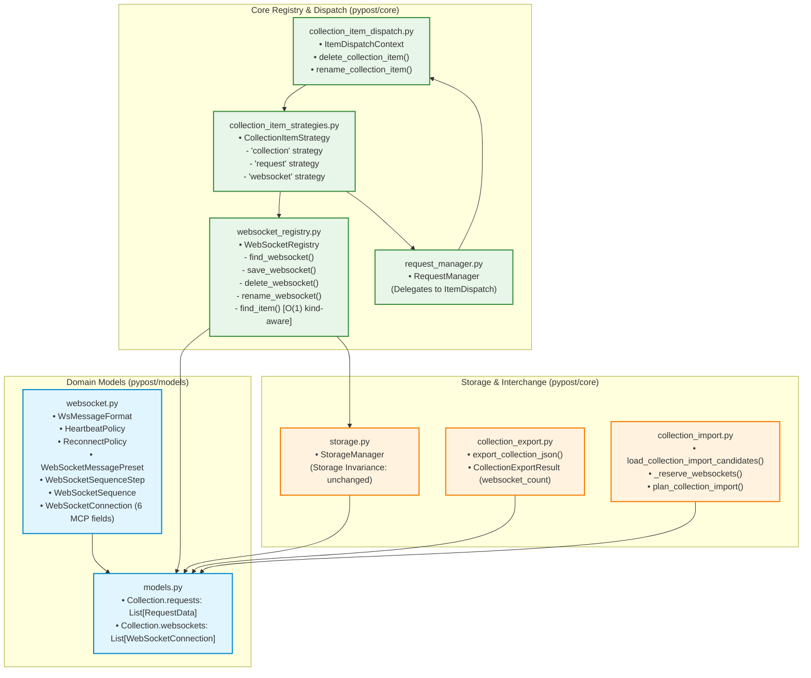
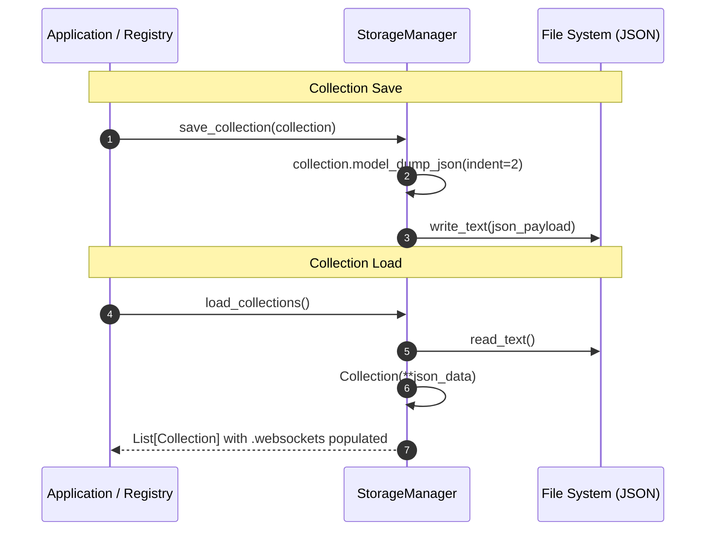

# WebSocket Connection Profile Model, Persistence, and Interchange

## Overview

PyPost provides persistence and collection interchange for WebSocket connection profiles (**WS-2**, Epic PYPOST-1123). This subsystem manages saved WebSocket endpoints, configuration presets, multi-step message sequences, and MCP metadata as first-class domain entities alongside HTTP requests.

Key design principles include:
- **Strict Model Isolation**: `WebSocketConnection` is an independent domain entity stored in `Collection.websockets` rather than overloading `RequestData`, preventing memory bloat and deep-copy overhead in HTTP tab isolation.
- **Storage Invariance**: Storage persistence (`pypost/core/storage.py`) serializes collections via Pydantic without requiring WebSocket-specific logic or disk schema forks.
- **Kind-Aware O(1) Indexing**: `WebSocketRegistry` indexes WebSocket endpoints across all loaded collections and provides O(1) resolution via `find_item(item_id) -> ("request" | "websocket", item, collection)`.
- **Extensible Item Dispatch**: Collection tree actions (delete, rename) route through `pypost/core/collection_item_dispatch.py` and strategy handlers in `pypost/core/collection_item_strategies.py`, keeping core managers decoupled and under baseline LOC caps.
- **Interchange & ID Collision Safety**: Collection import/export serializes WebSocket profiles, reserves IDs, re-keys colliding IDs with fresh UUIDs, preserves raw template variables without secret evaluation, and reports distinct WebSocket summary counts.

---

## Architecture & Data Models

### System Component Diagram



---

## Domain Models (`pypost/models/websocket.py`)

All WebSocket domain models are implemented as pure Pydantic v2 models with validated field constraints:

| Model / Enum | Fields & Types | Validation & Defaults | Description |
|---|---|---|---|
| `WsMessageFormat` | `TEXT = "text"`, `JSON = "json"`, `HEX = "hex"`, `BASE64 = "base64"` | Enum subclassing `(str, Enum)` | Supported message body payload formats. |
| `HeartbeatPolicy` | `enabled: bool = True`<br/>`interval_seconds: int = 30`<br/>`timeout_seconds: int = 10` | `5 <= interval_seconds <= 3600`<br/>`1 <= timeout_seconds <= 300` | Automated keep-alive ping configuration. |
| `ReconnectPolicy` | `enabled: bool = True`<br/>`max_attempts: int = 5`<br/>`initial_delay_seconds: float = 1.0`<br/>`backoff_multiplier: float = 2.0`<br/>`max_delay_seconds: float = 30.0` | `0 <= max_attempts <= 100`<br/>`initial_delay_seconds > 0`<br/>`backoff_multiplier >= 1.0`<br/>`max_delay_seconds > 0` | Bounded exponential backoff reconnection parameters. |
| `WebSocketMessagePreset` | `id: str`<br/>`name: str = "New Message"`<br/>`format: WsMessageFormat = JSON`<br/>`payload: str = ""` | `id` defaults to `uuid4()` string.<br/>`payload` contains raw template text. | Reusable message template. |
| `WebSocketSequenceStep` | `preset_id: Optional[str] = None`<br/>`inline_payload: str = ""`<br/>`format: WsMessageFormat = JSON`<br/>`delay_ms: int = 0` | `0 <= delay_ms <= 600_000` (pre-step delay cap: 10 min) | Single step in an automated multi-step sequence. |
| `WebSocketSequence` | `id: str`<br/>`name: str = "New Sequence"`<br/>`steps: List[WebSocketSequenceStep]` | `id` defaults to `uuid4()` string.<br/>`steps` defaults to `[]`. | Ordered sequence of message steps. |
| `WebSocketConnection` | See schema below | Peer of `RequestData` | Saved endpoint profile, presets, sequences, and 6 MCP metadata fields. |

### `WebSocketConnection` Schema & MCP Fields

```python
class WebSocketConnection(BaseModel):
    """Saved, reusable description of a real-time endpoint. Peer of RequestData."""

    id: str = Field(default_factory=lambda: str(uuid.uuid4()))
    name: str = "New WebSocket"
    url: str = ""  # ws:// or wss://, may contain {{ vars }}
    headers: Dict[str, str] = Field(default_factory=dict)
    params: Dict[str, str] = Field(default_factory=dict)
    subprotocols: List[str] = Field(default_factory=list)
    heartbeat: HeartbeatPolicy = Field(default_factory=HeartbeatPolicy)
    reconnect: ReconnectPolicy = Field(default_factory=ReconnectPolicy)
    presets: List[WebSocketMessagePreset] = Field(default_factory=list)
    sequences: List[WebSocketSequence] = Field(default_factory=list)
    default_format: WsMessageFormat = WsMessageFormat.JSON

    # 6 MCP tool metadata fields (authoritatively owned by WS-2)
    expose_as_mcp: bool = False
    mcp_description: str = ""
    mcp_params: Dict[str, McpToolParam] = Field(default_factory=dict)
    mcp_probe_preset_id: Optional[str] = None
    mcp_probe_max_messages: Optional[int] = None
    mcp_probe_max_duration_ms: Optional[int] = None
```

### Collection Model Extension (`pypost/models/models.py`)

`Collection` holds both HTTP requests and WebSocket endpoints in independent lists:

```python
class Collection(BaseModel):
    id: str = Field(default_factory=lambda: str(uuid.uuid4()))
    name: str = "New Collection"
    requests: List[RequestData] = Field(default_factory=list)
    websockets: List[WebSocketConnection] = Field(default_factory=list)
```

---

## Registry & Item Dispatch

### `WebSocketRegistry` (`pypost/core/websocket_registry.py`)

`WebSocketRegistry` is a Qt-free service managing WebSocket profiles across loaded collections:
- **In-Memory Indexing**: Maps `ws_id -> (WebSocketConnection, Collection)` for fast retrieval.
- **CRUD Operations**:
  - `find_websocket(ws_id)`: Returns `(WebSocketConnection, Collection)` or `None`.
  - `save_websocket(conn, collection_id)`: Inserts or updates a connection profile and persists the collection.
  - `delete_websocket(ws_id)`: Removes the profile from its owning collection, updates index, and persists.
  - `rename_websocket(ws_id, new_name)`: Updates `name` on the profile and persists.
- **Kind-Aware O(1) Lookup (`find_item`)**:
  ```python
  def find_item(self, item_id: str) -> Optional[Tuple[str, object, Collection]]:
      """Resolve an id in O(1) across requests and websockets."""
  ```
  Returns `("request", RequestData, Collection)` for HTTP requests, `("websocket", WebSocketConnection, Collection)` for WebSocket connections, or `None` if the item ID does not exist.

### Collection Item Dispatch (`pypost/core/collection_item_dispatch.py`)

To adhere to strict module LOC limits (Single Responsibility Principle), collection tree item operations are extracted into `pypost/core/collection_item_dispatch.py`.

```python
@dataclass(frozen=True)
class ItemDispatchContext:
    request_manager: RequestManager
    websocket_registry: Optional[WebSocketRegistry] = None
    mcp_client_registry: Optional[McpClientRegistry] = None

def delete_collection_item(
    context: ItemDispatchContext,
    item_id: str,
    item_type: str,
    strategies: Optional[dict[str, CollectionItemStrategy]] = None,
) -> bool: ...

def rename_collection_item(
    context: ItemDispatchContext,
    item_id: str,
    item_type: str,
    new_name: str,
    strategies: Optional[dict[str, CollectionItemStrategy]] = None,
) -> bool: ...
```

### Strategy Registration (`pypost/core/collection_item_strategies.py`)

Item operations are dispatched polymorphically via `DEFAULT_COLLECTION_ITEM_STRATEGIES`:
- `"collection"`: Deletes or renames entire collection via `RequestManager`.
- `"request"`: Deletes or renames HTTP `RequestData` via `RequestManager`.
- `"websocket"`: Deletes or renames `WebSocketConnection` via `WebSocketRegistry`.
- `"mcp_client"`: Deletes or renames MCP client entries via `McpClientRegistry`.

`_unpack_context` returns a **3-tuple**
`(RequestManager, WebSocketRegistry | None, McpClientRegistry | None)`.
Every handler must unpack three values (e.g. `manager, _, _` for
collection/request). See
[Collection Item Strategies](collection_item_strategies.md).

---

## Storage Invariance

`pypost/core/storage.py` requires **zero code changes** to support WebSocket persistence.



### Backward Compatibility & Downgrade Behavior
1. **Forward Compatibility**: Older collection JSON files lacking `"websockets"` load with `websockets = []` (default factory).
2. **Lossy Downgrade Policy**: Pydantic v2 uses `extra='ignore'` by default. Older PyPost versions reading a collection with `"websockets"` ignore the unknown key without error. If saved by an older version, the unknown key is dropped.

---

## Collection Import / Export Interchange

### Export Interchange (`pypost/core/collection_export.py`)
- Serializes `Collection.model_dump(mode="json")`, including `requests` and `websockets`.
- Tracks `websocket_count` in `CollectionExportResult` and `CollectionsExportResult`.
- Preserves raw template strings (`wss://{{ HOST }}:{{ PORT }}/ws`, `{{ API_KEY }}`) without evaluating secrets.

### Import Interchange (`pypost/core/collection_import.py`)
1. **Candidate Parsing & Shape Validation**: Validates candidate JSON records and ensures `websockets` (if present) is a list of valid profile dictionaries.
2. **ID Collision Reservation & Re-Keying**:
   - `_reserve_requests` and `_reserve_websockets` collect all existing IDs in the workspace.
   - If an imported WebSocket ID already exists, a fresh `uuid4()` is generated to prevent overwriting existing connections.
3. **Separate Reporting**:
   - `CollectionImportPlanResult` tracks `websocket_count` separately from `request_count`.
   - Summary string `SUMMARY_WEBSOCKETS_IMPORTED` formats `WebSockets imported: {count}` in the UI import summary dialog.

---

## API & Usage Examples

### 1. Creating and Saving a WebSocket Connection Profile

```python
from pypost.core.storage import StorageManager
from pypost.core.request_manager import RequestManager
from pypost.core.websocket_registry import WebSocketRegistry
from pypost.models.models import Collection
from pypost.models.websocket import (
    HeartbeatPolicy,
    ReconnectPolicy,
    WebSocketConnection,
    WebSocketMessagePreset,
    WebSocketSequence,
    WebSocketSequenceStep,
    WsMessageFormat,
)

# Initialize storage and registry
storage = StorageManager(base_dir="/tmp/pypost_data")
request_manager = RequestManager(storage=storage)
registry = WebSocketRegistry(request_manager=request_manager, storage=storage)

# Create a collection
collection = Collection(name="Realtime API")
storage.save_collection(collection)
request_manager.load_collections()
registry.rebuild_index()

# Build WebSocket profile with presets and sequences
ws_profile = WebSocketConnection(
    name="Market Feed",
    url="wss://{{ HOST }}/v1/stream",
    headers={"Authorization": "Bearer {{ TOKEN }}"},
    subprotocols=["market-v2"],
    heartbeat=HeartbeatPolicy(enabled=True, interval_seconds=15, timeout_seconds=5),
    reconnect=ReconnectPolicy(enabled=True, max_attempts=5, initial_delay_seconds=1.0),
    presets=[
        WebSocketMessagePreset(
            name="Subscribe Ticker",
            format=WsMessageFormat.JSON,
            payload='{"action": "subscribe", "symbol": "BTCUSD"}',
        )
    ],
    sequences=[
        WebSocketSequence(
            name="Handshake and Subscribe",
            steps=[
                WebSocketSequenceStep(
                    inline_payload='{"type": "auth", "token": "{{ TOKEN }}"}',
                    format=WsMessageFormat.JSON,
                    delay_ms=0,
                ),
                WebSocketSequenceStep(
                    inline_payload='{"type": "subscribe", "channel": "orders"}',
                    format=WsMessageFormat.JSON,
                    delay_ms=500,
                ),
            ],
        )
    ],
    expose_as_mcp=True,
    mcp_description="Connects to the market data feed and monitors ticker stream.",
)

# Save to registry
registry.save_websocket(ws_profile, collection.id)

# Retrieve profile
found = registry.find_websocket(ws_profile.id)
assert found is not None
conn, owning_col = found
print(f"Saved WebSocket '{conn.name}' in collection '{owning_col.name}'")
```

### 2. O(1) Kind-Aware Item Lookup

```python
# Look up any item (HTTP request or WebSocket connection) in O(1)
item = registry.find_item(ws_profile.id)
if item is not None:
    kind, entity, owning_col = item
    if kind == "websocket":
        print(f"Found WebSocket: {entity.name} (URL: {entity.url})")
    elif kind == "request":
        print(f"Found HTTP Request: {entity.name} (Method: {entity.method})")
```

### 3. Collection Item Dispatching (Polymorphic Delete and Rename)

```python
from pypost.core.collection_item_dispatch import (
    ItemDispatchContext,
    delete_collection_item,
    rename_collection_item,
)

dispatch_ctx = ItemDispatchContext(
    request_manager=request_manager,
    websocket_registry=registry,
)

# Rename a WebSocket profile
rename_collection_item(
    context=dispatch_ctx,
    item_id=ws_profile.id,
    item_type="websocket",
    new_name="Live Orderbook Stream",
)

# Delete a WebSocket profile
delete_collection_item(
    context=dispatch_ctx,
    item_id=ws_profile.id,
    item_type="websocket",
)
```

### 4. Exporting and Importing Collections with WebSocket Profiles

```python
from pypost.core.collection_export import export_collection_json
from pypost.core.collection_import import (
    load_collection_import_candidates,
    plan_collection_import,
)
from pypost.core.collection_import_apply import apply_imported_collections

# Export collection to JSON string
export_res = export_collection_json(collection)
print(f"Exported: {export_res.request_count} requests, {export_res.websocket_count} websockets")
json_payload = export_res.content

# Import collection JSON
candidates = load_collection_import_candidates(json_payload)
plan = plan_collection_import(
    candidates=candidates,
    existing_collections=request_manager.get_collections(),
)
print(f"Plan: {plan.request_count} requests, {plan.websocket_count} websockets to import")

# Apply imported collections
apply_imported_collections(request_manager, plan.collections)
```

---

## Troubleshooting Guide

| Symptom | Probable Cause | Diagnostic / Solution |
|---|---|---|
| `AttributeError: 'Collection' object has no attribute 'websockets'` | Older domain model file loaded or outdated installation package. | Ensure `pypost/models/models.py` defines `websockets: List[WebSocketConnection] = Field(default_factory=list)`. |
| `ValidationError` when setting `HeartbeatPolicy` or `ReconnectPolicy` | Parameter out of allowed numeric range (e.g. `interval_seconds < 5` or `initial_delay_seconds <= 0`). | Verify range constraints: `interval_seconds` (5..3600), `timeout_seconds` (1..300), `max_attempts` (0..100), `initial_delay_seconds` (>0), `backoff_multiplier` (>=1.0), `delay_ms` (0..600000). |
| `registry.find_websocket(ws_id)` returns `None` after saving collection | `registry.rebuild_index()` not called after direct collection modifications on `RequestManager`. | Call `registry.rebuild_index()` or save through `registry.save_websocket(conn, col_id)` to keep in-memory index synchronized. |
| `find_item(item_id)` returns `None` for a valid WebSocket or Request ID | ID does not exist in any loaded collection or `rebuild_index()` is needed. | Confirm the collection containing the item is loaded in `RequestManager.get_collections()` and call `registry.rebuild_index()`. |
| Imported WebSocket profile ID was changed after import | Collision detection triggered because a WebSocket with the same UUID already existed in the workspace. | This is intended behavior. The import process re-keys colliding IDs (`_reserve_websockets`) to avoid overwriting existing profiles. |
| Environment variables in WebSocket URLs or headers not working when viewed in collection JSON | Raw template strings (`{{ VAR }}`) are saved to disk instead of resolved values. | This is intended behavior. Saved collections and export payloads preserve raw templates to prevent secret leakage. Substitution occurs only at runtime when initiating a connection. |
| LOC cap violation on `request_manager.py` during lint or audit | Code added directly to `request_manager.py` instead of delegating to `collection_item_dispatch.py` or `websocket_registry.py`. | Keep `request_manager.py` minimal by placing item-type-specific logic into dispatch strategies or dedicated registries. Run `python scripts/audit_baseline_metrics.py` to verify compliance. |
