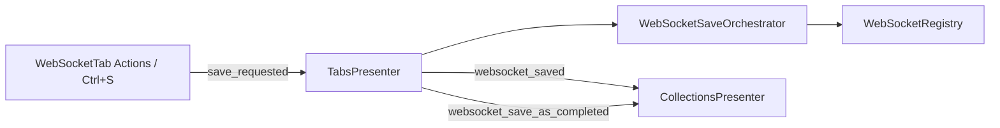

# WebSocket Save-to-Collection Flow (PYPOST-1161)

## Overview

WebSocket workspace tabs can persist connection profiles to Collections via **Save** and
**Save As…**, mirroring the HTTP request save pipeline (WS-TM-5). Entry points are the
**Actions** menu on `WebSocketTab` and widget-level shortcuts `Ctrl+S` / `Ctrl+Shift+S`.
Draft tabs (not yet in `WebSocketRegistry`) open the shared save dialog; saved profiles
overwrite in place with optional confirmation and stale-version protection.

Related: blank draft lifecycle [websocket_draft_tab.md](websocket_draft_tab.md),
Collections menu [websocket_collections_menu.md](websocket_collections_menu.md),
HTTP reference [request_actions.md](request_actions.md).

## Architecture

- **`WebSocketTab` (`pypost/ui/widgets/websocket/websocket_tab.py`)**:
  Actions menu (Save, Save As…), `Ctrl+S` / `Ctrl+Shift+S` `QAction`s with hotkey tags
  (`section="WebSocket Session"`), emits `save_requested` / `save_as_requested` with a live
  editor snapshot from `connection_snapshot_from_tab`.
- **`WebSocketSaveOrchestrator` (`pypost/ui/websocket_save_orchestrator.py`)**:
  Save / save-as dialogs, overwrite and stale confirms, `WebSocketRegistry.save_websocket`,
  collection expansion via `StateManager`, save metrics (`overwrite` / `new`).
- **`TabsPresenter` (`pypost/ui/presenters/tabs_presenter.py`)**:
  `_handle_save_websocket` / `_handle_save_as_websocket`; applies results to tab +
  `persisted_baseline`; emits `websocket_saved`, `websocket_save_as_completed`,
  `websocket_persisted` (overwrite only).
- **`CollectionsPresenter.add_saved_websocket_to_tree`**:
  Incremental tree row for Save As (`ws {name}` under target collection).
- **`main_window_signals.wire_presenter_signals`**:
  `websocket_saved` → `refresh_tree` + `restore_tree_state` + MCP refresh;
  `websocket_save_as_completed` → `add_saved_websocket_to_tree`.
- **`connection_snapshot_from_tab` (`pypost/ui/presenters/tab_dirty.py`)**:
  Single source for editor-visible persisted fields at save time (URL, handshake, presets,
  sequences from `presenter.connection`).



## API / Usage

### `WebSocketTab.handle_save_menu_action()` / `handle_save_request_shortcut()`

Triggers profile save from menu or `Ctrl+S`.

- Logs `ws_save_action_triggered source=menu|shortcut`
- Increments `gui_save_actions_total{source=…}`
- Emits `save_requested` with `connection_snapshot_from_tab(self)`

### `WebSocketTab.handle_save_as_menu_action()` / `handle_save_as_shortcut()`

Triggers Save As from menu or `Ctrl+Shift+S`.

- Logs `ws_save_as_action_triggered source=…`
- Increments `gui_save_as_actions_total{source=…}`
- Emits `save_as_requested` with snapshot

### `WebSocketSaveOrchestrator.save_profile(connection, parent, *, stale_context=None)`

- Draft (id not in registry): `_save_new` → `SaveRequestDialog` → `CREATED_NEW`
- Saved profile: `_save_overwrite` → optional confirms → `OVERWRITE`
- Returns shared `SaveResult` / `SaveAction` from `request_save_orchestrator`

### `WebSocketSaveOrchestrator.save_as_profile(connection, parent)`

Always dialog + **new UUID**; original registry entry unchanged; returns `SAVE_AS`.

### `TabsPresenter._handle_save_websocket(tab, connection)`

Calls orchestrator with `_stale_context_for_websocket_tab(tab)`. On success: updates tab
identity, title, `persisted_baseline`, calls `save_tabs_state()` on first save, emits
`websocket_saved` (and `websocket_persisted` on overwrite).

### `CollectionsPresenter.add_saved_websocket_to_tree(ws, collection_id) -> bool`

Appends `_make_websocket_item(ws)` under the collection without full model rebuild.

## Configuration

- **`AppSettings.confirm_overwrite_request`**: gates overwrite confirm for saved profiles
  (same preference as HTTP).
- No WebSocket-specific save settings. Collection expansion uses existing
  `StateManager.get_expanded_collections` / `set_expanded_collections`.

## Logging and metrics

| Event | Level | Module |
| --- | --- | --- |
| `ws_save_action_triggered` | INFO | `websocket_tab` |
| `ws_save_as_action_triggered` | INFO | `websocket_tab` |
| `ws_save_new_succeeded` | INFO | `websocket_save_orchestrator` |
| `ws_save_overwrite_succeeded` | INFO | `websocket_save_orchestrator` |
| `ws_save_overwrite_cancelled` / `ws_save_stale_cancelled` | INFO | `websocket_save_orchestrator` |
| `ws_save_as_flow_*` | INFO / WARNING | `websocket_save_orchestrator` |
| `ws_save_overwrite_failed` | ERR | `tabs_presenter` |
| `add_saved_websocket_to_tree_completed` | INFO | `collections_presenter` |

Metrics: `gui_save_actions_total`, `gui_save_as_actions_total` (source labels as HTTP).
Orchestrator adds `source=overwrite|new` on persistence success.

## Automated tests

| Test | File | Coverage |
| --- | --- | --- |
| Orchestrator draft / overwrite / stale / save-as | `tests/test_websocket_save_orchestrator.py` | Unit |
| Presenter signals | `tests/test_tabs_presenter.py::TestWebsocketSaveSignals` | Handler wiring |
| Tree incremental insert | `tests/test_collections_presenter.py` | `add_saved_websocket_to_tree` |
| Menu + Ctrl+S integration | `tests/test_websocket_save_flow_integration.py` | GUI entry points |

```bash
make test PYTEST_ARGS='tests/test_websocket_save_orchestrator.py tests/test_websocket_save_flow_integration.py tests/test_tabs_presenter.py -k TestWebsocketSaveSignals tests/test_collections_presenter.py -k add_saved_websocket'
```

## Troubleshooting

| Symptom | Likely cause | What to check |
| --- | --- | --- |
| Actions menu has no Save | Old `WebSocketTab` without `_init_ui` actions row | `websocket_tab.py` Actions `QToolButton` |
| Ctrl+S does nothing | Tab not focused; shortcut on widget actions | `addAction(save_action)` in `_setup_save_shortcuts` |
| Save succeeds but tree empty | Signal not wired | `main_window_signals` `websocket_saved` → `refresh_tree` |
| Save As duplicates full refresh only | Wrong signal | Save As must use `websocket_save_as_completed` → `add_saved_websocket_to_tree` |
| Draft id not in session restore after first save | `save_tabs_state` not called | First save path in `_handle_save_websocket` |
| Overwrite never prompts | `confirm_overwrite_request` false or id not in registry | `WebSocketRegistry.find_websocket` |
| Stale overwrite on *this* tab blocked | `StaleCheckContext.stale_persisted` + disk drift | `persisted_baseline` on collection-backed tabs |
| Sibling tab not prompted after save elsewhere | Known gap | `websocket_persisted` not wired to sibling handler yet |

## Related work

| Story | Jira | Summary |
| --- | --- | --- |
| WS-TM-2 | PYPOST-1158 | Blank WebSocket draft tabs |
| WS-TM-4 | PYPOST-1160 | Collections WebSocket context menu |
| WS-TM-5 | PYPOST-1161 | **This document — save-to-collection (shipped)** |
| WS-TM-6 | PYPOST-1162 | Remaining WebSocket session shortcuts / Help |
